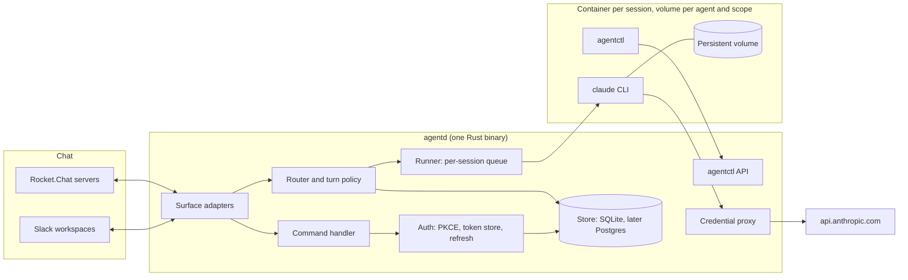
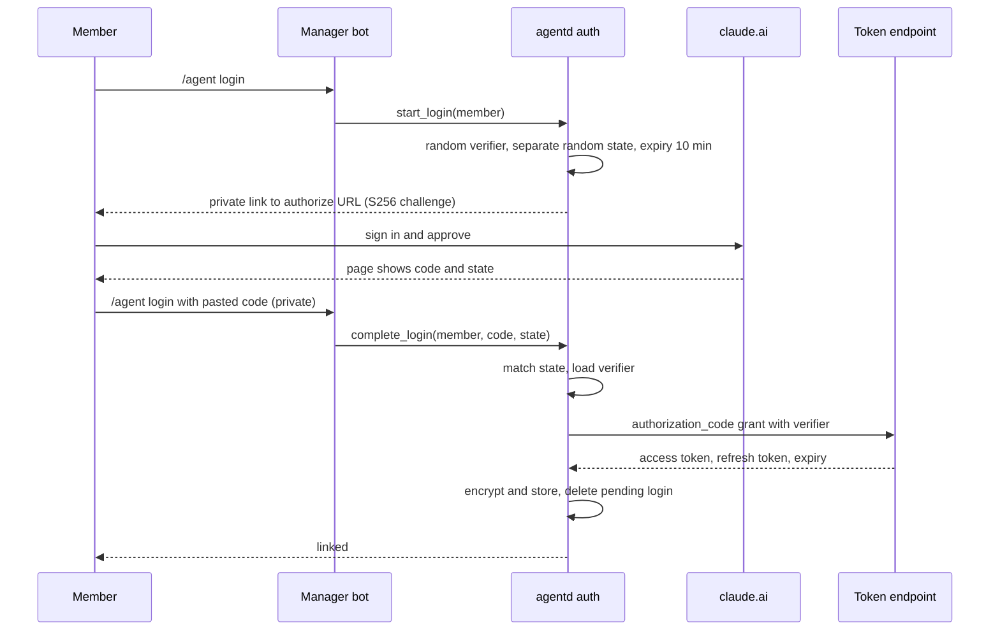
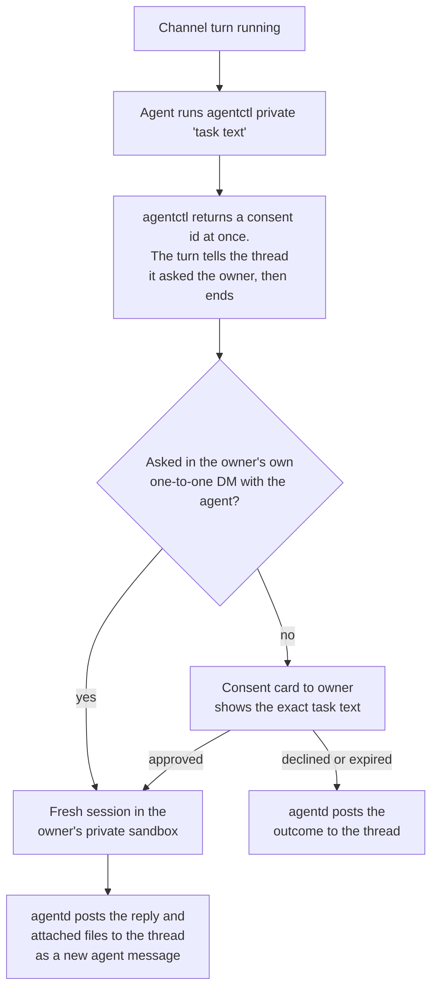
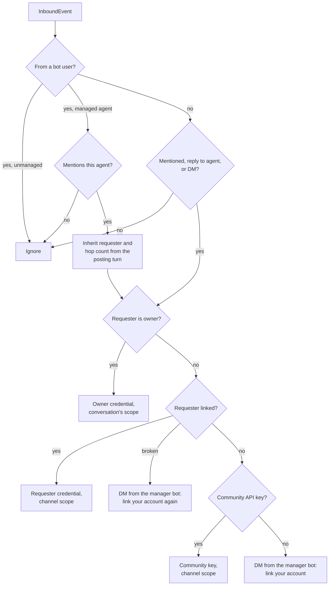
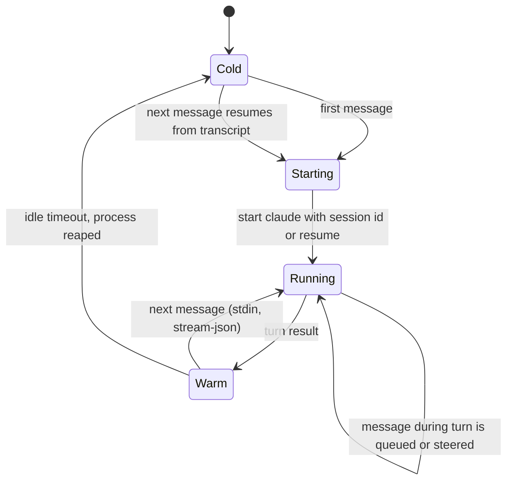
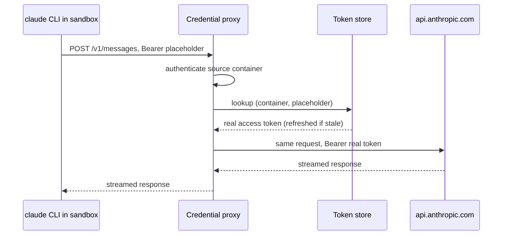
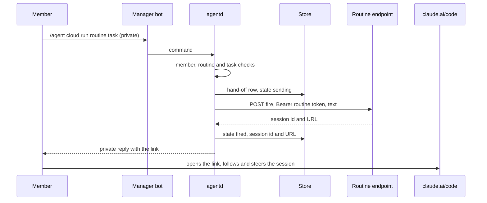
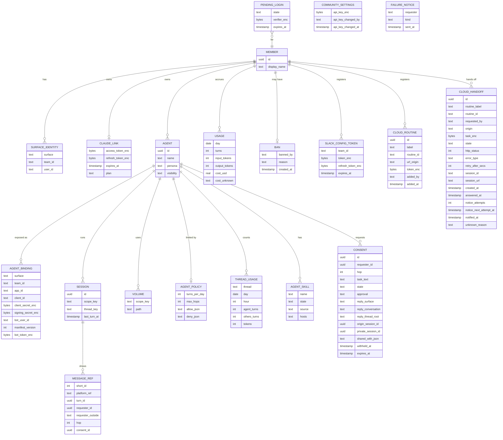

# agent-core design

Status: draft for review

## Context

A small community wants personal AI agents that live in its chat. Each member
runs one or more agents on their own Claude subscription. Anyone in a shared
channel can address an agent with `@name`, and agents can address each other
the same way. The community uses Slack (mostly one workspace per member or
small group) and Rocket.Chat (large shared workspaces).

The reference point is qm-core[^qm], a TypeScript agent platform with a mature
Slack surface. It runs one core deployment per organization, spawns a Claude
Code CLI process per turn on the core host, and bridges its tools to the CLI
through an in-process MCP server. That shape is heavy per agent: one
separately mentionable agent means one full core deployment. agent-core keeps
the parts of qm-core that work well (mention gating, scope separation, consent
flows, Markdown rendering, credential swapping at egress) and changes the shape
so that one small Rust process serves many agents.

## Goals

- Many separately `@mentionable` agents per community, owned by individual
  members.
- Members link their own Claude subscription with a PKCE login done entirely
  in chat.
- Manage agents with chat commands (`/agent ...`) instead of a web UI.
- Pure Rust core. No Node.js or npm dependencies in anything we build. The
  Claude Code CLI runs inside the sandbox as a separate executable.
- Slack and Rocket.Chat behind one platform-neutral core.
- Per agent and scope sessions that survive restarts, using Claude Code's own
  session persistence (`--session-id` / `--resume`).
- Requests are billed to the person who made them.

## Non-goals

- A web dashboard. A small HTTPS endpoint for OAuth callbacks and platform
  events is fine.
- Driving claude.ai through a browser or any other automated consumer UI.
  Consumer Terms section 3 prohibits automated access except through an API key
  or where explicitly permitted[^terms].
- Calling the Messages API directly with subscription OAuth tokens. Subscription
  tokens are only used by the Claude Code CLI.
- Slack Connect before milestone 7. [Slack Connect](#slack-connect) designs
  it, with members of other organizations kept out unless the community and
  each agent's owner let them in.
- Microsoft Teams, Discord, email.

## Terminology

| Term | Meaning |
| --- | --- |
| Member | A person in a chat workspace. Identified by `(surface, team, user)`. |
| Outside member | A Slack member from another organization, seen in a Slack Connect conversation. Keyed by the workspace agentd serves, with their own organization alongside (see [Slack Connect](#slack-connect)). |
| Linked member | A member who completed the Claude PKCE login. |
| Agent | A persona (prompt, skills, sandbox image) owned by one member, with one chat identity per surface binding. |
| Surface | A chat platform adapter: Slack or Rocket.Chat. |
| Scope | Where a conversation happens: a DM, a channel, or a group DM. Scopes decide sandboxes and what an agent may touch. |
| Session | One Claude Code conversation, resumed across turns. |
| Manager bot | The one bot per workspace that owns `/agent` commands, login DMs and consent cards. |

## Architecture



agentd is a single process. Each surface adapter turns platform events into a
neutral `InboundEvent`. The router decides which agent, session and credential
a turn uses. The runner serializes turns per session and runs `claude -p` in the
right sandbox. Agents act on the world with ordinary CLIs and skills inside the
sandbox. The only core-facing CLI is `agentctl`, which calls back into agentd
with a short-lived token scoped to one turn.

### Why the CLI runs inside the sandbox

qm-core runs the CLI on the core host with every built-in tool disabled and
routes all execution through MCP tools into the sandbox[^qm-harness]. agent-core
wants Claude Code's built-in tools (Bash, Read, Edit) and skills instead of an
MCP schema. Those tools act on the machine the CLI runs on, so the CLI has to
run where the work happens. The sandbox becomes the security boundary, which
also makes `--permission-mode bypassPermissions` acceptable.

## Chat identities and mentions

On both platforms only a real account can be mentioned: a user or a bot user.
A mentionable agent therefore needs its own bot identity.

| | Slack | Rocket.Chat |
| --- | --- | --- |
| Mention in the message | `<@U…>` user id token, produced by autocomplete | `@username` text, parsed by the server into `mentions[]` |
| Agent identity | One Slack app with a bot user per agent | One user with the `bot` role per agent |
| How the bot hears it | `message.channels`, `message.groups`, `message.im` and `message.mpim` events, not `app_mention`[^slack-mention]. agentd keeps a channel or group DM message only if it mentions the bot (`<@U…>` in the text or blocks, another bot's in its text alone, and none with a backtick both before and after it in the same text) or replies in a thread whose root the bot may have posted (its `parent_user_id` is the bot user, or isn't known), so the router can see replies to the agent's own messages. When the bot user is known, it drops the bot's own posts, and other bots' messages that don't mention it, in every kind of conversation. The bot must be a channel member | Realtime `stream-room-messages`, check `mentions[]` for the bot's `_id`[^rc-stream] |
| Bot-to-bot mentions | Delivered by agentd itself for its agents' own posts. Whether Slack also delivers one app's bot user's post to another app as a `message.*` event is not yet verified; a copy that does arrive is dropped[^slack-botmention] | Delivered by agentd itself for its agents' own posts, and by the server too; the second copy is dropped |
| Who creates the identity | The member installs the app. Admin approval only if "Require App Approval" is on[^slack-approval] | agentd's manager account with a custom role (`create-user` and token creation)[^rc-create] |
| Scaling limit | 10 app installs on the free plan[^slack-free] | None in practice |

### Slack

Each agent is its own Slack app, created from a manifest.

- **One-time setup per member.** App configuration tokens are only issued in
  the api.slack.com UI[^slack-manifest]. The member generates one there and
  hands the token and its refresh token to agentd with `/agent slack-token`
  (slash command text is not posted to the channel). agentd stores both
  encrypted and rotates them with `tooling.tokens.rotate` before the 12-hour
  expiry. Holding a member's configuration refresh token lets agentd create and
  edit apps as that member, so it is listed in the threat table.
- **Per agent.** `/agent create` calls `apps.manifest.create`. The response
  carries the new app's `app_id`, `client_id`, `client_secret` and
  `signing_secret`, which agentd stores with the binding. agentd DMs the member
  an install link. The member clicks Allow and the OAuth callback, using
  `client_id` and `client_secret`, delivers the bot token. Members can install
  apps without an admin by default. When the workspace requires app approval,
  the click becomes a request and agentd reports that the install is waiting for
  approval.
- **Transport.** All Slack apps, the manager bot included, use HTTPS: the
  Events API, interactivity and slash commands. Socket Mode needs an app-level
  `xapp` token that no API can create[^slack-socket], so it cannot be automated
  for agent apps, and one transport is simpler. agentd's public HTTPS endpoint is
  therefore a prerequisite for `/agent create` on Slack: the manifest's
  `request_url` must answer Slack's `url_verification` challenge when the app is
  created. Each app has its own request URLs, `/slack/b/{binding}/events`,
  `…/interactivity` and `…/commands`, keyed by agentd's binding id (the manager
  app's is `manager`), because the manifest must carry them before Slack has
  assigned an app id. The path selects the secret: each app's requests are
  verified with its own `signing_secret`, a `v0` HMAC-SHA256 over the raw body
  compared in constant time, with a timestamp at most five minutes from now.
  Unknown bindings get 404.
- **The challenge is answered unsigned while an app is created.** Slack sends
  `url_verification` while `apps.manifest.create` is still running, before
  agentd has the new app's signing secret, so agentd echoes the challenge for a
  binding it knows but has no secret for yet (one still being created) without
  checking the signature. A binding with a secret, the manager app's included,
  answers a challenge only once it verified. That is
  safe because the echo has no side effects: it reads no state beyond the
  binding's existence, writes nothing and queues nothing, and returns only the
  string the caller sent, as `text/plain` with `nosniff`. A forger learns only
  that the binding exists, which the 401 on its other requests says anyway.
  Slack's `ssl_check` is the one other exception: it posts a form whose
  `ssl_check` is `1`, unsigned, to a slash command's URL to check its
  certificate, and agentd answers it there with an empty 200 on the same
  terms, as Bolt does. Every other request, including a `url_verification` on
  the command or interactivity URL, must verify.
- **Acknowledge first.** Slack expects an acknowledgement within three seconds
  and retries otherwise. Turns take minutes, so agentd acknowledges every event,
  command and interaction as soon as it is verified and queued, processes it
  asynchronously, and replies to commands and interactions through their
  `response_url`. A binding with too many requests in flight (acknowledged,
  and not yet handed on) gets 503: each agent's app may have 32, one owner's
  agents' apps together 64, agents' apps together 1024, and the manager app
  1024 of its own, so one app's flood is refused without refusing another's.
  An agent's app that sends faster than Slack delivers to one app (a burst of
  100, then 8 a second, about Slack's 30,000 events an hour) gets 503 too.
  Slack retries an event later, while a command or interaction fails and its
  user can try again. Slack turns off an app's events when too many
  deliveries fail, so only what a forger sends should meet a refusal: each
  app gets every message in every channel it is in, and one owner's agents
  may share busy channels, so their owner's limit counts only the messages
  agentd keeps. An agent's app is only a way to reach its agent, so its
  events other than messages, its commands and its interactions get an
  empty 200 and are dropped, and so does a message posted more than 15
  minutes before it arrived, which confirming would refuse, with a warning
  once a minute per app, since a fast clock or a backlog at Slack drops
  every one; none of them takes a place or writes anything. The queue keeps
  each body as it arrived, at most a megabyte, and parses it again after
  the ack.
  Deduplication is per binding and happens after the ack: a message,
  whether retried or reaching the same app twice, by `(channel, ts)`, and
  only once normalization has kept it, so unaddressed channel messages cost
  no store write; other events by `event_id`; and a replayed command or
  interaction by its signature. One owner's agents' apps together keep a
  burst of 200 messages, then 16 a second; a message past that is dropped
  after its 200, before its row. Slack's keys are kept an hour, longer than
  Slack retries, a signature is accepted or a message is confirmed. Those
  ids must be shaped like Slack's (`Ev…`, `T…`/`E…`, `C…`/`D…`/`G…`, each
  with room to grow to 64 characters after its prefix, and a `ts` of 10 to
  20 and 6 digits), or the body gets 400 before the ack, so a key is at
  most about a hundred bytes. A message's sender is no key: one not shaped
  like Slack's (`U…`/`W…`, `B…`) is dropped after the 200, before any row.
  A kept message is cut to Slack's own limits, 160 KB of text (40,000
  characters of at most 4 bytes each, cut in bytes since Slack's escaping
  of `&`, `<` and `>` lengthens what was typed), 10 files and 100
  mentions, so each is at most about 225 KB.

Slash commands are neither namespaced nor unique. Two apps can both register
`/agent`, and Slack routes it to whichever was installed most recently, so a
later-installed app can silently take over the command. Only the manager bot
declares `/agent`, agent apps declare no commands, and `/agent me` shows the
manager app's name so members can notice a hijack.

Loop protection is mandatory because bots hear each other: a per-thread cap on
agent turns per hour, a per-thread token budget per day, both counting every
agent in the thread, a cap on the hops of a chain, agents ignore bot messages
that do not mention them, and only mentions from agentd-managed agents are
honored (see [Agent-to-agent attribution](#agent-to-agent-attribution)). A
one-to-one DM holds one agent, so its caps don't apply there. The token
budget and the usage meter read the CLI's own figures, which the agent can
falsify: it runs as the CLI's user and can write to its stdout and its
transcript. So the turn caps and the hop cap, which count turns agentd
starts, are the hard bounds on a loop, and the token budget stops agents
that loop by mistake. The meter also keeps each turn's cost as the CLI
reckons it, but only as a record: no limit reads it.

### Rocket.Chat

The community admin installs agentd once and gives its manager account a custom
role. After that `/agent create` is self-service: agentd calls `users.create`
with the `bot` role and the agent's name as display name, obtains a token for
the new user, and the bot sets its own avatar. The owner invites the bot into
rooms with Rocket.Chat's own invite, or the manager adds it to a room it is in
where the owner ran `!agent create`. `/agent delete` deactivates the bot user.
Bot users bypass the REST rate limiter by default[^rc-perms].

The custom role needs `create-user`, plus `edit-other-user-active-status` if
agentd passes `active` on create, and the permission for creating the bot's
token. It also needs `view-full-other-user-info`: messages don't carry
the sender's roles, and `users.info` shows another user's roles only with it,
which is how agentd tells bots from people. A reviewer's reading of the current server source is that `users.create`
with `roles: ["bot"]` checks only those, and that `assign-roles` is checked on
update only. That needs a test on the target server version.

Custom slash commands on Rocket.Chat require an Apps-Engine app written in
TypeScript[^rc-slash]. agent-core instead takes commands as DMs to the manager
bot or with a `!agent` prefix. Both feed the same parser, so the command set is
identical on both platforms.

## Account linking

Members link their Claude subscription with the OAuth PKCE flow that Claude Code
uses. The authorize page redirects to Anthropic's own callback page, which shows
a `code#state` string for the user to paste back. That fits chat and needs no
public callback URL.



Rules:

- The verifier never leaves agentd. `state` is a separate random value. qm-core
  sends the verifier as `state`[^qm-oauth], which puts the PKCE secret in the
  authorize URL. We do not copy that.
- Codes are only accepted in private channels: Slack slash command text is not
  posted to the channel, and on Rocket.Chat the code goes in a DM to the manager
  bot, which is already private. `!agent login <code>` in a channel is refused,
  the pending login is invalidated because the code is now public, and the member
  is told to start again. agentd does not delete members' messages. That would
  need `delete-message` or `force-delete-message`, which the `bot` role lacks.
- Tokens are encrypted at rest (ChaCha20-Poly1305, key from the environment or a
  KMS). Refresh is single-flight per member. A failed refresh DMs the member.
- Endpoint URLs, client id and scopes come from configuration. They are Claude
  Code's OAuth parameters, not a published API contract, and can change. The
  scopes may be only `user:profile`, `user:inference` or both: configuration
  refuses any other (see [Cloud hand-off](#cloud-hand-off)).

## Turn routing and billing

A member's Claude usage through Claude Code counts against a per-user monthly
Agent SDK credit that cannot be pooled or shared[^sdk-credit]. Consumer Terms
section 2 also prohibits making an account available to anyone else[^terms].
So a turn always runs on the credential of the person who caused it.

| Who starts the turn | Where | Runs on | What the agent can touch |
| --- | --- | --- | --- |
| The owner, in a DM | DM | Owner's credential | Everything the owner granted: repos, memory. A cloud hand-off is a member's own command, never an agent's (see [Cloud hand-off](#cloud-hand-off)) |
| The owner, in a channel | Channel thread | Owner's credential | Public side. A private task the agent requests needs a consent card, as from anyone outside the owner's own DM (see below) |
| Another linked member | Channel thread | Requester's credential | Public side only: persona, skills, thread context |
| A private task requested during a non-owner's turn | Owner's private sandbox | Owner's credential, after the owner approves a consent card | Owner's private resources for that one task. Only the result and attachments return to the thread |
| Unlinked member | Channel | Community API key if configured, otherwise a "link your account" DM from the manager bot | Public side only |
| Agent to agent | Thread | The requester of the turn whose message mentioned the agent | Public side only, hop-capped |

### Agent-to-agent attribution

A hop is billed to the requester of the turn that produced the mention, never to
whoever started the thread. agentd posts every agent message itself, so it
records `(platform message ref, turn, requester)` for each one. When an agent
message mentions another agent, the new turn inherits that requester and the hop
count. `agentctl ask-agent` posts the task in the thread as the calling agent,
mentioning the target, so it is recorded and handed off like any other agent
message. Mentions from bot users that agentd does not manage are ignored. That
keeps an unmanaged or prompt-injected bot from spending anyone's subscription,
and the hop cap bounds what one request can cost its requester.

agentd delivers those mentions itself rather than waiting for the platform to
deliver its own bots' posts back. Once a turn's posts are out, each one in the
thread the turn answered, outside a one-to-one DM, that the platform reads as
mentioning other managed agents, is queued for those agents as the posting
bot's message, each agent once for the turn. It then goes through routing
like any message, so the requester and hop come only from the post's own
record, and the hop cap, the thread's caps and each agent's rules apply. Only
those posts carry the turn's attribution: a post in another thread or
channel, or a private task's result, hands nothing off by either delivery.
Each hand-off is recorded in the store with its post, in one transaction,
and kept until a job settles it; the instance that holds it keeps it leased,
through a drain too, so a shutdown or crash before its hop is claimed delays
it rather than losing it. The
platform may deliver the same post as well: Rocket.Chat does, and on Slack it
is unverified. A claim on the mentioned agent and the posting turn, in the
store, lets one hop run for each turn and agent, however many of the turn's
posts mention it and whichever copy arrives first.

### Private tasks

Private resources never enter a channel sandbox. Channel volumes persist and
every later turn in that channel can read them with the CLI's built-in tools,
so a checked-out private repository or generated file left there would outlive
the consent it was granted under.

The router cannot tell from message text whether a task needs private
resources, so the agent asks during its turn, the same way qm-core's agents
issue ask-agent requests mid-turn[^qm-askagent]. The request is asynchronous,
like qm-core's. Consent can take hours, and a channel turn that waited would
hold its container, block the thread's session queue, keep its turn token alive
and outlast Claude Code's Bash tool timeout (2 minutes by default, with a
10-minute ceiling unless raised)[^cc-envvars]. The flow:



- The same asynchronous path serves the owner, with no consent card, only for
  a task asked for in the owner's own one-to-one DM with the agent, the one
  turn that already runs on the owner's side, with memory, read-write
  `shared/` and posts anywhere: skipping the card there grants nothing the
  turn doesn't already have. A long private task would otherwise hold that
  turn the same way. Everywhere else a card is sent even when the owner is
  the requester: a channel or group-DM turn runs on the public side and
  reads the thread's history, which any member can write into, so its text
  may have steered the request; and a hop turn inherits its requester from
  another agent's post, which the owner may never have seen. The owner's card says
  that approving runs the task on the owner's side, and when it was asked for
  at a hop. The task runs on the owner's side only when the owner asked in
  their own DM or approved the card of a task their own identity asked for,
  never because of who the requester is alone.
- Each agent, and each requester with an agent, may have only a few consents
  waiting or running at once, and a task is handed at most one attachment's
  worth of files in all, so neither the files held for consents nor the cards
  sent to an owner grow without bound. A consent card is one message, with its
  decision commands, on every surface; a task too long for one is refused when
  it is asked for.
- `CONSENT` records the reply target: surface, conversation, thread root, the
  originating session, the requester and the hop count. Unanswered consent cards
  expire after a configurable time, 24 hours by default.
- Each private task gets a fresh session with a random v4 id on the owner's
  private volume. It never joins the owner's DM session, so a non-owner's task
  cannot read the owner's DM transcript and does not add to it.
- What crosses into the private turn is only the task text shown on the consent
  card and files the channel turn attached explicitly. The channel thread's
  transcript does not cross. The card names the files but doesn't show their
  contents, and their contents can direct the task like its text, so the card
  says so. A task the card couldn't show as the model reads it is refused when
  it is asked for: control or invisible characters, long runs of blanks, many
  blank lines in a row, or stacked combining marks. The card says whether the
  owner asked or someone else did, naming them by a handle that stays the
  same, and shows the task in a box of its own as literal text.
- What comes back is only the private turn's final reply and files it attached.
  agentd posts them to the thread as a new agent message whose `MESSAGE_REF` is
  attributed to the original requester and hop count, and names the consent.
  A mention in it starts no other agent's turn: the router treats it as
  unattributed, so private context cannot reach another agent through the
  thread either, and no hop chains on the owner's credential from it.
- A private task is run again after a failure only if no turn of it reached
  the model; otherwise the thread is told it was interrupted, unless its result
  was already posted. Its container is stopped as soon as its turn ends. A
  task cut short by a shutdown or taken over by another instance has its
  container killed, so its turn ends as a crash, which is billed to the owner
  like any other. Its session's directory is deleted once the consent's work
  is finished, however it finished. The thread's caps apply to it as to any
  turn outside a DM.
- Inside a private task, `agentctl` offers only `attach`. `ask-agent` and
  `private` are refused, so private context cannot flow to other agents and no
  hops can chain on the owner's credential.

### Routing



Response gating is deterministic: an explicit mention, a reply to the agent's
own message, or a DM. A reply counts only if it mentions no other managed
agent: a reply in one agent's thread that mentions only a second agent is
addressed to the second, so the person pays for one turn, not two. Messages
from managed agents only count when they mention this agent explicitly, and
the manager bot's own posts never start a turn. Replying in a thread is not enough, or two agents in one
thread would answer each other indefinitely. qm-core runs a model call to decide whether to chime in on
unaddressed thread messages. With subscription credentials that would cost a
CLI run per message, so agent-core does not do it.

A DM counts only for the agent whose bot received it, so another agent
mentioned in someone's DM with a different bot never answers there. The
owner's turns run only on the owner's credential: an owner without a linked
account gets the link prompt, never the community key. Nor does anyone whose
link broke: they are asked to link again, and nothing runs until they do. Refusals (a paused
agent, a banned requester, the agent's deny rules, the hop cap, the agent's
daily cap and the per-thread caps) apply only to
messages that pass the gate above, so an unaddressed message never draws a
notice, and they come before the credential, so nobody is offered a link
prompt or a community-key turn they would then be refused. A refusal of the
requester themselves (a ban, or the agent's deny rules) is told to them
privately by the manager bot, at most once a day per agent, and never in the
thread; the others are one line in the thread. A member of another
organization in a Slack Connect channel is ignored unless the community
lists their organization, and is told any refusal in the thread instead
(see [Audience](#audience)). If the router can't tell whether the requester
is banned, or what the agent's rules are, it refuses rather than assume the
requester is allowed. The router's rustdoc gives the full order.

## Sessions and sandboxes

### Keys

- Volume: one per `(agent, scope)`. A DM transcript never lands on a channel's
  disk.
- Sandbox: one container per active session, with the scope's volume mounted.
  Sessions in one scope can run concurrently for different requesters, and a
  shared container would let one session read another's process environment
  (`/proc/<pid>/environ`), including its proxy placeholder and `agentctl` token.
  With one container per session, container identity and session identity are
  the same thing, which is what the credential proxy and `agentctl` rely on.
- Session: one row per conversation and thread root (DMs use one continuous
  session, channels one per thread), looked up by
  `(agent, surface, team, conversation, thread root)`. Its id is a random UUIDv4
  minted on create and again on `/agent reset`, because `--session-id` needs an
  id that has not been used.
- Directories on the volume: each session gets `sessions/<session id>/work` as
  its working directory and `sessions/<session id>/claude` as its
  `CLAUDE_CONFIG_DIR`, and only `sessions/<session id>/` is mounted read-write in
  its container. Keeping them apart keeps the agent's transcripts and
  `settings.json` out of its own Glob, Grep and `git` scope. `shared/` is mounted into every session of the
  scope and guarded by a scope-level lock that `agentctl` takes for writes.
  Skills are mounted read-only.
- The surface and team are part of every lookup key, so the same agent on two
  platforms keeps separate sessions. On Slack the team is the workspace
  agentd serves, in a Slack Connect channel too, whoever posted (see
  [Slack Connect](#slack-connect)).

### Lifecycle



The runner keeps a warm container and `claude` process per active session in
stream-json mode and reaps both after an idle timeout. The next message resumes
from the transcript. Turns are serialized per session with a keyed queue. Two
concurrent `--resume` runs of one session would fork the transcript.

A warm process cannot change credential kind or model mid-flight. A thread can
be driven by a linked member on one turn (OAuth token, `Authorization: Bearer`
with the `oauth-2025-04-20` beta) and an unlinked member on the next (community
API key, sent by the CLI as `x-api-key` from `ANTHROPIC_API_KEY`). The process
environment is fixed at start, and plans differ in model access and rate limits.
The runner therefore restarts the process, resuming from the transcript, when
the next turn's credential kind or model differs from the running one. The model
is chosen per turn from what the requester's plan allows. The plan is read from
the account profile (the `user:profile` scope) at link time and on every token
refresh and stored in `CLAUDE_LINK`. Like the OAuth parameters, that profile is
Claude Code's, not a published contract. Switching the model
over the stream-json control channel instead of restarting is a later
optimization.

`claude` runs as a non-root user in the image. On Linux the CLI refuses
`bypassPermissions` as root or under sudo outside a recognized
sandbox[^cc-bypass].

### Persistence

- Each session's `CLAUDE_CONFIG_DIR` is its own `sessions/<session id>/claude`
  directory, and `CLAUDE_CODE_PROJECT_DIR_NAME` is set to the session id, so the
  transcript directory is named explicitly instead of being derived from the
  working directory (Claude Code 2.1.234 or later)[^cc-sessions].
  `claude --resume <id>` searches every project directory since 2.1.223, so the
  fixed layout is for predictability and backups, not a resume requirement.
- `cleanupPeriodDays` is raised from its 30-day default in each session's
  `settings.json` so idle threads keep their transcripts.
- Each turn's user message carries only what the transcript lacks: the
  thread's recent messages it hasn't been shown or posted, those said while
  an earlier turn ran included,
  messages agentd posted as the agent in the same thread from other sessions
  (a private task's result, and its declined or expired outcomes, which
  never enter the channel session's transcript; found in `MESSAGE_REF` by
  agent, thread and another session, so other threads of the channel stay
  out), who is present, and surface hints. Each message shown gets a short
  id in the session, which is how the model names it to `agentctl`. The
  system prompt stays byte-identical across turns so prompt caching keeps
  working.
- Volumes are snapshotted. Mirroring transcripts to the store is a later option
  for multi-host deployments.

## Credential proxy

The sandbox never holds a real Claude credential. It gets a placeholder token,
and the proxy swaps it for the real one.



Sandbox environment for a subscription credential:

```text
CLAUDE_CODE_OAUTH_TOKEN=<placeholder>
ANTHROPIC_BASE_URL=http://cred-proxy.internal:8080
CLAUDE_CODE_DISABLE_NONESSENTIAL_TRAFFIC=1
DISABLE_AUTOUPDATER=1
CLAUDE_CONFIG_DIR=/volume/sessions/<session id>/claude
CLAUDE_CODE_PROJECT_DIR_NAME=<session id>
```

For the community API key, `ANTHROPIC_API_KEY=<placeholder>` replaces
`CLAUDE_CODE_OAUTH_TOKEN`, and the CLI sends it as `x-api-key`.

Tested against Claude Code 2.1.283 with a local capture server:

- The CLI sends the subscription token to a custom `ANTHROPIC_BASE_URL` over
  plain HTTP, as `Authorization: Bearer` with the `oauth-2025-04-20` beta.
- By default it also opens direct connections to `api.anthropic.com` that
  bypass the base URL. With `CLAUDE_CODE_DISABLE_NONESSENTIAL_TRAFFIC=1` and
  `DISABLE_AUTOUPDATER=1` there were none.
- It may send `HEAD /api/hello` to the base URL as a connectivity check.

Proxy rules:

1. Swap only the credential header, only for the configured upstream:
   `Authorization: Bearer` for a subscription placeholder, `x-api-key` for an
   API-key placeholder. A placeholder of one kind never receives a credential of
   the other kind. Never substitute in bodies or for other hosts. Otherwise the
   model could send the placeholder to an attacker's host and the proxy would
   attach the real token.
2. Mint one placeholder per `claude` process, which is also one per container
   and session. Several sessions in one scope can run at the same time for
   different requesters, and a shared placeholder would give the proxy no way to
   tell which member's credential a request belongs to. The runner points the
   process's placeholder at the current turn's credential when the turn starts,
   and clears the pointer when the turn ends, however it ended, so between turns
   the placeholder authorizes nothing.
   Turns within a process are serialized, so the mapping cannot change under a
   request in flight. The mapping is bound to the container's network identity,
   and is revoked when the container is reaped. Another session cannot read the
   placeholder because it runs in a different container.
3. Sandbox egress goes through the proxy and an allowlist only. Block cloud
   metadata endpoints. Direct `api.anthropic.com` is blocked so new side traffic
   fails loudly.
4. The same mechanism serves bearer-token CLIs in skills, for example
   `GH_TOKEN`. Signed-request schemes such as AWS SigV4 cannot be swapped and
   need short-lived credentials instead.

## Tools and skills

There is no MCP server. Agents use Claude Code's built-in tools plus skills in
`$CLAUDE_CONFIG_DIR/skills/`, loaded with `--setting-sources user`. Skills cost
only their name and description in context until used.

Core-facing actions go through `agentctl`, a small static Rust binary:

| Command | Effect |
| --- | --- |
| `agentctl attach <path>` | Stage a file to upload with this turn's reply |
| `agentctl post --to <target> <text>` | Post somewhere else the agent is allowed to post |
| `agentctl react <emoji> [message id]` | Add a reaction |
| `agentctl history [--before id]` | Pull more thread context than the turn included |
| `agentctl lock -- <command>` | Run a command while holding the scope's `shared/` lock, for writes to `shared/`. A second `lock`, from any session of the scope, waits |
| `agentctl ask-agent <agent> <task>` | Hand a task to another agent through the policy engine: after the turn, the agent's bot posts the task in this thread, mentioning the other agent, which then answers there. The hop is billed to this turn's requester. Only in a channel or group DM. Refused inside a private task |
| `agentctl private [--file <path>]... <task>` | Ask for a task on the owner's private resources. Returns a consent id at once. Needs the owner's consent unless this turn is the owner's own DM with the agent. `--file` hands the task a file from the calling session's directory, copied into its working directory. agentd posts the result to the thread when the task finishes. Refused inside a private task |

An agent's skills are directories in agentd's data directory,
`skills/<agent>/<name>/`, which every session of the agent mounts read-only
as its `$CLAUDE_CONFIG_DIR/skills`. The owner adds one with `/agent skill
add` from an `https://` Git repository (cloned by agentd, shallow, with no
submodules, only from hosts that resolve to public addresses) or from a
`SKILL.md` or `.zip` attached to the manager bot's DM. agentd checks it
before it is used: sizes, plain file names, no symlinks or special files,
and a `SKILL.md` with `name` and `description` front matter. A skill may
declare `allowed-hosts:` in its front matter; it is held back until the
owner confirms those hosts with `/agent skill confirm`, and they then extend
the egress allowlist for that agent's sandboxes only, never to
`api.anthropic.com` or private and metadata addresses. Skills reach a
conversation when its process next starts; removing one refuses new
connections to its hosts at once, and connections already open end within
the egress proxy's idle and lifetime limits. Claude Code shows the model
its skills only when the `Skill` tool is enabled, so the launch flags
enable it.

One bundled skill documents `agentctl`, and every agent has it. Its token is one per `claude`
process, scoped to one agent, scope and session, and bound to the session's
container: agentd refuses a request from any other source address. A warm
process's environment is fixed at start, so a token can't be issued per turn.
Instead agentd records the current turn, with its requester, side and kind,
on the token when the turn starts and clears it when the turn ends, and the
token authorizes nothing between turns. That makes everything it can do
expire with the turn. Tokens are stored only as SHA-256 hashes and are all
deleted when agentd restarts.

Launch flags:

```text
claude -p --input-format stream-json --output-format stream-json --verbose \
  --tools "Bash,Read,Edit,Write,Glob,Grep,Skill" --strict-mcp-config \
  --setting-sources user --permission-mode bypassPermissions \
  --append-system-prompt-file /agent/persona.md \
  --session-id <uuid> | --resume <uuid>
```

## Rendering and delivery

The agent writes standard Markdown. Each surface renders it with a converter
built on a Markdown parse tree (`pulldown-cmark`), not regexes:

- Slack: mrkdwn. Tables become aligned text in a code block, `**bold**` becomes
  `*bold*`, links become `<url|label>`, and `@Name` becomes a real mention
  through the member directory. Mass mentions (`<!here>`, `<!channel>`) are
  neutralized. qm-core's `toSlackMrkdwn` is the behavioral reference[^qm-mrkdwn].
- Rocket.Chat: mostly pass-through Markdown. `@all` and `@here` are
  neutralized.
- Splitting respects each surface's message limit, never cuts inside a link,
  mention or surrogate pair, and closes and reopens code fences across chunks.
- Files staged with `agentctl attach` upload before the text reply.
- Text directives such as `[[react: eyes]]` are parsed and stripped before
  rendering. Short message ids shown to the model come from a per-session table
  in the store, not from encoding platform timestamps.

## Commands

| Command | Who | What it does |
| --- | --- | --- |
| `/agent login`, `/agent login <code>`, `/agent logout` | Anyone | Link or unlink a Claude account |
| `/agent me` | Anyone | Link status, usage meter, own agents, manager app name |
| `/agent slack-token <token> <refresh token>` | Linked member on Slack | Register the app configuration token used to create agent apps |
| `/agent create <name> [persona]` | Linked member | Create the identity and a default persona |
| `/agent persona <name> <text>` | Owner | Edit the system prompt, or upload `persona.md` in the DM |
| `/agent skill add <name> [source]`, `/agent skill confirm <name> <skill>`, `/agent skill rm <name> <skill>` | Owner | Manage skills; confirm the hosts a skill asks for |
| `/agent allow\|deny <name> <target>` | Owner | Who may mention the agent and where. `outside` stands for members of other organizations the community lists (see [Audience](#audience)) |
| `/agent limits <name> turns=N/day hops=N` | Owner | Per-agent limits; `off` removes one |
| `/agent pause\|resume\|delete <name>` | Owner | Lifecycle. Delete deactivates the bot identity |
| `/agent sessions <name>`, `/agent reset <name> [here]` | Owner | Inspect or reset sessions |
| `/agent cloud add\|run\|list\|rm …` | Privately: `add` and `run` by a linked member, `list` and `rm` by any member | Register routines and hand work to a cloud session on one's own account (see [Cloud hand-off](#cloud-hand-off)) |
| `/agent list [@user]` | Anyone | Agent directory |
| `/agent admin ...` | Community admin | Community API key, bans, Slack configuration |

Command replies are always private: Slack ephemeral responses through
`response_url`, and the manager bot's DM on Rocket.Chat. Slack slash commands
arrive over HTTPS like every other Slack request and are acknowledged within
three seconds, with the real reply sent later through `response_url`.

## Cloud hand-off

A member can hand long repository work, such as a pull request that takes an
hour, to a Claude Code cloud session that runs on Anthropic's infrastructure
on the member's own account. agentd starts the session when the member types
a command, returns its link privately, and records that it did. It does not
follow the session afterwards: nothing documented lets it, and the member
watches the session where Claude Code already shows it.

### What Claude Code documents

What follows is what the Claude Code documentation said when this section was
written, on 2026-10-01. None of it has been tried from agentd yet; see
[Verified and assumed](#verified-and-assumed).

| Capability | Documented interface | Credential it needs | Used |
| --- | --- | --- | --- |
| Create a cloud session | `claude --cloud "<task>"`. The CLI shows a live checklist while the VM starts and queues what the user types meanwhile. It clones the current directory's GitHub remote at the current branch, or uploads a bundle of the local repository, history included, when there is no remote or the Claude GitHub App isn't installed on it. `-p` rejects `--cloud` with a task description[^cc-headless] | A claude.ai sign-in; with an API key it fails[^cloud] | No |
| Create a session headless | `claude -p "<task>" --environment ccpool_… --output-format json` prints `session_id` and exits. Only for self-hosted environments, a public beta on Team and Enterprise plans[^cc-selfhosted-test] | A claude.ai OAuth token, not an API key[^cc-selfhosted-test] | No |
| Queue a follow-up | `claude -p "<message>" --cloud <session id>` queues the message and exits without a reply, printing `{ok, session_id, url}` with `--output-format json`[^cloud] | The same[^cc-selfhosted-test] | No |
| Fire a routine | `POST https://api.anthropic.com/v1/claude_code/routines/<trig_…>/fire` with the routine's bearer token and an optional `text` of at most 65,536 characters. It returns `claude_code_session_id` and `claude_code_session_url` once the session exists, and doesn't stream or wait. There is no idempotency key: every success creates a session[^cc-routines-fire] | A per-routine token made at claude.ai, scoped to firing that one routine, with "no read access"[^cc-routines-fire] | Yes |
| Read replies or status | For Anthropic-hosted sessions, only people's surfaces: the session at claude.ai/code, the Claude app, `claude --teleport`, and `/schedule`'s conversational run history[^cloud][^cc-routines]. For self-hosted runners, a Stop hook the runner's operator installs[^cc-selfhosted-test] | | No |

The scope that grants control of a member's cloud sessions,
`user:sessions:claude_code`, is capped at 30 days by the server, and
`claude setup-token` doesn't include it[^cc-selfhosted-test].

So the design uses a routine's API trigger, not `claude --cloud` as milestone
6 first said:

- Creating a session through the CLI needs an interactive terminal, a
  checkout of the repository on agentd's host (or an upload of it), and a
  full claude.ai login of the member on that host, outside any sandbox.
- That login's `user:sessions:claude_code` scope would control every cloud
  session of the member, not one task. agentd's links ask for
  `user:profile user:inference` and nothing else, and must keep doing so:
  the credential proxy forwards any path (T18), so a session scope on a
  linked token would let every turn on that member's credential, channel
  turns they ask for included, create, list and message their cloud
  sessions. Configuration refuses any `[claude_oauth] scopes` entry other
  than those two. Widening the scopes would also fail every linked member's
  next refresh until they log in again, since the refresh sends the scope
  (T09).
- A routine's token can do exactly one thing: start that routine. The member
  chooses its repositories, environment and connectors at claude.ai, where
  they can see them, and can revoke the token there.

### Setting it up

Once per repository, the member:

1. Creates a routine at claude.ai/code/routines with one repository, an
   environment with **Trusted** network access (the default allowlist) and
   no secrets, and no connectors: the form includes every connector by
   default, and a run uses them without asking for approval[^cc-routines].
2. Writes the routine's prompt so it acts on the fired text. Anthropic hands
   that text to the session inside a `<routine-fire-payload>` block that
   labels it untrusted, and the session ignores instructions in it unless the
   prompt says otherwise[^cc-routines]. The README gives a prompt such as
   "Carry out the task in the routine-fire-payload block on the attached
   repository. It is mine, sent through agent-core. Push to a `claude/`
   branch and open a draft pull request."
3. Adds an API trigger, copies its URL, and generates its token, which is
   shown once[^cc-routines].
4. Registers both with agentd: `/agent cloud add <routine> <url> <token>`,
   under a short label of the member's choosing, such as the repository's
   name. The slash command is better than a DM for this on Slack: its text
   isn't posted anywhere, while a DM keeps the token in Slack's history.

Step 2 is what makes the hand-off work, and it is also what makes the token
powerful. The routine's prompt tells the session to do what the fired text
says, so whoever holds the token (the member, agentd, or anyone who steals
it, or steals agentd's store together with its master key) can make the
routine do any work its repositories, connectors and network allow, as the
member. That is why step 1 keeps a routine to one repository, no connectors
and the default allowlist.

### Command surface

| Command | What it does |
| --- | --- |
| `/agent cloud add <routine> <url> <token>` | Register a routine under the label `<routine>`, or replace its token. Secret-bearing |
| `/agent cloud run <routine> <task>` | Fire the routine with the task text and reply with the session's link |
| `/agent cloud list` | The member's routines, and their last ten hand-offs with their state, task and link |
| `/agent cloud rm <routine>` | Forget a routine and its token |

A label is 1 to 64 characters of ASCII letters, digits and `._/-`, starting
with a letter or digit, so `agentsky/agent-core` is one. Each member holds at
most 20 routines, and a routine once: registering a routine id already
registered under another label is refused.

Routines belong to the member, not to an agent. No agent's persona, skills,
memory or volumes go to the cloud session, so an agent would only lend a
name. Keyed per agent, one routine registered under two agents would hold
two copies of its token, and **Regenerate** at claude.ai, which revokes the
old token[^cc-routines-fire], would leave one of them failing until the
member noticed. So `cloud` commands take no agent name, which the plan's
example `/agent cloud <name> <repo> <task>` had.

Slack delivers slash command text with `&`, `<` and `>` as entities and
with mentions, channels and links as `<@U…|name>`, `<#C…|name>` and
`<url|label>` tokens (`should_escape` is on for `/agent`). agentd decodes the
entities before parsing, as for every command (T08, T30), but reads a task's
tokens in the text as Slack delivered it, where every `<` the member typed is
still an entity, so only Slack's own tokens are read as tokens. The
`<url>` around a pasted fire URL is taken off. In a task, each token becomes
what Slack showed the member, so the session reads what they saw:
`<@U…|name>` becomes `@name`, `<#C…|name>` becomes `#name`, `<url>` and a
`<url|label>` whose label is its URL become the URL, and a `<url|label>`
with another label becomes `label (url)`, so a label can't hide where a
link goes. Any other `<…>` token, such as a broadcast, is refused, and so is
a mention without its name, which is how a DM's `message` event carries
one. The task
then reaches the session as Slack delivered it, with those tokens
rewritten. Rocket.Chat delivers what was typed, unchanged.

### Who can start one, and where

Only a linked member, as for `/agent create`, by typing `cloud run`, in a
place where only they and the manager bot read the command: a Slack slash
command (its text isn't posted), a DM with the Slack manager app, or a DM
with the Rocket.Chat manager bot. That is the rule for login codes, and every
`cloud` command follows it. `!agent cloud …` in a Rocket.Chat room is
refused; `cloud add` there gets the secret-bearing refusal, which tells the
member to revoke the token with **Regenerate** or **Revoke** at
claude.ai/code/routines. Messages from bots are never commands (T13), so no
agent's post can issue one. A ban refuses every `cloud` command but `rm`,
which only takes something away.

There is no `agentctl` command for it, in any turn, the owner's own DM with
their agent included, and no consent card starts one. This is stricter than
private tasks on purpose:

- T33 lets the owner's own DM turn start a private task without a card
  because the task gets nothing that turn doesn't already have. A cloud
  session does get more. It pushes to GitHub and comments on pull requests as
  the member, uses the routine's connectors as the member, runs for hours on
  a VM whose network agentd doesn't control, and agentd can neither see nor
  stop it.
- A turn's text can be steered by what it reads: files, web pages, the
  repository, and in a channel the thread. If the model could start a cloud
  session, any such injection would become work done with the member's
  GitHub identity.
- A consent card would show model-written text and make approving it one
  tap. T33's card works because what an approved task can reach is bounded
  by agentd: the owner's private volume, the sandbox's egress, `attach` only.
  Here agentd bounds nothing after the request.
- Typing the command costs the member seconds, and keeps text a model wrote
  out of it. An agent that thinks a task suits the cloud may say so in
  words; the bundled `agentctl` skill doesn't describe `cloud run`, so no
  agent is taught to write one out.

A member can still paste text from elsewhere, an agent's reply included.
So a `cloud run` task gets the checks a consent card's task gets (T33): the presentation selectors and joiners that only change how a
character is drawn are dropped, and a task with control or invisible
characters, deep indentation, wide runs of blanks, many blank lines in a row
or stacked combining marks is refused, so what the member sees in their own
message is what the session reads.

### Credential and billing

The only credential is the routine token the member registered. The session
runs on the account that owns the routine and draws down that account's
subscription usage, like any of its cloud sessions; the routine endpoint
also caps fires at 30 an hour per routine and 100 an hour per
account[^cc-routines-fire]. Those caps don't keep a request from leaving or
its row from being written, so agentd caps each member too: at most
`[cloud] handoffs_per_hour` hand-offs (default 10, at most 100) asked in the
hour before, whatever came of them, counted in the same transaction that
writes the row, and one more is refused before anything is written or sent.
No requester's credential, no community key, and
no Claude link is ever used: no turn starts a hand-off, so there is no
requester other than the member who typed the command, and the endpoint
takes only the token made for that routine[^cc-routines-fire].

agentd can't tell whose account a token belongs to. It needs no more:
whoever holds a routine's token can fire that routine anyway, so registering
one grants the registering member nothing new, and the session runs on the
routine owner's account whoever fires it.

The token is sealed at rest like every secret in the store, decrypted only
for the fire request, never logged, never written to a sandbox, and never
pointed at by a placeholder. The request goes from agentd itself, over its
`egress` network, not through the credential proxy.

agentd keeps only the routine's id, `trig_` and ASCII letters and digits,
from the pasted URL. The URL's path must be exactly
`/v1/claude_code/routines/<routine id>/fire`, with no dot segments in the
text as pasted, and its origin must be that of `[cloud] base_url`
(`https://api.anthropic.com` by default; `http` and a port only for a
loopback `base_url`, which is what tests use). agentd keeps that origin
with the routine and refuses to fire it once `base_url`'s origin differs,
so pointing `base_url` at a test server later sends it no stored token.
agentd builds the URL again from `base_url` for each request and follows no
redirects. So a member can't
point agentd's request, token and all, at another host: Rocket.Chat and
MongoDB share agentd's `egress` network.

### Repository access

The cloud session gets the routine's repositories, through the member's own
GitHub connection at claude.ai (the Claude GitHub App or
`/web-setup`)[^cloud]. Each run clones them, starting from the default
branch unless the routine's prompt says otherwise, and pushes to `claude/`
branches; a push to any other branch is refused when the branch is
protected, has someone else's open pull request, or carries someone else's
commits[^cc-routines]. In Anthropic-hosted environments the GitHub
credential stays outside the VM, `git push` reaches only the session's
working branch, and the GitHub API only the session's
repositories[^cc-cloud-env]. Network access, environment variables and the
setup script are the routine's environment's.

agentd sends no repository, file, GitHub token or anything from a volume:
only the task text. A repository an owner keeps in their agent's private
`shared/` doesn't cross. agentd can't read a routine's configuration (its
token has no read access), so `<routine>` is only the member's name for it,
and `cloud list` shows the labels the member typed, not what the routines
hold.

### The request and the link



- The body is `{"text": "<task>"}`, with `Authorization: Bearer`,
  `anthropic-version: 2023-06-01`, `Content-Type: application/json` and
  `anthropic-beta: experimental-cc-routine-2026-04-01`. The reference makes
  the beta header optional, but the routines page says breaking changes ship
  behind new dated headers, while the two previous ones keep
  working[^cc-routines][^cc-routines-fire]. Sending the dated header pins
  the shape agentd was written for and gives a migration window when it
  changes; the cost is that agentd's requests fail once that header is
  retired, until `[cloud] beta` is updated. agentd adds nothing to the text.
- A task is refused when empty, longer than 65,536 bytes of UTF-8 (which
  keeps it under the endpoint's 65,536 characters however they are
  counted), or holding what the checks above refuse.
- The link comes back in the command's private reply: Slack's ephemeral
  reply through `response_url`, or the manager bot's DM. It says agentd
  won't follow the session, and how to: open the link, the Claude app, or
  `claude --teleport <session id>` in a checkout of the repository.
  agentd shows the URL only when it is `https://claude.ai/code/` followed by
  the returned session id, which must be `session_` and ASCII letters and
  digits; otherwise it shows the id and `https://claude.ai/code`. The link
  is never posted to a channel or thread, nor shown to any agent's turn.

### Status

agentd doesn't read the session's status or replies, and doesn't pretend to.
The routine token has no read access; reading an Anthropic-hosted session
would need the session scope above and endpoints that aren't documented; and
the documented read-back, a Stop hook, exists only on self-hosted runners.
Even the routines page's green status says only that a session started and
exited without an infrastructure error, not that the task
succeeded[^cc-routines].

So a hand-off's record ends at `fired`, with the session's id and link. The
member follows it at that link, in the Claude app, or through the pull
request it opens. `cloud list` shows what agentd knows, and says that is all
it knows.

### Durability and audit

Two tables, both in the store:

- `cloud_routines`: an id, the member, the label, the routine id (with its
  `trig_` prefix), the fire URL's origin, the sealed token, who added it (the
  identity) and when. One label and one routine id per member. A row is
  deleted by `cloud rm`, by the member's `logout`, and when Slack reports the
  member deleted, as configuration tokens are; that last one sends no reply,
  since there is no one to reply to. A deletion acts on the member, not the
  identity, so a member Slack reports deleted loses every routine and hand-off
  they have, those registered from Rocket.Chat included. agentd can't revoke a
  token at Anthropic, which has no public API for it[^cc-routines-fire], so
  the other replies tell the member to revoke it at claude.ai/code/routines.
- `cloud_handoffs`: an id, the member, the routine's label and id (copied,
  so the record outlives the routine's row), the identity that asked and the
  kind of command origin, the sealed task text, the state (`sending`,
  `fired`, `rejected` or `unknown`), the HTTP status, the error type and any
  `Retry-After`, why an `unknown` outcome isn't known, the session id and
  URL, when it was asked and answered, and the notice's state. `cloud list`
  shows each task's first line, cut to 60 characters, as literal text. Rows
  are deleted 90 days after they were asked (`[cloud] retention_days`), and
  with the member's routines on `logout`.

Sealed columns use their table, column and row as associated data, like
every sealed column, and the member as well: a token also with its routine
id, label and origin, so a row moved to another member, or pointed at
another routine, label or origin, no longer opens. The task is kept because
a member should be able to see what was sent on their account in their
name, as a consent keeps its task.

A fire runs at most once. The row is written as `sending` before the
request, in a transaction that also checks the routine is still the
member's, so a `logout` or deletion that comes first leaves nothing to fire,
and one that comes after deletes the row; an outcome then finds no row and
is only logged. The request is sent once and never retried; only the member,
with another `cloud run`, starts another session. Commands themselves run
once: Slack's replayed slash commands are dropped by their signature, and
Rocket.Chat edits don't run again.

The member hears each outcome at least once, usually once:

- The command's reply tells them, whatever the outcome, so recording an
  outcome also marks its notice done.
- If agentd stops during a request, its row stays `sending`. A pass every
  minute marks `sending` rows older than twice `[cloud] timeout_secs`
  `unknown`, and owes their members a notice in the manager bot's DM: the
  hand-off may have started, so check claude.ai/code before running it
  again. The notice is claimed and sent as the relink notice is (T13): a
  claim counts an attempt and takes a 10-minute lease, a failed send
  backs off from a minute, doubling up to an hour, and the notice is given
  up 24 hours after the row became `unknown`. The pass and the purge run
  even when `[cloud]` is absent, so a notice owed from before the section
  was removed still goes out; they then use the defaults, 30 seconds for
  `timeout_secs` and 90 days for `retention_days`.
- An answer that arrives for a row the pass marked `unknown`, when
  recording it was held up, is still recorded, once, whether or not the
  notice has gone out: `unknown` becomes `fired` with the session's id and
  link, or `rejected` with its status, and a late `unknown` keeps the row
  with its own reason. A notice not yet sent is marked done, since the
  reply tells the member; one a claim is sending at that moment may still
  arrive besides the reply. An `unknown` the reply itself recorded takes no
  later answer. Nothing retries a record that failed: such a row stays
  `unknown`, and the reply already said what happened. The purge keeps a
  row whose notice is still owed, and a `sending` row the pass hasn't
  marked yet.

Logs carry the command's name, the member, routine and hand-off ids, the
state, the status and the session id. Never the token, the task text, or
the pasted URL as typed.

### Failure modes

| Case | State | The member is told |
| --- | --- | --- |
| `[cloud]` isn't configured | Nothing stored | Cloud hand-off is off on this agentd. `cloud list` and `cloud rm` still work |
| Not linked, a public place, a ban, an unknown label, a task the checks refuse | Nothing stored | Why, privately |
| The member asked for `[cloud] handoffs_per_hour` hand-offs in the last hour | Nothing stored | Nothing was started; try again later |
| The routine was removed or replaced, or the member logged out, after the command read it | Nothing stored | Nothing was started |
| The store fails before the request | Nothing sent | Nothing was started; try again |
| No connection: DNS, refused, TLS, all before the request was sent | `rejected` | Nothing was started |
| 400: the routine is paused, the text too long, or the `anthropic-version` missing or unsupported | `rejected` | The routine refused the task and may be paused |
| 401: the token doesn't match the routine | `rejected` | Generate a new token, then `cloud add` again |
| 403: the account or organization has no access to the endpoint | `rejected` | The account can't fire routines |
| 404: the routine is gone | `rejected` | Use `cloud rm` |
| 429: an hourly fire limit | `rejected` | When it resets, from `Retry-After` in seconds (an HTTP date is ignored). agentd doesn't retry |
| 500 or 503, a timeout after sending, a reset connection, a redirect, or a 200 agentd can't read | `unknown` | It may have started; check claude.ai/code before running it again |
| agentd stops during the request | `unknown`, by the pass | The same, once, in the manager bot's DM |
| The store fails after a 200 | stays `sending`, then `unknown` | The link at once, from memory; the reply already carried it |
| The reply can't be delivered | as recorded | Nothing at once; `cloud list` shows the outcome and link |
| The account is out of usage, its GitHub connection is gone, its subscription is paused, or the task fails in the cloud | Not documented: `fired`, or a `rejected` the endpoint may give | What the endpoint answers; otherwise the session shows it |

### Verified and assumed

Verified, from the documentation on 2026-10-01: everything in
[What Claude Code documents](#what-claude-code-documents), the routine
endpoint's request, response, documented errors, limits and token scope,
its tokens' `sk-ant-oat01-` prefix, the untrusted wrapping of fired text,
how routines clone and push, and the GitHub proxy's limits.

Assumed, until the live check in the plan's implementation tasks:

- That a 4xx answer from the endpoint started no session. The reference
  lists the errors but doesn't say so.
- That a 500 or 503 may have started one. The reference says to retry a 500;
  without an idempotency key agentd won't.
- What the endpoint answers when the account is out of usage, its GitHub
  connection is gone (routines skip runs for up to 72 hours, then turn
  off[^cc-routines]) or its subscription is paused: an error, or a session
  that fails.
- That a 403 means what the failure table says. The reference says only
  that the account or organization has no access to the endpoint;
  routines or cloud sessions turned off by an organization's Owner are a
  likely cause, not a documented one.
- That `claude_code_session_url` is always `https://claude.ai/code/<id>`.
  agentd falls back to the id if not.
- That agentd's linked tokens, with `user:profile user:inference`, are
  refused by the routine endpoint and the session endpoints. The routine
  reference says only the routine's token matches; neither was tried.
- That the endpoint stays as documented. It is experimental, and routines
  are a research preview[^cc-routines][^cc-routines-fire].
- That the OAuth token endpoint names the granted scopes in `scope` when it
  answers a login's code exchange. agentd refuses a login whose answer
  doesn't, since only `scope` shows the member didn't widen the authorize
  URL. It is observed in Claude Code 2.1.286's handling, which stores
  nothing from a login whose `scope` doesn't name `user:inference`
  [^cc-oauth-scope]; the live check confirms it for agentd's scope pair. A
  refresh without `scope` keeps the link.
- That the token endpoint grants nothing beyond what was asked for by
  default. `auth::ALLOWED_SCOPES` is a constant, so a default scope added
  to every grant would break every link at its next refresh and refuse
  every login, until a release adds it; Claude Code 2.1.286 already asks
  for `user:ccr_inference` among its own.

## Data model



Identities are `(surface, team_id, user_id)`, never a bare user id. One member
can link several surface identities to one Claude login. `MESSAGE_REF` records
the turn and requester of every message agentd posts, which is what
agent-to-agent attribution reads. The Slack columns of `AGENT_BINDING` are empty
for Rocket.Chat bindings. On Slack, `team_id` is the workspace agentd serves,
for members of other organizations too, whose own organization is kept as
`MESSAGE_REF`'s `requester_outside` (see
[Who is outside](#who-is-outside)).

## Security

| Threat | Mitigation |
| --- | --- |
| Prompt injection from other members reaches the owner's secrets | Channel-scope sandboxes hold no owner secrets. Work on owner resources runs in the owner's private sandbox, and only after a consent card unless the owner asked for it in their own one-to-one DM with the agent: a channel or group-DM turn reads text anyone can write, even when the owner started it. Persona prompt treats others' text as data. |
| Leaked placeholder token | One per CLI process and container, bound to the container's network identity, revoked when the container is reaped, swapped only for the configured upstream header of its own kind. |
| One session reads another session's placeholder or `agentctl` token | One container per session, so sessions share neither a PID namespace nor process environments. Tokens are bound to their container. |
| One member's request billed to another in a shared scope | Placeholders are per session container, and each mapping follows the current turn's requester. |
| Agent-to-agent hops billed to the wrong person | A hop inherits the requester of the turn that posted the mention. Mentions from unmanaged bots are ignored. |
| Private task leaks the owner's DM context to a non-owner | Each private task runs in a fresh session. Only the consented task text and explicit attachments cross in, only the reply and attachments cross out. Private tasks cannot call `ask-agent` or `private`. |
| A pending consent holds resources | `agentctl private` returns at once. The channel turn ends, and the result is posted later as a new message. Unanswered cards expire. |
| Private files left behind for later channel turns | Private resources only run in the owner's private sandbox. Channel sandboxes never mount them. |
| Concurrent threads corrupt a shared checkout | One working directory per session, a lock for the scope's shared paths. |
| Model exfiltrates the real token | The real token never enters the sandbox. |
| A skill carries a hostile package or widens egress | Skills are checked before use (size caps, plain names, no symlinks or special files, bounded front matter) and mounted read-only. agentd clones only over `https` from hosts whose addresses are all public, pinned to those addresses, with no redirects or submodules. Hosts a skill declares need the owner's confirmation, name each host (no wildcards), apply to that agent only, and pass the same checks as configured rules. The `Skill` tool also loads `$CLAUDE_CONFIG_DIR/commands/*.md`, which the session may write, so an agent can plant commands for its own session; it can already write `CLAUDE.md` and `settings.json` there, so that grants nothing new. Under `--setting-sources user`, the working directory's `.claude/skills` and `CLAUDE.md` are not loaded. |
| A hostile Git server exploits `git` while agentd clones a skill, inside the process that holds the Docker socket | Accepted for now: `git` parses the server's responses in agentd's container. Mitigations: the container runs as uid 10001 with every capability dropped, `no-new-privileges` and a read-only root; `git` runs with an empty environment and no system or global configuration, over `https` only, pinned to the checked public addresses, with a time limit, a per-file size limit (`ulimit -f`) and a directory size cap. Running clones in a throwaway container without the socket is deferred work. |
| Agents loop on each other | Hop cap per chain, agent turns per thread per hour, token budget per thread per day, ignore unmentioned bot messages. A capped thread is told once per window. |
| PKCE code interception | Separate random state, verifier server-side, 10-minute expiry, private channels only. |
| Manager account compromise on Rocket.Chat | Custom role instead of admin. The manager token never enters sandboxes. |
| agentd holds members' Slack configuration refresh tokens | Encrypted at rest, used only to create and update that member's agent apps, deleted on `/agent logout` or when the member leaves. Compromise of agentd lets an attacker create or edit apps as those members, so agentd's store and key need the same protection as the Claude tokens. |
| A later-installed Slack app takes over `/agent` | Only the manager bot declares it. `/agent me` shows the manager app's name. |
| Forged or replayed Slack requests | Each app's requests are verified with its own `signing_secret` over the raw body, in constant time, and refused when the timestamp is more than five minutes off. Only the side-effect-free `url_verification` echo, for a binding still being created, and `ssl_check` answer skip it. Retried events are deduplicated by `event_id` (messages by channel and timestamp), and a command or interaction replayed within the window by its signature. Reading the body and looking up the secret share a 2-second timeout, and refusals, answered challenges and retried deliveries are logged at most once a minute per app. |
| Every agent app hears whole channels | Agent apps subscribe to `message.*` instead of `app_mention`, so the design's "reply to the agent's own message" gating works on Slack. The cost: each agent app needs the `channels:history`, `groups:history`, `im:history` and `mpim:history` scopes and receives every message in every channel it is in; N agents in a channel means N copies of its traffic; each member's app can read the channel's history; and workspaces that require app approval are more likely to block the install. agentd drops unaddressed channel and group DM messages at ingress, thread replies under another user's root included, and never logs message content. |
| An agent's owner forges its app's events | Each agent's app is created with its owner's configuration token, so the owner can read the app's signing secret, client secret and bot token at api.slack.com. With the signing secret they can sign a `message` event with any sender, conversation, kind, thread, mentions and files: a copy of a linked member's message with a mention added, to run a turn on that member's Claude plan; a message in another member's DM with the agent, to resume that member's scope; an agent's post with a mention added, to inherit the requester recorded for it; or a message from themselves in another member's thread or DM, to resume, reset or replace that member's session. So Slack's copy is the source of truth: before agentd acts on any message it doesn't ignore (a turn, a link prompt or a refusal), whoever the event says sent it, the owner included, it reads the message back from Slack over TLS with the app's bot token (`conversations.history`, or `conversations.replies` in the thread the event names, at exactly that `ts`), takes the conversation's kind from `conversations.info` (cached per channel for an hour, and refused unless Slack's channel id is the event's exactly), normalizes Slack's copy with the ingress's own rules, and routes that copy again. It acts only if the copy is the same message in the same thread and routes to the same decision, a limit's refusal aside (the counts a limit reads can change between the two routings), and then acts on the copy. What the forged event said decides nothing. A message older than 15 minutes when its event arrived is acknowledged and dropped before it is recorded, since deduplication forgets a message after an hour and messages from before the bot joined never had one. A copy Slack doesn't have, won't show or that routes differently is dropped silently. An unreachable Slack or a rate limit drops the message and tells the thread to try again. A bot's post that was edited is refused, since agentd never edits its agents' posts. An edited message runs once, with its text when its turn comes; the edit starts no turn of its own, and a deleted message is dropped. The cost is one cached `conversations.info` per channel plus one Tier 3 read per message not ignored, on the agent's own token. Forged events slow or refuse only their owner's own agents: each agent's app has at most 32 requests in flight, from the ack until its message reaches the pipeline, one owner's agents' apps together 64, and each app gets 503 past that or past a rate of 100 at once then 8 a second, near Slack's own ceiling for one app; one owner's apps together keep 200 messages at once then 16 a second, and drop the rest after their 200, but only messages an agent's app keeps count, and outside one-to-one DMs it keeps only mentions of its bot and replies in threads its bot may have started, so busy channels and threads one owner's agents share take from that owner's bucket only what may be addressed to one of them, however many agents are there; each deduplication key is made of ids shaped like Slack's, or the body gets 400, so the rows one owner can add to the shared store are at most about a hundred bytes each, at 16 a second, kept an hour, about 60,000 rows or 20 MB at most, and only for messages; each app's messages reach the pipeline in a lane of their own, so the `bots.info` lookup of a sender known only by a made-up bot id holds up only that app's, and a message whose bot id isn't shaped like Slack's is dropped after its 200, with a throttled warning, before it is looked up or cached; an event keeps at most 160 KB of text, 10 files and 100 mentions, each id shaped like Slack's, so the 64 messages one owner's apps may have in flight hold at most about 14 MB; the lookups never wait for the token's quota or retry a 429 (past it, a bot sender stays unknown and is ignored, and the thread gets the "try again" line, posted like the busy line in a task that holds no place); one owner's agents, however many, hold at most 16 of the pipeline's 64 places and post 8 such lines at once; the warnings a flood causes, confirmations that fail included, are logged once a minute per agent; and the workspace's shared member list is read only with the manager app's token, never an agent's, which its owner could revoke or exhaust. Only several owners flooding together (four for the pipeline's places, 16 for the ingress's 1024) could take what other agents need. The owner's bot token still reads every conversation the bot is in, so confirming protects other members' sessions, scopes and bills, not what the bot can read. The manager app's secret stays with the operators, so its requests aren't read back. Slack Connect's home check (`users.info` on the manager app's token) runs only on a confirmed copy's human sender, never on a forged event's claim or a bot's post, and doesn't wait for a used-up quota either. A made-up user id costs it nothing, but a forged event naming a real message the bot can read from the last 15 minutes costs one lookup per real sender, cached an hour. Most senders are answered from the member list while it is less than an hour old; while it can't be read, or once it is older, each costs a `users.info`, so one owner can use up the manager's shared quota and turn other owners' confirmations into "try again" lines until it refills. That is the one way one owner's forged events reach other owners' agents. |
| One member's usage billed to another | Requester-pays policy. Owner credential only with owner action or approval. |
| A cloud session acts with a member's GitHub identity, connectors and subscription, beyond agentd's sandbox and sight | Only the member's own `/agent cloud run`, typed where only they and the manager bot read it, starts one. No `agentctl` command or consent card can, and bots' messages are never commands. The task gets a consent card's checks for characters that don't show. agentd sends only the task text; the repositories, environment and connectors are the routine's, set by the member at claude.ai. |
| A routine token leaks, or agentd's store leaks with its master key | Anthropic scopes a token to firing one routine, with no read access. But the routine's prompt tells the session to act on fired text, so a token lets its holder do any work the routine's repositories, connectors and network allow, as the member, and a stolen store and key do that for every member with a routine. The setup keeps each routine to one repository, no connectors and the default allowlist. Tokens are sealed at rest, decrypted only for agentd's own request, never logged and never in a sandbox; `cloud rm` and `logout` delete them, and the member revokes them at claude.ai. |
| agentd's Claude links gain control of members' cloud sessions | Configuration refuses any scope but `user:profile` and `user:inference`, so no turn can reach a member's cloud sessions through the credential proxy. |
| A member loops `cloud run`, filling the store with sealed tasks or sending a flood of requests with bad tokens from agentd's address | Each member may ask for `[cloud] handoffs_per_hour` hand-offs an hour (default 10), whatever came of them, counted durably in the transaction that writes the row; one more is refused before anything is written or sent. |
| A member's pasted URL steers agentd's request and token to another host | Only the routine id is kept, from a URL whose path and origin must match; the URL is rebuilt from `[cloud] base_url`, and redirects aren't followed. |
| A retried fire starts two sessions | A fire is recorded before it is sent and never retried. An outcome agentd can't know is reported as such, and the member decides. |
| Members of another organization in a Slack Connect channel use agents, spend the community key or bill a member | Closed by default. agentd hears them only when `[slack_connect] teams` lists their organization, and an agent answers them only when its owner allows `outside` or the member by name; `everyone` and room allows don't, and an `outside` allow changes nothing for home members. Their turns run on the community key or not at all, never on a link or the owner's credential, and bans, deny rules and every cap apply. Hops on their behalf need a switch of their own, and they can never ask for a private task, which would run on the owner's credential. |
| A message's organization is forged or misread, so an outside member passes as a home one | The event decides nothing: the copy read back with the agent's token is routed, and a sender is outside if the event or the copy says so. A sender is home only when every team field Slack gives (`user_team`, `source_team`, `user_profile.team`, `team`) names the home workspace or organization and the home member list or `users.info` on the manager's token says the user is in the home workspace. The check runs on the confirmed copy, never on an event's claim, and never on a bot's post. A made-up user id costs no lookup; a forged event naming a real message the bot can read from the last 15 minutes costs at most one per real sender, cached an hour, and the cost is unbounded only while the home member list can't be read or is more than an hour old. A lookup that says another workspace is outside; one that fails with a transport error or a rate limit gets the "try again" line, and any other failure leaves the sender outside. Slash commands, which carry no sender team, rely on Slack running an app's commands only for its own workspace. The workspace an event came through is `authorizations[0].team_id`; an event without one is dropped, never judged by the envelope's `team_id`, and an installation elsewhere is dropped. Envelope fields an owner could sign (`is_ext_shared_channel`, `context_team_id`) are never read. |
| An outside member runs commands, decides a consent card, links an account, or is DMed | Slack routes `/agent` only for home members; agentd drops any interaction whose sender is outside or has no `user.team_id` before the intake, and runs no command from a manager DM whose sender is outside. The Slack path that opens a DM refuses a user the home check doesn't place in the home workspace, so no link prompt, relink notice, refusal or failure notice reaches one. Refusals reach them as one generic line in the thread, at most once per thread per agent per day, which names no ban; it does show that their organization is listed. A sender whose own team fields say outside gets no busy line, and is dropped before confirmation, so gets no "try again" line either. One whose fields say nothing of it, found outside only by the home check, can still get the busy line, posted before routing, and the "try again" line, in the thread or in a DM to the manager app, neither throttled per thread; neither says more than that the agent is busy or Slack failed. |
| The owner's private work reaches another organization | Cards go to the owner's home DM, never the thread. A card says whether the thread is shared with other organizations, and which, read fresh; a result is withheld if the thread's sharing changed after approval, or can't be read, or its id changed. No turn whose requester is outside, a hop's included, can ask for a private task. An owner-side `agentctl post` into another externally shared conversation is refused. Accepted: sharing a conversation later shows its history, results and posts already in it included, to the new organization, as it shows everything members posted there. |
| Other organizations read what agents say in a shared channel, and their members' messages steer turns | Accepted, as for any channel member: a home member who asks in a shared channel chooses that audience, and outside text reaches only public-side turns, whose sandboxes hold no owner secrets. |
| A private `G…` channel shared with another organization gets a new id, so the rules naming it stop applying | Agent apps subscribe to `channel_id_changed`. The new id is confirmed with `conversations.info`, and the receiving agent's room rules move to it; nothing else moves, so no other channel's sessions can be joined to this one. |

## Crate layout

| Crate | Purpose | Main dependencies |
| --- | --- | --- |
| `agentd` | Binary and wiring | `tokio`, `tracing` |
| `core-types` | IDs, events, keys, policy types | `serde`, `uuid` |
| `store` | Persistence | `sqlx` |
| `auth` | PKCE, exchange, refresh, encryption | `reqwest` (rustls), `sha2`, `base64`, `rand`, `chacha20poly1305` |
| `surface-slack` | Events API, interactivity, slash commands, Web API, manifest API | `reqwest`, `axum`, `hmac` |
| `surface-rocketchat` | DDP realtime, REST | `tokio-tungstenite`, `reqwest` |
| `render` | Markdown conversion and splitting | `pulldown-cmark` |
| `commands` | `/agent` parsing and handlers | `clap` |
| `runner` | Session queue, stream-json, resume | `tokio` |
| `sandbox` | Container per session: provision, exec, teardown | `bollard` |
| `cred-proxy` | Header swap | `hyper`, `axum` |
| `agentctl` | In-sandbox CLI, static musl build | `clap`, `reqwest` |

The core surface trait:

```rust
#[async_trait::async_trait]
pub trait Surface: Send + Sync {
    async fn events(&self, binding: &Binding, tx: Sender<InboundEvent>) -> Result<()>;
    async fn post(&self, to: &ReplyTarget, text: &str) -> Result<MsgRef>;
    async fn edit(&self, msg: &MsgRef, text: &str) -> Result<()>;
    async fn react(&self, msg: &MsgRef, emoji: &str) -> Result<()>;
    async fn unreact(&self, msg: &MsgRef, emoji: &str) -> Result<()>;
    async fn can_post(&self, conv: &ConvRef) -> Result<bool>;
    async fn upload(&self, to: &ReplyTarget, files: &[OutFile]) -> Result<()>;
    async fn history(&self, thread: &ThreadKey, before: Option<Cursor>, limit: usize) -> Result<Vec<Msg>>;
    fn render(&self, markdown: &str) -> Vec<String>;
    fn caps(&self) -> Caps;
}
```

`history` reads one thread (or a DM's top level), because both of its
callers, the per-turn message and `agentctl history`, need a thread's
messages, and neither platform can list a thread's replies without its root.
`unreact` takes back the reaction that shows a turn is running. `can_post`
says whether the bot may post in a conversation as it is: on Rocket.Chat,
posting to a public channel joins the poster to it, so a bot posts, and
uploads, only where it is a member already, and a mentioned agent whose bot
isn't in the room doesn't answer there.

Everything after `InboundEvent` is shared. Behavior differences go through
`caps()` (buttons, edits, message size), never through surface-name checks in
shared code. A `MockSurface` drives the shared core in tests.

## Milestones

1. Rocket.Chat adapter, manager bot DM commands (`login`, `create`, `persona`,
   `list`), PKCE linking.
2. One bot per agent, mention gating, a Docker container per session on a
   volume per agent and scope, non-root `claude`, `--session-id` / `--resume`
   through the credential proxy.
3. Requester-pays routing and the usage meter.
4. Slack adapter: public HTTPS endpoint, `/agent slack-token`, manifest-based
   agent apps with a one-click install, manager bot with `/agent`.
5. Consent cards and `agentctl private`, agent-to-agent hand-off with requester
   attribution, hop caps. agentd delivers agent-to-agent mentions itself, so the
   milestone doesn't wait on whether Slack delivers one app's bot user's post to
   another app; T32 checks whether it does, which only means a duplicate that
   agentd drops.
6. Cloud hand-off for long PR work, started by a member on their own
   account through a routine's API trigger rather than `claude --cloud` (see
   [Cloud hand-off](#cloud-hand-off)).
7. Slack Connect, with members of other organizations kept out by default
   (see [Slack Connect](#slack-connect)).

## Slack Connect

In a Slack Connect conversation, members of other organizations post next to
the community's own. Every organization in one must be on a paid
plan[^slack-connect]. agentd serves one Slack workspace, the one its manager
app is installed in (T30), and installs every agent's app there and only
there (T31). So Slack Connect changes no app, binding, session key or
deduplication key. It changes who agentd may be talking to, and where the
owner's work may be read.

The design keeps members of other organizations out by default, and lets them
in on terms the community and each agent's owner set:

- The community lists the organizations whose members agentd hears at all.
  Anyone else is ignored, as an unaddressed message is.
- Each agent's owner opts the agent in. `/agent allow <name> outside`
  admits members of listed organizations, and `allow <name> @user` one of
  them; `everyone` and `#room` don't.
- Their turns run on the community API key or not at all. They can't link a
  Claude account, and nothing they cause runs on the owner's credential or
  anyone else's: not a turn, not a hop, and not a private task, which they
  can't ask for.
- They have no commands, agentd never DMs them, and they never see or decide a
  consent card. Hand-offs on their behalf are off unless the community turns
  them on, and they can never ask for a private task.
- A private task's result, or a post from the owner's side, isn't posted
  into a conversation that another organization reads unless the owner
  could see it would. What a conversation already holds when it is shared
  later becomes visible to the new organization; that is accepted.

qm-core refuses external members by default. agentd does too, but lets the
community and owners open the door.

### Terms

- **Home workspace**: the workspace agentd serves, the manager app's.
- **Outside member**: a Slack member whose own workspace or organization
  isn't the home workspace, seen in a shared channel, a shared group DM or a
  DM with an agent's bot. Their organization is the team id Slack names for
  them (`T…`, or `E…` for an Enterprise Grid organization), or unknown.
- **Shared conversation**: one whose `conversations.info` has `is_shared`.
  It is **externally shared** when it also has `is_ext_shared`, which is when
  another organization is in it; `is_org_shared` alone means only other
  workspaces of the home workspace's own Enterprise Grid organization
  are[^slack-conversation].

### What Slack documents

Every row was read from search excerpts of Slack's pages, not the pages
themselves (see below), so each is as good as the excerpt.

| Question | What Slack documents | Used |
| --- | --- | --- |
| How many times is an event delivered when an app is installed on several sides of a shared channel? | Once. "If you're using the Events API, you don't have to worry about duplicate messages from shared channels"[^slack-connect-apps]. In an Enterprise organization, "only one event will be sent regardless of how many workspaces" the app is installed on[^slack-enterprise] | Yes |
| Whose installation does an event name? | `authorizations` is one installation of the app that can see the event (`enterprise_id`, `team_id`, `user_id`, `is_bot`, `is_enterprise_install`). It is truncated to one; the full list comes from `apps.event.authorizations.list` with the event's `event_context`. `authed_users` and `authed_teams` were deprecated for it in 2021[^slack-events][^slack-authed][^slack-event-authorizations] | `authorizations[0].team_id` |
| Does `event_id` differ per workspace? | `event_id` is "a unique identifier for this specific event, globally unique across all workspaces"[^slack-events][^slack-api-specs]. Whether two apps that both receive one message see the same `event_id` isn't said | No change needed (below) |
| What is the envelope's `team_id`? | "The unique identifier of the workspace where the event occurred"[^slack-api-specs]. `context_team_id` is "the perspective through which the viewing user is accessing the channel", and `is_ext_shared_channel` says the event happened in an externally shared channel[^slack-events] | Not read |
| Which team sent a message? | An excerpt says a message's `team` is the team it originated from, and that a sender whose `team` differs from the installation's is external[^slack-connect-apps]. Bolt's fixtures are mixed: in one an outside actor's `app_mention` has `team` set to the installing team and the actor's organization only in `user_team`, `source_team` and `user_profile.team`; in others `team` is the actor's. Bolt reads `user_team` before `team`, and notes `user_team` can be an `E…` organization id[^bolt-actor]. Not settled; see [Verified and assumed](#verified-and-assumed-1) | Every field, and never alone |
| Are user ids unique across organizations? | User ids are globally unique: the same person in two unrelated workspaces has two ids, and an Enterprise organization gives each person one id, `U…` or `W…`[^slack-users-identity][^slack-enterprise]. The user object's `team_id` names the person's own workspace, and `is_stranger` marks an external member the app shares no channel with[^slack-user-object] | Yes |
| What does `conversations.info` say about sharing? | `is_shared`, `is_ext_shared`, `is_org_shared`, `connected_team_ids` ("connected external team IDs"), `shared_team_ids` and `context_team_id`[^slack-conversation] | `is_shared`, `is_ext_shared`, `connected_team_ids` |
| Can external members use an app's slash commands? | No. Slash commands and message shortcuts work only for members of the team that installed the app; external members see what the app posts in the channel[^slack-connect-apps] | Yes |
| Can a bot DM an external member? | Only one it shares a channel with[^slack-connect-apps] | Not used |
| Does a channel's id change when it is shared? | A private channel with a `G…` id gets a `C…` id the moment a share is initiated, even if it never completes; apps that can see the channel get `channel_id_changed` with `old_channel_id` and `new_channel_id`[^slack-channel-id] | Yes |
| Can an agent's app be installed in another organization? | A new app installs only in its own workspace until public distribution is turned on in its settings[^slack-distribution] | Yes |

Slack's developer site wasn't reachable from where this was written, as for
T28 to T31. The rows above were read on 2026-10-01 from search excerpts of
those pages, the `event_id` and `team_id` wording also from Slack's own event
wrapper schema, and the field names from Slack's SDKs: the Java SDK's
`EventsApiPayload`, `Authorization`, `MessageEvent`, `Conversation` and
`BlockActionPayload`, and the Node SDK's event types, which give `user_team`
and `source_team` "when the user who mentioned this bot is in a different
workspace/org". See [Verified and assumed](#verified-and-assumed-1).

### Who is outside

agentd keys every Slack identity by the home workspace and the user id,
`(slack, home team, user)`, an outside member's too. User ids are globally
unique, so that names one person, and the keys members already type stay
right: `/agent admin ban @user` and `/agent deny <name> @user` parse
`<@U…>` with the command's workspace, the home one, and match the outside
member they name. The person's own organization is a separate field,
`outside`, on the event and on the turn's requester.

- **The workspace an event came through** is its installation's,
  `authorizations[0].team_id`. An event without one, or with a null one, is
  acknowledged and dropped, with a warning throttled per binding. This
  applies to `event_callback` envelopes only; `url_verification` and
  `app_rate_limited` are handled as T28 handles them. Slack replaced
  `authed_teams` with `authorizations` in 2021[^slack-authed], and agentd
  never falls back to the envelope's `team_id`, which in an externally
  shared channel may hold the team of whoever acted, per some of Bolt's
  fixtures[^bolt-actor]. Slash commands and interactions carry no
  `authorizations`; theirs is the payload's `team_id` or `team.id`, as
  today. Until T36a, the ingress takes the team
  from the envelope (T28) and agentd drops requests from another workspace
  (T30, T31), so it may drop outside members' messages by accident, per
  the SDK's `message` fixtures. T36a makes that a rule.
- **A conversation's team** is that workspace, so sessions, volumes, thread
  caps and message references in a shared channel are keyed as in any other
  of the home workspace's channels.
- **A sender is home only when two things agree**, and outside otherwise:
  1. Every team field Slack gives for the sender in the message names the
     home workspace or the home workspace's own Enterprise Grid
     organization (the `enterprise_id` `auth.test` gives at startup, T30):
     `user_team`, `source_team`, `user_profile.team` and `team`, in the
     event and in Slack's copy ([below](#confirmation)). A field that names
     anything else makes the sender outside, with that team as their
     organization: the first of `user_team`, `source_team`,
     `user_profile.team` and `team` that isn't home. A team not shaped like
     Slack's (`T` or `E` and up to 64 letters or digits) makes the message
     malformed, and it is dropped.
  2. An independent source says the user belongs to the home workspace: the
     home member list agentd already reads (`users.list`), while it is less
     than an hour old, or else `users.info` on the manager app's token, its
     answers cached for an hour. Either answer counts only for an active
     account (not `deleted`) that isn't `is_stranger`, whose `team_id` is
     the home workspace or whose `enterprise_user` is of the home
     organization and lists the home workspace among its `teams`, and every
     team the answer names (`team_id`, `profile.team`, `enterprise_user`'s
     organization) is the home workspace, the home organization or one of
     those `teams`. Only `teams` entries shaped like a workspace's id
     (`T…`) count, and an `enterprise_user` that names no organization, or
     isn't an object, names one that isn't home.

  Guests (`is_restricted`, `is_ultra_restricted`) are home: they are
  accounts of the home workspace, as they were before T36a, so a partner
  organization brought in as guests rather than through a shared channel
  is home to agentd, links accounts and runs commands like any member.

  agentd logs the home workspace and organization at startup. If
  `auth.test` gives no organization but Slack's member answers name one,
  every Grid member is refused, so agentd warns of it once, until it
  restarts.

  The fields alone are not enough: in one of Bolt's fixtures an outside
  actor's `app_mention` has `team` set to the installing team and names the
  actor's organization only in `user_team`, `source_team` and
  `user_profile.team`[^bolt-actor]. A lookup that says another workspace,
  or that Slack answers for no user, leaves the sender outside with no
  known organization, which no list admits.

  The check reads only senders Slack itself vouches for, never what an event
  says, and never a bot: `fill_sender_team` skips a sender with a bot user,
  whose `outside` decides nothing. On an agent's app, the event's own first
  routing takes a sender the fields don't rule out as home, and that decides
  nothing: nothing is acted on before confirmation (T31), not a turn, a link
  prompt or a refusal, and `private` and `ask-agent` exist only inside a
  turn. `Surface::confirm` then runs the check on Slack's copy, whose sender
  is a real user; an outside copy routes to `Ignore(Outside)`, differs from
  the event's decision, and is dropped. So a made-up user id costs no lookup
  on the manager's token. A forged event that names a real message the bot
  can read from the last 15 minutes costs at most one lookup per real
  sender, cached an hour; most senders are answered from the cached member
  list while it is less than an hour old, and only while it can't be read,
  or once it is older, does each cost a `users.info`
  ([Security](#security)). The confirmation's lookups don't wait for a
  used-up quota, this one included: one that fails with a transport error or
  a rate limit gets the thread T31's "try again" line, like any confirmation
  that can't be read, and any other failure leaves the sender outside. The
  manager app's own DMs, whose signing secret only the operators hold, are
  checked in the command intake's task for their sender, before the command
  runs and without waiting either. Every app's Slack requests pass through
  one ingress worker, so no lookup happens there; in the member's task a
  slow one holds up only that member's commands. A transport error or a rate
  limit answers "try again" in that DM, which the event names, so nothing is
  opened, and any other failure drops the command with a throttled warning.
  Answers from `users.info` are cached for an hour, at most 4,096 of them,
  the oldest dropped first, and an answer dropped from the cache is looked
  up again, never taken as home.

  No message takes a sender as home from the fields alone. A slash command
  carries no sender team at all, so its guard is Slack's own rule that only
  the installing workspace's members can run an app's
  commands[^slack-connect-apps], plus the existing check that the payload's
  `team_id` is the home workspace. A click on the manager app's buttons
  goes on when the payload's `user.team_id` is the home workspace, with no
  lookup: the payload is Slack's, signed with the manager app's secret,
  which only the operators hold, not an event an agent's owner can sign,
  and the only buttons are consent cards, which only the agent's owner,
  a home member, can decide.
- **Enterprise Grid.** A member of another workspace in the home
  workspace's own organization is outside unless their workspace or
  organization is listed: their fields may name the home organization, but
  the independent source names another workspace. A member of several of
  the organization's workspaces, the home one among them, is home when
  the member list or `users.info` lists the home workspace in their
  `enterprise_user.teams`, whichever workspace their `team_id` names. Two
  cases still fail closed, and T36e checks them on a Grid workspace if one
  is at hand: such a member's message whose own fields name another
  workspace of the organization (outside by the fields, with no lookup),
  and their click whose `user.team_id` does. The home organization is the `enterprise_id`
  `auth.test` gives at startup, so a workspace that joins or leaves an
  organization needs agentd restarted. Both manifests keep
  `org_deploy_enabled: false`, so no installation is organization-wide.
- **Requesters carry it.** A person's turn takes `outside` from their
  message. A hop's requester is the one its post's `MESSAGE_REF` records,
  with that row's `outside`, written by a turn whose requester was already
  home-checked on its own copy. So a hop needs no check of its own, whether
  or not its job passes through confirmation, and none is made for it or its
  posting bot, whose own `outside` decides nothing; the hand-off events
  agentd makes itself (T34) carry none. The `agentctl` token's turn records
  it too, so `ask-agent` and `private` know it. A consent never has an
  outside requester (below).
- **Names.** Outside members aren't in the home workspace's `users.list`, so
  `@Name` for one stays text when rendered, as an ambiguous name does
  (T29). The turn's message names an outside sender by user id and
  organization, and its surface hints say the requester is outside and has
  no commands, so the agent doesn't tell them to run one.

### Delivery and deduplication

Slack delivers an event once to each app that may see it, however many
workspaces the app is installed in[^slack-connect-apps][^slack-enterprise].
Each agent's app is installed only in the home workspace: an app is
installable only in its own workspace until its owner turns public
distribution on[^slack-distribution], and T31's callback stores no install
anywhere else. So each binding gets one delivery of a message in a shared
channel, and Slack's retries of it, with the same `event_id`.

T28's deduplication needs no change. It is per binding: a kept message by
`(channel, ts)` under `slack:<binding>:message`, other events by `event_id`
under `slack:<binding>`. Neither key depends on how many workspaces the
channel spans, nor on whether two apps see one message under the same
`event_id`, which Slack doesn't say. N agents in a shared channel get N
copies, one per binding, as in any channel, and each agent routes its own.
A hop runs once whichever copy of an agent's post arrives first, by T34's
claim on the agent and the post.

An owner who turns public distribution on and installs their agent's app in
another workspace too gets events whose `authorizations[0]` may name that
installation. agentd drops those, so the agent may miss messages in channels
both installations see. That only fails closed, and only for that owner's
agent. `apps.event.authorizations.list` would show every installation, but it
takes an app-level token[^slack-event-authorizations], which no API creates,
as for Socket Mode[^slack-socket], so agentd doesn't call it.

### Confirmation

Nothing an event says decides anything (T31): the owner of an agent's app
holds its signing secret and can sign any body, an envelope's
`is_ext_shared_channel`, `context_team_id` and `user_team` included. agentd
never reads the first two, and the event can only make a sender outside,
never home:

- `Surface::confirm` reads the message back with the binding's bot token, as
  today, and normalizes the copy with the ingress's rules, now including
  the sender's team fields.
- `conversations.info`, already cached per channel for an hour for the
  conversation's kind, also gives its sharing: not shared, shared only
  within the organization, or externally shared with `connected_team_ids`.
  The places where sharing guards the owner's work read it again instead of
  using the cache: a consent card, a private result's delivery and an
  owner-side post.
- The sender is looked up as above, never taken as home from the fields
  alone.
- The sender is outside if the event or the copy says so. The pipeline's
  `copy_stands` lets a copy stand when only a limit's refusal differs and
  the requesters' keys match, and an outside member's key names the home
  workspace like a home member's; so the copy takes the event's `outside`
  when the event's says outside and the copy's doesn't, and `copy_stands`
  compares the requester's key and `outside`. It still ignores the member
  a key belongs to, which may be made between the two routings (T27). An
  owner who forges `outside` onto a home member's message only keeps
  their own agent from answering it.

### Audience

Two layers decide whether an outside member's message runs a turn, and both
are closed by default:

1. **The community.** `[slack_connect] teams`, in the operator's
   configuration file rather than an `/agent admin` command, lists the
   organizations whose members agentd hears, by the id Slack names them
   with (`T…` or `E…`), which agentd logs when it ignores one. A message
   from anyone else outside is ignored without a word, as an unaddressed
   message is. An empty list, the default, hears no one from outside.
2. **The agent's owner.** `/agent allow <name> outside` admits members of
   listed organizations to that agent. `everyone` means everyone in the
   community and a `#room` allow means its home members, so neither admits
   an outside member; a member rule naming one (`@user`) does. Deny wins as
   before: `deny <name> outside`, or a deny of the room, of `everyone` or of
   the member, refuses them. An `outside` allow is ignored when judging a
   home member: T27's empty allow list means everyone, and `allow <name>
   outside` on an open agent must not turn that into "outside members
   only".

Past those, every T27 rule applies as to anyone: a ban by a community admin
(`/agent admin ban @user`), a paused agent, the agent's daily cap (outside
members' turns count toward it), the per-thread caps and the hop cap.

| What an outside member's message can do | When |
| --- | --- |
| Run a turn: a mention, a reply to the agent, a group DM or a DM with the agent's bot | Their organization is listed, the agent allows `outside`, and a community key is set |
| Be the requester of a hop: an agent's post that mentions another agent, or `agentctl ask-agent` | All of the above for each agent, and `[slack_connect] hand_off = true` |
| Run `/agent`, DM the manager bot, decide a card | Never |
| Ask for a private task, through a turn they requested or a hop on their behalf | Never |
| Link a Claude account, own an agent, administer the community | Never |

A refusal is told as one line where the message was posted, at most once per
thread per agent per day, claimed in `limit_notices` like a capped agent's
notice. It reads the same whatever the reason (a ban, the agent's rules, no
community key, a hop the community doesn't allow), since agentd can't
tell an outside member privately, and a ban shouldn't be announced where
others read it. The line does show that their organization is listed,
which an ignored message wouldn't; that is accepted. An ignored message,
from an organization not listed, gets nothing, and agentd logs the
organization's id at info level, at most once a minute per organization,
so operators can find the id to list. `ask-agent` and `private` refused in
an outside requester's turn are told to the model, as `agentctl`'s
refusals are, not to the thread.

### Paying for outside members' turns

A turn runs on the credential of whoever caused it. An outside member can't
link one:

- Linking takes a place only the member and the manager bot read
  ([Account linking](#account-linking)). Outside members have none: Slack
  routes the manager app's `/agent` only for home members, and the manager
  bot joins no channels, so it shares none with them and can't DM
  them[^slack-connect-apps].
- Linking an outside identity to a home member would need a command from
  that outside identity, which agentd can't receive.

So an outside member's turn runs on the community API key when one is set,
and is refused otherwise. It never runs on the agent owner's credential, nor
on any linked member's, whoever else is in the thread, and no private task,
which would, can be asked for on their behalf (below). A subscription can't
be made available to others[^terms]; the community key is an API key, and
listing an organization in `[slack_connect] teams` is the community's choice
to spend it on that organization's members. The meter records their usage
against their identity, as for an unlinked member (T27).

Refusing them outright is the default: an empty list. A community that
wants outside members to pay for themselves can't have it from this design;
see [Deferred work](tasks-plan.md#deferred-work).

### Commands

- Slack routes an app's slash commands only for the team that installed
  it[^slack-connect-apps], so outside members can't run `/agent`. A slash
  command's payload carries no sender team, so that rule, and the existing
  check that its `team_id` is the home workspace, are its guard. Manager DMs
  and interactions get more: before the command intake, agentd drops an
  interaction whose `user.team_id` is missing or isn't the home workspace;
  and it runs no command from a DM whose sender isn't home as resolved
  [above](#who-is-outside), checked in that member's intake task.
- Home members' `/agent` in a shared channel works as anywhere: its text
  isn't posted, and its reply is ephemeral, for them alone. `allow` and
  `deny` may name a shared channel as a `#room`.
- agentd never DMs an outside member, from the manager bot or an agent's
  (agent bots never open DMs; they answer only in DMs a member opened): no
  link prompt, relink notice, usage-limit notice (T26) or personal refusal.
  The guard sits where every Slack DM agentd sends is opened, not at each
  caller: opening the manager bot's DM with a user (`conversations.open`) is
  refused when the home check above says the user isn't in the home
  workspace. A check that can't be answered at that moment is an error, not
  a verdict: it is passed on as it came and not cached, and each caller
  handles it as it handles a failed `conversations.open` today, so a passing
  Slack error makes nobody unreachable for longer than one failed send
  would. What outside members would have been told privately, they are told
  in the thread as above, or not at all.
- A sender whose own team fields say outside gets neither of the lines
  anyone else can: their message is queued without the busy line, and the
  router drops it before confirmation, so no "try again" line follows. One
  whose fields say nothing of it, found outside only by the home check, can
  still get the busy line, posted before routing, and the "try again" line
  when Slack can't be read or a lookup is rate-limited, in the thread or in
  a DM to the manager app. Neither is throttled per thread, and neither
  says more than that the agent is busy or Slack failed.

### Consent cards and private tasks

- A card goes where T33 sends it: to the owner's identity on the thread's
  surface and team, through the manager bot's DM. The thread's team is
  always the home workspace, and an owner is always a home member (agents
  are made with `/agent create`), so a card goes to the owner's own home
  workspace and never into the thread or through an agent's app. A click on
  one from an outside member is dropped before the intake.
- `agentctl private` in a turn whose requester is outside, a hop's
  included, is refused, with no setting to allow it. An approved private
  task runs on the owner's credential and the owner's side (T33), so
  allowing it would let a member of another organization spend the owner's
  subscription, which the rule above forbids; the community key can't pay
  for it instead, since a private task works on the owner's resources, and
  a card would make approving one tap. A home member in the thread can ask
  for the task instead, and their card shows the thread's sharing.
- Whatever the requester, the card says whether the thread's conversation is
  externally shared and with which organizations, read fresh with the agent's
  bot token, since the result will be posted there. The consent records what
  the card showed.
- Before a result is posted, agentd reads the conversation's sharing again.
  The result is withheld if the card showed it as not externally shared
  and it now is; if it now names an organization the card's list didn't;
  if the card had a list and the read now gives none; if the conversation's
  id changed since the card; or if the read keeps failing until the work's
  retries give up. A list that is malformed or longer than agentd keeps
  counts as no list. A card that could name no organizations, because
  Slack gave no list, said so, and the owner consented to that. When a
  result is withheld, the thread is told in one line that it wasn't posted
  because the conversation's sharing changed, the owner is told in the
  manager bot's DM, and the task's work is deleted as on every other
  path. Declined and expired outcomes are posted as before; they say
  nothing private.
- The withholding guards only results not yet posted. A conversation shared
  later shows its history to the new organization, results and owner-side
  posts already in it included, as it shows everything members posted
  there; that is accepted, and the security table says so.
- The card names organizations by id. A readable name would need
  `team.info` and the `team:read` scope, which the manager app doesn't ask
  for.
- `agentctl post --to` from the owner's own DM with the agent, the one turn
  on the owner's side that can post (a private task can only `attach`),
  into another conversation that is externally shared is refused, so a turn
  holding the owner's memory and `shared/` doesn't post into another
  organization's view unasked. The owner can post there themselves.

### Hand-offs

agentd delivers its agents' mentions itself (T34), in shared channels too. A
hop inherits its requester's `outside`, so the mentioned agent must admit the
requester as above, and `[slack_connect] hand_off` must be on. `ask-agent` in
a turn whose requester is outside is refused unless it is on. Other
organizations' bots are bots agentd doesn't manage, and are ignored.

### Shared channels that change id

Sharing a private channel whose id starts with `G` gives it a new `C…`
id[^slack-channel-id]; a `C…` channel keeps its id. Everything
agentd keys by conversation would stop matching, and a rule that names the
channel would stop applying: a `deny <name> #room` would stop denying at the
moment the channel gains outside members. So agent apps subscribe to
`channel_id_changed`, and when one arrives agentd:

1. Confirms the new id with `conversations.info` on that binding's token: the
   channel exists, its id is exactly the new one, and the bot is a member.
2. Rewrites that agent's own `#room` rules from the old id to the new, in one
   transaction. Where the agent already has a rule on the new id, the two
   merge: a deny on either id is kept as a deny, and duplicates are
   dropped.

Slack sends the event once, so agentd stores the change before acting on it
and settles it from the store: a change it couldn't confirm because Slack
didn't answer is tried again for a day rather than lost, since a lost one
leaves a deny naming the old id.

Only the receiving agent's rules move: each agent whose bot is in the channel
gets its own event, and an owner who forges one can change only rules they
could set anyway. Nothing else moves. Sessions, volumes, thread counts and
message references stay under the old id, unused, and threads in the
channel start new sessions: agentd can't confirm that the old id and the new
are one channel, and moving another channel's sessions into this one would
show its threads to this channel's turns. An agent whose bot isn't in the
channel gets no event and keeps a rule naming the old id. It can't hear the
channel until it is invited, and its owner must then set the rule again.

Existing agents' apps get the subscription through `apps.manifest.update`
with their owner's configuration token (T30) when it works, and keep missing
it until then; `/agent me` says so. The update rebuilds the app's manifest
with the scopes and redirect URL it has, so it adds the event without a new
install.

### Verified and assumed

Read on 2026-10-01 from search excerpts of Slack's documentation, not the
pages: the rows of [What Slack documents](#what-slack-documents) but the
one on which team sent a message, which is assumed below. Read from Slack's
SDK sources: the field names agentd reads, that Bolt takes an event's
installation from `authorizations[0]` and the actor's team from
`user_team`, then `team`, and that Bolt's fixtures disagree on what `team`
holds for an outside actor.

Assumed, until T36e's live check. T36e gates admission: T36b, which first
lets an outside member's message run a turn, and T36c after it, depend on
it, so nothing admits an outside member before these are seen. T36a and
T36d only close things, and may land first.

- What each of `team`, `user_team`, `source_team` and `user_profile.team`
  holds for an outside member and a home member, in the event and in the
  copy `conversations.history` and `conversations.replies` return. agentd
  doesn't rely on them alone: a sender is home only when the home member
  list or `users.info` says so too.
- That `users.info` on the manager's token answers an outside member with
  their own `team_id`, or fails, and that the home `users.list` lists no
  outside member with the home `team_id`. If either were wrong, an outside
  member whose fields all named the home workspace would pass as a home
  one, with a home member's reach; that is the first thing T36e checks.
- That every event to an agent's app has the home workspace in
  `authorizations[0].team_id`.
- That a home member's message in a shared channel names the home workspace
  or the home organization. If it named another, home members would be
  refused there.
- That an outside member's user id is the same in both organizations, in
  `<@U…>` mentions too.
- That `conversations.info` gives a bot token `is_ext_shared` and
  `connected_team_ids`. Without `connected_team_ids`, a card says the thread
  is shared with other organizations without naming them, and a result is
  withheld only when the thread wasn't externally shared at approval and is
  now.
- That outside members can't DM the manager app, and whether they can DM an
  agent's bot. agentd drops the first and admits the second only as above.
- That `channel_id_changed` reaches an agent's app subscribed to it, and that
  `apps.manifest.update` adds the subscription without a reinstall.
- That files outside members attach download with the home bot token. One
  that doesn't fails as any other download does.

## Alternatives considered

**Keep qm-core's shape (CLI on the host, MCP tool bridge).** Rejected. Every tool
needs an MCP schema in context, and every mentionable agent needs its own core
deployment because qm-core supports one Slack installation per organization.

**One community bot that posts as each agent.** Slack's `chat:write.customize`
can change the display name and icon per message. It needs one app in total and
has no app limit, but agents are not separately mentionable. Kept as a fallback
for workspaces that cannot install more apps.

**Claude Managed Agents.** Anthropic hosts the loop and a per-session container,
with vault credentials substituted at egress, skills, custom tools and memory
stores[^cma]. It fits shared automation well and would remove the sandbox,
runner and proxy. It bills by API key, not subscription. Kept as an option for
channel agents funded by a community API key.

**Claude Code cloud sessions.** `claude --cloud` creates a session and
`claude -p "msg" --cloud <id>` queues a message, but there is no documented way
to read replies, and sessions are tied to a GitHub repository[^cloud]. Used only
for owner-initiated PR work, started through a routine's API trigger, not as
the chat backend (see [Cloud hand-off](#cloud-hand-off)).

**Browser automation of claude.ai.** Rejected. It violates Consumer Terms
section 3, and one suspension would take down every agent.

**Calling the Messages API from Rust with subscription tokens.** Rejected.
Subscription tokens are covered for use through Claude Code and the Agent SDK.
Direct calls would also need our own agent loop.

## Open questions and risks

- Claude Code's OAuth client id, scopes and endpoints are not a public contract.
  A change breaks linking until configuration is updated.
- The exact Rocket.Chat custom role. The current reading is `create-user`,
  `edit-other-user-active-status` when passing `active`, and token creation.
  An issue from 2017 reported that `users.create` also needed edit-user
  permissions[^rc-7351]. Needs a test on the target server version. Creating
  a custom role needs an Enterprise license (`roles.create` requires the
  `custom-roles` module on 7.13.9), so the Community Edition needs another
  answer, such as the permissions on a built-in role.
- Whether Slack delivers one app's bot user's post to another app as a
  `message.*` event. Agent-to-agent turns no longer depend on it, since agentd
  delivers its agents' mentions itself; a copy Slack delivers too is dropped
  before its read-back.
- One container per active session costs more than one per scope. Idle reaping
  bounds it, but a busy channel with many threads needs a per-scope container
  cap and a queue.
- Whether Rocket.Chat's `__my_messages__` subscription delivers every joined
  room. Until confirmed, subscribe per room.
- The Agent SDK credit is per user and monthly. Agents need clear messages when
  a requester's credit runs out.
- Long-term transcript retention on volumes. Snapshots cover single-host
  deployments. Multi-host needs transcript mirroring.
- The routine fire endpoint is experimental and routines are a research
  preview, so the hand-off may need changes as they settle. Whether a 4xx
  answer means no session was started, which the failure table assumes, is
  to be confirmed.
- Cloud hand-off status. agentd reads none; a documented, narrowly scoped
  read of one session would allow a `cloud status`. Self-hosted environments
  document a Stop-hook read-back that a Team or Enterprise deployment could
  use later.
- Each repository needs its own routine, made by hand at claude.ai. If a
  documented API ever creates routines or sessions with a narrow token, the
  setup could shrink to one command.
- Terms interpretation for requester-pays in shared channels is a design
  judgment, not legal advice. Larger communities should confirm with Anthropic.
- Slack Connect payloads. Which team an outside member's message names, in
  the event and in the copy agentd reads back, and what `authorizations` and
  `conversations.info` hold for a bot token, are read from documentation
  excerpts and SDK fixtures, not seen. Most wrong guesses keep outside
  members out, or refuse home members in shared channels. Letting someone
  in would take two wrong guesses at once: Slack naming an outside sender
  with the home workspace's team in every field, and the home member list
  or `users.info` placing them in the home workspace. T36e checks both
  first (see [Verified and assumed](#verified-and-assumed-1)).
- An Enterprise Grid home workspace. Members of its own organization's other
  workspaces are outside unless listed, and Slack may name a sender only by
  the organization's `E…` id. Whether that reads right in practice needs a
  Grid workspace to try.
- Outside members paying for themselves. They can't link, since agentd has no
  private place to talk to them. A manager app installed in their own
  workspace, or a link through a Slack Connect DM, could change that.

## References

[^qm]: qm-core, the reference TypeScript implementation (`agentsky/qm-core`). Slack surface in `src/slack/`, installation store in `src/surfaces/slack-installation.ts`.
[^terms]: [Anthropic Consumer Terms](https://www.anthropic.com/legal/consumer-terms), sections 2 and 3.
[^qm-harness]: qm-core `src/harness/claude-harness.ts`: `tools: ["Agent"]`, `settingSources: []`, bridged tools through `createSdkMcpServer`.
[^slack-mention]: [app_mention event](https://docs.slack.dev/reference/events/app_mention/). It can't deliver a reply to the agent's own message that doesn't mention it, which the gating counts, and subscribing to both it and the message events would deliver every mention twice.
[^rc-stream]: [stream-room-messages](https://developer.rocket.chat/api/realtime-api/subscriptions/stream-room-messages).
[^slack-botmention]: In the payloads of Slack's SDK test suites (`slackapi/bolt-python` `tests/scenario_tests/test_message_bot.py`), a current app's bot user posts a `message` event with no subtype, carrying `bot_id`, `bot_profile` and its bot user in `user`, which agentd keeps; the `bot_message` subtype, which agentd ignores, is for classic integrations and `response_url` posts. Whether one app's post reaches another app's `message.*` subscription is to be verified on a real workspace. Since T34, hand-off doesn't depend on it: agentd delivers an agent's post itself to the managed agents the post mentions, in the thread its turn answered, and once an agent's hop from that turn ran, any other copy, agentd's or the platform's, is dropped. T32's live check now only shows whether Slack delivers that duplicate.
[^slack-approval]: [Manage app approval for your workspace](https://slack.com/help/articles/222386767-Manage-app-approval-for-your-workspace).
[^rc-create]: [Rocket.Chat Create User](https://developer.rocket.chat/reference/api/rest-api/endpoints/user-management/users-endpoints/create-user).
[^slack-free]: [Feature limitations on the free version of Slack](https://slack.com/help/articles/27204752526611-Feature-limitations-on-the-free-version-of-Slack).
[^slack-manifest]: [Configuring apps with app manifests](https://docs.slack.dev/app-manifests/configuring-apps-with-app-manifests/).
[^slack-socket]: [Using Socket Mode](https://docs.slack.dev/apis/events-api/using-socket-mode/). App-level tokens are generated in the app settings UI.
[^rc-perms]: [Rocket.Chat permissions](https://docs.rocket.chat/docs/permissions): `api-bypass-rate-limit` defaults to the admin, bot and app roles.
[^rc-slash]: [Rocket.Chat slash commands](https://docs.rocket.chat/docs/slash-command) are registered by Apps-Engine apps.
[^qm-oauth]: qm-core `src/model/subscription-oauth.ts`, `startClaudeLogin`.
[^sdk-credit]: [Use the Claude Agent SDK with your Claude plan](https://support.claude.com/en/articles/15036540-use-the-claude-agent-sdk-with-your-claude-plan).
[^qm-askagent]: qm-core `src/slack/agent-requests.ts`: an approved request runs as a DM-scoped turn for the target member and the result is posted back to the thread.
[^cc-envvars]: [Claude Code environment variables](https://code.claude.com/docs/en/env-vars): `BASH_DEFAULT_TIMEOUT_MS` and `BASH_MAX_TIMEOUT_MS`.
[^cc-bypass]: [Claude Code permission modes](https://code.claude.com/docs/en/permission-modes#skip-all-checks-with-bypasspermissions-mode): bypass mode is refused as root or under sudo on Linux and macOS outside a recognized sandbox.
[^cc-sessions]: [Claude Code sessions](https://code.claude.com/docs/en/sessions): `--resume <id>` searches every project since 2.1.223, and `CLAUDE_CODE_PROJECT_DIR_NAME` names the transcript directory since 2.1.234.
[^qm-mrkdwn]: qm-core `src/slack/mrkdwn.ts` and `src/slack/safe-cut.ts`.
[^cc-headless]: [Run Claude Code programmatically](https://code.claude.com/docs/en/headless): `-p` rejects `--cloud` with a task description.
[^cloud]: [Use Claude Code in the cloud](https://code.claude.com/docs/en/claude-code-on-the-web): `--cloud`, follow-ups with `-p`, `--teleport`, the GitHub connection options, and that `--cloud` needs a claude.ai sign-in.
[^cc-selfhosted-test]: [Test self-hosted environments end to end](https://code.claude.com/docs/en/self-hosted-environments-testing): headless creation with `--environment`, the Stop-hook read-back, and the `user:sessions:claude_code` scope capped at 30 days.
[^cc-routines-fire]: [Trigger a routine through the API](https://platform.claude.com/docs/en/api/claude-code/routines-fire): the `/fire` request, the optional beta header, the 65,536-character `text`, the response, errors, no idempotency key, rate limits, and the token scoped to one routine with no read access, prefixed `sk-ant-oat01-`, which only the web UI generates, regenerates or revokes. Experimental.
[^cc-oauth-scope]: Claude Code 2.1.286's bundled JavaScript: `formatTokens` keeps `scopes: Hgn(e.scope)`, where `Hgn` splits a string on spaces and gives `[]` for anything else, and the save path `p8n` stores the tokens only when those scopes include `user:inference` (`rU`), as do its auth-source detection and its refresh eligibility. A login whose answer left `scope` out would leave Claude Code without a claude.ai login, assuming the endpoint answers agentd's narrower scope pair the way it answers Claude Code's.
[^cc-routines]: [Automate work with routines](https://code.claude.com/docs/en/routines): API triggers, the dated beta header and its migration window, the `routine-fire-payload` wrapping of fired text, connectors included by default, cloning from the default branch unless the prompt says otherwise, `claude/` branches, skipped runs while GitHub is disconnected, the run list's status, usage and hourly limits.
[^cc-cloud-env]: [Configure cloud environments](https://code.claude.com/docs/en/cloud-environments#github-proxy): the GitHub proxy keeps credentials outside the VM, limits `git push` to the working branch and the API to the session's repositories.
[^slack-connect]: [Slack Connect guide](https://slack.com/help/articles/115004151203-Slack-Connect-guide--Work-with-external-organizations).
[^slack-connect-apps]: [Understanding Slack Connect](https://docs.slack.dev/apis/slack-connect/): no duplicate events from shared channels with the Events API, a message's `team` against the installation's `team_id`, slash commands and message shortcuts only for the installing team, and bots DMing external members only with a shared channel in common. Read through search excerpts on 2026-10-01; the site wasn't reachable.
[^slack-events]: [The Events API](https://docs.slack.dev/apis/events-api/): the event wrapper's `event_id` ("globally unique across all workspaces"), `event_context`, `authorizations`, `is_ext_shared_channel` and `context_team_id`. Read through search excerpts on 2026-10-01.
[^slack-api-specs]: Slack's event wrapper schema, [`slackapi/slack-api-specs` `events-api/slack_common_event_wrapper_schema.json`](https://github.com/slackapi/slack-api-specs/blob/master/events-api/slack_common_event_wrapper_schema.json): `team_id` is "the unique identifier of the workspace where the event occurred", `event_id` "globally unique across all workspaces". Read on 2026-10-01. The schema predates `authorizations`.
[^slack-authed]: [Events API truncate authed users](https://docs.slack.dev/changelog/2020-09-15-events-api-truncate-authed-users/): `authed_users` and `authed_teams` deprecated for one `authorizations` entry, from 2021-02-24. Read through search excerpts on 2026-10-01.
[^slack-event-authorizations]: [`apps.event.authorizations.list`](https://docs.slack.dev/reference/methods/apps.event.authorizations.list/): every installation an event is visible to, from its `event_context`, with an app-level token holding `authorizations:read`. Read through search excerpts on 2026-10-01.
[^slack-enterprise]: [Developing apps for Enterprise orgs](https://docs.slack.dev/enterprise/developing-for-enterprise-orgs/): one event per shared-channel event whatever the number of installations, `is_enterprise_install`, one global `U…` or `W…` user id per person. Read through search excerpts on 2026-10-01.
[^slack-conversation]: [Conversation object](https://docs.slack.dev/reference/objects/conversation-object/) and [`conversations.info`](https://docs.slack.dev/reference/methods/conversations.info/): `is_shared`, `is_ext_shared`, `is_org_shared`, `connected_team_ids`, `shared_team_ids` and `context_team_id`. Read through search excerpts on 2026-10-01; the field names match the Java SDK's `Conversation`.
[^slack-users-identity]: [`users.identity`](https://docs.slack.dev/reference/methods/users.identity/): user ids are globally unique, and the same user on two unrelated workspaces has two. Read through search excerpts on 2026-10-01.
[^slack-user-object]: [User object](https://docs.slack.dev/reference/objects/user-object/): `team_id`, `is_stranger` and `enterprise_user`. Read through search excerpts on 2026-10-01.
[^slack-channel-id]: [`channel_id_changed` event](https://docs.slack.dev/reference/events/channel_id_changed/): a private channel's `G…` id becomes a `C…` id when a share is initiated, sent only to apps that can see the channel. Read through search excerpts on 2026-10-01.
[^slack-distribution]: [App lifecycle and distribution](https://docs.slack.dev/app-management/distribution/): a new app installs only in its own workspace until public distribution is activated. Read through search excerpts on 2026-10-01.
[^bolt-actor]: `slackapi/bolt-python` [`slack_bolt/request/internals.py`](https://github.com/slackapi/bolt-python/blob/main/slack_bolt/request/internals.py) (`extract_team_id`, `extract_actor_team_id`) and its `tests/slack_bolt/request/test_internals.py` fixtures, read on 2026-10-01: events in shared channels take the installation from `authorizations[0]`, the actor's team from `event.user_team` then `event.team`, which "can be an enterprise_id". The fixtures are mixed: `slack_connect_events_api_no_actor_team_requests` has an outside actor's `app_mention` with the envelope's `team_id` and `event.team` both the installing team and the actor's organization only in `user_team`, `source_team` and `user_profile.team`, while others put the actor's team in the envelope's `team_id` and `event.team`.
[^cma]: Claude Managed Agents documentation, [quickstart](https://platform.claude.com/docs/en/managed-agents/quickstart).
[^rc-7351]: [RocketChat/Rocket.Chat#7351](https://github.com/RocketChat/Rocket.Chat/issues/7351).
