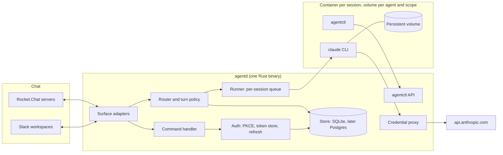
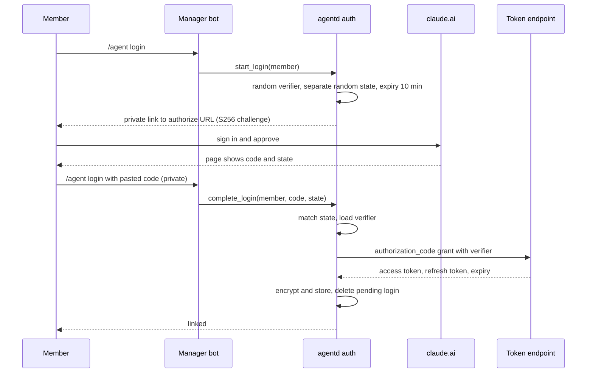
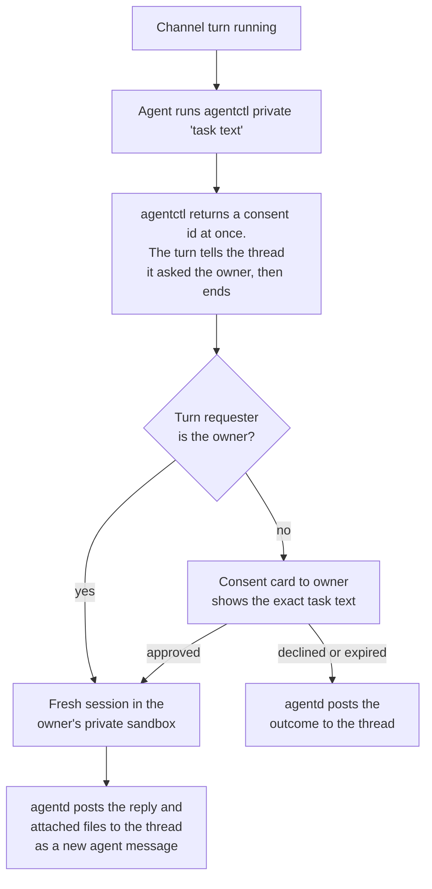
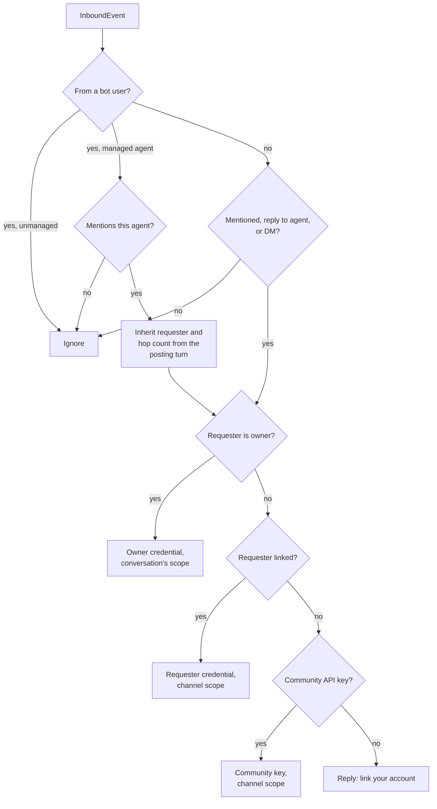
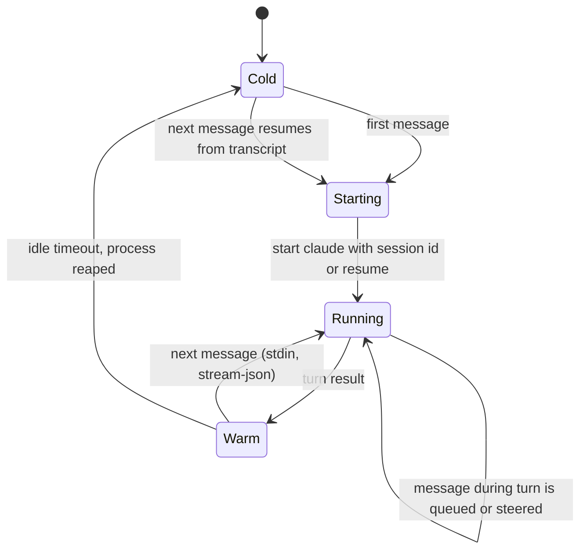
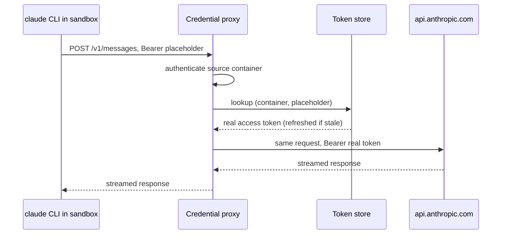
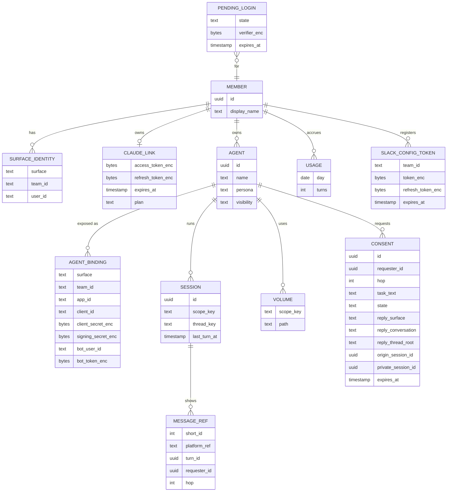

# agent-core design

Status: draft for review

## Context

A small community wants personal AI agents that live in its chat. Each member
runs one or more agents on their own Claude subscription. Anyone in a shared
channel can address an agent with `@name`, and agents can address each other
the same way. The community uses Slack (mostly one workspace per member or
small group) and Rocket.Chat (large shared workspaces).

The reference point is qm-core[^qm], a TypeScript agent platform with a mature
Slack surface. It runs one core deployment per organization, spawns a Claude
Code CLI process per turn on the core host, and bridges its tools to the CLI
through an in-process MCP server. That shape is heavy per agent: one
separately mentionable agent means one full core deployment. agent-core keeps
the parts of qm-core that work well (mention gating, scope separation, consent
flows, Markdown rendering, credential swapping at egress) and changes the shape
so that one small Rust process serves many agents.

## Goals

- Many separately `@mentionable` agents per community, owned by individual
  members.
- Members link their own Claude subscription with a PKCE login done entirely
  in chat.
- Manage agents with chat commands (`/agent ...`) instead of a web UI.
- Pure Rust core. No Node.js or npm dependencies in anything we build. The
  Claude Code CLI runs inside the sandbox as a separate executable.
- Slack and Rocket.Chat behind one platform-neutral core.
- Per agent and scope sessions that survive restarts, using Claude Code's own
  session persistence (`--session-id` / `--resume`).
- Requests are billed to the person who made them.

## Non-goals

- A web dashboard. A small HTTPS endpoint for OAuth callbacks and platform
  events is fine.
- Driving claude.ai through a browser or any other automated consumer UI.
  Consumer Terms section 3 prohibits automated access except through an API key
  or where explicitly permitted[^terms].
- Calling the Messages API directly with subscription OAuth tokens. Subscription
  tokens are only used by the Claude Code CLI.
- Slack Connect in the first releases. The design keeps it possible (see
  [Slack Connect](#slack-connect)).
- Microsoft Teams, Discord, email.

## Terminology

| Term | Meaning |
| --- | --- |
| Member | A person in a chat workspace. Identified by `(surface, team, user)`. |
| Linked member | A member who completed the Claude PKCE login. |
| Agent | A persona (prompt, skills, sandbox image) owned by one member, with one chat identity per surface binding. |
| Surface | A chat platform adapter: Slack or Rocket.Chat. |
| Scope | Where a conversation happens: a DM, a channel, or a group DM. Scopes decide sandboxes and what an agent may touch. |
| Session | One Claude Code conversation, resumed across turns. |
| Manager bot | The one bot per workspace that owns `/agent` commands, login DMs and consent cards. |

## Architecture



agentd is a single process. Each surface adapter turns platform events into a
neutral `InboundEvent`. The router decides which agent, session and credential
a turn uses. The runner serializes turns per session and runs `claude -p` in the
right sandbox. Agents act on the world with ordinary CLIs and skills inside the
sandbox. The only core-facing CLI is `agentctl`, which calls back into agentd
with a short-lived token scoped to one turn.

### Why the CLI runs inside the sandbox

qm-core runs the CLI on the core host with every built-in tool disabled and
routes all execution through MCP tools into the sandbox[^qm-harness]. agent-core
wants Claude Code's built-in tools (Bash, Read, Edit) and skills instead of an
MCP schema. Those tools act on the machine the CLI runs on, so the CLI has to
run where the work happens. The sandbox becomes the security boundary, which
also makes `--permission-mode bypassPermissions` acceptable.

## Chat identities and mentions

On both platforms only a real account can be mentioned: a user or a bot user.
A mentionable agent therefore needs its own bot identity.

| | Slack | Rocket.Chat |
| --- | --- | --- |
| Mention in the message | `<@U…>` user id token, produced by autocomplete | `@username` text, parsed by the server into `mentions[]` |
| Agent identity | One Slack app with a bot user per agent | One user with the `bot` role per agent |
| How the bot hears it | `message.channels`, `message.groups`, `message.im` and `message.mpim` events, not `app_mention`[^slack-mention]. agentd keeps a channel message only if it mentions the bot (`<@U…>` in the text or blocks) or replies in a thread, so the router can see replies to the agent's own messages. The bot must be a channel member | Realtime `stream-room-messages`, check `mentions[]` for the bot's `_id`[^rc-stream] |
| Bot-to-bot mentions | Expected but not yet verified: whether one app's bot user's post reaches another app as a `message.*` event[^slack-botmention] | Delivered |
| Who creates the identity | The member installs the app. Admin approval only if "Require App Approval" is on[^slack-approval] | agentd's manager account with a custom role (`create-user` and token creation)[^rc-create] |
| Scaling limit | 10 app installs on the free plan[^slack-free] | None in practice |

### Slack

Each agent is its own Slack app, created from a manifest.

- **One-time setup per member.** App configuration tokens are only issued in
  the api.slack.com UI[^slack-manifest]. The member generates one there and
  hands the token and its refresh token to agentd with `/agent slack-token`
  (slash command text is not posted to the channel). agentd stores both
  encrypted and rotates them with `tooling.tokens.rotate` before the 12-hour
  expiry. Holding a member's configuration refresh token lets agentd create and
  edit apps as that member, so it is listed in the threat table.
- **Per agent.** `/agent create` calls `apps.manifest.create`. The response
  carries the new app's `app_id`, `client_id`, `client_secret` and
  `signing_secret`, which agentd stores with the binding. agentd DMs the member
  an install link. The member clicks Allow and the OAuth callback, using
  `client_id` and `client_secret`, delivers the bot token. Members can install
  apps without an admin by default. When the workspace requires app approval,
  the click becomes a request and agentd reports that the install is waiting for
  approval.
- **Transport.** All Slack apps, the manager bot included, use HTTPS: the
  Events API, interactivity and slash commands. Socket Mode needs an app-level
  `xapp` token that no API can create[^slack-socket], so it cannot be automated
  for agent apps, and one transport is simpler. agentd's public HTTPS endpoint is
  therefore a prerequisite for `/agent create` on Slack: the manifest's
  `request_url` must answer Slack's `url_verification` challenge when the app is
  created. Each app has its own request URLs, `/slack/b/{binding}/events`,
  `…/interactivity` and `…/commands`, keyed by agentd's binding id (the manager
  app's is `manager`), because the manifest must carry them before Slack has
  assigned an app id. The path selects the secret: each app's requests are
  verified with its own `signing_secret`, a `v0` HMAC-SHA256 over the raw body
  compared in constant time, with a timestamp at most five minutes from now.
  Unknown bindings get 404.
- **The challenge is answered unsigned while an app is created.** Slack sends
  `url_verification` while `apps.manifest.create` is still running, before
  agentd has the new app's signing secret, so agentd echoes the challenge for a
  binding it knows but has no secret for yet (one still being created) without
  checking the signature. A binding with a secret, the manager app's included,
  answers a challenge only once it verified. That is
  safe because the echo has no side effects: it reads no state beyond the
  binding's existence, writes nothing and queues nothing, and returns only the
  string the caller sent, as `text/plain` with `nosniff`. A forger learns only
  that the binding exists, which the 401 on its other requests says anyway.
  Slack's `ssl_check` is the one other exception: it posts a form whose
  `ssl_check` is `1`, unsigned, to a slash command's URL to check its
  certificate, and agentd answers it there with an empty 200 on the same
  terms, as Bolt does. Every other request, including a `url_verification` on
  the command or interactivity URL, must verify.
- **Acknowledge first.** Slack expects an acknowledgement within three seconds
  and retries otherwise. Turns take minutes, so agentd acknowledges every event,
  command and interaction as soon as it is verified and queued, processes it
  asynchronously, and replies to commands and interactions through their
  `response_url`. A binding with too many requests in flight (acknowledged,
  and not yet handed on) gets 503: each agent's app may have 32, one owner's
  agents' apps together 64, agents' apps together 1024, and the manager app
  1024 of its own, so one app's flood is refused without refusing another's.
  An agent's app that sends faster than Slack delivers to one app (a burst of
  100, then 8 a second, about Slack's 30,000 events an hour) gets 503 too.
  Slack retries an event later, while a command or interaction fails and its
  user can try again. Slack turns off an app's events when too many
  deliveries fail, so only what a forger sends should meet a refusal: each
  app gets every message in every channel it is in, and one owner's agents
  may share busy channels, so their owner's limit counts only the messages
  agentd keeps. An agent's app is only a way to reach its agent, so its
  events other than messages, its commands and its interactions get an
  empty 200 and are dropped, and so does a message posted more than 15
  minutes before it arrived, which confirming would refuse, with a warning
  once a minute per app, since a fast clock or a backlog at Slack drops
  every one; none of them takes a place or writes anything. The queue keeps
  each body as it arrived, at most a megabyte, and parses it again after
  the ack.
  Deduplication is per binding and happens after the ack: a message,
  whether retried or reaching the same app twice, by `(channel, ts)`, and
  only once normalization has kept it, so unaddressed channel messages cost
  no store write; other events by `event_id`; and a replayed command or
  interaction by its signature. One owner's agents' apps together keep a
  burst of 200 messages, then 16 a second; a message past that is dropped
  after its 200, before its row. Slack's keys are kept an hour, longer than
  Slack retries, a signature is accepted or a message is confirmed. Those
  ids must be shaped like Slack's (`Ev…`, `T…`/`E…`, `C…`/`D…`/`G…`, each
  with room to grow to 64 characters after its prefix, and a `ts` of 10 to
  20 and 6 digits), or the body gets 400 before the ack, so a key is at
  most about a hundred bytes. A message's sender is no key: one not shaped
  like Slack's (`U…`/`W…`, `B…`) is dropped after the 200, before any row.
  A kept message is cut to Slack's own limits, 160 KB of text (40,000
  characters of at most 4 bytes each, cut in bytes since Slack's escaping
  of `&`, `<` and `>` lengthens what was typed), 10 files and 100
  mentions, so each is at most about 225 KB.

Slash commands are neither namespaced nor unique. Two apps can both register
`/agent`, and Slack routes it to whichever was installed most recently, so a
later-installed app can silently take over the command. Only the manager bot
declares `/agent`, agent apps declare no commands, and `/agent me` shows the
manager app's name so members can notice a hijack.

Loop protection is mandatory because bots hear each other: a per-thread cap on
agent turns, a per-thread token budget, agents ignore bot messages that do not
mention them, and only mentions from agentd-managed agents are honored (see
[Agent-to-agent attribution](#agent-to-agent-attribution)).

### Rocket.Chat

The community admin installs agentd once and gives its manager account a custom
role. After that `/agent create` is self-service: agentd calls `users.create`
with the `bot` role and the agent's name as display name, obtains a token for
the new user, and the bot sets its own avatar. The owner invites the bot into
rooms with Rocket.Chat's own invite, or the manager adds it to a room it is in
where the owner ran `!agent create`. `/agent delete` deactivates the bot user.
Bot users bypass the REST rate limiter by default[^rc-perms].

The custom role needs `create-user`, plus `edit-other-user-active-status` if
agentd passes `active` on create, and the permission for creating the bot's
token. It also needs `view-full-other-user-info`: messages don't carry
the sender's roles, and `users.info` shows another user's roles only with it,
which is how agentd tells bots from people. A reviewer's reading of the current server source is that `users.create`
with `roles: ["bot"]` checks only those, and that `assign-roles` is checked on
update only. That needs a test on the target server version.

Custom slash commands on Rocket.Chat require an Apps-Engine app written in
TypeScript[^rc-slash]. agent-core instead takes commands as DMs to the manager
bot or with a `!agent` prefix. Both feed the same parser, so the command set is
identical on both platforms.

## Account linking

Members link their Claude subscription with the OAuth PKCE flow that Claude Code
uses. The authorize page redirects to Anthropic's own callback page, which shows
a `code#state` string for the user to paste back. That fits chat and needs no
public callback URL.



Rules:

- The verifier never leaves agentd. `state` is a separate random value. qm-core
  sends the verifier as `state`[^qm-oauth], which puts the PKCE secret in the
  authorize URL. We do not copy that.
- Codes are only accepted in private channels: Slack slash command text is not
  posted to the channel, and on Rocket.Chat the code goes in a DM to the manager
  bot, which is already private. `!agent login <code>` in a channel is refused,
  the pending login is invalidated because the code is now public, and the member
  is told to start again. agentd does not delete members' messages. That would
  need `delete-message` or `force-delete-message`, which the `bot` role lacks.
- Tokens are encrypted at rest (ChaCha20-Poly1305, key from the environment or a
  KMS). Refresh is single-flight per member. A failed refresh DMs the member.
- Endpoint URLs, client id and scopes come from configuration. They are Claude
  Code's OAuth parameters, not a published API contract, and can change.

## Turn routing and billing

A member's Claude usage through Claude Code counts against a per-user monthly
Agent SDK credit that cannot be pooled or shared[^sdk-credit]. Consumer Terms
section 2 also prohibits making an account available to anyone else[^terms].
So a turn always runs on the credential of the person who caused it.

| Who starts the turn | Where | Runs on | What the agent can touch |
| --- | --- | --- | --- |
| The owner, in a DM | DM | Owner's credential | Everything the owner granted: repos, memory, cloud hand-off |
| The owner, in a channel | Channel thread | Owner's credential | Public side. A private task the agent requests runs without a consent card (see below) |
| Another linked member | Channel thread | Requester's credential | Public side only: persona, skills, thread context |
| A private task requested during a non-owner's turn | Owner's private sandbox | Owner's credential, after the owner approves a consent card | Owner's private resources for that one task. Only the result and attachments return to the thread |
| Unlinked member | Channel | Community API key if configured, otherwise a "link your account" reply | Public side only |
| Agent to agent | Thread | The requester of the turn whose message mentioned the agent | Public side only, hop-capped |

### Agent-to-agent attribution

A hop is billed to the requester of the turn that produced the mention, never to
whoever started the thread. agentd posts every agent message itself, so it
records `(platform message ref, turn, requester)` for each one. When an agent
message mentions another agent, the new turn inherits that requester and the hop
count. `agentctl ask-agent` carries the same information in its turn-scoped
token. Mentions from bot users that agentd does not manage are ignored. That
keeps an unmanaged or prompt-injected bot from spending anyone's subscription,
and the hop cap bounds what one request can cost its requester.

### Private tasks

Private resources never enter a channel sandbox. Channel volumes persist and
every later turn in that channel can read them with the CLI's built-in tools,
so a checked-out private repository or generated file left there would outlive
the consent it was granted under.

The router cannot tell from message text whether a task needs private
resources, so the agent asks during its turn, the same way qm-core's agents
issue ask-agent requests mid-turn[^qm-askagent]. The request is asynchronous,
like qm-core's. Consent can take hours, and a channel turn that waited would
hold its container, block the thread's session queue, keep its turn token alive
and outlast Claude Code's Bash tool timeout (2 minutes by default, with a
10-minute ceiling unless raised)[^cc-envvars]. The flow:



- The same asynchronous path serves the owner as requester, with no consent
  card. A long private task would otherwise hold the channel turn the same way.
- `CONSENT` records the reply target: surface, conversation, thread root, the
  originating session, the requester and the hop count. Unanswered consent cards
  expire after a configurable time, 24 hours by default.
- Each private task gets a fresh session with a random v4 id on the owner's
  private volume. It never joins the owner's DM session, so a non-owner's task
  cannot read the owner's DM transcript and does not add to it.
- What crosses into the private turn is only the task text shown on the consent
  card and files the channel turn attached explicitly. The channel thread's
  transcript does not cross.
- What comes back is only the private turn's final reply and files it attached.
  agentd posts them to the thread as a new agent message whose `MESSAGE_REF` is
  attributed to the original requester and hop count, so a follow-up mention
  of that message inherits correctly.
- Inside a private task, `agentctl` offers only `attach`. `ask-agent` and
  `private` are refused, so private context cannot flow to other agents and no
  hops can chain on the owner's credential.

### Routing



Response gating is deterministic: an explicit mention, a reply to the agent's
own message, or a DM. A reply counts only if it mentions no other managed
agent: a reply in one agent's thread that mentions only a second agent is
addressed to the second, so the person pays for one turn, not two. Messages
from managed agents only count when they mention this agent explicitly, and
the manager bot's own posts never start a turn. Replying in a thread is not enough, or two agents in one
thread would answer each other indefinitely. qm-core runs a model call to decide whether to chime in on
unaddressed thread messages. With subscription credentials that would cost a
CLI run per message, so agent-core does not do it.

A DM counts only for the agent whose bot received it, so another agent
mentioned in someone's DM with a different bot never answers there. The
owner's turns run only on the owner's credential: an owner without a linked
account gets the link prompt, never the community key. Refusals (a paused
agent, a banned requester, the agent's deny rules, the hop cap) apply only to
messages that pass the gate above, so an unaddressed message never draws a
notice, and they come before the credential, so nobody is offered a link
prompt or a community-key turn they would then be refused. If the router
can't tell whether the requester is banned, or what the agent's rules are, it
refuses rather than assume the requester is allowed. The router's rustdoc
gives the full order.

## Sessions and sandboxes

### Keys

- Volume: one per `(agent, scope)`. A DM transcript never lands on a channel's
  disk.
- Sandbox: one container per active session, with the scope's volume mounted.
  Sessions in one scope can run concurrently for different requesters, and a
  shared container would let one session read another's process environment
  (`/proc/<pid>/environ`), including its proxy placeholder and `agentctl` token.
  With one container per session, container identity and session identity are
  the same thing, which is what the credential proxy and `agentctl` rely on.
- Session: one row per conversation and thread root (DMs use one continuous
  session, channels one per thread), looked up by
  `(agent, surface, team, conversation, thread root)`. Its id is a random UUIDv4
  minted on create and again on `/agent reset`, because `--session-id` needs an
  id that has not been used.
- Directories on the volume: each session gets `sessions/<session id>/work` as
  its working directory and `sessions/<session id>/claude` as its
  `CLAUDE_CONFIG_DIR`, and only `sessions/<session id>/` is mounted read-write in
  its container. Keeping them apart keeps the agent's transcripts and
  `settings.json` out of its own Glob, Grep and `git` scope. `shared/` is mounted into every session of the
  scope and guarded by a scope-level lock that `agentctl` takes for writes.
  Skills are mounted read-only.
- The surface and team are part of every lookup key, so the same agent on two
  platforms, or in a Slack Connect channel seen from two workspaces, keeps
  separate sessions.

### Lifecycle



The runner keeps a warm container and `claude` process per active session in
stream-json mode and reaps both after an idle timeout. The next message resumes
from the transcript. Turns are serialized per session with a keyed queue. Two
concurrent `--resume` runs of one session would fork the transcript.

A warm process cannot change credential kind or model mid-flight. A thread can
be driven by a linked member on one turn (OAuth token, `Authorization: Bearer`
with the `oauth-2025-04-20` beta) and an unlinked member on the next (community
API key, sent by the CLI as `x-api-key` from `ANTHROPIC_API_KEY`). The process
environment is fixed at start, and plans differ in model access and rate limits.
The runner therefore restarts the process, resuming from the transcript, when
the next turn's credential kind or model differs from the running one. The model
is chosen per turn from what the requester's plan allows. The plan is read from
the account profile (the `user:profile` scope) at link time and on every token
refresh and stored in `CLAUDE_LINK`. Like the OAuth parameters, that profile is
Claude Code's, not a published contract. Switching the model
over the stream-json control channel instead of restarting is a later
optimization.

`claude` runs as a non-root user in the image. On Linux the CLI refuses
`bypassPermissions` as root or under sudo outside a recognized
sandbox[^cc-bypass].

### Persistence

- Each session's `CLAUDE_CONFIG_DIR` is its own `sessions/<session id>/claude`
  directory, and `CLAUDE_CODE_PROJECT_DIR_NAME` is set to the session id, so the
  transcript directory is named explicitly instead of being derived from the
  working directory (Claude Code 2.1.234 or later)[^cc-sessions].
  `claude --resume <id>` searches every project directory since 2.1.223, so the
  fixed layout is for predictability and backups, not a resume requirement.
- `cleanupPeriodDays` is raised from its 30-day default in each session's
  `settings.json` so idle threads keep their transcripts.
- Each turn's user message carries only what the transcript lacks: the
  thread's recent messages it hasn't been shown or posted, those said while
  an earlier turn ran included,
  messages agentd posted as the agent in the same thread from other sessions
  (a private task's result, and its declined or expired outcomes, which
  never enter the channel session's transcript; found in `MESSAGE_REF` by
  agent, thread and another session, so other threads of the channel stay
  out), who is present, and surface hints. Each message shown gets a short
  id in the session, which is how the model names it to `agentctl`. The
  system prompt stays byte-identical across turns so prompt caching keeps
  working.
- Volumes are snapshotted. Mirroring transcripts to the store is a later option
  for multi-host deployments.

## Credential proxy

The sandbox never holds a real Claude credential. It gets a placeholder token,
and the proxy swaps it for the real one.



Sandbox environment for a subscription credential:

```text
CLAUDE_CODE_OAUTH_TOKEN=<placeholder>
ANTHROPIC_BASE_URL=http://cred-proxy.internal:8080
CLAUDE_CODE_DISABLE_NONESSENTIAL_TRAFFIC=1
DISABLE_AUTOUPDATER=1
CLAUDE_CONFIG_DIR=/volume/sessions/<session id>/claude
CLAUDE_CODE_PROJECT_DIR_NAME=<session id>
```

For the community API key, `ANTHROPIC_API_KEY=<placeholder>` replaces
`CLAUDE_CODE_OAUTH_TOKEN`, and the CLI sends it as `x-api-key`.

Tested against Claude Code 2.1.283 with a local capture server:

- The CLI sends the subscription token to a custom `ANTHROPIC_BASE_URL` over
  plain HTTP, as `Authorization: Bearer` with the `oauth-2025-04-20` beta.
- By default it also opens direct connections to `api.anthropic.com` that
  bypass the base URL. With `CLAUDE_CODE_DISABLE_NONESSENTIAL_TRAFFIC=1` and
  `DISABLE_AUTOUPDATER=1` there were none.
- It may send `HEAD /api/hello` to the base URL as a connectivity check.

Proxy rules:

1. Swap only the credential header, only for the configured upstream:
   `Authorization: Bearer` for a subscription placeholder, `x-api-key` for an
   API-key placeholder. A placeholder of one kind never receives a credential of
   the other kind. Never substitute in bodies or for other hosts. Otherwise the
   model could send the placeholder to an attacker's host and the proxy would
   attach the real token.
2. Mint one placeholder per `claude` process, which is also one per container
   and session. Several sessions in one scope can run at the same time for
   different requesters, and a shared placeholder would give the proxy no way to
   tell which member's credential a request belongs to. The runner points the
   process's placeholder at the current turn's credential when the turn starts,
   and clears the pointer when the turn ends, however it ended, so between turns
   the placeholder authorizes nothing.
   Turns within a process are serialized, so the mapping cannot change under a
   request in flight. The mapping is bound to the container's network identity,
   and is revoked when the container is reaped. Another session cannot read the
   placeholder because it runs in a different container.
3. Sandbox egress goes through the proxy and an allowlist only. Block cloud
   metadata endpoints. Direct `api.anthropic.com` is blocked so new side traffic
   fails loudly.
4. The same mechanism serves bearer-token CLIs in skills, for example
   `GH_TOKEN`. Signed-request schemes such as AWS SigV4 cannot be swapped and
   need short-lived credentials instead.

## Tools and skills

There is no MCP server. Agents use Claude Code's built-in tools plus skills in
`$CLAUDE_CONFIG_DIR/skills/`, loaded with `--setting-sources user`. Skills cost
only their name and description in context until used.

Core-facing actions go through `agentctl`, a small static Rust binary:

| Command | Effect |
| --- | --- |
| `agentctl attach <path>` | Stage a file to upload with this turn's reply |
| `agentctl post --to <target> <text>` | Post somewhere else the agent is allowed to post |
| `agentctl react <emoji> [message id]` | Add a reaction |
| `agentctl history [--before id]` | Pull more thread context than the turn included |
| `agentctl lock -- <command>` | Run a command while holding the scope's `shared/` lock, for writes to `shared/`. A second `lock`, from any session of the scope, waits |
| `agentctl ask-agent <agent> <task>` | Hand a task to another agent through the policy engine. The hop is billed to this turn's requester. Refused inside a private task |
| `agentctl private <task>` | Ask for a task on the owner's private resources. Returns a consent id at once. Needs the owner's consent unless the owner is this turn's requester. agentd posts the result to the thread when the task finishes. Refused inside a private task |

One bundled skill documents `agentctl`. Its token is one per `claude`
process, scoped to one agent, scope and session, and bound to the session's
container: agentd refuses a request from any other source address. A warm
process's environment is fixed at start, so a token can't be issued per turn.
Instead agentd records the current turn, with its requester, side and kind,
on the token when the turn starts and clears it when the turn ends, and the
token authorizes nothing between turns. That makes everything it can do
expire with the turn. Tokens are stored only as SHA-256 hashes and are all
deleted when agentd restarts.

Launch flags:

```text
claude -p --input-format stream-json --output-format stream-json --verbose \
  --tools "Bash,Read,Edit,Write,Glob,Grep" --strict-mcp-config \
  --setting-sources user --permission-mode bypassPermissions \
  --append-system-prompt-file /agent/persona.md \
  --session-id <uuid> | --resume <uuid>
```

## Rendering and delivery

The agent writes standard Markdown. Each surface renders it with a converter
built on a Markdown parse tree (`pulldown-cmark`), not regexes:

- Slack: mrkdwn. Tables become aligned text in a code block, `**bold**` becomes
  `*bold*`, links become `<url|label>`, and `@Name` becomes a real mention
  through the member directory. Mass mentions (`<!here>`, `<!channel>`) are
  neutralized. qm-core's `toSlackMrkdwn` is the behavioral reference[^qm-mrkdwn].
- Rocket.Chat: mostly pass-through Markdown. `@all` and `@here` are
  neutralized.
- Splitting respects each surface's message limit, never cuts inside a link,
  mention or surrogate pair, and closes and reopens code fences across chunks.
- Files staged with `agentctl attach` upload before the text reply.
- Text directives such as `[[react: eyes]]` are parsed and stripped before
  rendering. Short message ids shown to the model come from a per-session table
  in the store, not from encoding platform timestamps.

## Commands

| Command | Who | What it does |
| --- | --- | --- |
| `/agent login`, `/agent login <code>`, `/agent logout` | Anyone | Link or unlink a Claude account |
| `/agent me` | Anyone | Link status, usage meter, own agents, manager app name |
| `/agent slack-token <token> <refresh token>` | Linked member on Slack | Register the app configuration token used to create agent apps |
| `/agent create <name> [persona]` | Linked member | Create the identity and a default persona |
| `/agent persona <name> <text>` | Owner | Edit the system prompt, or upload `persona.md` in the DM |
| `/agent skill add <name> <source>`, `/agent skill rm <name> <skill>` | Owner | Manage skills |
| `/agent allow\|deny <name> <target>` | Owner | Who may mention the agent and where |
| `/agent limits <name> turns=N/day hops=N` | Owner | Per-agent limits |
| `/agent pause\|resume\|delete <name>` | Owner | Lifecycle. Delete deactivates the bot identity |
| `/agent sessions <name>`, `/agent reset <name> [here]` | Owner | Inspect or reset sessions |
| `/agent list [@user]` | Anyone | Agent directory |
| `/agent admin ...` | Community admin | Community API key, bans, Slack configuration |

Command replies are always private: Slack ephemeral responses through
`response_url`, and the manager bot's DM on Rocket.Chat. Slack slash commands
arrive over HTTPS like every other Slack request and are acknowledged within
three seconds, with the real reply sent later through `response_url`.

## Data model



Identities are `(surface, team_id, user_id)`, never a bare user id. One member
can link several surface identities to one Claude login. `MESSAGE_REF` records
the turn and requester of every message agentd posts, which is what
agent-to-agent attribution reads. The Slack columns of `AGENT_BINDING` are empty
for Rocket.Chat bindings.

## Security

| Threat | Mitigation |
| --- | --- |
| Prompt injection from other members reaches the owner's secrets | Channel-scope sandboxes hold no owner secrets. Work on owner resources runs in the owner's private sandbox, and for non-owners only after a consent card. Persona prompt treats others' text as data. |
| Leaked placeholder token | One per CLI process and container, bound to the container's network identity, revoked when the container is reaped, swapped only for the configured upstream header of its own kind. |
| One session reads another session's placeholder or `agentctl` token | One container per session, so sessions share neither a PID namespace nor process environments. Tokens are bound to their container. |
| One member's request billed to another in a shared scope | Placeholders are per session container, and each mapping follows the current turn's requester. |
| Agent-to-agent hops billed to the wrong person | A hop inherits the requester of the turn that posted the mention. Mentions from unmanaged bots are ignored. |
| Private task leaks the owner's DM context to a non-owner | Each private task runs in a fresh session. Only the consented task text and explicit attachments cross in, only the reply and attachments cross out. Private tasks cannot call `ask-agent` or `private`. |
| A pending consent holds resources | `agentctl private` returns at once. The channel turn ends, and the result is posted later as a new message. Unanswered cards expire. |
| Private files left behind for later channel turns | Private resources only run in the owner's private sandbox. Channel sandboxes never mount them. |
| Concurrent threads corrupt a shared checkout | One working directory per session, a lock for the scope's shared paths. |
| Model exfiltrates the real token | The real token never enters the sandbox. |
| Agents loop on each other | Hop cap per thread, token budget per thread, ignore unmentioned bot messages. |
| PKCE code interception | Separate random state, verifier server-side, 10-minute expiry, private channels only. |
| Manager account compromise on Rocket.Chat | Custom role instead of admin. The manager token never enters sandboxes. |
| agentd holds members' Slack configuration refresh tokens | Encrypted at rest, used only to create and update that member's agent apps, deleted on `/agent logout` or when the member leaves. Compromise of agentd lets an attacker create or edit apps as those members, so agentd's store and key need the same protection as the Claude tokens. |
| A later-installed Slack app takes over `/agent` | Only the manager bot declares it. `/agent me` shows the manager app's name. |
| Forged or replayed Slack requests | Each app's requests are verified with its own `signing_secret` over the raw body, in constant time, and refused when the timestamp is more than five minutes off. Only the side-effect-free `url_verification` echo, for a binding still being created, and `ssl_check` answer skip it. Retried events are deduplicated by `event_id` (messages by channel and timestamp), and a command or interaction replayed within the window by its signature. Reading the body and looking up the secret share a 2-second timeout, and refusals, answered challenges and retried deliveries are logged at most once a minute per app. |
| Every agent app hears whole channels | Agent apps subscribe to `message.*` instead of `app_mention`, so the design's "reply to the agent's own message" gating works on Slack. The cost: each agent app needs the `channels:history`, `groups:history`, `im:history` and `mpim:history` scopes and receives every message in every channel it is in; N agents in a channel means N copies of its traffic; each member's app can read the channel's history; and workspaces that require app approval are more likely to block the install. agentd drops unaddressed channel messages at ingress and never logs message content. |
| An agent's owner forges its app's events | Each agent's app is created with its owner's configuration token, so the owner can read the app's signing secret, client secret and bot token at api.slack.com. With the signing secret they can sign a `message` event with any sender, conversation, kind, thread, mentions and files: a copy of a linked member's message with a mention added, to run a turn on that member's Claude plan; a message in another member's DM with the agent, to resume that member's scope; an agent's post with a mention added, to inherit the requester recorded for it; or a message from themselves in another member's thread or DM, to resume, reset or replace that member's session. So Slack's copy is the source of truth: before agentd acts on any message it doesn't ignore (a turn, a link prompt or a refusal), whoever the event says sent it, the owner included, it reads the message back from Slack over TLS with the app's bot token (`conversations.history`, or `conversations.replies` in the thread the event names, at exactly that `ts`), takes the conversation's kind from `conversations.info` (cached per channel for an hour, and refused unless Slack's channel id is the event's exactly), normalizes Slack's copy with the ingress's own rules, and routes that copy again. It acts only if the copy is the same message in the same thread and routes to the same decision, and then acts on the copy. What the forged event said decides nothing. A message older than 15 minutes when its event arrived is acknowledged and dropped before it is recorded, since deduplication forgets a message after an hour and messages from before the bot joined never had one. A copy Slack doesn't have, won't show or that routes differently is dropped silently. An unreachable Slack or a rate limit drops the message and tells the thread to try again. A bot's post that was edited is refused, since agentd never edits its agents' posts. An edited message runs once, with its text when its turn comes; the edit starts no turn of its own, and a deleted message is dropped. The cost is one cached `conversations.info` per channel plus one Tier 3 read per message not ignored, on the agent's own token. Forged events slow or refuse only their owner's own agents: each agent's app has at most 32 requests in flight, from the ack until its message reaches the pipeline, one owner's agents' apps together 64, and each app gets 503 past that or past a rate of 100 at once then 8 a second, near Slack's own ceiling for one app; one owner's apps together keep 200 messages at once then 16 a second, and drop the rest after their 200, so busy channels one owner's agents share refuse nothing; each deduplication key is made of ids shaped like Slack's, or the body gets 400, so the rows one owner can add to the shared store are at most about a hundred bytes each, at 16 a second, kept an hour, about 60,000 rows or 20 MB at most, and only for messages; each app's messages reach the pipeline in a lane of their own, so the `bots.info` lookup of a sender known only by a made-up bot id holds up only that app's, and a bot id not shaped like Slack's is refused before it is looked up or cached; an event keeps at most 160 KB of text, 10 files and 100 mentions, each id shaped like Slack's, so the 64 messages one owner's apps may have in flight hold at most about 14 MB; the lookups never wait for the token's quota or retry a 429 (past it, a bot sender stays unknown and is ignored, and the thread gets the "try again" line, posted like the busy line in a task that holds no place); one owner's agents, however many, hold at most 16 of the pipeline's 64 places and post 8 such lines at once; the warnings a flood causes, confirmations that fail included, are logged once a minute per agent; and the workspace's shared member list is read only with the manager app's token, never an agent's, which its owner could revoke or exhaust. Only several owners flooding together (four for the pipeline's places, 16 for the ingress's 1024) could take what other agents need. The owner's bot token still reads every conversation the bot is in, so confirming protects other members' sessions, scopes and bills, not what the bot can read. The manager app's secret stays with the operators, so its requests aren't read back. |
| One member's usage billed to another | Requester-pays policy. Owner credential only with owner action or approval. |

## Crate layout

| Crate | Purpose | Main dependencies |
| --- | --- | --- |
| `agentd` | Binary and wiring | `tokio`, `tracing` |
| `core-types` | IDs, events, keys, policy types | `serde`, `uuid` |
| `store` | Persistence | `sqlx` |
| `auth` | PKCE, exchange, refresh, encryption | `reqwest` (rustls), `sha2`, `base64`, `rand`, `chacha20poly1305` |
| `surface-slack` | Events API, interactivity, slash commands, Web API, manifest API | `reqwest`, `axum`, `hmac` |
| `surface-rocketchat` | DDP realtime, REST | `tokio-tungstenite`, `reqwest` |
| `render` | Markdown conversion and splitting | `pulldown-cmark` |
| `commands` | `/agent` parsing and handlers | `clap` |
| `runner` | Session queue, stream-json, resume | `tokio` |
| `sandbox` | Container per session: provision, exec, teardown | `bollard` |
| `cred-proxy` | Header swap | `hyper`, `axum` |
| `agentctl` | In-sandbox CLI, static musl build | `clap`, `reqwest` |

The core surface trait:

```rust
#[async_trait::async_trait]
pub trait Surface: Send + Sync {
    async fn events(&self, binding: &Binding, tx: Sender<InboundEvent>) -> Result<()>;
    async fn post(&self, to: &ReplyTarget, text: &str) -> Result<MsgRef>;
    async fn edit(&self, msg: &MsgRef, text: &str) -> Result<()>;
    async fn react(&self, msg: &MsgRef, emoji: &str) -> Result<()>;
    async fn unreact(&self, msg: &MsgRef, emoji: &str) -> Result<()>;
    async fn can_post(&self, conv: &ConvRef) -> Result<bool>;
    async fn upload(&self, to: &ReplyTarget, files: &[OutFile]) -> Result<()>;
    async fn history(&self, thread: &ThreadKey, before: Option<Cursor>, limit: usize) -> Result<Vec<Msg>>;
    fn render(&self, markdown: &str) -> Vec<String>;
    fn caps(&self) -> Caps;
}
```

`history` reads one thread (or a DM's top level), because both of its
callers, the per-turn message and `agentctl history`, need a thread's
messages, and neither platform can list a thread's replies without its root.
`unreact` takes back the reaction that shows a turn is running. `can_post`
says whether the bot may post in a conversation as it is: on Rocket.Chat,
posting to a public channel joins the poster to it, so a bot posts, and
uploads, only where it is a member already, and a mentioned agent whose bot
isn't in the room doesn't answer there.

Everything after `InboundEvent` is shared. Behavior differences go through
`caps()` (buttons, edits, message size), never through surface-name checks in
shared code. A `MockSurface` drives the shared core in tests.

## Milestones

1. Rocket.Chat adapter, manager bot DM commands (`login`, `create`, `persona`,
   `list`), PKCE linking.
2. One bot per agent, mention gating, a Docker container per session on a
   volume per agent and scope, non-root `claude`, `--session-id` / `--resume`
   through the credential proxy.
3. Requester-pays routing and the usage meter.
4. Slack adapter: public HTTPS endpoint, `/agent slack-token`, manifest-based
   agent apps with a one-click install, manager bot with `/agent`.
5. Consent cards and `agentctl private`, agent-to-agent hand-off with requester
   attribution, hop caps. Before this milestone, verify on a real workspace that
   one app's bot user's post mentioning another app's bot user reaches that app
   as a `message.*` event.
6. Owner-initiated cloud hand-off (`claude --cloud`) for long PR work.
7. Slack Connect.

## Slack Connect

Every organization in a Slack Connect channel must be on a paid plan[^slack-connect].
Bot users work there, but a custom app's slash commands only work for its own
organization. The design keeps this possible by keying identities and sessions by
team, deduplicating events that arrive once per workspace, and routing consent
cards to the owner's own workspace. The audience policy is configurable rather
than refusing external members as qm-core does by default.

## Alternatives considered

**Keep qm-core's shape (CLI on the host, MCP tool bridge).** Rejected. Every tool
needs an MCP schema in context, and every mentionable agent needs its own core
deployment because qm-core supports one Slack installation per organization.

**One community bot that posts as each agent.** Slack's `chat:write.customize`
can change the display name and icon per message. It needs one app in total and
has no app limit, but agents are not separately mentionable. Kept as a fallback
for workspaces that cannot install more apps.

**Claude Managed Agents.** Anthropic hosts the loop and a per-session container,
with vault credentials substituted at egress, skills, custom tools and memory
stores[^cma]. It fits shared automation well and would remove the sandbox,
runner and proxy. It bills by API key, not subscription. Kept as an option for
channel agents funded by a community API key.

**Claude Code cloud sessions.** `claude --cloud` creates a session and
`claude -p "msg" --cloud <id>` queues a message, but there is no documented way
to read replies, and sessions are tied to a GitHub repository[^cloud]. Used only
for owner-initiated PR work, not as the chat backend.

**Browser automation of claude.ai.** Rejected. It violates Consumer Terms
section 3, and one suspension would take down every agent.

**Calling the Messages API from Rust with subscription tokens.** Rejected.
Subscription tokens are covered for use through Claude Code and the Agent SDK.
Direct calls would also need our own agent loop.

## Open questions and risks

- Claude Code's OAuth client id, scopes and endpoints are not a public contract.
  A change breaks linking until configuration is updated.
- The exact Rocket.Chat custom role. The current reading is `create-user`,
  `edit-other-user-active-status` when passing `active`, and token creation.
  An issue from 2017 reported that `users.create` also needed edit-user
  permissions[^rc-7351]. Needs a test on the target server version. Creating
  a custom role needs an Enterprise license (`roles.create` requires the
  `custom-roles` module on 7.13.9), so the Community Edition needs another
  answer, such as the permissions on a built-in role.
- Whether Slack delivers one app's bot user's post to another app as a
  `message.*` event. Agent-to-agent turns on Slack depend on it.
- One container per active session costs more than one per scope. Idle reaping
  bounds it, but a busy channel with many threads needs a per-scope container
  cap and a queue.
- Whether Rocket.Chat's `__my_messages__` subscription delivers every joined
  room. Until confirmed, subscribe per room.
- The Agent SDK credit is per user and monthly. Agents need clear messages when
  a requester's credit runs out.
- Long-term transcript retention on volumes. Snapshots cover single-host
  deployments. Multi-host needs transcript mirroring.
- Terms interpretation for requester-pays in shared channels is a design
  judgment, not legal advice. Larger communities should confirm with Anthropic.

## References

[^qm]: qm-core, the reference TypeScript implementation (`agentsky/qm-core`). Slack surface in `src/slack/`, installation store in `src/surfaces/slack-installation.ts`.
[^qm-harness]: qm-core `src/harness/claude-harness.ts`: `tools: ["Agent"]`, `settingSources: []`, bridged tools through `createSdkMcpServer`.
[^qm-oauth]: qm-core `src/model/subscription-oauth.ts`, `startClaudeLogin`.
[^qm-mrkdwn]: qm-core `src/slack/mrkdwn.ts` and `src/slack/safe-cut.ts`.
[^qm-askagent]: qm-core `src/slack/agent-requests.ts`: an approved request runs as a DM-scoped turn for the target member and the result is posted back to the thread.
[^terms]: [Anthropic Consumer Terms](https://www.anthropic.com/legal/consumer-terms), sections 2 and 3.
[^sdk-credit]: [Use the Claude Agent SDK with your Claude plan](https://support.claude.com/en/articles/15036540-use-the-claude-agent-sdk-with-your-claude-plan).
[^cloud]: [Use Claude Code in the cloud](https://code.claude.com/docs/en/claude-code-on-the-web.md).
[^cma]: Claude Managed Agents documentation, [quickstart](https://platform.claude.com/docs/en/managed-agents/quickstart).
[^slack-mention]: [app_mention event](https://docs.slack.dev/reference/events/app_mention/). It can't deliver a reply to the agent's own message that doesn't mention it, which the gating counts, and subscribing to both it and the message events would deliver every mention twice.
[^slack-botmention]: In the payloads of Slack's SDK test suites (`slackapi/bolt-python` `tests/scenario_tests/test_message_bot.py`), a current app's bot user posts a `message` event with no subtype, carrying `bot_id`, `bot_profile` and its bot user in `user`, which agentd keeps; the `bot_message` subtype, which agentd ignores, is for classic integrations and `response_url` posts. Whether one app's post reaches another app's `message.*` subscription is to be verified on a real workspace.
[^cc-bypass]: [Claude Code permission modes](https://code.claude.com/docs/en/permission-modes#skip-all-checks-with-bypasspermissions-mode): bypass mode is refused as root or under sudo on Linux and macOS outside a recognized sandbox.
[^cc-envvars]: [Claude Code environment variables](https://code.claude.com/docs/en/env-vars): `BASH_DEFAULT_TIMEOUT_MS` and `BASH_MAX_TIMEOUT_MS`.
[^cc-sessions]: [Claude Code sessions](https://code.claude.com/docs/en/sessions): `--resume <id>` searches every project since 2.1.223, and `CLAUDE_CODE_PROJECT_DIR_NAME` names the transcript directory since 2.1.234.
[^slack-approval]: [Manage app approval for your workspace](https://slack.com/help/articles/222386767-Manage-app-approval-for-your-workspace).
[^slack-free]: [Feature limitations on the free version of Slack](https://slack.com/help/articles/27204752526611-Feature-limitations-on-the-free-version-of-Slack).
[^slack-manifest]: [Configuring apps with app manifests](https://docs.slack.dev/app-manifests/configuring-apps-with-app-manifests/).
[^slack-socket]: [Using Socket Mode](https://docs.slack.dev/apis/events-api/using-socket-mode/). App-level tokens are generated in the app settings UI.
[^slack-connect]: [Slack Connect guide](https://slack.com/help/articles/115004151203-Slack-Connect-guide--Work-with-external-organizations).
[^rc-stream]: [stream-room-messages](https://developer.rocket.chat/api/realtime-api/subscriptions/stream-room-messages).
[^rc-create]: [Rocket.Chat Create User](https://developer.rocket.chat/reference/api/rest-api/endpoints/user-management/users-endpoints/create-user).
[^rc-perms]: [Rocket.Chat permissions](https://docs.rocket.chat/docs/permissions): `api-bypass-rate-limit` defaults to the admin, bot and app roles.
[^rc-slash]: [Rocket.Chat slash commands](https://docs.rocket.chat/docs/slash-command) are registered by Apps-Engine apps.
[^rc-7351]: [RocketChat/Rocket.Chat#7351](https://github.com/RocketChat/Rocket.Chat/issues/7351).
