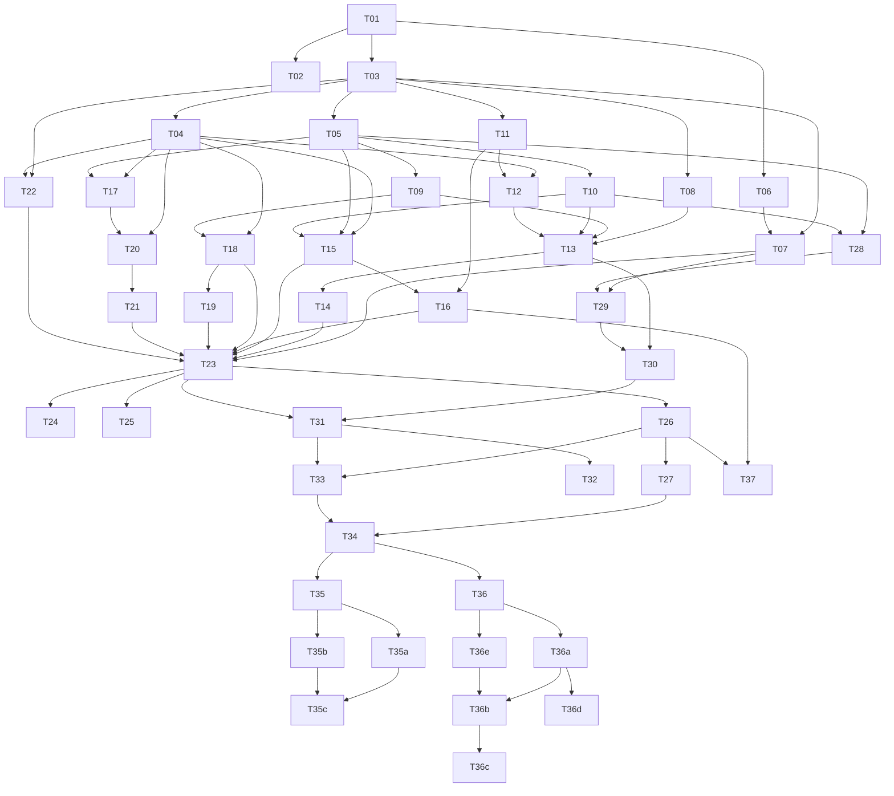

# agent-core implementation plan

Status: draft for review

This plan turns [design.md](design.md) into pull requests that coding agents
can pick up one at a time. Each task is one PR, with its dependencies, the
files it owns, what it delivers, and how a reviewer knows it is done. Tasks
without a dependency path between them can run in parallel.

The design is the source of truth for behavior. This plan fixes the engineering
choices the design leaves open ([Decisions](#decisions-this-plan-fixes)) and
orders the work. If a task has to deviate from the design, the same PR updates
`docs/design.md` and says why in its description.

## How to use this plan

1. Pick a task whose dependencies are all merged. The
   [dependency graph](#dependency-graph) and [lanes](#parallel-lanes) show what
   is unblocked.
2. Branch from the latest `main` as `<agent-name>/<branch>`. The branch name
   is given per task. The prefix names your coding agent (`claude`, `codex`,
   `copilot`), as `AGENTS.md` says.
3. Read the design sections the task links to, and this plan's
   [Decisions](#decisions-this-plan-fixes) and
   [Definition of done](#definition-of-done).
4. Deliver exactly the task's scope. Things marked out of scope belong to
   another task. If you find the task needs something that no task owns, add it
   to [Deferred work](#deferred-work) in the same PR rather than widening the
   change.
5. Leave the task's box in [Task index](#task-index) unticked. It is ticked
   when the PR merges, so a PR stacked on unmerged work never marks its task
   done before its base lands.

A task that grows past about 1,500 changed lines (lockfile and fixtures
excluded) should be split. Say where you split it in the PR description, and
add the remainder to this file as a new task with a letter suffix, for example
`T20b`.

## Decisions this plan fixes

These close questions the design leaves open, so that parallel tasks agree.

### Workspace

- The root `agent-core` package stays. It keeps `README.md` as its rustdoc and
  becomes an umbrella library that re-exports nothing. The root `Cargo.toml`
  gains:

  ```toml
  [workspace]
  members = ["crates/*"]
  default-members = [".", "crates/*"]
  resolver = "3"
  ```

  `default-members` makes plain `cargo test` and `cargo clippy` at the root
  cover every crate, so the existing CI commands keep working without
  `--workspace`. `cargo llvm-cov` ignores `default-members`, so the `coverage`
  alias passes `--workspace` itself
  ([impl-notes](impl-notes.md#cargo-llvm-cov-ignores-default-members)).
- CI runs cargo with `--locked`, so a stale `Cargo.lock` fails instead of
  being re-resolved on the runner.
- Crates live in `crates/<name>/`, with the package name equal to the directory
  name. All crates set `publish = false`.
- Shared metadata (`edition`, `rust-version`, `license-file`) and every
  third-party dependency version live in `[workspace.package]` and
  `[workspace.dependencies]`. Member crates use `workspace = true`. T01 declares
  every dependency this plan expects, so later PRs rarely touch the root
  manifest and rarely conflict on it.
- `[workspace.lints]` sets `rust.unsafe_code = "forbid"` and
  `clippy.all = "warn"`. Every crate has `[lints] workspace = true`. CI already
  turns warnings into errors.
- `Cargo.lock` is committed. agentd and agentctl are binaries that ship in
  images, so builds must be reproducible. T01 removes `Cargo.lock` from
  `.gitignore`.

### Crates

The design's [crate layout](design.md#crate-layout), with two additions and
one move:

| Crate | Kind | Notes |
| --- | --- | --- |
| `core-types` | lib | IDs, keys, `InboundEvent`, `Surface` trait, `Caps`, agentctl wire types, `Cidr`. No I/O. |
| `store` | lib | sqlx on SQLite. **Owns encryption at rest** (moved from `auth`, see below). |
| `auth` | lib | PKCE, token exchange, refresh, profile and plan lookup. |
| `render` | lib | Markdown to Slack mrkdwn and Rocket.Chat, splitting, directives. |
| `commands` | lib | `/agent` grammar and its parsed `Command` type. Handlers live in agentd. |
| `router` | lib | **Added.** The design has "Router and turn policy" in the architecture diagram but no crate for it. It holds pure routing, gating and credential-selection logic. |
| `runner` | lib | stream-json driver, per-session queue, warm pool, reaping. It never calls agentd: placeholder minting and agentctl tokens reach it through a `TurnHooks` trait that agentd implements (T23). |
| `sandbox` | lib | `Sandbox` trait, Docker implementation (bollard), process implementation for tests and development. |
| `cred-proxy` | lib | Header-swap reverse proxy and egress allowlist proxy. Served by agentd. |
| `surface-rocketchat` | lib | REST and DDP clients, `Surface` implementation. |
| `surface-slack` | lib | HTTPS ingress, Web API, manifest API, `Surface` implementation. |
| `agentd` | bin + lib | Configuration, wiring, command handlers, HTTP listeners, the turn pipeline. |
| `agentctl` | bin | In-sandbox CLI. Static musl build. |
| `testkit` | lib | **Added.** Test-only: `MockSurface`, the `fake-claude` binary, fake Rocket.Chat and Anthropic servers, fixtures. Only ever a dev-dependency. |

Encryption lives in `store` instead of `auth`. Every encrypted column (Claude
tokens, PKCE verifiers, Slack client and signing secrets, bot tokens, Slack
configuration tokens) goes through the store, so doing it there means no caller
can forget. The store API takes and returns `secrecy::SecretString`, and seals
values with ChaCha20-Poly1305 using the row's table, column and primary key as
associated data, so a ciphertext copied into another row fails to decrypt.

### Libraries

| Concern | Choice |
| --- | --- |
| Async runtime | `tokio` (multi-thread) |
| HTTP server | `axum` on `hyper` 1 |
| HTTP client | `reqwest` with `default-features = false`, plus its `rustls` feature (the `aws-lc-rs` provider) in crates that talk HTTPS; see [impl-notes](impl-notes.md#reqwest-013-defaults-to-aws-lc-rs-not-ring). No OpenSSL anywhere (T02 enforces it). `agentctl` only talks plain HTTP to `agentctl.internal`, so it builds `reqwest` without any TLS feature. |
| WebSocket | `tokio-tungstenite` with rustls |
| Database | `sqlx` with `sqlite` and `runtime-tokio`, runtime-checked queries (`sqlx::query_as` with `FromRow`), not the `query!` macros, so CI needs no `DATABASE_URL` and no offline query cache |
| Migrations | `sqlx::migrate!("./migrations")` in `store`, file names `<UTC timestamp>_<name>.sql`, so parallel PRs don't collide on numbers |
| Errors | `thiserror` in libraries, `anyhow` in the two binaries |
| Logging | `tracing`, `tracing-subscriber` with JSON output in production |
| Secrets | `secrecy` for every token, key and secret in memory. `Debug` never prints them. |
| Serialization | `serde`, `serde_json`, `toml`, and `serde_path_to_error` so configuration errors name the key |
| IDs | `uuid` with `v4` and `serde` |
| Time | `time` with `serde` and `formatting` (not `chrono`) |
| Crypto | `chacha20poly1305`, `sha2`, `hmac`, `base64`, `rand`, `subtle` for constant-time compares |
| Markdown | `pulldown-cmark` |
| CLI parsing | `clap` with `derive` |
| Docker | `bollard` |
| Dyn async traits | `async-trait` (the `Surface` trait is used as `dyn`) |
| HTTP fakes in tests | `wiremock` |
| URL parsing | `url`, already in the tree through `reqwest`; `commands` uses it for a routine's fire URL (T35a), so its origin compares with a `reqwest::Url`'s |

Adding a dependency that isn't in this table needs a sentence in the PR
description, and must pass T02's policy.

### Configuration

- One TOML file (`agentd --config /etc/agentd/agentd.toml`) plus environment
  overrides for secrets only. Secrets never go in the file:
  `AGENTD_MASTER_KEY` (base64, 32 bytes), `AGENTD_RC_MANAGER_TOKEN` and
  `AGENTD_SLACK_MANAGER_*`. The community API key is not configuration. An
  admin sets it with `/agent admin api-key set` (T26), and it is stored sealed.
  There is one source, so there is no precedence question.
- `agentd gen-key` prints a new master key.
- The file's sections, each added by the task that first needs it: `[server]`,
  `[internal]`, `[store]`, `[claude_oauth]`, `[sandbox]`, `[runner]`,
  `[proxy]`, `[rocketchat]`, `[slack]`, `[limits]`, `[agents]` (T14's
  per-owner cap), `[community]` (T26's community admins), `[cloud]` (T35b,
  optional: without it cloud hand-off is off), `[slack_connect]` (T36b's
  audience). `config/agentd.example.toml` documents every key and is kept
  current by each task.
- Claude OAuth defaults, observed in the Claude Code 2.1.285 binary on
  2026-09-30. Configuration, not constants, per the design's
  [Account linking](design.md#account-linking) rules:

  | Key | Default |
  | --- | --- |
  | `authorize_url` | `https://claude.com/cai/oauth/authorize` |
  | `token_url` | `https://platform.claude.com/v1/oauth/token` |
  | `revoke_url` | `https://platform.claude.com/v1/oauth/token/revoke` |
  | `redirect_uri` | `https://platform.claude.com/oauth/code/callback` |
  | `client_id` | `9d1c250a-e61b-44d9-88ed-5944d1962f5e` |
  | `scopes` | `user:profile user:inference` |
  | `profile_url` | `https://api.anthropic.com/api/oauth/profile` |

  qm-core still uses `https://claude.ai/oauth/authorize` and
  `https://console.anthropic.com/v1/oauth/token`. T09 checked every default,
  and the request shapes, against the 2.1.285 binary
  ([impl-notes](impl-notes.md#t09-auth)). Claude Code's own claude.ai login
  asks for more scopes; `user:profile user:inference` is the least agentd
  needs. The live login T09 couldn't run is on
  [T13's live-check list](#t13). `scopes` may hold only a subset
  of `user:profile user:inference`: configuration refuses any other scope
  (T35b), so no linked token can control a member's cloud sessions.

### Network and deployment shape

- Development and single-host deployment use Docker Compose (added in T16).
- Two Docker networks:
  - `egress` is a normal bridge.
  - `sandbox` is `internal: true`, so it has no route out, and sets the
    bridge option `com.docker.network.bridge.inhibit_ipv4`, so the host has
    no address on it. Without that a sandbox reaches whatever listens on the
    host's wildcard address
    ([impl-notes](impl-notes.md#an-internal-network-still-reaches-the-host)).
- agentd runs in a container on both networks, with a static address on each
  (Compose `ipv4_address` on fixed subnets). Other containers take addresses
  from an `ip_range` that excludes agentd's
  ([impl-notes](impl-notes.md#static-addresses-need-an-ip_range-and-the-range-moves-the-gateway)).
  On `sandbox` it has the aliases `cred-proxy.internal` and
  `agentctl.internal`.
- Rocket.Chat and MongoDB are on `egress` only.
- Sandbox containers attach to `sandbox` only. Everything they reach, they reach
  through agentd.
- Sandboxes can't reach each other. A private task's sandbox holds the
  owner's files and a placeholder bound to its address (T33), and a channel
  sandbox, which runs whatever other members prompt, shares its network. The
  Compose `sandbox` network turns inter-container traffic off
  (`com.docker.network.bridge.enable_icc: "false"`), which also cuts
  sandboxes off from agentd, and `deploy/compose/isolate-sandbox.sh` adds
  iptables rules to Docker's `DOCKER-USER` chain that let only new TCP
  connections to agentd's sandbox address on 8080 and 8081 through
  ([impl-notes](impl-notes.md#sandboxes-on-one-network-reach-each-other)).
  Every deployment must enforce the same isolation, however it creates the
  network: an internal network alone doesn't.
- agentd listeners:

  | Listener | Binds | Reachable from | Serves |
  | --- | --- | --- | --- |
  | public | agentd's `egress` address, port 8443 | the internet, behind the operator's TLS terminator | Slack events, interactivity, slash commands, OAuth callbacks, `/healthz` |
  | proxy | agentd's `sandbox` address, port 8080 | sandboxes | `ANTHROPIC_BASE_URL` target, plus `HTTPS_PROXY` CONNECT with an allowlist |
  | ctl | agentd's `sandbox` address, port 8081 | sandboxes | agentctl API |

- Each listener binds its own address, never `0.0.0.0`, so a sandbox can't
  reach the public routes. Configuration validation refuses an unspecified
  address in any form, a public address inside the sandbox subnet, and a
  proxy or ctl address outside it (T10). As a second guard, the public listener also refuses
  connections from the sandbox subnet. T16 has a Docker test that a sandbox
  reaches only ports 8080 and 8081, and not another sandbox.
- A container's network identity is its IP on the `sandbox` network, read from
  `docker inspect` after start. The proxy and the ctl API map the source IP of
  each connection to a session, and reject any IP they don't know. Docker can
  give a dead container's IP to a new one, so mappings are revoked before a
  container is stopped and again when Docker reports it died (T21), and
  agentctl tokens are purged at startup (T15).
- agentd terminates no TLS itself. The operator puts a TLS terminator in front
  of the public listener; the README documents a Caddy example.

### Volumes and scopes

- A volume is keyed by `VolumeKey { agent, scope }`, matching the design's one
  volume per `(agent, scope)`. Two agents in one channel never share a volume
  or its `shared/` directory.
- The owner's DMs with their agent and the agent's private tasks use one
  volume, `VolumeKey { agent, scope: Private }`. Sessions stay separate (each
  mounts only its own `sessions/<id>/`), so a private task can't read the
  owner's DM transcript, as the design requires. Two directories on it are
  shared across sessions:
  - `shared/` holds what the owner granted for work: repositories and files.
    Owner-requested sessions mount it read-write. A private task a non-owner
    requested mounts it read-only, and the consent card says the task can read
    it.
  - `memory/` holds anything built from DM conversations. Only owner-requested
    sessions mount it. A non-owner's approved task never sees it, so DM
    context can't reach the channel through a private task, and the task
    can't plant text in the owner's future DM sessions.
- A non-owner's DM with an agent is a `Dm` scope with its own volume, and runs
  on the public side.
- Channel and group DM scopes each get their own volume per agent.
- Writes to `shared/` go through `agentctl lock -- <command>` (T15), which
  holds the scope's lock while the command runs. That is the design's
  "scope-level lock that `agentctl` takes for writes".

### Claude Code CLI

- The minimum version is 2.1.234, because the design relies on
  `CLAUDE_CODE_PROJECT_DIR_NAME`. The sandbox image pins an exact version with
  a build argument (2.1.285 when this plan was written). It uses the native
  installer, not npm, so the image has no Node.js.
- The stream-json output shapes the runner relies on, observed on 2.1.285:
  - `{"type":"system","subtype":"init",…}` at the start of every turn, not
    only once per process, with `session_id`, `model` and `tools`.
  - `{"type":"assistant","message":{…}}` and `{"type":"user",…}` during the
    turn.
  - A final `{"type":"result",…}` line with `subtype`, `is_error`, `result`,
    `session_id`, `total_cost_usd`, `usage`, `terminal_reason` and
    `api_error_status`. `usage` is the turn's own, but `total_cost_usd` is
    the process's running total
    ([impl-notes](impl-notes.md#total_cost_usd-is-the-processs-running-total)).
    `is_error` decides failure, not `subtype`. An unreachable upstream produced
    `subtype: "success"` with `is_error: true` and
    `terminal_reason: "api_error"`.
  - Other line types, such as `rate_limit_event`, `system/api_retry`,
    `active_goal`, `autocompact_state` and `system/commands_changed`, appear
    too and must be ignored. With an OAuth token, `rate_limit_event` follows
    the first `assistant` line of each process; with an API key it didn't
    appear. Parse every line
    leniently: unknown `type` values are skipped, and unknown fields are
    allowed.
- The transcript lands at
  `$CLAUDE_CONFIG_DIR/projects/$CLAUDE_CODE_PROJECT_DIR_NAME/<session id>.jsonl`
  (verified on 2.1.285). It is created by the first user message, not when
  the process starts, so a process stopped before its first turn leaves no
  transcript to `--resume` ([impl-notes](impl-notes.md#t04-testkit)).
- With both `ANTHROPIC_API_KEY` and `CLAUDE_CODE_OAUTH_TOKEN` set, the CLI
  sends the API key. The runner sets exactly one of them.
- Input is one JSON object per line:
  `{"type":"user","message":{"role":"user","content":"…"}}`.

### Testing

- The workspace forbids `unsafe`, and in edition 2024 `std::env::set_var` is
  unsafe. Code that reads the environment (configuration overrides, the
  runner's launch environment) takes it as an injected map or iterator, so
  tests pass their own instead of mutating the process. Process groups for
  reaping use the safe `CommandExt::process_group`, not `pre_exec`.
- Tests never touch the network or a real Docker daemon by default. HTTP peers
  are `wiremock` servers or fakes from `testkit`.
- `testkit` ships a `fake-claude` binary. It accepts the design's launch flags,
  speaks stream-json from a script file named by `FAKE_CLAUDE_SCRIPT`, writes a
  transcript at the path above, and makes a real HTTP request to
  `ANTHROPIC_BASE_URL` with its credential header. That lets runner,
  cred-proxy and pipeline tests run end to end without Docker or an Anthropic
  account.
- Other crates find the binary with `testkit::fake_claude_path()`. Cargo only
  sets `CARGO_BIN_EXE_<name>` for a package's own integration tests. The helper
  runs `$CARGO build --locked -p testkit --bin fake-claude
  --message-format=json` once per test process and reads the executable path
  from the artifact message. That call blocks, so tests make it before
  starting any timeout.
  It passes `--target-dir` with the directory the running test executable
  was built in, because `cargo llvm-cov` names its target directory on the
  command line, where a nested cargo can't see it
  ([impl-notes](impl-notes.md#fake_claude_path-built-outside-cargo-llvm-covs-target-directory)).
- Tests that need Docker are named `docker_*` and marked
  `#[ignore = "needs docker"]`. CI runs them with
  `cargo test --workspace -- --ignored docker_` in a separate job (added in
  T17), so Docker tests in any crate run.
- The coverage gate (85% of lines, workspace-wide) stays as is. Docker tests
  don't run under coverage, so code that only they exercise must stay thin.
  Build requests to Docker, such as container configuration, as pure functions
  with unit tests, and keep the code that sends them small.
- Live checks against real Slack and Rocket.Chat are manual. The PR records
  what was run and what was seen. Never put real tokens in fixtures; redact
  captured payloads.

## Definition of done

Every PR, in addition to its task's acceptance criteria:

- `cargo fmt --check`,
  `cargo clippy --all-targets --all-features -- -D warnings`,
  `cargo test --all-features`, `cargo test --doc --all-features`, and
  `RUSTDOCFLAGS=-D\ warnings cargo doc --no-deps --all-features` pass locally.
- `cargo coverage` passes (85% of lines).
- `cargo check` passes on the MSRV in `Cargo.toml` (CI's `msrv` job).
- No `unsafe`. No `unwrap()` or `expect()` outside tests and `main` startup,
  unless the reason is a proven invariant; say which in the PR.
- No secret reaches a log line, an error message, a panic message or a test
  snapshot. Secret-bearing types use `secrecy`. Content that may hold secrets
  without being a typed secret (chat message text, model output, tool input
  and output) is never logged either; log ids, sizes and kinds instead.
- Public items of library crates have rustdoc comments. Behavior that's easy to
  get wrong (the proxy's swap rules, gating, attribution) has tests named after
  the rule they check.
- `config/agentd.example.toml` and `README.md` are updated when the task adds
  configuration or an operator-visible step.
- The task's box in the [Task index](#task-index) is ticked when the PR merges.
- The PR description links the task (`docs/tasks-plan.md#t07`), lists any
  deviation from the design or this plan, and lists what was verified live, if
  anything.

## Task index

| ID | Task | Branch | Depends on | Milestone |
| --- | --- | --- | --- | --- |
| [T01](#t01) | Workspace skeleton | `workspace-skeleton` | none | foundation |
| [T02](#t02) | Dependency policy in CI | `cargo-deny-policy` | T01 | foundation |
| [T03](#t03) | `core-types` | `core-types` | T01 | foundation |
| [T04](#t04) | `testkit`: mock surface and fake claude | `testkit` | T03 | foundation |
| [T05](#t05) | `store` foundation and encryption | `store-foundation` | T03 | foundation |
| [T06](#t06) | `render`: Slack mrkdwn | `render-slack-mrkdwn` | T01 | foundation |
| [T07](#t07) | `render`: splitting, directives, Rocket.Chat | `render-split-directives` | T03, T06 | foundation |
| [T08](#t08) | `commands`: `/agent` parser | `commands-parser` | T03 | foundation |
| [T09](#t09) | `auth`: PKCE, exchange, refresh, plan | `auth-pkce` | T05 | M1 |
| [T10](#t10) | `agentd` skeleton | `agentd-skeleton` | T05 | M1 |
| [T11](#t11) | Rocket.Chat REST client | `rocketchat-rest` | T03 | M1 |
| [T12](#t12) | Rocket.Chat realtime and `Surface` | `rocketchat-realtime` | T04, T11 | M1 |
| [T13](#t13) | Command dispatch and account commands | `account-commands` | T08, T09, T10, T12 | M1 |
| [T14](#t14) | Agent lifecycle on Rocket.Chat | `agent-lifecycle-rocketchat` | T13 | M1 |
| [T15](#t15) | `agentctl` and the ctl API | `agentctl` | T04, T05, T10 | M2 |
| [T16](#t16) | Sandbox image and Compose dev stack | `sandbox-image` | T11, T15 | M2 |
| [T17](#t17) | `sandbox` crate | `sandbox-crate` | T04, T05 | M2 |
| [T18](#t18) | Credential proxy: header swap | `cred-proxy-swap` | T04, T09 | M2 |
| [T19](#t19) | Credential proxy: egress allowlist | `egress-allowlist` | T18 | M2 |
| [T20](#t20) | `runner`: stream-json process driver | `runner-process` | T04, T17 | M2 |
| [T21](#t21) | `runner`: sessions, queue, warm pool | `runner-sessions` | T20 | M2 |
| [T22](#t22) | `router`: gating and credential policy | `router-policy` | T03, T04 | M2 |
| [T23](#t23) | Turn pipeline end to end (T23a: runner wiring) | `turn-pipeline` | T07, T14, T15, T16, T18, T19, T21, T22 | M2 |
| [T23b](#t23b) | Turn pipeline: routing and delivery | `turn-pipeline-delivery` | T23 | M2 |
| [T24](#t24) | Session commands | `session-commands` | T23 | M2 |
| [T25](#t25) | Skills and the `agentctl` skill | `skills` | T23 | M2 |
| [T26](#t26) | Requester-pays routing | `requester-pays` | T23 | M3 |
| [T27](#t27) | Usage meter, limits, allow and deny | `usage-limits` | T26 | M3 |
| [T28](#t28) | Slack ingress | `slack-ingress` | T05, T10 | M4 |
| [T29](#t29) | Slack Web API and `Surface` | `slack-web-api` | T07, T28 | M4 |
| [T30](#t30) | Slack manager app and configuration token | `slack-manager-app` | T13, T29 | M4 |
| [T31](#t31) | Slack agent apps from manifests | `slack-agent-apps` | T30, T23 | M4 |
| [T32](#t32) | Verify Slack bot-to-bot delivery | `slack-bot-mention-check` | T31 | M5 gate |
| [T33](#t33) | Consent cards and private tasks | `private-tasks` | T26, T31 | M5 |
| [T34](#t34) | Agent-to-agent hand-off | `agent-to-agent` | T27, T33 | M5 |
| [T35](#t35) | Cloud hand-off (design first) | `cloud-handoff-design` | T34 | M6 |
| [T35a](#t35a) | Cloud hand-off: store and grammar | `cloud-handoff-store` | T35 | M6 |
| [T35b](#t35b) | Cloud hand-off: fire client | `cloud-fire-client` | T35 | M6 |
| [T35c](#t35c) | Cloud hand-off: commands | `cloud-handoff-commands` | T35a, T35b | M6 |
| [T36](#t36) | Slack Connect (design first) | `slack-connect-design` | T34 | M7 |
| [T36a](#t36a) | Slack Connect: who is outside | `slack-connect-identity` | T36 | M7 |
| [T36b](#t36b) | Slack Connect: audience and paying | `slack-connect-audience` | T36a, T36e | M7 |
| [T36c](#t36c) | Slack Connect: private work in shared conversations | `slack-connect-private` | T36b | M7 |
| [T36d](#t36d) | Slack Connect: channel ids that change | `slack-channel-id-changed` | T36a | M7 |
| [T36e](#t36e) | Verify Slack Connect payloads | `slack-connect-check` | T36 | M7 gate |
| [T37](#t37) | Rocket.Chat end to end in CI | `rocketchat-e2e` | T16, T26 | M3 |

Progress:

- [x] T01 Workspace skeleton
- [ ] T02 Dependency policy in CI
- [ ] T03 `core-types`
- [ ] T04 `testkit`: mock surface and fake claude
- [ ] T05 `store` foundation and encryption
- [ ] T06 `render`: Slack mrkdwn
- [ ] T07 `render`: splitting, directives, Rocket.Chat
- [ ] T08 `commands`: `/agent` parser
- [ ] T09 `auth`: PKCE, exchange, refresh, plan
- [ ] T10 `agentd` skeleton
- [ ] T11 Rocket.Chat REST client
- [ ] T12 Rocket.Chat realtime and `Surface`
- [ ] T13 Command dispatch and account commands
- [ ] T14 Agent lifecycle on Rocket.Chat
- [ ] T15 `agentctl` and the ctl API
- [ ] T16 Sandbox image and Compose dev stack
- [ ] T17 `sandbox` crate
- [ ] T18 Credential proxy: header swap
- [ ] T19 Credential proxy: egress allowlist
- [ ] T20 `runner`: stream-json process driver
- [ ] T21 `runner`: sessions, queue, warm pool
- [ ] T22 `router`: gating and credential policy
- [ ] T23 Turn pipeline end to end
- [ ] T23b Turn pipeline: routing and delivery
- [ ] T24 Session commands
- [ ] T25 Skills and the `agentctl` skill
- [ ] T26 Requester-pays routing
- [ ] T27 Usage meter, limits, allow and deny
- [ ] T28 Slack ingress
- [ ] T29 Slack Web API and `Surface`
- [ ] T30 Slack manager app and configuration token
- [ ] T31 Slack agent apps from manifests
- [ ] T32 Verify Slack bot-to-bot delivery
- [ ] T33 Consent cards and private tasks
- [ ] T34 Agent-to-agent hand-off
- [ ] T35 Cloud hand-off (design first)
- [ ] T35a Cloud hand-off: store and grammar
- [ ] T35b Cloud hand-off: fire client
- [ ] T35c Cloud hand-off: commands
- [ ] T36 Slack Connect (design first)
- [ ] T36a Slack Connect: who is outside
- [ ] T36b Slack Connect: audience and paying
- [ ] T36c Slack Connect: private work in shared conversations
- [ ] T36d Slack Connect: channel ids that change
- [ ] T36e Verify Slack Connect payloads
- [ ] T37 Rocket.Chat end to end in CI

The design's milestone 3 (requester-pays) moves ahead of milestone 4 (Slack)
as the design orders it. The Slack surface (T28, T29) needs only T05, T07 and
T10, and the manager app (T30) adds T13, so that work can run alongside phases
2 and 3. Only T31 waits for the pipeline.

## Dependency graph



## Parallel lanes

With several agents, these lanes keep them out of each other's files. A lane
is a suggestion, not an owner: pick any unblocked task.

| Lane | Tasks in order | Main files |
| --- | --- | --- |
| Platform | T01, T02, T05, T10, T15, T16 | root manifests, `crates/store`, `crates/agentd`, `crates/agentctl`, `images/`, `deploy/` |
| Types and tests | T03, T04, T22 | `crates/core-types`, `crates/testkit`, `crates/router` |
| Rendering and commands | T06, T07, T08 | `crates/render`, `crates/commands` |
| Auth and proxy | T09, T18, T19 | `crates/auth`, `crates/cred-proxy` |
| Rocket.Chat | T11, T12, T13, T14 | `crates/surface-rocketchat`, agentd command handlers |
| Execution | T17, T20, T21 | `crates/sandbox`, `crates/runner` |
| Slack | T28, T29, T30, T31, T32 | `crates/surface-slack`, agentd Slack wiring |
| Integration | T23 to T27, T33, T34 | `crates/agentd` pipeline, `crates/router` |
| Cloud hand-off | T35a, T35b, T35c | `crates/store`, `crates/commands`, `crates/auth/src/config.rs`, `crates/agentd/src/config.rs`, `crates/agentd/src/app.rs`, `crates/agentd/src/cloud`, `crates/agentd/src/commands/cloud.rs`, `crates/agentd/src/commands/mod.rs` (`logout`), `crates/agentd/src/commands/slack_tokens.rs`, `config/agentd.example.toml` |
| Slack Connect | T36e (live, any time), T36a, T36d, then T36b, T36c | `crates/surface-slack` (ingress, normalize, directory, web, manifest), `crates/router`, `crates/store` (migrations), `crates/commands`, `crates/testkit` (Slack fixtures), `crates/agentd` Slack wiring, sweeper, pipeline, commands, consents and ctl |
| End to end | T37 | `scripts/ci`, `.github/workflows/e2e.yml`, `crates/testkit` |

## Phase 0: foundation

### T01

**Workspace skeleton.** Branch `workspace-skeleton`. Depends on nothing.

Design: [Crate layout](design.md#crate-layout).

Deliverables:

- Root `Cargo.toml` as in [Workspace](#workspace): `[workspace]`,
  `[workspace.package]`, `[workspace.dependencies]` (every crate in
  [Libraries](#libraries) with a pinned version and the features this plan
  names), `[workspace.lints]`.
- Empty library crates with a one-line rustdoc and one smoke test each:
  `core-types`, `store`, `auth`, `render`, `commands`, `router`, `runner`,
  `sandbox`, `cred-proxy`, `surface-rocketchat`, `surface-slack`, `testkit`.
- Binary crates `agentd` and `agentctl`, each with a `main` that parses
  `--version` with clap and exits.
- `Cargo.lock` committed and removed from `.gitignore`.
- `AGENTS.md` gains a short "Code layout" section that points to this plan and
  states the crate rules: `testkit` is only a dev-dependency, `core-types` does
  no I/O, and surface crates never depend on each other.
- `README.md`'s Development section mentions the workspace and the plan.
- `scripts/ci/docs-only.sh` treats every path under `crates/` as code, even
  `.md` files. Personas and skills there (T14, T25) are runtime assets that
  tests read, so a change to one must not skip the build and test jobs.

Acceptance:

- Every existing CI job passes unchanged, and the coverage job covers every
  crate (check the per-crate list in the coverage summary).
- `cargo tree -e normal -i openssl-sys` reports nothing.
- `sh scripts/ci/docs-only.sh` exits 1 for a diff touching only
  `crates/x/assets/a.md`, and 0 for one touching only `docs/a.md`.

Out of scope: any real code in the crates.

### T02

**Dependency policy in CI.** Branch `cargo-deny-policy`. Depends on T01.

Deliverables:

- `deny.toml` with these sections:
  - `[bans]` denies `openssl`, `openssl-sys` and `native-tls`, and warns on
    duplicate versions.
  - `[licenses]` allows the permissive licenses that
    `[workspace.dependencies]` actually needs: MIT, Apache-2.0,
    BSD-3-Clause, ISC, Unicode-3.0, Zlib, and CDLA-Permissive-2.0 (for
    `webpki-root-certs`). `aws-lc-sys` no longer needs an `OpenSSL`
    exception; see
    [impl-notes](impl-notes.md#aws-lc-sys-no-longer-needs-an-openssl-exception).
    GPL, LGPL and AGPL are denied. A weak-copyleft license such as MPL-2.0 is
    allowed only as a per-crate exception with a reason.
    `[licenses.private] ignore = true`, because the workspace crates carry
    only `license-file`. That exempts every `publish = false` crate, so
    `scripts/ci/check-path-deps.sh` fails when any path package other than
    the root package or a crate directly under `crates/` is in the graph
    (see
    [impl-notes](impl-notes.md#licensesprivate-exempts-any-unpublished-crate)).
  - `[advisories]` denies vulnerabilities and warns on unmaintained crates
    (the latter through `-W unmaintained` on the command line; see
    [impl-notes](impl-notes.md#cargo-deny-020-has-no-warning-level-for-unmaintained-crates)).
  - `[sources]` allows crates.io only.
- A `deny` job in `.github/workflows/ci.yml`, using
  `EmbarkStudios/cargo-deny-action` pinned to a major version, run with
  `--workspace` (see
  [impl-notes](impl-notes.md#cargo-deny-checks-only-the-root-package-by-default)).
  It runs `check-path-deps.sh` before cargo-deny, runs when code changed and
  on a weekly `schedule` (which runs every job but `publish-badges`; see
  [impl-notes](impl-notes.md#the-deny-job-ran-only-when-code-changed)),
  and is added to `ci-passed`'s `needs`.
- A README line naming the policy.

Acceptance: the job passes on `main`'s lockfile. A throwaway local commit that
adds `native-tls` fails it, and so does one that adds a GPL crate with
`publish = false` as a path dependency; say so in the PR.

### T03

**`core-types`.** Branch `core-types`. Depends on T01.

Design: [Terminology](design.md#terminology),
[Surface trait](design.md#crate-layout),
[Sessions and sandboxes: Keys](design.md#keys),
[Turn routing and billing](design.md#turn-routing-and-billing).

Deliverables in `crates/core-types/src/`:

- `ids.rs`: newtypes over `Uuid` for `MemberId`, `AgentId`, `SessionId`,
  `TurnId`, `ConsentId`, `BindingId` and `LeaseId`, each with `new_v4()`, `Display`,
  `FromStr` and serde.
- `surface.rs`:
  - `SurfaceKind` (`Slack`, `RocketChat`).
  - String newtypes `TeamId`, `UserId`, `ConversationId`, `MessageId`.
  - `MemberKey { surface, team, user }` and
    `ConvRef { surface, team, conversation }`.
  - `ThreadKey { conv, root: Option<MessageId> }`, where `None` means a DM's
    continuous session.
  - `ConvKind` (`Dm`, `GroupDm`, `Channel`), what the platform says the
    conversation is.
  - `ReplyTarget { conv, thread_root }`, `MsgRef`, `Cursor`.
- `scope.rs`:
  - `ScopeKind` (`Dm`, `Channel`, `GroupDm`, `Private`).
  - `ScopeKey`, which renders to a stable string such as
    `dm:<surface>:<team>:<conv>`, `ch:<surface>:<team>:<conv>`,
    `gdm:<surface>:<team>:<conv>` or `private`. Its parse and display
    round-trip. `%`, `:` and `/` inside ids are percent-escaped, so a
    Rocket.Chat team named after a `host:port` stays unambiguous.
  - `VolumeKey { agent, scope }`, rendered as `<agent>/<scope>`, which names
    volumes (see [Volumes and scopes](#volumes-and-scopes)).
- `event.rs`: `InboundEvent` with:
  - `event_id` for deduplication, `binding`, `sender: MemberKey`.
  - `sender_is_bot: bool` and `sender_bot_user: Option<UserId>`. For a bot,
    `sender.user` holds its user id when known and its bot id otherwise, and
    `sender_bot_user` is that user id or `None` (see
    [impl-notes](impl-notes.md#a-slack-bot-message-may-name-no-user)).
  - `conv`, `thread_root`, `message: MsgRef`, `text`.
  - `mentions: Vec<UserId>`, `conv_kind: ConvKind` (with an `is_dm()`
    helper), `reply_to: Option<MsgRef>`, `files: Vec<InFile>`, and
    `received_at`. A bare `is_dm` couldn't tell a group DM from a channel,
    and the router needs that for `ScopeKind::GroupDm`.
- `turn.rs`:
  - `CredentialKind` (`Subscription`, `ApiKey`).
  - `CredentialRef` (`Member(MemberId)`, `Community`).
  - `Requester { member: Option<MemberId>, key: MemberKey }`.
  - `Hop(u8)`.
  - `TurnKind` (`Normal`, `PrivateTask(ConsentId)`).
  - `Side` (`Owner`, `Public`), shared by the router's decision (T22) and the
    agentctl target rules (T15).
- `surface_trait.rs`: the design's `Surface` trait verbatim, with
  `#[async_trait]`, plus the `Binding`, `OutFile`, `InFile`, `Msg` and `Caps`
  types. `history` takes a `ThreadKey`, and `Sender` is core-types' own
  handle over a `Sink` trait, since the crate has no async runtime (see
  [impl-notes](impl-notes.md#t03-core-types)). `Caps` has `message_limit`,
  `supports_edit`, `supports_buttons`, `supports_threads` and
  `per_binding_delivery`. The last is true where every
  agent's app receives its own copy of an event (Slack), and false where
  agentd deduplicates one copy per message (Rocket.Chat). `message_limit` is
  a `Limit { max: usize, unit: LengthUnit }`, with `LengthUnit` `Chars` or
  `Utf16`; T07's splitter takes it. Errors are `SurfaceError` with
  `thiserror`, including a `RateLimited { retry_after }` variant.
- `ctl.rs`: agentctl request and response types (serde) for `attach`, `post`,
  `react`, `history`, `lock`, `ask-agent`, and `private` (task text plus file
  paths), with the error type. The binary and the server share these.

Acceptance: unit tests for `ScopeKey` and `VolumeKey` round-trips, serde
round-trips of every wire type, and ID parsing. The crate has no dependency
outside `serde`, `serde_json`, `uuid`, `time`, `thiserror` and `async-trait`.

Out of scope: any logic beyond construction, parsing and formatting.

### T04

**`testkit`: mock surface and fake claude.** Branch `testkit`. Depends
on T03.

Design: [Surface trait](design.md#crate-layout) ("A `MockSurface` drives the
shared core in tests"), [Tools and skills](design.md#tools-and-skills) (launch
flags).

Deliverables:

- `MockSurface`, implementing `Surface`. It records every `post`, `edit`,
  `react` and `upload` in an inspectable log, serves canned `history`, has
  configurable `Caps`, and has an `inject(InboundEvent)` helper feeding the
  `events` channel. It honors its `Caps` (`Unsupported` for `edit` without
  `supports_edit` and for thread targets without `supports_threads`), and
  `fail_next(op, error)` makes the next call of an operation fail with a
  platform error such as `RateLimited` or `Unauthorized`.
- A `fake-claude` binary (`src/bin/fake-claude.rs`) that:
  - Accepts the full launch flag set from the design. It fails with exit 2 on
    unknown flags, and when both `--session-id` and `--resume` are given, or
    neither.
  - With `--session-id`, fails if the transcript already exists. With
    `--resume`, fails if it doesn't.
  - Reads stream-json user lines from stdin. For each, it sends
    `POST $ANTHROPIC_BASE_URL/v1/messages` with `x-api-key:
    $ANTHROPIC_API_KEY` when that is set, and `Authorization: Bearer
    $CLAUDE_CODE_OAUTH_TOKEN` otherwise, as the real CLI does, and expects
    a 200.
  - Emits the `init`, `assistant` and `result` lines from the script file named
    by `FAKE_CLAUDE_SCRIPT` (JSON: a list of turns, each with reply text,
    `is_error`, optional delay, optional crash, and optional raw
    `extra_lines`, which may be unknown line types or not JSON at all). Like
    the real CLI with an OAuth token, it also prints a `rate_limit_event`
    after the first reply of each process, so a runner test always sees a
    line it must skip.
  - Appends to the transcript at
    `$CLAUDE_CONFIG_DIR/projects/$CLAUDE_CODE_PROJECT_DIR_NAME/<id>.jsonl`.
  - Can run `agentctl` commands listed in the script, to exercise the ctl API
    later.
- `fake_claude_path()`, as described in [Testing](#testing), so other crates
  can spawn the binary.
- `fake_anthropic()`: a `wiremock` server that records every request and its
  headers, answers `HEAD /api/hello`, and answers `POST /v1/messages` the way
  the real CLI needs. A request with `"stream": true` gets an SSE stream of
  `message_start`, `content_block_start`, `content_block_delta`
  (`text_delta`), `content_block_stop`, `message_delta` (`stop_reason:
  end_turn`, `usage`) and `message_stop`, with the text from a script. Other
  requests get the equivalent JSON message. The fixture is checked against
  the real CLI in T23's Docker test.
- A `fixtures/` directory with the `stream-json` sample lines listed in
  [Claude Code CLI](#claude-code-cli). Capture them from a real CLI with an
  unreachable base URL, as in this plan's research, and redact the paths.

Acceptance: tests that run `fake-claude` as a child process cover each of its
checks. At least one test finds it through `fake_claude_path()`, so the helper
is covered under `cargo coverage` as well. `MockSurface`
has tests for its log and inject path.

Out of scope: fake Rocket.Chat and Slack servers. Those are added with their
clients in T11, T12, T28 and T29, under `testkit::rocketchat` and
`testkit::slack`.

### T05

**`store` foundation and encryption.** Branch `store-foundation`.
Depends on T03.

Design: [Data model](design.md#data-model),
[Account linking](design.md#account-linking) (encryption rules).

Deliverables:

- `Store::open(url, sealer)`, which sets `journal_mode=WAL`,
  `foreign_keys=ON` and `busy_timeout`, and runs migrations. The `Sealer`
  carries the master key
  ([impl-notes](impl-notes.md#the-key-reaches-the-store-through-open)).
- `Store::open_in_memory(sealer)` for tests.
- `Sealer`: ChaCha20-Poly1305 with a random 96-bit nonce per value. The stored
  layout is `version(1) || nonce(12) || ciphertext`. Associated data is
  `table/column/primary key`. The key is loaded from a `SecretString`
  (base64). Keep a key version byte so a future rotation can re-seal.
- A migration `…_foundation.sql` that creates these tables:
  - `members` (`id`, `display_name`, `created_at`).
  - `surface_identities` (`surface`, `team_id`, `user_id`, `member_id`) with a
    unique key on `(surface, team_id, user_id)`.
  - `claude_links` (`member_id` primary key, `access_token_enc`,
    `refresh_token_enc`, `expires_at`, `plan`, `rate_limit_tier`,
    `broken_at`, `updated_at`). `broken_at` is set when a refresh fails and
    cleared by the next successful login.
  - `pending_logins` (`state` primary key, `member_id`, `verifier_enc`,
    `expires_at`).
  - `processed_events` (`source`, `event_id`, `seen_at`) with a primary key on
    `(source, event_id)`, for durable deduplication of Slack retries and
    Rocket.Chat redeliveries.
- Repository methods, each a small async function with a test:
  - `member_for_identity`, `ensure_member(MemberKey, display_name)`.
  - `put_claude_link`, `get_claude_link`, `delete_claude_link`, and
    `mark_claude_link_broken(member, at) -> bool`, true only when it set
    `broken_at` (T09 marks the link, T13 sends one notice per failure).
  - `put_pending_login`, `take_pending_login(state)` (atomic: delete and
    return), `invalidate_pending_logins(member)`.
  - `mark_event_processed(source, id) -> bool`, which returns false when the
    event was already there.
  - `sweep_expired(now)`.
- Every encrypted column goes through `Sealer`. Callers see `SecretString`
  only.

Acceptance:

- A ciphertext moved to another row or column fails to decrypt.
- A wrong key fails.
- `take_pending_login` returns a row exactly once under concurrent callers:
  test with `tokio::join!` on a file-backed database.
- The migration applies to an empty database and is idempotent.

Out of scope: every other table. Each task that needs one adds its own
migration: agents and bindings (T14), agentctl tokens and scope locks (T15),
volumes (T17), sessions (T21), message refs (T23), community settings (T26),
usage, policies, bans and thread usage (T27), Slack configuration tokens
(T30), consents (T33).

### T06

**`render`: Slack mrkdwn.** Branch `render-slack-mrkdwn`. Depends on
T01.

Design: [Rendering and delivery](design.md#rendering-and-delivery).
Behavioral reference: qm-core `src/slack/mrkdwn.ts`.

Deliverables:

- `render::slack::to_mrkdwn(md: &str, directory: &dyn MentionDirectory)
  -> String`, built on `pulldown-cmark` events. It converts:
  - Headings to bold lines.
  - `**bold**` to `*bold*`, `*em*` and `_em_` to `_em_`, and `~~strike~~` to
    `~strike~`.
  - Inline and fenced code are preserved, and their contents are never
    rewritten, except that a run of three backticks inside a fenced block
    gets a zero-width space so it can't close the block (see
    [impl-notes](impl-notes.md#backtick-runs-close-a-slack-code-block)).
  - Links to `<url|label>`, except that a label naming another host goes
    next to the link (see
    [impl-notes](impl-notes.md#a-link-label-can-disguise-its-destination)).
    Bare `http(s)` URLs get explicit `<url>` bounds, as in qm-core, so Slack
    doesn't pull neighboring marks into them (see
    [impl-notes](impl-notes.md#bare-urls-get-explicit-bounds)).
  - Lists to `•` and `1.` lines, with two spaces of indent per nesting level.
  - Blockquotes to `>`.
  - Tables to aligned plain text inside a fenced code block.
  - Images to links.
- Escapes `&`, `<` and `>` everywhere, including inside code, as Slack
  requires (see
  [impl-notes](impl-notes.md#escaping-applies-inside-code-too)).
- `@Name` (outside code) becomes `<@U…>` when `directory` resolves it and is
  left as text when it doesn't.
- Neutralizes mass mentions. `@here`, `@channel` and `@everyone`, and literal
  `<!here>`, `<!channel>` and `<!everyone>`, become harmless text (qm-core's
  behavior).
- `MentionDirectory` is a trait in `render` with `fn resolve(&self, name:
  &str) -> Option<String>`, so `render` stays free of I/O.

Acceptance: table-driven tests. Port qm-core's mrkdwn test cases where they
apply, and name the source file in a module-level comment. Code blocks
containing `**`, `<` and `@here` must come out untouched except for escaping.

Out of scope: splitting (T07).

### T07

**`render`: splitting, directives, Rocket.Chat.** Branch
`render-split-directives`. Depends on T03 and T06.

Design: [Rendering and delivery](design.md#rendering-and-delivery).
Reference: qm-core `src/slack/safe-cut.ts`.

Deliverables:

- `render::split(text: &str, limit: Limit) -> Vec<String>`, with `Limit` from
  `core-types` (T03). Rocket.Chat checks `Message_MaxAllowedSize` against
  JavaScript string length, so its limit counts UTF-16 code units, and an emoji
  counts as two. It:
  - Prefers paragraph breaks, then line breaks, then spaces.
  - Never cuts inside a Slack `<…>` token, an HTML entity, a Markdown link
    (inline, or a reference with a definition in the text), a mention or a
    grapheme cluster, nor right before an `@` that follows anything but
    whitespace or `>`. Cuts fall on `char` boundaries.
  - Closes an open code fence at the end of a chunk and reopens it, with the
    same info string, at the start of the next.
- `render::directives::extract(text) -> (String, Vec<Directive>)` for
  `[[react: <emoji>]]` (the only directive for now). Directives inside code are
  not parsed. Emoji names longer than 64 characters are dropped.
- `render::rocketchat::to_markdown(md, directory)`: pass-through, neutralizing
  `@all` and `@here` everywhere, code included, because the server finds
  mentions in the raw text (see
  [impl-notes](impl-notes.md#code-doesnt-protect-a-broadcast-on-rocketchat)),
  with the same `@Name` resolution as Slack
  (the directory returns usernames there; see
  [impl-notes](impl-notes.md#rocketchat-mentions-need-a-username-not-an-id)).
- Per-surface limits as constants: Slack 3,000 characters per `text` chunk
  (under the 4,000 hard limit, leaving room for rendering growth), and
  Rocket.Chat 5,000 UTF-16 units (the server default `Message_MaxAllowedSize`).
  `Caps` carries them as a `Limit`, and the Rocket.Chat value is overridable
  from configuration.

Acceptance: property-style tests (a hand-written generator is enough; no new
dependency). Rejoining the chunks with fences removed gives back the original
text, and no chunk exceeds the limit in its unit. Fixed cases cover a URL at
the limit, an emoji at the limit in both units, and a 10,000-character code
block.

### T08

**`commands`: `/agent` parser.** Branch `commands-parser`. Depends on
T03.

Design: [Commands](design.md#commands),
[Rocket.Chat](design.md#rocketchat) (DM and `!agent` prefix).

Deliverables:

- `commands::parse(text: &str) -> Result<Command, ParseError>` over clap
  derive with `no_binary_name`. Input is the text after `/agent`, the whole
  text of a DM to the manager bot, or the text after `!agent`. A
  `strip_prefix` helper covers the last two.
- A `Command` enum covering every row of the design's command table:
  - `Login { code: Option<SecretString> }`, `Logout`, `Me`.
  - `SlackToken { token, refresh }`, both `SecretString`.
  - `Create { name, persona }`, `Persona { name, text }`.
  - `Skill(Add { name, source } | Confirm { name, skill } | Rm { name, skill })`.
    `name` is the agent; `skill rm` names the skill, since an owner may have
    several agents
    ([impl-notes](impl-notes.md#skill-rm-needs-the-agent-and-the-skill)).
    `skill confirm` came with T25
    ([impl-notes](impl-notes.md#hosts-are-confirmed-with-a-command-of-their-own)).
  - `Allow` and `Deny { name, target }`.
  - `Limits { name, turns_per_day, hops }`.
  - `Pause`, `Resume` and `Delete { name }`.
  - `Sessions { name }`, `Reset { name, here: bool }`.
  - `List { user }`.
  - `Admin(AdminCommand)` with `ApiKey { set|clear }`, `Ban`, `Unban` and
    `Slack(…)` placeholders.
  - `Approve` and `Decline { consent }`, the text form of consent buttons used
    by T33.
- Agent names validated as `[a-z0-9-]{2,32}`.
- `limits` parses `turns=N/day hops=N` in any order.
- `Command::is_secret_bearing()` is true for `Login { code: Some }`,
  `SlackToken` and `Admin(ApiKey { set })`, so callers can enforce
  private-channel rules and redact logs.
- `ParseError::is_secret_bearing()` says the same of text that fails to
  parse, including misspelt commands (`api-key set <key>` without `admin`,
  `slack_token …`) and any word holding a known token prefix (`sk-ant-`,
  `xoxb-`, `xoxp-`, `xoxe.`, `xoxe-`, `xapp-`)
  ([impl-notes](impl-notes.md#misspelt-secret-bearing-commands-arent-commands-at-all)).
- A `skill add` source is an `https://` Git URL with an optional `#ref`, in a
  narrow character set; anything else, including a word starting with `-`, is
  a parse error ([impl-notes](impl-notes.md#a-skill-source-reaches-git-clone)).
- `Command::help()` gives short usage text per command. An unknown command
  returns the help text as the error message.

Acceptance: a test per command covering the success case and at least one
malformed case. Tests check that secret-bearing variants redact themselves in
`Debug`.

Out of scope: handlers (T13 onward).

## Phase 1: Rocket.Chat, linking, agent identities (design milestone 1)

### T09

**`auth`: PKCE, exchange, refresh, plan.** Branch `auth-pkce`. Depends
on T05.

Design: [Account linking](design.md#account-linking),
[Lifecycle](design.md#lifecycle) (plan read from the profile).
Reference: qm-core `src/model/subscription-oauth.ts`, but do not copy its use
of the verifier as `state`.

Deliverables:

- `OAuthConfig` (the `[claude_oauth]` section, defaults in
  [Configuration](#configuration)).
- `start_login(member) -> LoginStart { url, expires_at }`:
  - 32 random bytes of verifier, base64url.
  - The S256 challenge.
  - A separate random 32-byte `state`.
  - Stores a pending login with a 10-minute expiry, then builds the authorize
    URL with `code=true`, `client_id`, `response_type=code`, `redirect_uri`,
    `scope`, `code_challenge`, `code_challenge_method=S256` and `state`.
- `complete_login(member, pasted) -> Linked { plan }`:
  1. Parse `code#state`. Tolerate whitespace and a full callback URL pasted by
     mistake.
  2. `take_pending_login(state)`, and check that it belongs to `member`.
  3. POST the `authorization_code` grant as JSON with `code`, `state`,
     `code_verifier`, `redirect_uri` and `client_id`.
  4. Store the tokens.
  5. Fetch the profile.
- `fetch_plan(access_token) -> PlanInfo { plan, rate_limit_tier }`:
  `GET profile_url` with a Bearer token.
  Map `organization.organization_type` (`claude_pro`, `claude_max`,
  `claude_team`, `claude_enterprise`) to `Plan`, and keep
  `organization.rate_limit_tier`. Unknown values map to `Plan::Unknown(String)`
  rather than failing.
- A `TokenSource` trait for use by the proxy:
  `async fn access_token(&self, member) -> Result<SecretString>`. It refreshes
  when the token expires within 5 minutes. The refresh runs in a spawned task
  that holds the member's keyed async mutex and finishes even if every caller
  is dropped; concurrent callers share its result, success or failure
  ([impl-notes](impl-notes.md#a-cancelled-caller-lost-the-refresh)). After a
  failure that doesn't break the link, a still-valid token is served without
  retrying for 30 s. The tokens are stored first; the plan is re-read after
  the lock is released and stored on its own.
- A refresh whose response says the refresh token is dead (HTTP 400 or 401
  with `invalid_grant`, `invalid_client`, `invalid_scope` or
  `unauthorized_client`, or an account-on-hold body on 400, 401 or 403, as
  Claude Code 2.1.285 reads them) returns `AuthError::RelinkRequired` and
  marks the link broken. The member is sent once per failure, by the refresh
  task, on the channel `Auth::take_relink_notices()` returns. Other failures
  (network, timeout, 5xx, 429, any other 4xx such as a proxy's HTML 403, an
  unreadable body) leave the link alone and serve the current token while it
  is valid
  ([impl-notes](impl-notes.md#a-4xx-from-the-token-endpoint-is-not-always-a-dead-token)).
  The DM to the member is sent by agentd (T13), not here.
- `status(member) -> LinkStatus { linked, plan, broken }`, read without the
  tokens, for T13's `me`.
- `logout(member)`: deletes the link, then revokes the refresh token at
  `revoke_url`, best effort, as Claude Code 2.1.285's logout does.

Acceptance:

- wiremock tests for exchange, refresh and profile.
- A test that ten concurrent `access_token` calls during expiry cause exactly
  one refresh request.
- A test that `state` is never equal to or derived from the verifier, and that
  the verifier appears in no URL.
- A test for the expired pending login.

Live check (manual, recorded in the PR): one real login against the default
endpoints. Say which endpoints worked. If any default is wrong, fix it here and
in [Configuration](#configuration). T09's environment had no browser or
Claude account, so this login moved to [T13's live check](#t13), where
`login` first exists end to end.

### T10

**`agentd` skeleton.** Branch `agentd-skeleton`. Depends on T05.

Deliverables:

- Subcommands `agentd serve --config <path>`, `agentd migrate --config <path>`
  and `agentd gen-key`.
- Config loading: TOML plus secret environment variables, as in
  [Configuration](#configuration). Validation errors name the key.
- `tracing` setup: human output on a TTY, JSON otherwise. Secrets are
  `secrecy` types and never reach a field. As a backstop, a redaction layer
  replaces the value of any field whose whole name is in a fixed list
  (`token`, `access_token`, `refresh_token`, `bot_token`, `secret`,
  `client_secret`, `signing_secret`, `api_key`, `code`, `verifier`,
  `password`), so fields such as `scope_key` are still logged.
- An axum public listener with `GET /healthz`, which checks the store. The
  internal listeners are placeholders that later tasks fill.
- Graceful shutdown on SIGTERM: stop accepting, then drain for a configurable
  timeout. A second SIGTERM or SIGINT drops in-flight work at once.
- An `App` struct holding the shared state (config, store, later the surfaces,
  runner and proxy) that later tasks extend. Keep it in
  `crates/agentd/src/app.rs`.
- A background sweeper task that calls `store.sweep_expired` every minute.
- `config/agentd.example.toml`.

Acceptance: an integration test boots `serve` on an ephemeral port with an
in-memory store, gets 200 from `/healthz`, and shuts down cleanly. Config
errors have tests.

### T11

**Rocket.Chat REST client.** Branch `rocketchat-rest`. Depends on T03.

Design: [Rocket.Chat](design.md#rocketchat).

Deliverables in `crates/surface-rocketchat/src/rest.rs`:

- A client authenticated with `X-User-Id` and `X-Auth-Token` (the manager's
  personal access token from `AGENTD_RC_MANAGER_TOKEN`, or a bot's token).
- Methods:
  - `me`.
  - `users.create` with `roles: ["bot"]`, and `verified`, `joinDefaultChannels:
    false` and `requirePasswordChange: false`, with a random password that is
    never stored.
  - A token for the new bot, in one of two ways. Pick the one that works with
    the manager's roles from the design on the target server version and
    record which in the PR:
    - `users.createToken`. 7.x refuses it unless the server runs with
      `CREATE_TOKENS_FOR_USERS=true`; 8.0 and later require a `secret` equal
      to the server's `CREATE_TOKENS_FOR_USERS_SECRET`
      ([impl-notes](impl-notes.md#userscreatetoken-needs-a-server-secret-and-its-token-expires)).
    - Log in once as the bot with its random password, then call
      `users.generatePersonalAccessToken`. The `bot` role needs
      `create-personal-access-tokens`, and the password is discarded
      afterwards.
  - `users.setAvatar`, `users.update` (name), `users.setActiveStatus`.
  - `channels.invite` and `groups.invite`, `rooms.info`,
    `im.create`.
  - `chat.postMessage` with `tmid` for threads, `chat.update`, `chat.react`.
  - `rooms.media/{rid}` (multipart) then `rooms.mediaConfirm/{rid}/{fileId}`
    with `tmid`. `rooms.upload/{rid}` was removed in Rocket.Chat 8.0
    ([impl-notes](impl-notes.md#roomsupload-is-gone-in-rocketchat-80)).
    Files over a configurable size (100 MiB by default, Rocket.Chat's
    default `FileUpload_MaxFileSize`) are refused before they are read
    ([impl-notes](impl-notes.md#uploads-are-capped-and-read-once)).
  - `channels.history`, `groups.history`, `im.history` and
    `chat.getThreadMessages` for `history`.
- Handles the rate limiter: honor `x-ratelimit-reset` on 429, measured
  against the response's `Date` header rather than the local clock
  ([impl-notes](impl-notes.md#clock-skew-defeated-the-429-retry)), and retry
  at most once.
- `testkit::rocketchat::FakeRest`: wiremock routes for the above.

Acceptance: a wiremock test per method, including error mapping to
`SurfaceError` and the 429 retry.

Live check (manual): against a Rocket.Chat 7.x server (T16's Compose stack
works once it lands; until then a local container). Using a manager with only
the roles the design gives it (the built-in `bot` and `app` roles on the
Community Edition, a custom role with a license), create a bot user and obtain
its token.
Record the exact permissions needed. This settles the design's open question.
Update the Rocket.Chat section of `docs/design.md` with the result.

### T12

**Rocket.Chat realtime and `Surface`.** Branch `rocketchat-realtime`.
Depends on T04 and T11.

Design: [Chat identities and mentions](design.md#chat-identities-and-mentions),
[Rocket.Chat](design.md#rocketchat).

Deliverables:

- A DDP client over `tokio-tungstenite`:
  - `connect`, then `login` with a `resume` token.
  - Answer server `ping` with `pong`.
  - Subscribe to `stream-room-messages` per joined room. Per the design's open
    question, don't rely on `__my_messages__`.
  - Subscribe to `stream-notify-user` `<uid>/subscriptions-changed`, and
    subscribe to a room as soon as the bot is added to it. Owners invite bots
    through the normal Rocket.Chat UI (T14), and the bot must hear the room
    without a restart.
  - Reconnect with jittered exponential backoff and resubscribe.
  - One connection per bot user (managed agents and the manager).
- Normalization into `InboundEvent`:
  - `mentions[]._id` goes to `mentions`.
  - `t` system messages are ignored.
  - `tmid` becomes `thread_root`, and also `reply_to`, since the router
    decides whether the thread root is the agent's own message.
  - Room type `d` sets `conv_kind` to `Dm`, or `GroupDm` when the room has
    more than two members.
  - The `bot` field, or a sender with the `bot` role, sets `sender_is_bot`,
    and then `sender_bot_user` is `u._id`, the same id as `sender.user`.
  - Edits (`editedAt`) are ignored.
  - `event_id` is the message `_id`.
  - A bot's own messages are not dropped here. Every connection in a room
    receives every message and the first to record it wins, so a per-connection
    drop could discard the only copy another agent would have seen. The
    pipeline never makes the sending agent a candidate (T23), and the router
    ignores managed-bot messages that don't mention the agent (T22).
- Deduplication through `store.mark_event_processed("rocketchat", _id)`, since
  several bots in one room each receive every message.
- `RocketChatSurface`, implementing `Surface` over T11 and this client, with
  a `message_limit` of 5,000 UTF-16 units, `supports_edit` and
  `supports_threads` true, and `supports_buttons` and `per_binding_delivery`
  false. Buttons stay false because interactive buttons need Apps-Engine.
  Consent uses text commands, see T33.
- `testkit::rocketchat::FakeDdp`: a small WebSocket server scripting DDP
  frames.

Acceptance:

- Tests against `FakeDdp` for login, subscription, a mention event producing
  the right `InboundEvent`, a dropped connection reconnecting and
  resubscribing, and a `subscriptions-changed` notice leading to a new room
  subscription.
- A test that two bots in one room produce one processed event, and that
  agent A's post mentioning agent B survives deduplication whichever
  connection records it first. The router receives it once per mentioned
  agent. Routing to the mentioned agents happens in T23; here, assert the
  event carries every mention.

### T13

**Command dispatch and account commands.** Branch `account-commands`.
Depends on T08, T09, T10 and T12.

Design: [Account linking](design.md#account-linking),
[Commands](design.md#commands) ("Command replies are always private").

Deliverables:

- `crates/agentd/src/commands/`: a dispatcher from `(MemberKey, Command,
  Origin)` to a handler. `Origin` is `SlackSlash { response_url, conv }`
  (T24 added the conversation, for `reset <name> here`),
  `RocketChatDm { room }` or `RocketChatChannel { room }`. The DM's room
  saves a `users.info` and `im.create` per reply
  ([impl-notes](impl-notes.md#a-dm-to-a-member-needs-their-username)).
- Private reply plumbing: a `reply_private(origin, text)` helper. On Rocket.Chat
  it sends a manager-bot DM; the Slack arm is filled in T30.
- Rocket.Chat wiring:
  - A DM to the manager bot is parsed whole as a command.
  - A channel message starting with `!agent` is parsed after the prefix.
  - A `CommandIntake` runs the commands that any connection feeds it, since
    only the connection that records a message first delivers it
    ([impl-notes](impl-notes.md#every-bot-connection-has-to-look-for-commands)).
    The manager bot's connection is its first feeder.
- Handlers:
  - `login`: start the login and send the link privately.
  - `login <code>`: complete the login.
  - Any secret-bearing command from `RocketChatChannel` (`login <code>`,
    `admin api-key set`) is refused, and the member is told privately that the
    secret is now public. For `login <code>`, the member's pending logins are
    invalidated and they are told to start again. For the API key, the admin is
    told to revoke that key at Anthropic.
  - `logout`: delete the link (and, later, the Slack configuration token; T30
    adds that).
  - `me`: link status and plan, from `Auth::status`. The usage line is added in
    T27, the manager app name in T30.
- Relink notice: at startup, take the receiver from
  `Auth::take_relink_notices()` and DM each member it yields. `auth`'s refresh
  task sends a member exactly when it sets `claude_links.broken_at`, whoever
  asked for the token (a command, or T18's proxy on a session's behalf), so
  there is one notice per failure and none is lost when the caller goes away.
  Callers that get `RelinkRequired` send nothing themselves. The channel only
  wakes the notifier: the notice owed is recorded in the store
  (`claude_links.relink_notified_at`) and claimed there with a lease before
  sending, so it survives a restart and a crash mid-send, is sent by one
  instance, and is retried with a capped backoff when the DM fails, until
  the attempts run out ([impl-notes](impl-notes.md#the-relink-channel-is-in-memory-the-notice-has-to-be-durable)).
- Secret-bearing commands are never logged with their arguments.

Acceptance: `MockSurface` and wiremock tests for the full login flow from DM,
the channel refusal and invalidation path, logout, and `me` for linked and
unlinked members.

Live check (manual, recorded in the PR), the real login T09 couldn't run:
with the default `[claude_oauth]` endpoints and a real Claude account, run
`login`, open the link, and paste the `code#state` back. Confirm the
authorization server accepts the narrowed scopes `user:profile
user:inference`, that the token works for a model request and `me` shows the
plan from the profile, and that a refresh succeeds. Then `logout` and confirm
the revocation at `revoke_url`
(`https://platform.claude.com/v1/oauth/token/revoke`, read from the binary,
never called live) succeeds and a refresh with the revoked token is refused.
Say which endpoints worked; fix any wrong default here, in
[Configuration](#configuration) and in impl-notes.

### T14

**Agent lifecycle on Rocket.Chat.** Branch
`agent-lifecycle-rocketchat`. Depends on T13.

Design: [Rocket.Chat](design.md#rocketchat), [Commands](design.md#commands),
[Data model](design.md#data-model).

Deliverables:

- A migration `…_agents.sql`:
  - `agents` (`id`, `owner_id`, `name` unique per owner, `persona`,
    `visibility`, `state` of `active`, `paused` or `deleted`, `created_at`).
  - `agent_bindings` (`id`, `agent_id`, `surface`, `team_id`, `bot_user_id`
    nullable, `bot_token_enc` nullable, `state` of `creating`,
    `pending_install`, `active` or `disabled`, `state_changed_at`, plus the
    Slack columns from the design, nullable). Unique on `(surface, team_id,
    bot_user_id)` where `bot_user_id` is set. Slack bindings exist before their
    bot user does (T31). `bot_username` records the username, and
    `retired_at`, `retire_attempts` and `retire_next_attempt_at` the
    deactivation a disabled binding's bot user owes
    ([impl-notes](impl-notes.md#deactivating-a-deleted-agents-bot-is-owed-until-it-happens)).
    The name is unique only among agents that aren't deleted.
- Store methods for agents and bindings.
- Handlers:
  - `create <name> [persona]` requires a linked member.
    1. Create the Rocket.Chat bot user named `<name>` (or `<owner>.<name>` when
       taken; tell the member which;
       [impl-notes](impl-notes.md#bot-usernames)). A member has at most
       `[agents] max_per_owner` agents that aren't deleted (default 10).
    2. Obtain its token. An avatar is optional; set one only from an
       `avatar_url` in configuration.
    3. Store the binding.
    4. Start its realtime connection.
    5. Reply with how to invite it.
  - `persona <name> <text>`: owner only. A `persona.md` file attached to a
    DM with the manager bot, with `persona <name>` as its text, replaces the
    persona the same way. Size is capped at 64 KB. On Slack (T30 landed
    first) the file is downloaded with the manager's
    `WebApi::download_file`, and `commands::slack::dm_command` passes the
    DM's files to the handler
    ([impl-notes](impl-notes.md#files-in-the-manager-dm)).
  - `list [@user]`: an agent directory.
  - `pause`, `resume` and `delete`, owner only. Delete deactivates the bot user
    and stops its connection; state becomes `deleted`. A paused agent's bot
    keeps listening, since deduplication is global
    ([impl-notes](impl-notes.md#a-paused-agents-bot-keeps-listening)).
- The default persona is a short template in `crates/agentd/assets/persona.md`
  naming the agent and owner.
- Joining rooms: the owner invites the bot with the normal Rocket.Chat UI, or
  the manager invites it where the manager is a member. `allow` and `deny` come
  in T27.
- On startup, agentd restores realtime connections for every active binding.
  A `Supervisor` derives the connections from the store at startup, when a
  command pokes it and every minute, abandons creations that never finished,
  and retries deactivations that failed
  ([impl-notes](impl-notes.md#connections-follow-the-store),
  [impl-notes](impl-notes.md#a-creation-can-stop-halfway)).
- Until T23, and from then on when agentd runs no turns (no `[sandbox]`),
  what isn't a command goes to `Acknowledge`: each active agent a
  person's message addresses reacts with `:eyes:`
  ([impl-notes](impl-notes.md#before-turns-a-bot-reacts-instead-of-replying)).
- A realtime connection is `RocketChatSurface::events` (T12). agentd builds
  each surface with a store-backed `Dedup` (T13's `StoreDedup`) and the one
  `BotRoles` over the manager's client that T13 keeps in
  `app::RocketChatManager`, shared by every surface
  ([impl-notes](impl-notes.md#messages-dont-carry-the-senders-roles)).
- Every connection, each agent's and the manager bot's, delivers through a
  `CommandFeed` of T13's one `CommandIntake` (`into_sender(onward)`), so the
  connection that records a message first hands a command to the intake and
  passes only other messages onward, the manager bot's included; a command
  is never also taken as a turn
  ([impl-notes](impl-notes.md#every-bot-connection-has-to-look-for-commands)).

Acceptance: tests with `FakeRest` and `FakeDdp` for create, a name collision,
persona edit by a non-owner (refused), pause (events ignored), delete, and
restart restoring connections. With the manager's and an agent's
connections running as agentd starts them: `!agent me` in a room both are
in gets exactly one reply whichever connection records it first, and is
not taken as a turn; `!agent me` in a room without the manager bot gets a
reply; `!agent login <code>` in a DM with the agent's bot is refused.

Live check (manual): create two agents on the Compose Rocket.Chat and mention
each in a channel. Before T23 the reply can be a fixed acknowledgement; record
that mentions arrive per bot. To check avatars, set `avatar_url` to a public
image URL: `users.setAvatar` refuses private addresses, redirects and
anything not `image/*`
([impl-notes](impl-notes.md#the-live-check-against-7139)). Also record whether 7.x answers
`users.create` for an email already in use with `error-field-unavailable`,
the code read as "username taken". If it does, a creation whose email is
already taken, by a first `users.create` that succeeded unrecorded, moves
on to the prefixed username, and the orphan lookup then searches that name
instead of the one the bot user got
([impl-notes](impl-notes.md#a-creation-can-stop-halfway)). Confirm the exact
error the server answers `users.info?username=` with for a username no user
has: `user_by_username` matches the codeless `User not found.` word for word,
and different wording falls back to the retirement's 20 attempts.

## Phase 2: sessions, sandboxes, credential proxy (design milestone 2)

### T15

**`agentctl` and the ctl API.** Branch `agentctl`. Depends on T04, T05
and T10.

Design: [Tools and skills](design.md#tools-and-skills).

Deliverables:

- `agentctl`, a static binary:
  - Subcommands `attach <path>`, `post --to <target> <text>`,
    `react <emoji> [message id]`, `history [--before id]`,
    `lock -- <command>…`, `ask-agent <agent> <task>` and
    `private [--file <path>]… <task>`.
  - `lock` acquires the scope's `shared/` lock through the API, runs the
    command, and releases the lock when it exits. The lock is a lease in a
    `scope_locks` table (`lease_id` as the primary key, `volume_key` unique,
    `holder_session`, `expires_at`), renewed while the command runs, so a
    crashed holder frees it. Each acquire mints a new `LeaseId`, which
    `LockResponse::Held` returns; renew and release carry it and act only
    when it matches the current lease of the token's `volume_key`. The lock is exclusive per lease, not
    per session: Claude Code runs tool calls in parallel, so one session can
    run two `agentctl lock` at once, and the second must wait rather than
    share the first's lease (see
    [impl-notes](impl-notes.md#the-scope-lock-had-no-lease-id)).
    `holder_session` records which session holds the lease. This is the
    lock the design says `agentctl` takes for writes; the PR adds the
    command to the design's table.
  - Reads `AGENTCTL_URL` (default `http://agentctl.internal:8081`) and
    `AGENTCTL_TOKEN` from the environment.
  - Prints results as plain text for the model, and exits non-zero with a
    one-line reason on refusal.
  - `attach` streams the file to the API, capped at a configurable size
    (default 50 MB).
- A CI job, on x86_64 only, that adds the `x86_64-unknown-linux-musl` target,
  builds `agentctl` for it, and checks that `readelf -l` shows no `INTERP`
  segment (musl builds are static-pie, which `file` does not call
  "statically linked"). agentctl has no TLS and no C dependencies, so the
  target needs no extra system packages. The job is added to `ci-passed`.
- The ctl API server in agentd, `crates/agentd/src/ctl/`, on the ctl listener:
  - Bearer token auth, one token per `claude` process. A warm process is fed
    turns over stdin and its environment is fixed at start, so a token issued
    per turn could never reach it. Instead agentd tracks the current turn on
    the server, and a token authorizes nothing between turns. That gives the
    design's "expires with the turn" for everything the token can do; the PR
    notes it in the design's `agentctl` paragraph.
  - Tokens are 32 random bytes, stored as a SHA-256 hash in a new
    `ctl_tokens` table (`hash`, `session_id`, `agent_id`, `volume_key`,
    `container_ip`, and the current turn: `turn_id`, `requester_member`
    and `requester_key`, `hop`, `kind` and `consent_id`, `side`, and the
    turn's thread and message, `conversation`, `thread_root` and
    `trigger_message`, which the target rules and `history` need; all
    nullable). That table's migration belongs to this task. A session has
    one token at a time: issuing a new one revokes the old
    ([impl-notes](impl-notes.md#t15-agentctl)).
    agentd deletes every row at startup: containers from before a restart are
    reaped (T17), and Docker can give their IPs to new containers.
  - The connection's source IP must match `container_ip`, and `turn_id` must
    be set. Otherwise the request is refused.
  - `issue_process_token(...)`, `begin_turn(token, turn)`, `end_turn(token)`
    and `revoke_process_token(...)`, called through T21's hooks.
  - Handlers write to a per-turn outbox (attachments staged on disk under the
    agentd data directory, reactions and posts queued) that the turn pipeline
    (T23) drains: `end_turn` returns it. The data directory is the new
    `store.data_dir` key, and the attachment cap `limits.attach_max_bytes`.
  - Target rules, checked when the request arrives, from the turn's `Side`
    (the `core-types` type T22's router decides with, stored at
    `begin_turn`):
    - `Public` (every channel turn, the owner's included, since channel text
      is untrusted): `post` may target only the current conversation, and
      `react` only messages in it.
    - `Owner` (the owner's DMs and owner-requested private tasks): `post` may
      target any conversation the agent's bot is a member of. The surface
      refuses the rest.
    - Anything else is refused with a reason the model can read.
  - `history` calls `Surface::history`, on the surface a `SurfaceLookup`
    finds for the agent and conversation. agentd passes one to `App` once
    surfaces are wired in (T23); until then `history` answers "not
    available".
  - `ask-agent` and `private` return "not available yet" until T33 and T34.
  - Refusal rule already in place: inside a `TurnKind::PrivateTask` token,
    everything except `attach` is refused.

Acceptance:

- Tests for token hashing, IP binding, refusal between turns, the startup purge,
  refusal inside private tasks, each target rule, and the `lock` lease: a
  second session waits for it, so does a second `lock` in the same session, a
  renew or release naming an expired or earlier lease leaves the current one
  alone, and it expires when its holder dies.
- `agentctl` against the server for each subcommand, through the `fake-claude`
  script path from T04.

### T16

**Sandbox image and Compose dev stack.** Branch `sandbox-image`.
Depends on T11 and T15.

Design:
[Why the CLI runs inside the sandbox](design.md#why-the-cli-runs-inside-the-sandbox),
[Lifecycle](design.md#lifecycle) (non-root),
[Credential proxy](design.md#credential-proxy) (environment).

Deliverables:

- `images/sandbox/Dockerfile`:
  - Debian stable slim, with `ca-certificates`, `git`, `curl`, `jq` and
    `ripgrep`.
  - Claude Code's native build at the pinned `CLAUDE_CODE_VERSION` build
    argument, downloaded from the release bucket the native installer uses
    and checked against a SHA-256 pinned per architecture, with no Node.js
    ([impl-notes](impl-notes.md#the-native-installer-isnt-pinned)).
  - `agentctl` copied from a multi-stage Rust build.
  - A non-root user `agent` with uid 10001, and `WORKDIR /volume`.
  - `/bin/sh`, which `DockerSandbox::exec` runs every command through.
  - No entrypoint, and the command `sleep infinity`: the sandbox crate
    starts containers with Docker's init (`init: true`) as PID 1, and the
    runner execs `claude` into them
    ([impl-notes](impl-notes.md#one-init-dockers)).
- `images/agentd/Dockerfile`: a multi-stage build of agentd on a distroless or
  Debian slim base, run as uid 10001, the sandbox user, so the volume
  directories agentd creates are writable in sandboxes
  ([impl-notes](impl-notes.md#agent-writable-directories-are-given-to-the-sandbox-user)).
- `deploy/compose/compose.yaml` for development:
  - Rocket.Chat 7.x and MongoDB, on `egress` only.
  - agentd, on both networks with static addresses, binding each listener to
    its own address, with the aliases from
    [Network and deployment shape](#network-and-deployment-shape).
  - The `sandbox` network (`internal: true`, with `name: sandbox` so Docker
    doesn't prefix the project name, inter-container traffic off, and a
    fixed bridge name) and the `egress` network (`name: egress`).
  - `deploy/compose/isolate-sandbox.sh`, which adds, idempotently, and
    removes the iptables rules that let sandboxes reach agentd's 8080 and
    8081 and nothing else on their network.
  - A volume root on the host.
  - Access to the Docker socket for agentd, documented as a development-only
    shortcut with a note that production should use a socket proxy.
- `deploy/compose/README.md`:
  1. Bring the stack up.
  2. Create the Rocket.Chat admin, then the manager user and its roles (with
     the permissions T11 settled: a custom role with a license, otherwise
     the built-in `bot` and `app` roles).
  3. Configure agentd.
  4. Run the live checks listed in T11, T14 and T23.
- CI: a job that builds both images (no push) when `images/**` or the Rust code
  changes, added to `ci-passed`. The same job runs this task's image and
  network tests below; T17's `docker-tests` job comes later.

Acceptance:

- The image builds in CI.
- `docker run --rm <image> claude --version` prints the pinned version.
- `docker run --rm <image> id -u` prints 10001.
- `docker run --rm <image> which node` fails.
- A Docker test, with the Compose networks, that a container on `sandbox`
  reaches agentd's ports 8080 and 8081, and not port 8443, Rocket.Chat,
  MongoDB, the host, another container on `sandbox` or the internet.

### T17

**`sandbox` crate.** Branch `sandbox-crate`. Depends on T04 and T05.

Design: [Sessions and sandboxes](design.md#sessions-and-sandboxes),
[Persistence](design.md#persistence). This plan:
[Volumes and scopes](#volumes-and-scopes).

Deliverables:

- The `Sandbox` trait:
  - `ensure_volume(VolumeKey) -> VolumeRef`.
  - `start(SessionSpec) -> Container`, where `SessionSpec` carries the session
    id, volume, image, environment, the agent's persona and skills
    directories, and labels. Before creating the container it creates
    `sessions/<id>/work`, `sessions/<id>/claude`, `sessions/<id>/home` and
    `sessions/<id>/tmp`, and writes `sessions/<id>/claude/settings.json`
    with `cleanupPeriodDays` (configurable, default 3650). That step is
    crate-private, since it is safe only while the session has no running
    container
    ([impl-notes](impl-notes.md#the-agent-controls-what-is-inside-its-session-directory)).
  - `Container::paths()`, which gives the paths as the CLI sees them: working
    directory, `CLAUDE_CONFIG_DIR`, `HOME`, `TMPDIR`, persona file. Docker and
    process sandboxes differ here, and the runner uses only these.
  - `exec(container, argv, env) -> ChildIo` with piped stdin and stdout.
  - `ip(container)`.
  - `stop(container)`.
  - `list_managed()`.
  - `events() -> Stream<ContainerEvent>`, which reports containers that died,
    so the runner can revoke their mappings at once (T21).
- A migration `…_volumes.sql` for the `volumes` table (`agent_id`,
  `scope_key`, `path`, `created_at`), keyed by `(agent_id, scope_key)`.
  `path` is relative to the data directory and unique
  ([impl-notes](impl-notes.md#the-volumes-row-records-a-relative-path)).
- Volumes are host directories under `volumes/` in the agentd data
  directory, at `volumes/<agent id>/<scope dir>`. `<scope dir>` is the
  lowercase hex SHA-256 of the scope key's string form: 64 characters from
  `[0-9a-f]` for every key, so no key makes a name too long, and none differ
  only by case. It is a digest rather than a reversible encoding (hex or
  base32 of the key) because those grow with the key, and a long
  Rocket.Chat team id could pass the 255-byte file-name limit. The `volumes`
  row records which key a directory holds, and `ensure_volume` derives the
  same path again if the row is lost. Scope and volume key strings contain
  `:` and may contain `%` (see
  [impl-notes](impl-notes.md#scope-keys-are-not-file-or-docker-names)), so
  neither is ever used as a path segment or a Docker name.
- `DockerSandbox` (bollard). `container_config(&SessionSpec) -> bollard
  config` is a pure function with unit tests, and the rest is a thin sender:
  - The pinned image, as user 10001.
  - Every directory below is a bind mount through bollard's `Mounts` API
    (`HostConfig::mounts`, type `bind`, `read_only` per mount). Never
    `HostConfig::binds` strings, whose `src:dst:ro` form a `:` in a path
    breaks, and never named Docker volumes, whose names allow only
    `[a-zA-Z0-9][a-zA-Z0-9_.-]*`.
  - `sessions/<id>/` mounted read-write at `/volume/sessions/<id>`, `shared/`
    at `/volume/shared` (read-write or read-only, per `SessionSpec`),
    `memory/` at `/volume/memory` when `SessionSpec` asks for it (see
    [Volumes and scopes](#volumes-and-scopes)), skills read-only at
    `/volume/sessions/<id>/claude/skills`, and the agent's persona directory
    read-only at `/agent`.
  - `HOME` and `TMPDIR` point into the session's `home/` and `tmp/`
    directories, which are writable and allow execution.
  - A tmpfs `/tmp` mounted with `exec`, because Docker's tmpfs default is
    `noexec`.
  - Network `sandbox` only, `no-new-privileges`, all capabilities dropped,
    memory, CPU and PID limits from configuration, and a read-only root
    filesystem.
  - Labels `agentd.session=<id>`, `agentd.agent=<id>`,
    `agentd.scope=<key>` and `agentd.instance=<[sandbox] instance>`.
  - `exec` attaches stdin and stdout with bollard's exec API, through a
    `/bin/sh` wrapper that reports the pid so the process can be killed
    ([impl-notes](impl-notes.md#docker-cant-signal-an-execd-process)).
  - `list_managed` finds containers by the `agentd.session` label and this
    agentd's `agentd.instance` label
    ([impl-notes](impl-notes.md#several-agentd-or-test-runs-on-one-docker-host)).
  - `events` follows Docker's event stream, filtered to `die` events for
    managed containers.
  - Mount sources are rewritten to `[sandbox] host_data_dir` when agentd
    sees its data directory at another path than the Docker daemon
    ([impl-notes](impl-notes.md#agentds-paths-arent-the-docker-daemons)).
  - Agent-writable directories are given to the sandbox user, and nothing
    on the host follows a symlink inside them
    ([impl-notes](impl-notes.md#the-agent-controls-what-is-inside-its-session-directory)).
- `ProcessSandbox`, for tests and Docker-less development: "containers" are
  directories under a temp root, `exec` spawns a local child process with the
  given environment and working directory, and `ip` returns `127.0.0.1`. It
  isolates nothing, and says so in its rustdoc.
- `reap_orphans()` at startup: stop every container labeled `agentd.session`
  with this agentd's `agentd.instance`.
  Placeholder mappings and agentctl tokens don't survive a restart, so no
  container from before one can be used.
- A CI job `docker-tests`, added to `ci-passed`. It runs
  `cargo test --workspace -- --ignored docker_` on ubuntu-24.04, when code
  changed. The tests here use `debian:stable-slim` with a non-root user, since
  they check mounts and isolation, not the CLI. They run as the test
  process's own non-root uid, since a non-root test can't give directories
  to uid 10001. The sandbox image is T16's,
  and the test that launches the real `claude` belongs to T23.

Acceptance:

- Unit tests with `ProcessSandbox` for the directory layout and the contents of
  `settings.json`.
- Unit tests of `container_config`: mounts, read-only flags, user,
  environment, network, limits, capabilities, labels. A scope key with `:`
  and `%` in its ids yields `Mounts` entries with the expected source paths
  and no `binds`.
- Two agents in one channel get two volumes.
- Docker tests:
  - A session can't see another session's directory.
  - `shared/` is visible.
  - Skills and the persona are read-only.
  - `shared/` is read-only when `SessionSpec` says so, and `memory/` is
    absent unless requested.
  - It runs as a non-root user.
  - `HOME` and `/tmp` are writable, and a script in `/tmp` runs.
  - The internet is unreachable: `curl https://example.com` fails.
  - Orphan reaping.
  - A killed container produces a `die` event.

### T18

**Credential proxy: header swap.** Branch `cred-proxy-swap`. Depends on
T04 and T09.

Design: [Credential proxy](design.md#credential-proxy) (rules 1 and 2), the
security table rows on placeholders.

Deliverables:

- `cred_proxy::Registry`:
  - `mint(session, container_ip, kind) -> Placeholder`: a random 32-byte token
    with a recognizable prefix per kind, for example `agentd-sub-…` and
    `agentd-key-…`.
  - `point(placeholder_id, CredentialRef)`, called at turn start. It refuses a
    credential of the other kind. Callers hold the placeholder's non-secret
    `PlaceholderId` for this and for revoking
    ([impl-notes](impl-notes.md#t18-credential-proxy)).
  - `unpoint(placeholder_id) -> bool`, called at turn end, however the turn
    ended. Until the next `point`, requests carrying the placeholder are
    refused. It returns whether the placeholder was live, like `revoke`: a
    placeholder already revoked, as when its container died mid-turn and
    `process_stopping` ran before `turn_finished`, is a normal case, not an
    error.
  - `revoke(placeholder_id)` and `revoke_session(session)`.
  - An address belongs to one session: minting for an address revokes other
    sessions' placeholders bound to it.
  - In memory. It is disposable, re-derivable state: containers are reaped on
    restart.
- A reverse proxy served by agentd on the proxy listener, forwarding to the
  configured upstream (default `https://api.anthropic.com`):
  - Authenticates the source by peer IP, and looks up the placeholder presented
    in `Authorization: Bearer` or `x-api-key`.
  - Rejects the request unless the placeholder exists, is bound to that source
    IP, is pointed at a credential, and the header kind matches the placeholder
    kind.
  - Replaces only that header's value: a subscription credential from
    `TokenSource`, or the community API key from a `CommunityKey` trait.
    T26 implements it over the store; until then tests use a fixed key.
  - When `TokenSource` returns `RelinkRequired` or `NotLinked`, answers the
    client with an error and does nothing else: the relink DM comes from
    `auth`'s relink notices, which agentd forwards (T13). Dropping a request
    mid-refresh is safe; the refresh finishes in its own task.
  - Leaves the body and every other header untouched, and streams request and
    response bodies (SSE) without buffering.
  - Answers `HEAD /api/hello` locally with 200.
  - Strips hop-by-hop headers.
  - Upstream is the one configured host. No `Host` header or absolute URI from
    the client can redirect it: absolute-form requests get 403.
  - Forwards only `GET`, `HEAD`, `POST`, `PUT`, `PATCH`, `DELETE` and
    `OPTIONS`. Every other method, `TRACE` and `CONNECT` included, gets 405
    before any credential is looked up, until T19 takes `CONNECT` over on the
    same listener.
- Metrics hook: a `ProxyObserver` trait called with `(session, status, usage
  headers)`, and the credential the request used, since the session's
  pointer changes from turn to turn. T27 uses it for the meter.

Acceptance, as tests named after the rules:

- `swaps_bearer_for_subscription_placeholder`.
- `swaps_x_api_key_for_api_key_placeholder`.
- `refuses_placeholder_of_wrong_kind`.
- `refuses_unknown_source_ip`.
- `refuses_placeholder_bound_to_other_ip`.
- `never_substitutes_in_body`.
- `ignores_client_host_header`.
- `streams_sse_without_buffering`: the first event arrives before the upstream
  finishes.
- `revoked_placeholder_is_refused`.
- `unpointed_placeholder_is_refused`: after the turn ends, nothing reaches
  the upstream.
- `refuses_methods_outside_the_allowlist`: `TRACE` and an extension method.
- An end-to-end test with `fake-claude` and `fake_anthropic()`.

Out of scope: egress for other hosts (T19), bearer swap for other CLIs
([Deferred work](#deferred-work)).

### T19

**Credential proxy: egress allowlist.** Branch `egress-allowlist`.
Depends on T18.

Design: [Credential proxy](design.md#credential-proxy) (rule 3).

Deliverables:

- An HTTP `CONNECT` forward proxy on the same proxy listener
  (`cred_proxy::EgressProxy`, served through `CredProxy::with_egress`).
  Sandboxes get `HTTPS_PROXY` and `HTTP_PROXY` set to
  `http://cred-proxy.internal:8080`, and
  `NO_PROXY=cred-proxy.internal,agentctl.internal`, in both upper and lower
  case (`cred_proxy::EGRESS_ENV`); curl, and so git, reads only the
  lowercase `http_proxy`.
- A host allowlist from `[proxy] allow = [...]`, with a per-agent extension
  point (the `EgressExtension` trait; T25 adds skill-declared hosts):
  - Exact hosts and `*.suffix` patterns, compared lowercase without a
    trailing dot. IP addresses are neither rules nor `CONNECT` targets, and
    `api.anthropic.com` is not a rule.
  - Port 443 only, unless a rule names another port.
  - Tunnels bytes without TLS interception.
- The target is the request line's authority-form `host:port` over HTTP/1;
  `Host` is ignored.
- Always denied, whatever the allowlist says:
  - `api.anthropic.com` (so side traffic fails loudly, per the design).
  - Link-local and cloud metadata addresses (`169.254.0.0/16`,
    `fd00:ec2::254`, `fd20:ce::254`, `fd00:c1::a9fe:a9fe`,
    `168.63.129.16`), loopback, agentd's own addresses and the sandbox
    subnet, and reserved, documentation, multicast and non-global IPv6
    ranges
    ([impl-notes](impl-notes.md#addresses-are-checked-after-resolution-and-the-tunnel-goes-to-them)).
  - Private ranges, whichever rule allowed the host.
  - Denial is checked after DNS resolution, so a DNS rebind can't reach them,
    and the tunnel connects to the checked addresses, never the name.
- Limits, so one sandbox can't exhaust the proxy
  ([impl-notes](impl-notes.md#tunnels-and-lookups-are-capped)): open tunnels
  per session and in all (`[proxy] max_session_tunnels`, default 32, and
  `max_tunnels`, default 256), taken before the host is looked up and
  refused with 429 or 503 when full; concurrent host lookups; a timeout on
  the `EgressExtension`; and a tunnel lifetime (1 hour) besides the idle
  timeout (5 minutes). A session's tunnels close once it has no live
  placeholder left, so `Registry::revoke_session` cuts them.
- A denied `CONNECT` returns 403 (429 or 503 at a limit) with a one-line
  reason, and is logged with the session.
- Absolute-form requests (`GET http://host/…`, what `HTTP_PROXY` produces for
  plain HTTP) get 403. They must never fall through to the Anthropic reverse
  proxy; T18's proxy already refuses them, and T19 keeps that. Plain HTTP
  egress is not offered.

Acceptance:

- Tests for an allowed tunnel, a denied host, denial of `api.anthropic.com`,
  a rebind to `169.254.169.254` denied, a non-443 port denied, and an
  absolute-form request refused without reaching the upstream.
- Tests for each limit: a full session or proxy refused, a lookup cap that
  counts lookups the timeout gave up on, a silent extension refused, a
  tunnel closed at its lifetime, and a revoked session's tunnels closed.
- A Docker test (ignored by default) that a sandbox can `git clone` from an
  allowed host and not from another.

### T20

**`runner`: stream-json process driver.** Branch `runner-process`.
Depends on T04 and T17.

Design: [Lifecycle](design.md#lifecycle),
[Tools and skills](design.md#tools-and-skills) (launch flags),
[Claude Code CLI](#claude-code-cli) in this plan.

Deliverables:

- `ClaudeProcess::start(sandbox, container, &ProcessConfig, LaunchSpec) ->
  ClaudeProcess`. `ProcessConfig` holds the `claude` binary, the proxy's
  `ANTHROPIC_BASE_URL` and the turn timeout. It builds argv from the design's
  launch flags:
  - `--session-id <id>` when the session has never started, `--resume <id>`
    otherwise.
  - `--tools "Bash,Read,Edit,Write,Glob,Grep,Skill"`, `--strict-mcp-config`,
    `--setting-sources user`, `--permission-mode bypassPermissions` and
    `--append-system-prompt-file <persona path>`.
  - `--model <m>` when the router chose one.
  - The environment from the design's credential proxy block, plus
    `HOME` and `TMPDIR` from `Container::paths()`. The placeholder, the
    process's `AGENTCTL_TOKEN` and the egress proxy variables come from the
    caller: the placeholder in `LaunchSpec.placeholder`, with
    `LaunchSpec.credential` choosing its variable, and the rest in
    `LaunchSpec.env`, which may not set the runner's own variables or any
    `ANTHROPIC_*` or `CLAUDE_CODE_OAUTH_*` one
    ([impl-notes](impl-notes.md#the-placeholder-is-not-an-environment-entry)).
    The runner doesn't know how they are made.
- `send_turn(user_message) -> TurnOutcome`. It writes one stream-json user line
  and reads lines until `type == "result"`. The outcome carries:
  - `is_error`, `result` text, `terminal_reason`, `api_error_status`.
  - `usage`, `session_id`, and the turn's `cost_usd`: the rise in the
    CLI's running `total_cost_usd` since the process's previous result
    ([impl-notes](impl-notes.md#total_cost_usd-is-the-processs-running-total)).
  - Structural metadata for diagnostics: the number of `assistant` messages
    and the names of the tools called. Message bodies, tool inputs and tool
    output are never kept or logged: they can hold file contents and secrets
    that no field-name redaction can catch.
- Lenient parsing: unknown types and fields are ignored, and a malformed line
  is skipped, logging only its length and parse error, never its text.
- A per-turn timeout, configurable, default 30 minutes. On timeout the process
  is killed and the turn fails. A kill doesn't always end the process: it
  can fail, and under Docker signal nothing
  ([impl-notes](impl-notes.md#docker-cant-signal-an-execd-process)). So if
  the exit isn't seen within the 5-second grace period, the process stays
  `may_be_alive()` ([impl-notes](impl-notes.md#a-kill-is-not-an-exit)).
  The process has no way to stop its container; T21 calls
  `process_stopping` and stops the container for the session before
  starting another process.
- Process death mid-turn becomes `TurnOutcome::Crashed`, and a timeout
  `TurnOutcome::TimedOut`; a result is `TurnOutcome::Finished`. The next turn
  starts a new process with `--resume`. `TurnStats::init_seen` says whether
  the CLI read the turn's message, which is when its transcript starts
  ([impl-notes](impl-notes.md#when-a-session-has-started)).
- Classification of `is_error` results: `usage_limit` (rate limit or credit
  exhausted, when `api_error_status` is 429 or the text says so), `auth` (401
  or 403), `other`. T26 turns these into member-facing messages.
- The persona file is `<data>/agents/<agent>/persona.md`, written by agentd
  from `agents.persona` in the store (T14) when the persona changes and
  reached through `Container::paths()`. It stays
  byte-identical across restarts, so prompt caching keeps working. A persona
  edit takes effect when the process next starts.

Acceptance:

- With `fake-claude` and `ProcessSandbox`:
  - First start uses `--session-id` and later starts use `--resume`.
  - Two turns on one warm process.
  - A crash, then a resume.
  - A timeout.
  - An `is_error` result.
  - Unknown line types are ignored.
  - The environment contains no real credential, only the placeholder.
  - A turn whose assistant message and tool output contain a fake secret
    leaves no trace of it in captured logs.
- A fixture test parsing the real CLI lines captured in T04.

### T21

**`runner`: sessions, queue, warm pool.** Branch `runner-sessions`.
Depends on T20. It must not depend on T15 or T18: it reaches them through
`TurnHooks`, which agentd implements in T23.

Design: [Keys](design.md#keys), [Lifecycle](design.md#lifecycle).

Deliverables:

- A migration `…_sessions.sql`: `sessions` (`id`, `agent_id`, `surface`,
  `team_id`, `conversation`, `thread_root` not null, `scope_key`, `kind` of
  `normal` or `private`, `consent_id` set exactly for `private` rows,
  `started` bool, `maybe_started` bool, `created_at`, `last_turn_at`,
  `reset_at`). `maybe_started` is set before a turn goes to an unstarted
  session's CLI and cleared once the outcome says, so a turn cut off by a
  restart resumes first
  ([impl-notes](impl-notes.md#a-turn-cut-off-before-its-outcome-was-recorded)).
  - DMs store `thread_root = ''`, because SQLite treats NULLs as distinct in
    unique indexes.
  - A partial unique index on `(agent_id, surface, team_id, conversation,
    thread_root) WHERE kind = 'normal' AND reset_at IS NULL`, so a reset row
    doesn't collide with its replacement.
- The `TurnHooks` trait, the runner's only way out. Every call after
  `process_starting` also gets the `Self::Process` value it returned for
  that process, so a late call for an old process never touches the
  session's new one, and `turn_finished` returns `Self::Finished` (T23's
  outbox), which `run_turn` hands back
  ([impl-notes](impl-notes.md#the-hooks-name-the-process-not-only-the-session)):
  - `process_starting(session, container_ip, kind) -> (ProcessEnv,
    Self::Process)`, where `ProcessEnv` holds the placeholder, the agentctl
    token and the proxy variables, all as `SecretString`, for
    `LaunchSpec.placeholder` and `LaunchSpec.env`
    (`BTreeMap<String, SecretString>`).
  - `turn_starting(session, process, &TurnRequest)`, which points the
    placeholder at the turn's credential and records the turn on the
    agentctl token.
  - `turn_finished(session, process, turn)`, which clears the turn from the token and
    unpoints the placeholder. It is called on every exit from the turn:
    success, error, timeout, interrupt and cancellation. It completes before
    the session's queue slot is released, cancellation included, for example
    by running the turn body in a task the caller's drop doesn't cancel.
    Otherwise a late `turn_finished` for turn N could run after turn N+1's
    `turn_starting` and clear N+1's pointer.
  - `process_stopping(session, process)`, which revokes the placeholder and the token. It
    is called before the container is stopped, and again, idempotently, when the
    sandbox reports the container died.
- `SessionManager`:
  - `lookup_or_create(agent, thread_key, scope) -> Session`. A new session
    id is a v4. A thread's live session on another scope is reset and
    replaced, so a session never changes volume
    ([impl-notes](impl-notes.md#lookup_or_create-needs-the-scope)).
  - A session is marked `started` after a turn whose `TurnStats::init_seen`
    is true, whatever its outcome, not when its process starts
    ([impl-notes](impl-notes.md#when-a-session-has-started)).
  - A turn whose outcome is `TurnOutcome::resume_refused()` on a process
    the turn started with `SessionStart::Resume` (a `--resume` of a session
    with no transcript) resets the session to `--session-id`:
    the row is marked not started and the turn runs again, once, on a new
    process with `SessionStart::New` and the same id, since the CLI never
    read the message.
  - `reset(session)`: mints a new id and marks the old row reset, so the next
    turn uses `--session-id` with a fresh id.
  - `run_turn(session, TurnRequest) -> TurnReport` (the `TurnOutcome` and
    what `turn_finished` returned), serialized per session
    with a keyed queue. Turns queue in arrival order; steering is deferred.
- Warm pool: one container and one `ClaudeProcess` per active session.
  - An idle reaper, configurable, default 15 minutes, calls
    `process_stopping` and then stops both.
  - It follows `Sandbox::events()`: a container that died has its process
    marked gone and `process_stopping` called at once, so its IP can't be
    reused with a live mapping. The stream ends only after an `Err` item,
    which means deaths may have been missed: the pool subscribes again and
    compares `list_managed()` with the containers it holds.
  - A per-scope container cap, default 4, per volume. Turns beyond it wait in a per-scope
    queue, after an idle container of the scope is stopped for them if
    there is one
    ([impl-notes](impl-notes.md#idle-containers-hold-places-under-the-caps)).
    A busy session can keep a waiting one out for as long as it has turns;
    making it yield is [deferred](#deferred-work) ("Fairness at the
    per-scope cap").
  - A global cap, default 32, which stops idle containers the same way.
  - A container's mounts follow the turn's `Side` on the agent's `Private`
    volume, and a turn with other mounts restarts the container
    ([impl-notes](impl-notes.md#mounts-come-from-the-turns-side)).
- Restart rule: if the next turn's `CredentialKind` or model differs from the
  running process's, stop the process and start a new one with `--resume`.
  If the next turn's `Requester` differs from the one whose turn started the
  container, stop the container, which ends every process a turn left running
  in it, and start a new one, whose process starts with `--resume`. An
  agent-to-agent hop runs as the requester it inherits, so it keeps a
  container started for that requester
  ([impl-notes](impl-notes.md#another-requesters-turn-gets-a-new-container)).
- After a turn that leaves `ClaudeProcess::is_running()` false, or after
  `stop`, a process whose `may_be_alive()` is still true was killed without
  its exit being confirmed. Call `process_stopping` and stop the container
  before starting another process for the session, so two processes never
  share a transcript.
- Private sessions: `create_private(agent, consent, thread) -> Session` on the
  agent's `Private` volume, always a fresh id, where `thread` is where the
  result goes. T33 uses it
  ([impl-notes](impl-notes.md#create_private-needs-the-thread)).

Acceptance:

- Tests with `fake-claude`:
  - Concurrent turns on one session run in order.
  - Turns on two sessions of one scope run concurrently, in two containers.
  - The scope cap queues the third session.
  - An idle reap followed by a message resumes with `--resume` and keeps the
    transcript.
  - A credential-kind change restarts the process.
  - A model change restarts the process.
  - Another requester's turn replaces the container; a turn of the same
    requester, and an agent-to-agent hop carrying it, keep it.
  - Reset starts with a new id.
  - A `--resume` the CLI refuses for want of a transcript reruns the turn
    with `--session-id`.
  - A recording `TurnHooks` double sees the calls in order for each turn:
    `process_starting` once per process, `turn_starting` and `turn_finished`
    per turn, and `process_stopping` before every stop and after a killed
    container.
  - Two DM lookups create one session, and a reset session's replacement
    inserts without a conflict.

### T22

**`router`: gating and credential policy.** Branch `router-policy`.
Depends on T03 and T04.

Design: [Routing](design.md#routing),
[Turn routing and billing](design.md#turn-routing-and-billing),
[Agent-to-agent attribution](design.md#agent-to-agent-attribution).

Deliverables:

- A pure function `route(event, agent, view: &dyn RouterView) -> Decision`.
  `RouterView` answers:
  - `managed_bot(MemberKey) -> Option<ManagedBot>`, where `ManagedBot` is
    `Agent(AgentId)` or `Manager`, keyed by surface, team and user as every
    identity is, so a matching user id from another team or server is never
    taken for a managed bot. The router asks it for `event.sender`, and for
    every sender, whatever `sender_is_bot` says, so a managed agent's post is
    never routed as a person's
    ([impl-notes](impl-notes.md#surface-flags-arent-trusted-for-managed-agents)),
    and the manager bot's posts are ignored
    ([impl-notes](impl-notes.md#the-manager-bot-had-no-identity-in-the-view)).
    Surfaces put the bot's user id in both `sender.user` and
    `sender_bot_user`, so the router needs only `sender`; a bot known only by
    its bot id is an unmanaged bot without a lookup. Mentions are looked up
    the same way, in the conversation's surface and team.
  - `binding_agent(BindingId) -> Option<AgentId>`, so a one-to-one DM counts
    only for the agent whose binding received it
    ([impl-notes](impl-notes.md#a-dm-didnt-say-whose-dm-it-is)).
  - `message_ref(msg) -> Option<Attribution { agent, requester, hop }>`,
    accepted only when `agent` is the agent that sent the message
    ([impl-notes](impl-notes.md#message_ref-needed-the-posting-agent-and-the-requesters-member-may-be-stale)).
  - `member_for(MemberKey) -> Option<Option<MemberId>>`: `Some(None)` for
    an identity that belongs to no member. `link_state(member)` (unlinked,
    linked or broken; T26 replaced `is_linked`,
    [impl-notes](impl-notes.md#a-broken-link-asks-for-a-new-login-never-the-community-key)).
  - `community_key_configured()`.
  - `agent_owner(agent)`, `agent_state(agent)`.
  - `is_reply_to_agent(msg, agent)`.
  - `policy(agent) -> Option<AgentPolicy>`, which returns allow and deny and
    the effective hop cap (T27 fills it; an agent with no rules has
    `AgentPolicy::default()`, which allows, with a cap of 3).
  - `is_banned(requester) -> Option<bool>` (T27 fills it).
  - `member_for`, `policy` and `is_banned` fail closed: `None` means the
    view doesn't know, and the router refuses with
    `RefuseReason::PolicyUnavailable`
    ([impl-notes](impl-notes.md#an-unanswered-member_for-made-the-owner-a-stranger)). The
    trait's rustdoc lists every lookup `route` may make for an event, in
    order
    ([impl-notes](impl-notes.md#a-synchronous-view-over-an-asynchronous-store-failed-open)).
- `Decision` is one of:
  - `Ignore(reason)`.
  - `LinkPrompt { requester }`, naming who should link: the sender, or a
    hop's inherited requester.
  - `Run { requester, hop, credential: CredentialRef, scope: ScopeKind,
    side: Owner | Public }`.
  - `Refuse(reason)`, used for paused agents, bans, deny rules and the hop
    cap.
  - Reasons are enums, not strings. The order of the checks is in the
    crate rustdoc ([impl-notes](impl-notes.md#the-plan-and-the-design-name-no-order-for-the-checks)).
- The flowchart from the design, each branch a named test:
  - Unmanaged bot, ignored, including one known only by its bot id
    (`sender_bot_user: None`).
  - Managed bot that doesn't mention the agent, ignored.
  - Managed bot that mentions the agent inherits requester and hop plus one.
  - Managed bot that mentions the agent but has no `message_ref`,
    `Ignore("unattributed managed bot")`. T34's pipeline retries the lookup
    before calling `route`, so the router stays pure.
  - An agent's own message, ignored, even if it mentions itself.
  - Human, not addressed, ignored.
  - Owner in a DM, owner credential on the owner side, `ScopeKind::Private`
    (so the agent's `Private` volume).
  - Owner in a channel, owner credential on the public side.
  - Linked non-owner, requester credential, channel scope.
  - Unlinked with the community key, community credential.
  - Unlinked without it, a link prompt.
  - A thread reply that doesn't mention the agent and isn't a reply to it,
    ignored. A reply to the agent that mentions only another managed agent,
    ignored too
    ([impl-notes](impl-notes.md#a-reply-naming-another-agent-ran-two-turns)).
  - Over the hop cap, refused.
- The model is chosen from the requester's plan by a `ModelPolicy`
  (configuration maps a plan to a model, with a default).

Acceptance: one test per branch above, plus exhaustive matching on `Decision`.
No I/O in the crate.

### T23

**Turn pipeline end to end.** Branch `turn-pipeline`. Depends on T07,
T14, T15, T16, T18, T19, T21 and T22.

Split in two PRs, since the whole passes the size this plan allows. This
one, T23a, wires the runner into agentd: the `message_refs` migration and
its store methods, the `[sandbox]`, `[runner]` and `[proxy] upstream`
configuration, the `DockerSandbox` with `reap_orphans` at startup, agentd's
`TurnHooks`, the credential proxy on `Routers.proxy`, and
`docker_real_claude_starts` with the CI step that builds the sandbox image.
[T23b](#t23b) is the pipeline itself: `crates/agentd/src/pipeline/`'s steps
1 to 5, the turn message builder, the working indicator, error delivery,
the `SurfaceLookup` and short ids for agentctl, and the full pipeline test.
Tasks that depend on T23 depend on T23b too.

Design: [Architecture](design.md#architecture),
[Rendering and delivery](design.md#rendering-and-delivery),
[Persistence](design.md#persistence) (per-turn message),
[Agent-to-agent attribution](design.md#agent-to-agent-attribution) (records).

Deliverables:

- A migration `…_message_refs.sql`: `message_refs` (`session_id`,
  `short_id` per session, `surface`, `team_id`, `conversation`,
  `thread_root` not null (`''` for DMs, as in `sessions`), `platform_ref`,
  `agent_id` nullable, `turn_id` nullable, `requester_member`,
  `requester_key`, `hop`, `posted_at`).
  - A message is named by `(surface, team_id, conversation, platform_ref)`,
    since a Slack `ts` is unique only within a channel. It has one row per
    session it was shown to, each with that session's short id, and one row
    with `agent_id` set (a partial unique index) when agentd posted it, which
    is the one attribution reads
    ([impl-notes](impl-notes.md#one-row-per-session-and-one-attribution-per-post)).
  - Indexed on `(agent_id, surface, team_id, conversation, thread_root)` for
    the thread lookups below.
  - Rows exist for every message agentd posts, and for inbound messages shown
    to the model, so short ids resolve.
- agentd's `[sandbox]` configuration section is `sandbox::SandboxConfig`
  (T17), validated with its `validate`; `image` fills every `SessionSpec`.
  agentd builds a `DockerSandbox` with its data directory, calls
  `reap_orphans` at startup, and documents the section in
  `config/agentd.example.toml`, including that the network it names must
  keep sandboxes from reaching each other
  ([Network and deployment shape](#network-and-deployment-shape)). bollard
  logs every request body at debug level, `exec` environments with
  placeholders and agentctl tokens included, so `telemetry::subscriber` caps
  the `bollard` target at `info` whatever `server.log_filter` says. Any other
  subscriber setup, such as a test harness that captures logs, must keep that
  cap ([impl-notes](impl-notes.md#bollard-logs-request-bodies-at-debug-level)).
- agentd's `TurnHooks` implementation (T21's trait): it mints and points
  placeholders with T18's `Registry`, and `turn_finished` calls
  `Registry::unpoint`. Its `Process` holds the process's `PlaceholderId`
  and agentctl token, and its `Finished` is the turn's outbox, which
  `SessionManager::run_turn` returns in `TurnReport::finished`. It sets the egress proxy variables from
  T19 (`cred_proxy::EGRESS_ENV`), and issues agentctl tokens and records their turns with T15
  (`Ctl::issue_process_token`, `begin_turn`, `end_turn`, which returns the
  turn's outbox, and `revoke_process_token`). `process_stopping` revokes
  the process's own placeholder with `Registry::revoke`, not the whole
  session's, so a late call for an old process leaves the session's new
  one alone
  ([impl-notes](impl-notes.md#process_stopping-revokes-the-process-not-the-session)).
  It builds `App` with a
  `SurfaceLookup` for `agentctl history`, and resolves the short message ids
  it shows the model where agentctl takes a message id
  ([impl-notes](impl-notes.md#message-ids-are-platform-ids-until-t23)).
- agentd serves T18's `CredProxy` on `Routers.proxy`, with the `Registry`
  shared with its `TurnHooks`, and with
  `CredProxy::with_egress(config.egress_proxy()?)`, so the same listener
  answers `CONNECT` (T19). Revoking the session's last placeholder in
  `process_stopping` also closes the session's egress tunnels: the egress
  proxy watches each tunnel's session through the shared `Registry`, so no
  other call is needed. A `[proxy] upstream` key, default
  `https://api.anthropic.com`, sets the upstream, and
  `config/agentd.example.toml` documents it.
- `crates/agentd/src/pipeline/`:
  1. Receive `InboundEvent`s from every surface. On Rocket.Chat the pipeline
     takes the place of T14's `Acknowledge` as the `onward` sender of every
     connection. A reply is a `chat.postMessage`, which makes a bot join a
     public channel it isn't in, so a mentioned agent whose bot isn't in the
     room doesn't reply there
     ([impl-notes](impl-notes.md#before-turns-a-bot-reacts-instead-of-replying)).
  2. For each candidate agent, call `router::route` with a store-backed
     `RouterView`. The store is asynchronous and the view is not, so first
     load everything the lookups listed in `RouterView`'s rustdoc need for
     the event and every candidate, the manager bot's identities included.
     Until T27, `policy` answers `AgentPolicy::default()` and `is_banned`
     answers `Some(false)`. A lookup the view can't answer withholds the
     turn: `None` from `member_for`, `is_banned` or `policy` is refused as
     `PolicyUnavailable`. The view must never answer `Some(None)` for an
     identity whose lookup failed: it either propagates the store error or
     leaves the key unknown, so `member_for` answers `None`. The candidates
     are every managed agent mentioned, the agent whose DM it is, and the
     agent that posted the thread root (`reply_to`, looked up in
     `message_refs`). When the surface has
     `per_binding_delivery`, only the receiving binding's agent is a
     candidate, since each other agent gets its own copy.
  3. On `Run`, look up the session, build the turn message, and call
     `SessionManager::run_turn`. `run_turn` returns
     `RunnerError::SessionReset` when a reset or a scope-change replacement
     lands between `lookup_or_create` and the turn reaching the front of the
     session's queue. The pipeline then calls `lookup_or_create` again and
     retries the turn once on the session it returns.
  4. Deliver the reply:
     1. Extract directives.
     2. Upload staged attachments first.
     3. Render and split with `Surface::render`. The trait takes no
        `MentionDirectory`, so each surface resolves `@Name` from its own
        member list; on Slack that is T29's per-team member cache, which
        includes the agents' bot users. agentd passes each team's managed
        agents' bot user ids to `TeamDirectory::set_managed_bots`, so an
        agent keeps a name a human shares
        ([impl-notes](impl-notes.md#t29-slack-web-api)).
     4. Post as the agent's bot identity in the thread.
     5. Record `message_refs` for every chunk with the turn's requester and
        hop.
     6. Apply reactions, and send the `agentctl post` messages the turn queued
        (T15 already checked their targets).
  5. On `LinkPrompt`, send the decision's `requester` a private-link
     instruction (manager bot DM or ephemeral where the surface allows).
- Turn message builder:
  - Thread messages since the agent's last reply that the transcript lacks,
    fetched with `Surface::history`.
  - Messages agentd posted for this agent in this thread outside this session,
    found in `message_refs` by agent, thread (`surface`, `team_id`,
    `conversation`, `thread_root`) and a different `session_id`, so results
    from other threads of the same channel stay out. That covers
    a private task's result and its declined or expired outcomes (T33), which
    never enter the channel session's transcript. This PR fixes the design's
    Persistence bullet on the per-turn message to say so.
  - Who is present, with short ids from `message_refs`.
  - Surface hints.
  - The system prompt (persona) is never changed per turn.
- Candidates never include the agent that posted the message.
- A typing or "working" indicator where the surface supports it. On
  Rocket.Chat, react with a configurable emoji at turn start and remove it at
  the end.
- Error delivery: failed turns post a short, non-leaking message. Classified
  errors from T20 get specific text: "your Claude usage limit is reached",
  "your Claude login expired, run `/agent login`".

Acceptance:

- A full pipeline test with `MockSurface`, `fake-claude`, `ProcessSandbox`, the
  real proxy and `fake_anthropic()`:
  - A mention produces one reply in the thread.
  - `message_refs` are recorded with the requester.
  - An attachment is uploaded before the text.
  - A `[[react: eyes]]` directive becomes a reaction and is stripped from the
    text.
  - A second mention in the thread resumes the same session.
  - A DM uses the DM session.
  - The same agent in two channels uses two volumes.
  - A human reply in a thread whose root the agent posted, without a mention,
    starts a turn.
  - A queued `agentctl post` to the current conversation is delivered.
- The `docker-tests` job (T17) gains a step that builds T16's sandbox image
  first.
- A Docker test (`docker_real_claude_starts`) with T16's image and T17's
  container configuration: the real `claude` starts on a read-only root,
  resumes a session through the proxy, and writes its transcript where
  [Claude Code CLI](#claude-code-cli) says. It uses a test network that
  is internal but lets the host's gateway address through (it doesn't set
  `inhibit_ipv4`), where the test process serves the proxy, forwarding to
  `fake_anthropic()`, so it needs no account
  ([impl-notes](impl-notes.md#the-real-claude-test-serves-the-proxy-on-the-networks-gateway)).
  It asserts that the fake saw every request the CLI made, through the
  proxy, and that the resumed process's first result reports the session's
  restored total cost.

Live check (manual, recorded in the PR): with the Compose stack from T16, its
`isolate-sandbox.sh` rules in place, and a real linked account, mention an agent in a channel on Rocket.Chat, run a turn
that uses Bash and returns a file, restart agentd, and continue the thread with
`--resume`. The first result of a `--resume`d process reports the session's total so
far, not a total counted from 0: `docker_real_claude_starts` showed it with
the native 2.1.285 build against `fake_anthropic()`, and T27 corrects for it
([impl-notes](impl-notes.md#a-resumed-process-restores-the-sessions-total-cost)).
The live run confirms it with a real account.
Also run `agentctl lock -- sh -c 'sleep 600'` with a short Bash
tool timeout, and record whether the CLI kills a timed-out command through
its process group or its process, and with which signal: `agentctl lock`
runs its command in a group of its own, so a group kill would leave the
command running after agentctl dies
([impl-notes](impl-notes.md#the-command-runs-in-its-own-process-group)).
That completes design milestone 2.

### T23b

**Turn pipeline: routing and delivery.** Branch `turn-pipeline-delivery`.
Depends on T23 (its first part, T23a).

The rest of [T23](#t23), whose text holds the details:

- `crates/agentd/src/pipeline/`'s steps 1 to 5: receiving every surface's
  events in place of T14's `Acknowledge`, routing each candidate with a
  store-backed `RouterView`, running the turn on
  `SessionManager::run_turn` (T23a's `Turns`) with the retry on
  `SessionReset`, delivering the reply, and the link prompt.
- The turn message builder, the working indicator and error delivery.
- The persona file written from the store before a turn, byte-identical
  across restarts.
- `App` built with a `SurfaceLookup` for `agentctl history`, and the short
  message ids resolved where agentctl takes a message id.
- `TeamDirectory::set_managed_bots` fed with each team's managed agents.
- The design's Persistence bullet on the per-turn message fixed.

Acceptance: T23's full pipeline test, and its live check.

### T24

**Session commands.** Branch `session-commands`. Depends on T23.

Deliverables:

- `/agent sessions <name>`: the owner's view of active and recent sessions,
  with scope, thread link where the surface can build one, last turn time and
  whether a container is warm. The sessions shown are the live ones in use:
  not reset, and with a turn finished, one going to the CLI, or a warm
  container, most recently active first, at most 20
  ([impl-notes](impl-notes.md#which-sessions-the-commands-act-on)). Slack
  links go to `app.slack.com/client/<team>/<channel>`; Rocket.Chat links
  need the room's type, and a channel's name from the manager's
  `rooms.info`, so a private group the manager can't read has none
  ([impl-notes](impl-notes.md#thread-links)).
- `/agent reset <name> [here]`: without `here`, reset every session of the
  agent. With `here`, reset only the current conversation's sessions: a
  DM's one session, or every thread of a channel, since a Slack slash
  command names no thread
  ([impl-notes](impl-notes.md#here-is-the-conversation-not-the-thread)). This is
  valid only as `!agent` in a room on Rocket.Chat, the agent's own room
  without the manager bot or a DM with the agent's bot included, or a slash
  command in that conversation on Slack; from the manager's DM it is refused
  with how to send it.
- Reset stops a warm process first. `SessionManager::reset` (T21) does,
  after the turns queued before it, and `SessionManager::warm_sessions`
  lists the sessions whose container is warm. They reach the commands through
  `commands::SessionControl`, which `pipeline::Turns::start` hands to the
  app's commands, held weakly. Without a runner a reset marks the session
  in the store only.

Acceptance: tests for both commands, owner-only enforcement, and that the next
turn after reset uses `--session-id` with a new id.

### T25

**Skills and the `agentctl` skill.** Branch `skills`. Depends on T23.

Design: [Tools and skills](design.md#tools-and-skills).

Deliverables:

- The bundled skill `crates/agentd/assets/skills/agentctl/SKILL.md`, which
  documents every `agentctl` command, its refusals, and that `private` returns
  at once and the result is posted later.
- Skill storage per agent: `<data>/skills/<agent>/<name>/`, mounted read-only
  into every session of that agent. The bundled skill is always present.
- `/agent skill add <name> <source>`, where `source` is one of:
  - an `https://` Git URL with an optional `#ref`, in the form T08's parser
    accepts, cloned by agentd on the egress network, shallow, with no
    submodules, passing the URL after `--` and the ref only inside an
    `--opt=value` word, so neither can be read as an option;
  - a `SKILL.md` or `.zip` file attached to the DM with the manager bot.
    On Slack the DM's files are the `InboundEvent::files` that T30's
    `commands::slack::dm_command` passes with the command; download them
    with `Commands::download`, which uses the manager's
    `WebApi::download_file` and caps the size
    ([impl-notes](impl-notes.md#files-in-the-manager-dm)).
  It validates that `SKILL.md` exists with `name` and `description` front
  matter, and caps the size.
- `/agent skill rm <name> <skill>`, where `<name>` is the agent (T08).
- Skills may declare extra egress hosts in front matter (`allowed-hosts:`). The
  owner confirms them when adding, and they extend T19's allowlist for that
  agent's sandboxes, through an `EgressExtension` that maps the session to
  its agent's confirmed hosts.

Acceptance: tests for add from a local Git fixture repo, add from an uploaded
file, validation failures, rm, mounting (the path is visible in a
`ProcessSandbox` session), and the allowlist extension.

Notes from implementing it
([impl-notes](impl-notes.md#t25-skills-and-the-agentctl-skill)):

- A skill whose `SKILL.md` declares `allowed-hosts` waits, outside what
  sandboxes mount, until the owner sends `skill confirm <name> <skill>`
  within an hour; only then are its files and hosts in use. The
  `agent_skills` table records every skill with its state, source and
  hosts, and `SkillHosts` reads a session's agent's confirmed hosts from it.
- The bundled `agentctl` skill is written before every turn, like the
  persona; the name `agentctl` can't be added or removed. The runner mounts
  `<data>/skills/<agent>` when it exists.
- The clone refuses a Git host that isn't a DNS name or resolves to an
  address the egress proxy never reaches, and pins `git` to the addresses
  checked, with no redirects, `https` only and a size and time cap. The
  agentd image moves from distroless to Debian slim for `git`.
- An upload is a `.md` (up to 256 KB) or a `.zip` (up to 10 MB, unpacked
  too), read from either manager DM through T30's `Commands::download`
  ([impl-notes](impl-notes.md#files-in-the-manager-dm)).
- The launch flags enable the `Skill` tool: without it Claude Code never
  tells the model about the mounted skills.

## Phase 3: requester-pays (design milestone 3)

### T26

**Requester-pays routing.** Branch `requester-pays`. Depends on T23.

Design: [Turn routing and billing](design.md#turn-routing-and-billing),
[Lifecycle](design.md#lifecycle) (credential kind and model restarts).

Deliverables:

- End-to-end use of `Decision::Run.credential`:
  - A linked non-owner's turn runs on their own subscription.
  - An unlinked member's turn runs on the community key if one is configured.
  - Otherwise the member gets a link prompt.
  - A member whose link is broken never runs on the community key: they get
    a relink prompt, a private DM from the manager bot as for T13's relink
    notice, and nothing runs
    ([impl-notes](impl-notes.md#a-broken-link-asks-for-a-new-login-never-the-community-key)).
  - The owner's credential is used only for owner-requested turns.
- `/agent admin api-key set <key>` and `/agent admin api-key clear` for
  community admins. A migration `…_community_settings.sql` adds a
  single-row `community_settings` table with `api_key_enc`, and who last
  changed it and when, which `me` shows admins. This is the only
  source of the key; the proxy reads it from the store on every request,
  so a change applies at once on every instance. The command is
  secret-bearing: refused in channels (T13's rule) and never logged.
  Admins are listed in configuration, by `MemberKey`: `[community]
  admins`, matched exactly
  ([impl-notes](impl-notes.md#admins-are-identities-matched-exactly)).
- The model is picked per requester plan through T22's `ModelPolicy`. A plan
  change after a token refresh takes effect on the next turn, and restarts the
  process when the model differs (T21's rule).
- Usage-limit and auth errors from T20 are shown to the requester, never the
  owner, and name whose account hit the limit: the thread is told whether
  it was the requester's own account or the community key, and the
  requester alone also gets a DM from the manager bot, unless a relink
  notice already tells them, at most once an hour for each kind of failure
  ([impl-notes](impl-notes.md#whose-account-hit-the-limit-and-who-is-told)).
- Public-side enforcement: a non-owner's turn runs on the conversation's own
  channel, group DM or DM volume, never the agent's `Private` volume. Add a
  test that fails if a non-owner decision ever resolves to `Private`. The
  pipeline also refuses such a decision itself
  ([impl-notes](impl-notes.md#the-pipeline-also-refuses-a-private-scope-for-anyone-but-the-owner)).

Acceptance: pipeline tests with two linked members and one unlinked member in
one thread, each turn's credential checked through the fake Anthropic's
recorded headers. That includes a Bearer for linked members and `x-api-key` for
the community key, with a process restart between them. Plus admin command
tests.

### T27

**Usage meter, limits, allow and deny.** Branch `usage-limits`.
Depends on T26.

Design: [Commands](design.md#commands), [Slack](design.md#slack) (loop
protection), [Security](design.md#security) (agents loop).

Deliverables:

- A migration `…_usage.sql` with five tables:
  - `usage` (`member_id`, `day`, `turns`, `input_tokens`, `output_tokens`,
    `cost_usd`, `cost_unknown`), keyed `(member_id, day, cost_unknown)`.
  - `agent_policies` (`agent_id`, `turns_per_day`, `max_hops`, `allow_json`,
    `deny_json`).
  - `thread_usage` (`surface`, `team_id`, `conversation`, `thread_root`,
    `day`, `hour`, `agent_id`, `agent_turns`, `others_turns`, `tokens`),
    for the per-thread caps and each agent's daily cap
    ([impl-notes](impl-notes.md#one-table-counts-threads-and-agents)).
  - `bans` (`member_id`, `banned_by`, `reason`, `created_at`).
  - `limit_notices`, so a capped agent tells a thread once per window
    ([impl-notes](impl-notes.md#a-capped-agent-says-so-once-per-thread-and-window)).
- The meter accrues per requester from each `TurnOutcome`'s usage and
  `cost_usd`, which is the turn's own, not the CLI's running total, except
  on the first turn of a process started with `--resume`: the CLI restores
  the session's total from the transcript's last `cost-state` line, which it
  writes when a process exits and not when one is killed, so that turn's
  `cost_usd` holds the restored total too. This task takes it off, from that
  line read without following links and with its size capped, or from a
  total the runner keeps in `sessions` when a process exits cleanly
  ([impl-notes](impl-notes.md#a-resumed-process-restores-the-sessions-total-cost)),
  and makes `fake-claude` restore the total as the real CLI does. The runner
  reads the line when it starts a `--resume`d process
  ([impl-notes](impl-notes.md#the-runner-reads-the-restored-total-from-the-transcript)).
  Tokens are the input the model read fresh (uncached input and cache
  writes) plus output; cache reads aren't counted
  ([impl-notes](impl-notes.md#cache-reads-arent-tokens-the-meter-counts)).
  `/agent me` shows today's and this month's turns and tokens (UTC).
- `/agent limits <name> turns=N/day hops=N`, enforced in the router through
  `RouterView::policy`: past the daily cap, reply once per thread per day.
  Either setting may be `off`. The cap limits and counts requests from
  anyone but the owner
  ([impl-notes](impl-notes.md#the-owner-is-never-capped-by-their-own-agents-limit)).
  `AgentPolicy::max_hops` is the effective cap, the global one lowered by the
  agent's, and allow and deny follow `AgentPolicy::permits` (T22). This task
  extends T22's `AgentPolicy` with the daily turn cap and the turns taken
  today, and `RefuseReason` with a variant for it, and fills `policy` and
  `is_banned` from these tables, returning `None` only when a lookup fails,
  never for an agent or member with no rows.
- `/agent allow|deny <name> <target>`. A target is a member (`@user`), a
  channel (`#room`), or `everyone`. A member rule stores the identity and
  the member it belongs to, as `PolicyTarget::Member { key, member }`, so it
  covers the member on every surface. Deny wins, and the default allows
  everyone. `deny` never takes a target off the allow list, so it never
  lets anyone in, `allow` of a denied target only lifts the deny, and
  `allow everyone` empties the allow list
  ([impl-notes](impl-notes.md#allow-and-deny-undo-each-other)).
- Thread caps from `[limits]`:
  - Agent turns per thread per hour (`thread_turns_per_hour`).
  - A token budget per thread per day (`thread_tokens_per_day`).
  - A global hop cap (`max_hops`). Per-agent `hops` can only lower it.

  The router reads the first two through a new `RouterView::thread_budget`,
  refusing with `RefuseReason::ThreadTurns` or `ThreadTokens`, for every
  requester and every agent in the thread, but not in a one-to-one DM
  ([impl-notes](impl-notes.md#thread-caps-count-every-agent-and-skip-one-to-one-dms)).
- `/agent admin ban @user [reason]` and `/agent admin unban @user`, for
  community admins (T26's `[community] admins`). The router refuses a
  banned member's turns through `RouterView::is_banned`, and a ban also
  blocks their commands other than `me`.

Acceptance: router tests for each limit, rule and ban, including the hop cap,
and command tests. The pipeline test of two agents mentioning each other
until the cap belongs to T34, which hardens that path.

## Phase 4: Slack (design milestone 4)

T28 and T29 need only T05, T07 and T10, and T30 adds T13, so they can run
alongside phases 2 and 3.

### T28

**Slack ingress.** Branch `slack-ingress`. Depends on T05 and T10.
Secrets are looked up through a `SigningSecrets` trait. This task implements
it for the manager binding from configuration. T31 adds the store-backed
agent bindings.

Design: [Slack](design.md#slack) (transport, acknowledge first, forged
requests).

Deliverables:

- Public routes, with one request URL set per app, keyed by agentd's own
  binding id rather than Slack's app id:
  - `POST /slack/b/{binding}/events`.
  - `POST /slack/b/{binding}/interactivity`.
  - `POST /slack/b/{binding}/commands`.

  The app id doesn't exist until `apps.manifest.create` returns, but the
  manifest must already carry its URLs, so agentd mints the binding id first
  (T31). The manager app uses the fixed binding `manager`, whose events carry
  the nil UUID as their `BindingId` (`BindingRef::MANAGER_ID`). The path
  selects the signing secret: the binding's for agent apps, the one from
  configuration for the manager. Unknown bindings get 404.
  ([impl-notes](impl-notes.md#t28-slack-ingress))
- Signature verification: `v0=HMAC-SHA256(secret, "v0:{ts}:{body}")` over the
  raw body, compared in constant time, rejecting timestamps more than 5 minutes
  from now in either direction, missing or repeated headers, and bodies over
  1 MiB.
- `url_verification`: echo the challenge for a known binding, without checking
  the signature. Slack sends it during `apps.manifest.create`, before agentd
  has the new app's signing secret. The echo has no side effects. The one
  other exception is Slack's `ssl_check`: a form whose `ssl_check` is `1`,
  posted unsigned to the command URL, gets an empty 200 on the same terms.
  Every other request type must verify.
  This PR adds that detail to the design's Slack transport bullet.
- Every request is acknowledged within 3 seconds. Handlers enqueue and return
  200 at once, or 503 when the queue is full (Slack retries events, not
  commands or interactions); they never wait for the queue. The secret lookup
  and the body read share a 2-second timeout. Slash commands and
  interactivity return an empty 200 and reply later through `response_url`.
- Deduplication per binding: `store.mark_event_processed("slack:<binding>",
  event_id)` drops retried events, and messages are keyed by `(binding,
  channel, ts)` instead, which drops a retry and a message that reached the
  same app twice. Messages are normalized first, so a dropped one costs no
  store write. Slash commands and
  interactivity, which have no event id, are deduplicated by signature, which
  drops a replay inside the 5-minute window. `X-Slack-Retry-Num` is logged.
- Normalization to `InboundEvent`:
  - Agent apps take every message from `message.channels`,
    `message.groups`, `message.im` and `message.mpim`, and don't subscribe to
    `app_mention`. `app_mention` can't deliver a reply to the agent's own
    message that doesn't mention it, which the design's gating counts. The
    message events carry mentions too, and subscribing to both would deliver
    every mention twice. Mentions are read from the text, as below.
  - A channel message that neither mentions the app's bot user nor is a
    thread reply is dropped here.
  - This PR updates the design's identities table ("How the bot hears it")
    to match, and adds a row to its security table for the cost: each agent
    app needs the `*:history` scopes and receives every message in every
    channel it is in. N agents in a channel means N copies of its traffic,
    each member's app can read the channel's history, and workspaces that
    require app approval are more likely to block the install. That is the
    price of the design's "reply to the agent's own message" gating on Slack.
  - `message` subtypes other than none, `file_share` and `thread_broadcast`
    are ignored.
  - `thread_ts` becomes `thread_root` and `reply_to`.
  - `channel_type` sets `conv_kind`: `im` is `Dm`, `mpim` is `GroupDm`, and
    the rest are `Channel`.
  - `bot_id` or `bot_profile` sets `sender_is_bot`. When the event has a
    `user` field, it is `sender.user` and `sender_bot_user`. A bot event
    without one has its `bot_id` as `sender.user` and no `sender_bot_user`
    until T29's `bots.info` lookup fills both with the bot's user id (see
    `InboundEvent`'s "Bot senders" rustdoc).
  - Mentions come from `<@U…>` tokens in the text and in `blocks`.
  - `files` become `InFile`.
  - `team_id` comes from the envelope. `authorizations` are ignored for now.
- Slack sends `&`, `<` and `>` in message and slash command text as
  `&amp;`, `&lt;` and `&gt;`. The ingress passes that text on as Slack sent
  it, and the Slack surface decodes the three entities before any of it
  reaches `commands::parse` (T30), which works on plain text: otherwise a
  persona typed as `You & me` arrives as `You &amp; me`. Mention and link
  tokens parse either way.
- `testkit::slack`: request signing helpers and payload fixtures.

Acceptance:

- Tests for a valid signature, a bad signature, a stale timestamp, the wrong
  app's secret, the challenge, dedup of a retried event, each normalization
  case, and a slash command ack under 3 seconds with a slow handler.
- A Tower middleware or handler test showing the ack doesn't wait for the
  queue.

### T29

**Slack Web API and `Surface`.** Branch `slack-web-api`. Depends on T07
and T28.

Design: [Rendering and delivery](design.md#rendering-and-delivery),
[Surface trait](design.md#crate-layout).

Deliverables:

- A Web API client with a bot token per binding:
  - `chat.postMessage` with `thread_ts`, `unfurl_links: false` and mrkdwn text.
    Posts and updates never set `link_names` or `parse: full`: `render`
    leaves unresolved `@names` and code as written, and either flag would let
    them ping (see
    [impl-notes](impl-notes.md#typed-broadcasts-get-a-zero-width-space)).
  - `chat.update`, `chat.postEphemeral`, `reactions.add` and
    `reactions.remove`.
  - `conversations.replies` and `conversations.history`, `conversations.info`
    and `conversations.join` (public channels only; an app hears only the
    channels its bot user is in).
  - `users.info`, `users.list` (paginated), `bots.info`, `auth.test`.
  - The file upload flow: `files.getUploadURLExternal`, then upload, then
    `files.completeUploadExternal` with `channel_id` and `thread_ts`.
- Rate limits: on 429, honor `Retry-After`. Each method is tagged with its tier
  for a simple per-token limiter.
- `response_url` helper for private command replies (`response_type:
  ephemeral`).
- `SlackSurface`, implementing `Surface`. Its `Caps` have a `message_limit`
  of 3,000 chars, and `supports_edit`, `supports_buttons`, `supports_threads`
  and `per_binding_delivery` all true.
- A member cache per team, filled from `users.list` and refreshed on a
  TTL, mapping display and real names (and bot users' usernames) to user
  ids. `SlackSurface::render` reads it; bot users are listed too, so agents'
  names resolve without the bindings, and the managed agents' bot users
  given to `TeamDirectory::set_managed_bots` win names they share with
  others. `users.info` can't look a user up by name.
- `bots.info` fills `sender.user` and `sender_bot_user` with the bot's
  `user_id` for bot events that lack a `user` field, cached per bot id. A bot
  id that maps to no user keeps the `bot_id` as `sender.user` and no
  `sender_bot_user`, so the router ignores it as an unmanaged bot. The
  ingress has no bot tokens, so the lookup is
  `SlackSurface::fill_bot_sender`, which the receiver of `SlackInbound`
  calls before routing (T31).

Acceptance: wiremock tests for each method, the upload flow in order, 429
handling, and that `render` converts and splits through `render`, so that
`post` sends one chunk as T23 expects. A test asserts that the
`chat.postMessage` and `chat.update` request bodies carry neither `link_names`
nor `parse: full`. Slack returns HTTP 200 with `ok: false` on errors; test
that mapping.

Live check (manual, recorded in the PR): post a reply whose Markdown has `|`
inside a link label, such as `[a | b](https://x.io)`, which `render` sends
as `<https://x.io|a | b>`, and confirm Slack shows the whole label `a | b`
linking to `https://x.io`.

### T30

**Slack manager app and configuration token.** Branch
`slack-manager-app`. Depends on T13 and T29.

Design: [Slack](design.md#slack) (one-time setup, slash command takeover),
[Commands](design.md#commands).

Deliverables:

- `deploy/slack/manager-manifest.yaml`, a template:
  - The bot user.
  - The `/agent` slash command.
  - Interactivity, events and command request URLs under
    `/slack/b/manager/…`, with the public URL substituted.
  - Scopes: `commands`, `chat:write`, `im:write`, `im:history`,
    `users:read`, `files:read`.
  - Bot events: `message.im` (commands and file uploads in the manager DM)
    and `user_change` (to notice members who leave).
  - `README.md` steps to install it once per workspace and put its
    credentials in configuration.
- Slack arm of `reply_private` (T13), using `response_url` for slash commands
  and a manager DM otherwise.
- Manager DMs on Slack work as on Rocket.Chat: the whole text is parsed as a
  command. Files attached there feed `persona` (T14's upload rule) and
  `skill add` (T25), downloaded with the manager's bot token.
- The `&amp;`, `&lt;` and `&gt;` entities in slash command and manager-DM
  text are decoded before `commands::parse` sees it (the contract in the
  `commands` crate docs), with a test that `persona <name> You & me` sets
  the persona `You & me`.
- `/agent slack-token <token> <refresh>`, for linked members on Slack.
  - Validate the token with `auth.test` on the tooling API, or by calling
    `tooling.tokens.rotate` at once, which also proves the refresh token works.
  - A migration `…_slack_config_tokens.sql` creates `slack_config_tokens`
    (`member_id`, `team_id`, `token_enc`, `refresh_token_enc`, `expires_at`).
  - A rotation loop rotates each token when it has less than 2 hours left, and
    DMs the member on failure.
- `/agent logout` also deletes the member's configuration tokens, and so does
  a `user_change` event whose user is `deleted` (the design's threat table:
  "deleted on `/agent logout` or when the member leaves").
- `/agent me` shows the manager app's name and app id on Slack, from
  `auth.test` at startup, so members notice a takeover.

Notes from implementing it
([impl-notes](impl-notes.md#t30-slack-manager-app-and-configuration-token)):

- agentd serves one workspace, the one `AGENTD_SLACK_MANAGER_BOT_TOKEN`
  belongs to, which is required with the signing secret. `App::open` reads
  the team, bot user and app (`auth.test`, then `bots.info`) and refuses to
  start without them. `[slack] api_url` points tests at a fake Web API.
- `slack_config_tokens` also has `version`, `updated_at`, `lease_until`,
  `broken_at`, `notified_at` and `notice_attempts`: rotations and notices
  are claimed with a lease, and act only on the version of the tokens they
  read. Only a refused refresh token breaks a token and DMs its member
  (once, at most 20 attempts); other failures are retried when the lease
  ends. The token the member typed is discarded: the rotation's pair is
  stored, and must belong to the sender's workspace and user.
- Commands from every surface go through one `commands::intake::CommandIntake`.
  A DM to the manager app is `Origin::SlackDm`. Command text is decoded with
  `surface_slack::normalize::unescape` before parsing.
- Files attached to the manager DM go with the command. `persona` (T14)
  reads one with `WebApi::download_file` under its 64 KB cap; `skill add`
  (T25) uses the same download.
- The manifest's tests use `serde_norway`, a dev-dependency (MIT or
  Apache-2.0).

Acceptance: tests for the token command (success, invalid token, secret never
logged), rotation (a wiremock sequence of two rotations), logout and a
deleted-user event each deleting tokens, a command sent as a manager DM, and
`me` output. The manifest template passes a YAML parse test and a
snapshot test.

Live check (manual): install the manager app on the Slack development
workspace. Run `/agent login` end to end and `/agent slack-token` with a real
configuration token, and confirm the rotation after forcing a short expiry.

### T31

**Slack agent apps from manifests.** Branch `slack-agent-apps`.
Depends on T30 and T23.

Design: [Slack](design.md#slack) (per agent), [Data model](design.md#data-model)
(`AGENT_BINDING` Slack columns).

Deliverables:

- A generated agent manifest:
  - The bot user display name is the agent name.
  - No slash commands.
  - Bot events `message.channels`, `message.groups`, `message.im` and
    `message.mpim` (T28 explains why not `app_mention`).
  - Scopes: `chat:write`, `chat:write.public` (off by
    default, a configuration switch), `channels:history`, `groups:history`,
    `im:history`, `mpim:history`, `channels:read`, `groups:read`,
    `im:read`, `mpim:read`, `im:write`, `reactions:write`,
    `files:read`, `files:write`, `users:read`, `channels:join`. The four
    `:read` conversation scopes are for `conversations.info`, which the
    confirm step calls to learn a message's conversation kind before acting
    on it (see the notes below).
  - Events and interactivity URLs under `/slack/b/{binding}/…`.
  - `redirect_urls` set to `{public_url}/slack/oauth/callback`.
- On `/agent create <name>` on Slack:
  1. Insert a binding row with a new id in state `creating`, so the public
     endpoint answers `url_verification` for it (T28).
  2. `apps.manifest.create` with the member's configuration token
     (`Store::slack_config_token(member, team)`, T30; one that is broken or
     expired needs a new `/agent slack-token`) and a manifest whose URLs
     use that binding id.
  3. Store `app_id`, `client_id`, `client_secret_enc` and
     `signing_secret_enc` on the binding, and move it to `pending_install`. If
     creation fails, delete the row.
  4. DM the member an install link: `https://slack.com/oauth/v2/authorize`
     with `client_id`, scopes and a signed `state` naming the binding.
- `GET /slack/oauth/callback`:
  1. Verify `state`.
  2. Call `oauth.v2.access` with the app's `client_id` and `client_secret`.
  3. Store `bot_token_enc` and `bot_user_id`, and mark the binding active.
  4. Tell the member.

  When the workspace requires app approval, the member's click becomes a
  request and Slack never calls the callback. So the install DM says an admin
  may need to approve it. If a binding is still `pending_install` after a
  configurable time (default 1 hour), agentd DMs the member once more.
- The store-backed `SigningSecrets` implementation (T28's trait) for agent
  bindings.
- `/agent delete` on Slack calls `apps.manifest.delete` (this removes the app
  and its bot user) and deletes the binding. That needs the owner's
  configuration token, which `/agent logout` deletes (T30). Without one,
  agentd disables the binding, stops handling its events, and tells the owner
  to delete the app at api.slack.com. `pause` doesn't touch Slack and, as
  in T14, leaves the binding active: the agent's app keeps verifying its
  events and reading each message back, and the router refuses a message
  addressed to it with "<name> is paused by its owner."
- agentd's receiver of T28's `SlackInbound` (T30's `slack::Inbound`, which
  handles only the manager app's requests so far) builds a T29
  `SlackSurface` per active binding, with one `TeamDirectory` per team. Whenever a team's
  active agent bindings change, it passes their `bot_user_id`s to
  `TeamDirectory::set_managed_bots`, so agents win names humans share. It
  awaits `refresh_members` when a binding starts, and passes each message
  through `fill_bot_sender` before routing it.
- Mention delivery goes through T28 to the pipeline from T23. The agent must be
  invited to a channel to hear mentions; the reply to create says so.

Notes from implementing it
([impl-notes](impl-notes.md#t31-slack-agent-apps-from-manifests)):

- `[slack]` gains `public_url` (required to create agent apps, `https`
  only), `public_posting` (the `chat:write.public` switch, off by default)
  and `install_reminder_secs` (default 3600).
- The install link's `state` is the binding id and a value sealed with the
  master key for it, and the link's first parameter; a replay is refused
  because the binding is no longer `pending_install`. The link asks for the
  scopes and names the redirect URL the app was created with
  (`agent_bindings.app_scopes` and `app_redirect_url`), so `public_url` is
  baked into each app. An install in another workspace, of another app, or
  granting scopes the app doesn't ask for is refused.
- `/agent delete` disables the binding (forgetting its secrets) and marks it
  retired once `apps.manifest.delete` succeeded, rather than deleting the
  row, which the router needs to recognize the deleted agent's bot.
- A creation that fails is abandoned as on Rocket.Chat (T14), and an app
  created for a creation that can't be stored, or whose answer can't be
  read, is deleted again. A sweeper abandons `creating` Slack bindings after
  `CREATION_LEASE` and sends the install reminder. A configuration token
  Slack refuses is marked broken; `/agent delete` always names an app it
  couldn't delete.
- Before acting on any message it doesn't ignore (a turn, a link prompt, a
  refusal), whoever sent it, the pipeline takes the platform's copy of it
  (`Surface::confirm`) and routes that instead: the owner holds their
  app's signing secret, so on Slack
  the message is read back with the bot token, its conversation's kind
  taken from `conversations.info`, and it is normalized as the ingress
  normalizes events. It is acted on only if the copy routes as the event
  did; a message older than 15 minutes when its event arrived is refused.
- `slack::Inbound` drops requests to any binding from another workspace,
  and queues agents' messages without waiting in `slack::Messages`, whose
  worker looks bot senders up and hands them to the pipeline once
  `Server::with_pipeline` connects it. `SlackBots` holds each binding's
  surface and starts reading the member list in the background; nothing
  waits for it.

Acceptance: wiremock tests for the full create, install and callback
sequence (including a challenge answered while the binding is `creating`),
the pending-install reminder, delete with and without a configuration token,
a callback with a forged or replayed
state refused, and a pipeline test where a Slack channel message mentioning
the agent produces a reply posted with the agent's bot token.

Live check (manual): on the Slack development workspace, create two agents,
install them, invite them to a channel, mention each, and get replies. That
completes design milestone 4. Also check and record:

- Whether Slack retries an interactivity payload, for example a button press
  answered slowly. T28 deduplicates commands and interactions by their
  signature, so a retry signed with a new timestamp would run twice
  ([impl-notes](impl-notes.md#replays-inside-the-five-minute-window)).
- Whether `conversations.replies` with an agent's bot token reads a thread
  in a public and a private channel (T29 calls it for `Surface::thread`). A
  refusal surfaces as `Forbidden`, not as an empty thread.

## Phase 5: private tasks and agent-to-agent (design milestone 5)

### T32

**Verify Slack bot-to-bot delivery.** Branch `slack-bot-mention-check`.
Depends on T31. Docs-only PR, and a gate for T34's Slack half.

Design: [Chat identities and mentions](design.md#chat-identities-and-mentions)
(the "expected but not yet verified" row), [Milestones](design.md#milestones)
item 5. T28 moved agent apps from `app_mention` to the `message.*` events, so
the open question becomes whether those deliver one app's bot posts to
another app.

Deliverables:

- A live experiment on the Slack development workspace, using two agent apps
  from T31:
  1. Agent A posts `<@B>` in a channel both are in, at top level and in a
     thread.
  2. Record whether B's app receives the `message.channels` event, with which
     `subtype`, `bot_id` and `user` fields, and whether it carries `blocks`
     Slack made from A's text-only post (T34 reads a bot's mentions from its
     text alone either way). Redact the payload.
- Update `docs/design.md`: the table row, the open question, and footnote
  `slack-botmention`, with the result and date.
- If Slack doesn't deliver it, propose the fallback in the same PR, and change
  T34 in this file to match. One possible fallback: agentd delivers
  agent-to-agent mentions internally, since it posted the message and knows the
  mention.

Acceptance: the redacted payloads are in the PR description, and the design
and this plan are updated.

Changed by T34: agentd now delivers agent-to-agent mentions itself on every
surface, the fallback above, without waiting for this check. Hand-off no
longer depends on Slack delivering one app's bot post to another. This live
check now only confirms whether that duplicate arrives; agentd drops whichever
copy of a post reaches an agent second. If Slack delivers it, record that the
second copy is dropped before its read-back and before taking a place in a
queue, so it costs no turn; if not, record that agentd's own delivery is the
only one.

### T33

**Consent cards and private tasks.** Branch `private-tasks`. Depends on
T26 and T31.

Design: [Private tasks](design.md#private-tasks), the security rows on private
tasks, [Data model](design.md#data-model) (`CONSENT`).

Deliverables:

- A migration `…_consents.sql` for `consents`, with the design's columns plus
  `agent_id`, `attachments_json` (the names of the files staged for the
  task, in `consents/<id>/` under the data directory), and `decided_by` and
  `decided_at`, plus the card's and the work's delivery state.
- `agentctl private <task>` handler:
  1. Create a `consents` row with the turn's requester, hop, reply target and
     origin session. Copy the files named with `--file` (paths in the
     calling session's directory, which agentctl sends relative to it) into
     the consent's staging area. These are
     the design's "files the channel turn attached explicitly". The PR adds
     `--file` to the design's `agentctl` table.
  2. Return the consent id at once.
  3. If the owner asked for it in their own one-to-one DM with the agent (a
     `Side::Owner` turn, so at hop 0), set the state to `approved` and enqueue
     the task. Otherwise, including the owner asking in a channel or group DM,
     whose history anyone can write into, and a hop turn whose inherited
     requester is the owner, send the consent card to the owner. The row
     records how it was approved (`approval`: `asked` or `card`).
  4. Refuse a request past the limits on unfinished consents per agent (the
     owner's own not counted) and per (agent, requester), counted before the
     files are staged and again in the insert's transaction, and files over
     one attachment's cap together. Refuse a task the card couldn't show as
     the model reads it: control or invisible (default-ignorable)
     characters (after dropping presentation selectors and zero-width
     joiners), indentation past 32 columns, blank runs wider than 16 columns
     after a line's first visible character, more than 2 blank lines in a
     row, or more than 4 stacked combining marks.
- Consent card:
  - Slack: Block Kit in the owner's DM from the manager bot, showing the exact
    task text, requester, channel and thread link, with Approve and Decline
    buttons. They are handled on `/slack/b/manager/interactivity`, and the
    card is updated with the outcome.
  - Rocket.Chat: a DM from the manager bot with the same text, plus the
    commands `approve <id>` and `decline <id>` (T08's `Approve` and `Decline`).
  - The card says whether the owner asked or "someone other than you", and
    names the requester by a stable handle (Slack mention with user id, or
    name and id), their name looked up when the card is sent, and the
    thread by the card's surface. On Slack the task sits under the label
    "The task, exactly as written:" in a preformatted rich-text box.
  - The card says the files' contents aren't shown and can direct the task
    like its text.
  - Only the owner can decide.
- Expiry: a sweeper marks cards `expired` after `[limits]
  consent_ttl_secs` (default 86400, 24 hours; the repository's `_secs`
  convention) and posts the outcome to the thread. The Slack card is updated
  with an expiry too.
- Execution:
  1. `SessionManager::create_private(agent, consent, thread)` makes a fresh session on
     the owner's private volume.
  2. The turn message is only the task text plus the staged attachments,
     copied into the session's work directory. No thread transcript.
  3. The credential is the owner's.
  4. Mounts follow [Volumes and scopes](#volumes-and-scopes): a task the owner
     requested gets `shared/` read-write and `memory/`. A task a non-owner
     requested gets `shared/` read-only and no `memory/`, and its consent card
     says it can read the owner's shared files. The runner picks the mounts
     from `TurnRequest.side`, so the task's turn sets it to `Side::Owner`
     exactly when the owner asked for it in their own DM, or approved on the card a
     task the owner's own identity asked for, and to `Side::Public` otherwise.
     It never follows from the requester alone, and never copies the side of
     the channel turn that asked.
  5. The turn recorded on the agentctl token has `TurnKind::PrivateTask`, so
     agentctl allows only `attach` (T15's rule).
- Delivery: the final reply and attached files are posted to the recorded
  thread as a new message from the agent. Its `message_refs` row carries the
  original requester and hop, the private session's id, and the recorded
  thread's `conversation` and `thread_root`, so the channel session's next
  turn finds it (T23). Declined and expired outcomes are posted the same way;
  with no private session, their rows carry the consent's id as the session
  id. Every such row also names the consent (`message_refs.consent_id`), and
  the router never takes a mention in it as a hop, so T34's hand-off can't
  start from a private result.
- The private session is never the owner's DM session, and its container is
  stopped as soon as its turn ends. A task cut short or taken over has its
  container killed, and the crashed turn is still billed. Its session's
  directory is deleted once the consent's work finishes, on every path. A
  task is run again only if no turn of it reached the model, and the
  thread's caps (T27) apply to it.
- The private sandbox shares the `sandbox` network with channel sandboxes,
  so it relies on that network keeping sandboxes from reaching each other
  ([Network and deployment shape](#network-and-deployment-shape)). The
  deployment documentation this task touches says so.

Acceptance, as tests named after the design's rules:

- `private_returns_at_once_and_channel_turn_ends`.
- `owner_requester_skips_card`.
- `non_owner_requires_approval`.
- `decline_posts_outcome`.
- `expiry_posts_outcome`.
- `private_session_is_fresh_and_not_dm`.
- `only_task_text_and_attachments_cross_in`.
- `only_reply_and_attachments_cross_out`.
- `ask_agent_and_private_refused_inside_private_task`.
- `result_message_ref_inherits_requester_and_hop`.
- `only_owner_can_decide`.
- `owner_requester_at_hop_one_needs_a_card`.
- `channel_volume_never_mounts_private_paths`.
- `non_owner_task_gets_read_only_shared_and_no_memory`.
- `owner_request_in_a_channel_needs_a_card`.
- `private_refuses_a_task_with_characters_the_card_wouldnt_show`.
- `a_shutdown_kills_and_meters_the_turn_it_cuts`.
- `a_turn_that_fails_after_it_may_have_started_leaves_nothing_behind`.

Live check (manual, with Docker): approve a non-owner's private task that
was handed a file, and check that the task can write a new file in `work/`
beside it. `work_dir` creates `sessions/<id>/work` as agentd's user and
`hand_over` gives the sandbox user only the handed files, so this relies on
the sandbox's directory repair covering `work/` before the container
starts.

### T34

**Agent-to-agent hand-off.** Branch `agent-to-agent`. Depends on T27 and
T33 (T32 now only confirms whether Slack delivers a duplicate).

Design: [Agent-to-agent attribution](design.md#agent-to-agent-attribution),
[Routing](design.md#routing).

Deliverables:

- Mention path: an agent's reply that mentions another managed agent starts a
  turn for the mentioned agent. The router inherits requester and `hop + 1`
  from the posting message's `message_refs` row (T22 already decides this; this
  task makes sure the pipeline feeds it, including when the platform event
  arrives before `message_refs` is written).
  - Record the ref before posting, keyed by a client-generated id where the
    platform supports one.
  - Otherwise record right after the post returns and have the pipeline retry
    the lookup briefly.
  - On Slack, follow T32's outcome.
- `agentctl ask-agent <agent> <task>`:
  1. Post the task in the current thread as the calling agent, mentioning the
     target, so the hand-off is visible.
  2. Record it with the turn's requester and hop.
  3. Return at once, like `private`.
- Hop caps and the thread budget from T27 apply. When a hop is refused, the
  thread gets a one-line notice.
- Mentions from unmanaged bots are ignored (T22). Add a pipeline test with an
  unmanaged bot on each surface.

Acceptance:

- Pipeline tests: A mentions B and B's turn runs on the original requester's
  credential with hop 1; B mentions A and the turn runs with hop 2; the chain
  stops at T27's cap, and a per-agent `hops` limit lowers it.
- The thread token budget from T27 stops a chain.
- A race test where the inbound event precedes the ref write.
- `ask-agent` inherits attribution.
- An unmanaged bot's mention is ignored.

Live check (manual): on both surfaces, two agents in one thread hand off once
and stop at the cap. That completes design milestone 5.

Deviation (decided in T34): agentd delivers agent-to-agent mentions itself,
on every surface and whether or not Slack or Rocket.Chat also deliver the
post, instead of following T32's outcome. Each of a turn's posts in the
thread the turn answered, outside a one-to-one DM and a private task, hands
off to the other managed agents the platform reads it as mentioning
(Rocket.Chat's `mentions[]` in the post's response, the `<@U…>` tokens in
what was sent to Slack, but none with a backtick both before and after it,
even one Slack shows as text, and a bot's copy read from its text alone),
each agent once for the turn: the hand-off is
recorded in `hand_offs` as the post is, and once the delivery is done it is
queued for that agent as the posting bot's message and goes through routing
like any other, without a read-back. Only those posts carry attribution
(`message_refs.hands_off`), so a post in another thread or channel starts
no hop by either delivery. A hand-off's row is written with its post's
record in one transaction and held from then on, kept until its job
settles it, leased again while this instance holds it (through a drain,
which takes no new rows), made due at once when its hold is let go during
a drain or a shutdown cut, and otherwise taken again after a lease, so it
is delivered at least once until its hop is claimed. A claim in
`processed_events`, keyed by the mentioned agent and the posting turn and
taken after routing and before acting, lets one hop run per turn and agent,
whichever copy or post arrives first; it is also checked before a copy
takes a place or a read-back. The ref is still recorded right after the
post returns, not before it; the platform's copy waits up to two seconds
for it as before, and the race test shows the hop runs once in both orders.
`ask-agent` posts the handle and a colon on a paragraph of its own, then the
task, after the turn with the turn's other queued posts; a mention names a
handle, a bare word a name or a handle, and a bare word two agents fit is
refused with each one's handle, name and owner side, as is a second ask to the same agent in a turn and any ask outside
channels and group DMs. The hop-cap notice is said once an hour per agent
and thread; the personal refusals (rules, ban, not in the channel) stay
silent on a hop, as T27 and T33 decided for bots' messages.

## Phase 6: cloud hand-off (design milestone 6)

### T35

**Cloud hand-off.** Branch `cloud-handoff-design`. Depends on T34.

Design milestone 6, which said "Owner-initiated cloud hand-off (`claude
--cloud`) for long PR work" when this task was written. The design said only
that the CLI can create a cloud session and queue a message, and that no
documented way exists to read replies. That is not enough to implement
against. This task is a design addendum PR (a new section in
`docs/design.md`) covering:

- The command surface, for example `/agent cloud <name> <repo> <task>`.
- Which credential is used (the owner's only).
- How the session link is returned.
- Whether and how status is read.

Superseded by the addendum, [Cloud hand-off](design.md#cloud-hand-off): the
`claude --cloud` wording above and the example's `<name>`. The documented
surface doesn't let a server create a session with `claude --cloud`, so the
hand-off fires a routine's API trigger, and milestone 6 now says so.
Routines belong to the member, not to an agent, so the commands take no
agent name. A member starts a hand-off only by typing `/agent cloud run`
where only they and the manager bot read it; no `agentctl` command or
consent card starts one, and agentd doesn't read the session's status. T35a
to T35c implement it.

### T35a

**Cloud hand-off: store and grammar.** Branch `cloud-handoff-store`.
Depends on T35.

Design: [Cloud hand-off](design.md#cloud-hand-off), its
[Command surface](design.md#command-surface) and
[Durability and audit](design.md#durability-and-audit);
[Data model](design.md#data-model) (`CLOUD_ROUTINE`, `CLOUD_HANDOFF`).

Deliverables:

- A migration `…_cloud_handoff.sql`:
  - `cloud_routines`: `id`, `member_id`, `label` (no `:`), `routine_id`
    (with its `trig_` prefix), `url_origin`, `token_enc`, `added_by` (the
    identity's `MemberKey` string form) and `added_at`. Unique on
    `(member_id, label)` and on `(member_id, routine_id)`.
  - `cloud_handoffs`: `id`, `member_id`, `routine_label`, `routine_id`,
    `requested_by`, `origin` (`slack_slash`, `slack_dm` or
    `rocketchat_dm`), `task_enc`, `state` with a `CHECK` on `sending`,
    `fired`, `rejected` and `unknown`, `http_status`, `error_type`,
    `retry_after_secs`, `unknown_reason`, `session_id`, `session_url`,
    `created_at`, `answered_at`, and the notice's `notice_attempts`,
    `notice_next_attempt_at` and `notified_at`, after T13's relink
    columns. A `fired` or `rejected` row always has `notified_at`.
    Partial indexes serve the pass: `created_at` where
    `state = 'sending'`, and `notice_next_attempt_at` where
    `state = 'unknown' AND notified_at IS NULL`.
- `Store` methods:
  - `put_cloud_routine(&NewCloudRoutine, now)`, whose fields are the
    member, label, routine id, URL origin, token and `added_by`. The token
    is a `core_types::RoutineToken`, sealed to `cloud_routines.token_enc`
    under `<member>:<id>:<routine id>:<label>:<url origin>`. It runs in one
    `BEGIN IMMEDIATE` transaction and returns `CloudRoutinePut`:
    - `Added(id)` for a new label.
    - `Replaced(id)` for an existing label, replaced in place, which is
      how a member registers a new token.
    - `RoutineTaken { label }` for a routine id registered under another
      label.
    - `Full` for a new label past 20 for the member, counted in the
      transaction.
    - `Unlinked` (from T35c) when the member no longer has a Claude link,
      checked in the transaction by `claude_links::linked`, the store's
      shared link check.
      Against a `logout` that unlinks and then deletes the member's routines
      (T35c), the put either commits first, and the delete finds its row, or
      comes after the unlink and is refused.
  - `cloud_routine(member, label)` returns the routine id, the URL origin
    and the opened token, and from T35c the registration it read, which
    `begin_cloud_handoff` checks is still stored. `cloud_routines(member)`
    lists labels, ids and times, never tokens.
  - `delete_cloud_routine(member, label)`, and
    `delete_cloud_routines_of(member)`, by the `MemberId`, for `logout` and
    a member Slack reports deleted. The latter also deletes the member's
    `cloud_handoffs`.
  - `begin_cloud_handoff(&NewCloudHandoff { … }, now)` seals the task to
    `cloud_handoffs.task_enc` under `<member>:<id>`, inserts the row as
    `sending` and returns its `CloudHandoffId`. From T35c it also takes
    `per_hour` and, in one `BEGIN IMMEDIATE` transaction, checks the
    member still has a Claude link with `claude_links::linked`, as
    `put_cloud_routine` does, and that the routine's registration is still
    stored, and returns `CloudBegun`, inserting nothing but for `Begun`:
    - `Begun(id)` for the row.
    - `RoutineGone` when the routine was removed, or its token replaced,
      since the command read it.
    - `TooMany` when the member asked for `per_hour` hand-offs in the last
      hour (`CLOUD_HANDOFF_WINDOW`) already.
    - `Unlinked` when the member no longer has a Claude link.
  - `finish_cloud_handoff(id, outcome, now)` records an outcome once, from
    `sending`, or from `unknown` when the pass gave up on the row
    (`unknown_reason` `no_answer`), for an answer whose record was held up
    past the pass. It sets `notified_at` if unset, since the command's
    reply tells the member. It refuses `no_answer`, which only the pass
    sets. Nothing retries a record that failed. Finishing a row that
    `logout` deleted changes nothing and isn't an error.
  - `recent_cloud_handoffs(member, limit)`, with each task opened.
  - `stale_cloud_handoffs(before, now)` marks every `sending` row created
    before `before` as `unknown`, sets `answered_at`, and returns them.
  - `due_cloud_handoff_notices(now)`, `claim_cloud_handoff_notice(id, now)`
    (a conditional `UPDATE` that counts an attempt and leases the notice
    for 10 minutes, as `claim_relink_notice`),
    `defer_cloud_handoff_notice(id, claim, now)` (a backoff from a minute,
    doubling up to an hour, naming its claim) and
    `mark_cloud_handoff_notified(id, claim, now)`. A notice is no longer
    due 24 hours after its row's `answered_at`.
  - `purge_cloud_handoffs(before, now)` deletes rows asked before
    `before`, keeping a `sending` row and one whose notice is still owed.
- `commands`:
  - `Command::Cloud(CloudCommand)` with `Add { label, routine, token }`,
    `Run { label, task }`, `List` and `Rm { label }`. `name()` gives
    `cloud add`, `cloud run`, `cloud list` and `cloud rm`.
  - `token` is a `SecretString`, so `Debug` redacts it, as for `login`,
    `slack-token` and `admin api-key set`. `task` is a `String` that
    nothing logs.
  - `RoutineLabel`: 1 to 64 characters of ASCII letters, digits and
    `._/-`, starting with a letter or digit.
  - `RoutineUrl` parsed from the pasted URL: the scheme `https` or `http`,
    a host and an optional port, no user info, query or fragment, and the
    path exactly `/v1/claude_code/routines/trig_<id>/fire` with an id of 1
    to 64 ASCII letters and digits. The raw text is checked for `.` and
    `..` segments and for `%` in the path before parsing, because the
    `url` crate removes dot segments. It keeps the origin, which T35c
    compares with `[cloud] base_url`'s, and the routine id. Slack's `<…>`
    around a pasted URL is taken off first, as for other Slack link
    tokens (T08).
  - The task is the rest of the text verbatim, like a persona.
  - `cloud add` is secret-bearing (`Command::is_secret_bearing`). Text that
    fails to parse counts as secret-bearing when `cloud` is followed by
    `add` and a value, besides the existing `sk-ant-` prefix rule, which
    already covers a routine token (`sk-ant-oat01-`).
  - Help lines for the four commands.

Acceptance, as tests named after the rules:

- `cloud_add_is_secret_bearing`.
- `cloud_debug_names_the_command_and_holds_no_token_or_task`.
- `a_cloud_add_that_fails_to_parse_is_secret_bearing`.
- `routine_url_must_be_the_fire_endpoint` (user info, a query, a fragment,
  `.` and `..` segments, `%2e`, a missing `trig_`, other characters in the
  id, a trailing slash, another path).
- `routine_label_grammar`.
- `cloud_run_task_is_the_rest_verbatim`.
- `a_routine_label_is_replaced_in_place`.
- `a_routine_id_is_registered_once_per_member`.
- `the_twenty_first_routine_is_refused`.
- `a_routine_is_refused_without_a_claude_link` (from T35c).
- `a_handoff_is_refused_without_a_claude_link` (from T35c).
- `a_routine_token_is_sealed_to_its_row`.
- `a_handoff_task_is_sealed_to_its_row`.
- `routines_of_a_member_are_deleted_by_member_id`.
- `a_handoff_finishes_from_sending_and_late_from_unknown` (`fired` and
  `rejected`, and from T35c `Gone` for a deleted hand-off).
- `recording_an_outcome_marks_its_notice_done`.
- `stale_sending_handoffs_become_unknown`.
- `a_handoff_notice_is_claimed_once_and_backs_off`.
- `a_handoff_notice_is_given_up_after_a_day`.
- `old_handoffs_are_purged`.

Decided in T35a ([impl-notes](impl-notes.md#t35a-cloud-hand-off-store-and-grammar)):
`finish_cloud_handoff` takes a row that is `sending`, or `unknown` because
the pass gave up on it (`unknown_reason` `no_answer`), once, and marks the
notice done if it hasn't gone out; a late `unknown` keeps the row with its
own reason. It refuses an `Unknown` whose reason is `NoAnswer` with
`StoreError::Refused`, since only the pass sets it. `cloud_routines` also
keeps the fire URL's origin (`url_origin`), which `put_cloud_routine`
takes and T35c compares with `base_url`'s before each fire, parsing the
stored origin rather than comparing strings. Sealed values are bound to
the member as well as the row, and a token to its routine id, label and
origin too; a label can't hold `:`. T35c answers a stored token that reads
as `Corrupt` (one that no longer passes `RoutineToken::parse`) by asking
the member to `cloud add` the routine again, which replaces the row
without reading the old token. `cloud add`'s token must start with
`sk-ant-` and be printable ASCII, checked once by
`core_types::RoutineToken::parse`. `purge_cloud_handoffs(before, now)`
keeps a row whose notice is still owed, and a `sending` row. The shared
types are `core_types::RoutineId`, `RoutineToken`, `CloudRoutineId` and
`CloudHandoffId`, and the store's `CloudOrigin`, `CloudHandoffState`,
`CloudOutcome` (`retry_after_secs` a `u32`, and
`Unknown { status, reason }`) and `CloudUnknownReason`, stored in its own
`unknown_reason` column. T35b's `fire` takes the opened routine, token and
`url_origin` included, and its `FireOutcome` is `CloudOutcome` (see
Decided in T35b). The link checks (`CloudRoutinePut::Unlinked`,
`CloudBegun`), the `per_hour` cap and the registration check land with
T35c. `RoutineUrl::origin()` is a `url::Origin`. A notice's mark needs a
claim that was made, not the latest one; its deferral needs the latest.
`CloudCommand`'s and `NewCloudHandoff`'s `Debug` leave out the task, and
the store hands a task back only as a `SecretString`. agentd's
public-secret refusal has its `cloud add` arm already; the other `cloud`
commands answer "isn't available yet" until T35c.

### T35b

**Cloud hand-off: fire client.** Branch `cloud-fire-client`. Depends on
T35.

Design: [Credential and billing](design.md#credential-and-billing),
[The request and the link](design.md#the-request-and-the-link),
[Failure modes](design.md#failure-modes).

Deliverables:

- An optional `[cloud]` section in `crates/agentd/src/config.rs`. Without
  it, cloud hand-off is off, as turns are without `[sandbox]`. Its keys:
  - `base_url`, default `https://api.anthropic.com`: an origin only, with
    no path, query, fragment or credentials; `http` only on a loopback IP
    address, as T23 ruled for `[proxy] upstream`.
  - `beta`, default `experimental-cc-routine-2026-04-01`, sent as
    `anthropic-beta`.
  - `timeout_secs`, default 30, from 5 to 120, and
    `connect_timeout_secs`, default 10, at most `timeout_secs`.
  - `retention_days`, default 90, from 1 to 365.

  `config/agentd.example.toml` documents them.
- `OAuthConfig::validate` in `crates/auth/src/config.rs` refuses any scope
  other than `user:profile` and `user:inference`, naming the key, so no
  linked token can control members' cloud sessions through the credential
  proxy.
- `agentd::cloud::FireClient`, built on `reqwest` with rustls, following no
  redirects, decompressing nothing and honoring the system proxy settings
  as `auth`'s client does. `fire(routine_id, token, task)` sends one
  `POST {base_url}/v1/claude_code/routines/{routine_id}/fire` with
  `Authorization: Bearer <token>`, `anthropic-version: 2023-06-01`,
  `anthropic-beta: <beta>`, `Content-Type: application/json` and
  `{"text": task}`. It never retries.
- A pure `classify` over what came back, returning `FireOutcome`:
  - `Fired { session_id, session_url }` for a 200 whose body holds
    `claude_code_session_id` shaped `session_` or `cse_` and 1 to 128
    ASCII letters and digits. `session_url` is kept only when it equals
    `https://claude.ai/code/<session_id>`; otherwise it is `None` and the
    reply falls back to the id.
  - `Rejected { status, error_type, retry_after }` for 400, 401, 403, 404
    and 429, reading `error.type` leniently from the error envelope and
    `Retry-After` only as whole seconds (an HTTP date is ignored), and for
    a connection that failed before the request was sent
    (`reqwest::Error::is_connect`), a connect timeout included: with
    `connect_timeout_secs` below `timeout_secs`, a connection that doesn't
    open in time is a connect error, which wins over its being a timeout.
  - `Unknown { status, reason }` for everything else: 5xx, another status,
    a timeout once the request was sent, a connection lost after sending, a
    redirect, or a 200 it can't read.
  - Bodies are read up to 64 KiB.
- Nothing logs the token, the task text or a response body; logs carry the
  routine id, the status and the outcome's kind.

Acceptance, against `wiremock`:

- `fire_sends_the_documented_request` (method, path, headers including the
  dated `anthropic-beta`, body, the token only in `Authorization`).
- `fire_reads_the_session_id_and_url`.
- `a_session_url_elsewhere_falls_back_to_the_id`.
- `each_documented_4xx_is_rejected_with_its_type`.
- `retry_after_is_kept_in_seconds_and_a_date_is_ignored`.
- `server_errors_and_other_statuses_are_unknown`.
- `a_timeout_after_sending_is_unknown`.
- `a_refused_connection_is_rejected`.
- `a_redirect_is_not_followed`.
- `an_unreadable_success_is_unknown`.
- `fire_never_retries` (the fake answers 500 and expects one request).
- `oauth_scopes_outside_profile_and_inference_are_refused`.
- `cloud_config_is_checked` (`base_url` with a path, a query or
  credentials, `http` off loopback, a connect timeout over the timeout,
  retention out of range).
- `token_and_task_never_reach_the_log` (a captured log at `trace`).

Decided in T35b ([impl-notes](impl-notes.md#t35b-cloud-hand-off-fire-client)):
`fire(&CloudRoutineToken, task)` takes the row `Store::cloud_routine`
gives and returns the outcome alone: `FireOutcome` is
`store::CloudOutcome`, recorded as it is, and never
`CloudUnknownReason::NoAnswer`. A routine whose `url_origin` isn't
`FireClient::origin()` and a task `cloud::check_task` refuses (empty or
over `cloud::MAX_TASK_BYTES`, 65,536 bytes) are not sent and come back
`Rejected` with no status. Building the client fails with
`FireClientError`. `connect_timeout_secs` must be below `timeout_secs`,
not at most equal, so a connection that never opened is always
`rejected`. `Retry-After` is capped at a day. Each fire is one request on
a connection of its own, with reqwest's own retries off. This client and
the credential proxy's, `auth`'s, Slack's and Rocket.Chat's use no proxy
for a plain `http` base or a loopback IP address
(`core_types::skips_proxy`), `auth` deciding per endpoint. `auth`
refuses a token response granting a scope outside `auth::ALLOWED_SCOPES`,
and a login's that doesn't name its scope: a login stores nothing, a
refresh breaks the link, and the refused grant is revoked.

### T35c

**Cloud hand-off: commands.** Branch `cloud-handoff-commands`. Depends on
T35a and T35b.

Design: [Cloud hand-off](design.md#cloud-hand-off), all of it, and the
security rows on cloud hand-off.

Deliverables:

- `crates/agentd/src/app.rs` builds a `FireClient` when `[cloud]` is
  present and hands it to the command handlers.
- Handlers in `crates/agentd/src/commands/cloud.rs`, through the one
  command intake (T30), so commands run once and in order per surface
  identity (`MemberKey`), not per member. A `logout` the intake doesn't
  order with a `cloud add` or `cloud run`, sent from the member's other
  identity or run on another instance during a blue-green swap, is caught
  by the link check in `put_cloud_routine` and `begin_cloud_handoff`
  (T35a): the handler answers `CloudRoutinePut::Unlinked` as an unlinked
  `cloud add` and `CloudBegun::Unlinked` as an unlinked `cloud run`,
  having stored or sent nothing. A member Slack reports deleted keeps their
  link, so a `cloud add` that races that deletion can still store a
  routine, which then stays until the member logs out, and a racing
  `cloud run` still writes and fires a hand-off, whose row goes at
  `[cloud] retention_days`. A member only on Slack can't send `logout`
  once Slack deleted them, so their routine stays sealed at rest
  indefinitely, as their Claude link already does, and a store leaked with
  its master key would yield its token, as the design's threat row on
  routine tokens says. This is an accepted gap: it needs the member's own
  command to land in the moment Slack deletes them, and through agentd
  only that member can fire the token, from another of their identities;
  for a member only on Slack, nobody can:
  - Every `cloud` command is refused unless `Origin::is_private()`.
    `cloud add` in a room gets the secret-bearing refusal, with its own arm
    saying to revoke the token with **Regenerate** or **Revoke** at
    claude.ai/code/routines, and stores nothing.
  - Without `[cloud]`, `add` and `run` are refused with one line saying
    cloud hand-off is off; `list` and `rm` still work.
  - `add` and `run` need a linked member, as `create` does. A ban refuses
    all but `cloud rm`, which joins the commands a ban leaves (`me`,
    `logout`, `pause`, `delete`).
  - `add` refuses a URL whose origin isn't `[cloud] base_url`'s, then
    stores the routine.
  - `run` drops joiners from the task with `ctl::without_joiners`, then
    refuses it with T33's checker, `consents::unshowable`, made
    `pub(crate)` and its reasons worded so they read for a cloud task as
    well as a card, and refuses an unknown label or a task over the size
    limit. It then writes the hand-off as `sending`, fires once, records
    the outcome and replies privately: the link and how to follow the
    session for `Fired`, and the failure table's line otherwise. If
    recording a `Fired` outcome fails, the reply still carries the link.
  - `list` shows the labels and routine ids, the last ten hand-offs with
    their state, time, link and the task's first line cut to 60
    characters as literal text (escaped on Slack, as T33's card escapes
    names), and one line saying agentd doesn't follow sessions.
  - `rm` deletes the routine and says to revoke the token at claude.ai.
- `logout` and a member Slack reports deleted delete the member's routines
  and hand-offs, by `MemberId`, so those registered from any surface go;
  `logout`'s reply says to revoke the tokens, and a deleted member is sent
  nothing.
- `logout` in `crates/agentd/src/commands/mod.rs`, which today deletes the
  Slack configuration tokens first and calls `auth.logout(member)` last,
  deletes the routines and hand-offs after `auth.logout` returns. A
  `cloud add` or `cloud run` racing it then either commits before the
  unlink, and the delete finds its row, or checks the link after it and is
  refused; deleting first would let one pass the check between the delete
  and the unlink and store a row after the delete. The deletes run
  whenever the member exists, whether or not `auth.logout` found a link, as
  the Slack token delete does today, so a `logout` retried after a delete
  failed still cleans up.
- A `cloud run` whose `begin_cloud_handoff` committed before the unlink
  may still fire after `logout` answers; its `finish_cloud_handoff` finds
  the row deleted, which is a no-op, and its reply still says what
  happened. `auth.logout` deletes the link and then awaits the revoke, so
  after a fresh `login` from another of the member's identities in that
  window, anything stored from that identity (a routine, a hand-off or a
  Slack configuration token, whose refresh token is already used up) is
  deleted by this `logout`: accepted, since the member logged out and in
  at once and can add the routine or register the token again; a deleted
  hand-off's session may already have fired, and only its record is lost.
- `slack-token` has the same race: its handler checks the link before it
  rotates the token with Slack, and `put_slack_config_token` doesn't check
  it again, so a token a racing `slack-token` stores after `logout`'s delete
  survives the logout, whether the delete runs before the unlink or after
  it. So `logout` deletes the Slack configuration tokens after `auth.logout`
  too, and `put_slack_config_token` checks the link in its write: one
  `INSERT … SELECT … WHERE EXISTS (SELECT 1 FROM claude_links …) ON CONFLICT
  …` statement, not a transaction, since a statement that fails inside an
  explicit transaction rolls back the trigger counts the failure-injection
  tests read. It returns `Result<Option<SlackConfigTokenRef>>`, with `None`
  when the member has no Claude link or doesn't exist. The handler answers
  `None` with new wording, not the unlinked reply, which ends "I didn't use
  it": the member is no longer linked, and checking the token used up its
  refresh token, so they should generate a new one after linking again. The
  store tests in `crates/store/src/slack_config_tokens.rs`, which put tokens
  for members with no link, seed a link first, as do any agentd tests that
  put a token for an unlinked member.
- A Slack task's tokens are rewritten to what Slack showed, as the design's
  [Command surface](design.md#command-surface) says: `<@U…|name>` to
  `@name`, `<#C…|name>` to `#name`, `<url>` and a `<url|label>` labelled
  with its URL to the URL, any other `<url|label>` to `label (url)`; any
  other `<…>` token is refused. Rocket.Chat tasks are left as typed.
- A `CloudNotifier` built like `RelinkNotifier`
  (`crates/agentd/src/commands/relink.rs`), holding the store and the
  manager bots' `Replies`, run from `Server::run` every minute: it marks
  `sending` hand-offs older than twice `[cloud] timeout_secs` `unknown`,
  claims and sends each due notice through `Replies::dm` to the member's
  identities (the hand-off may have started; check claude.ai/code before
  running it again), defers a failed send, and purges hand-offs older than
  `[cloud] retention_days`. It runs whether or not `[cloud]` is present,
  so a notice and the purge don't wait on the configuration; without the
  section it uses the defaults, `timeout_secs` 30 and `retention_days` 90.
- No `agentctl` subcommand, no ctl API route, and no mention of `cloud` in
  the bundled `agentctl` skill.
- `README.md`: the member's setup (a routine per repository with no
  connectors and the default allowlist, the prompt from the design and
  what it means for the token, the API trigger, `cloud add` as a slash
  command on Slack), that a task with characters that don't show, a line
  indented past 32 columns, a run of blanks wider than 16 columns or more
  than two blank lines in a row is refused, so pasted code may need
  reflowing, what agentd does and doesn't do after the link, and `[cloud]`
  for operators.

Acceptance, as pipeline and command tests named after the rules:

- `cloud_run_fires_once_and_replies_privately_with_the_link`.
- `cloud_commands_are_refused_in_a_rocketchat_room`.
- `cloud_add_in_a_room_gets_the_secret_refusal_and_stores_nothing`.
- `cloud_add_and_run_are_refused_without_cloud_config`.
- `an_unlinked_member_cannot_add_or_run`.
- `a_banned_member_can_only_rm`.
- `a_task_with_invisible_characters_is_refused`.
- `a_bot_message_never_runs_a_cloud_command`.
- `agentctl_has_no_cloud_command`.
- `an_unknown_outcome_is_never_retried`.
- `an_unknown_outcome_in_the_reply_gets_no_second_notice`.
- `a_stale_sending_handoff_is_reported_once`.
- `a_late_answer_after_the_pass_is_recorded_as_fired`.
- `a_replayed_slack_command_fires_once`.
- `logout_drops_routines_and_handoffs`.
- `a_member_slack_reports_deleted_loses_routines_from_every_surface`.
- `slack_tokens_in_a_task_become_what_slack_showed`.
- `a_link_label_other_than_its_url_is_shown_with_the_url`.
- `cloud_notifier_uses_the_defaults_without_cloud_config`.
- `a_routine_url_on_another_origin_is_refused`.
- `a_routine_registered_for_another_origin_is_refused_before_it_is_written`
  (`run`, after `[cloud] base_url` changed: the actionable reply, no
  hand-off row, nothing sent).
- `the_link_is_never_posted_outside_the_private_reply`.

And a store test in `crates/store/src/slack_config_tokens.rs`:

- `a_slack_token_stored_after_the_unlink_is_refused` (seeds a link,
  deletes it, then puts).

Notes from T35b and its review:

- `run` calls `cloud::check_task` and compares the routine's `url_origin`
  with `FireClient::origin()` before `begin_cloud_handoff`, saying which
  failed (for the origin, that `[cloud] base_url` changed and the routine
  has to be added again); `fire` refuses both too, unsent, as a backstop.
  Record whatever `fire` returns. `add` compares the pasted URL's
  `origin().ascii_serialization()` with `FireClient::origin()`.
- A 403 or 404 from something between agentd and the endpoint (an egress
  proxy, a WAF, a gateway `base_url`) is `rejected` like the endpoint's
  own, so word their lines tentatively: "the account can't fire routines,
  or something in between refused the request", and "the routine may have
  been deleted; if so, `cloud rm` it", so no member deletes a working
  routine on a misleading line.
- `error_type` is `[a-z0-9_]{1,64}` but chosen by the endpoint, and `_`
  is emphasis in mrkdwn and Markdown. Show it, if at all, in a code span;
  better, map statuses to the failure table's fixed lines and keep
  `error_type` for the log and the store.

Live check (manual): with a Pro or Max account, make a routine on a scratch
repository with the design's prompt, register it, run a task, and open the
link. Record the response and the session URL's form; what a paused routine,
a wrong token, a linked member's OAuth token and a missing `anthropic-beta`
get from the endpoint; what it answers with the account out of usage, its
GitHub connection removed and, if one is at hand, its subscription paused;
and whether any of those started a session; whether tokens are still
`sk-ant-oat01-…`, as the reference says, since `RoutineToken` requires the
`sk-ant-` family; whether the OAuth token endpoint's answer to a login's
code exchange names `scope`, since agentd refuses a login without it;
whether revoking one refresh token ends only its grant or every grant of
that member and client id, since agentd revokes a refused login's token
while the member may hold a healthy link; and
whether routine ids are case-insensitive (if so,
normalize them, since `trig_AB` and `trig_ab` would register one routine
under two labels; a token's associated data holds the stored routine id, so
normalize when parsing new ones, and re-seal stored rows in Rust with the
master key, never with a SQL `UPDATE`). Also check that a connect timeout
is classed `rejected`: with `[cloud] connect_timeout_secs` below
`timeout_secs`, point `base_url` at an address that drops the connection
attempt, and see that reqwest reports a connect error (`is_connect`), so
the reply says nothing was started, rather than a timeout, which would be
`unknown`; T35b's rule rests on a local probe of this. Record which form
the session id takes, `session_…` or `cse_…` (T35b accepts both, as the
cloud documentation shows both). And check the push restriction the design
now describes: that a fired session can push to a branch other than its
`claude/` working branch unless branch protection or a ruleset on GitHub
stops it, so the setup's advice to protect branches is needed. Update the
design's [Verified and assumed](design.md#verified-and-assumed),
[Repository access](design.md#repository-access) and failure table with
the result and date. That completes design milestone 6; until this check
is done, the milestone stays open.

Decided in T35c ([impl-notes](impl-notes.md#t35c-cloud-hand-off-commands)):
Slack command text reaches `Commands::answer_text` as Slack delivered it,
which decodes the entities before parsing, so `cloud run` reads Slack's
tokens in the delivered text and a `<` the member typed stays text; a
mention without its name, as a manager DM's `message` event carries it, is
refused like a broadcast. `FireClient::fires_for` is the one origin rule:
it parses the stored `url_origin`, as T35a decided, and `fire`'s backstop
uses it too instead of comparing strings. `consents::unshowable` is
`pub(crate)` with reasons that read for a card and a cloud task alike.
`cloud list` shows a task's first line as a code span, its backticks left
out, and never the endpoint's `error_type`. `cloud rm` is named wherever a
ban's replies list what a banned member may still run. The pass is
`commands::cloud::CloudNotifier`, run every minute from `Server::run`.
Review round 1 added a per-member cap, `[cloud] handoffs_per_hour` (default
10, from 1 to 100), which `Store::begin_cloud_handoff` counts in the
transaction that writes the row, refusing one more before anything is
written or sent; that transaction also checks the routine is still the
member's, so a `logout` racing a `cloud run` either comes first or deletes
the row, and `finish_cloud_handoff` says when the row is gone. On Slack,
replies name `/agent cloud add` even in a DM. `logout` unlinks before it
deletes routines, so a failed `logout` sent again still says to revoke
tokens. One row's store failure no longer ends a notifier pass or skips its
purge; review round 2 gave the relink notifier the same shape.

## Phase 7: Slack Connect (design milestone 7)

### T36

**Slack Connect.** Branch `slack-connect-design`. Depends on T34.

Design milestone 7 and [Slack Connect](design.md#slack-connect). Design
addendum first, covering:

- Deduplicating an event delivered once per connected workspace. The store
  already dedups by `event_id`; confirm whether IDs differ per workspace.
- Routing consent cards to the owner's own workspace.
- The configurable audience policy.
- How slash commands behave for external members.

The addendum is [Slack Connect](design.md#slack-connect). Slack delivers an
event once per app whatever the number of installations, and each agent's
app is installed only in the home workspace, so T28's per-binding
deduplication stands as it is. The addendum keys every Slack identity by the
home workspace, takes the sender's organization from Slack's copy of the
message, keeps members of other organizations out unless the community lists
them and the agent's owner allows `outside`, runs their turns only on the
community key, gives them no commands and no DMs, and keeps the owner's
private work from reaching another organization unseen. T36a to T36e
implement it.

### T36a

**Slack Connect: who is outside.** Branch `slack-connect-identity`.
Depends on T36.

Design: [Slack Connect](design.md#slack-connect), its
[Who is outside](design.md#who-is-outside),
[Delivery and deduplication](design.md#delivery-and-deduplication),
[Confirmation](design.md#confirmation) and
[Commands](design.md#commands-1).

Deliverables:

- `core-types`:
  - `Outside { team: TeamId }`: the sender's own organization, as the
    message's own team fields name it. (First planned as
    `Option<TeamId>`, with `None` when Slack named none; superseded, see
    the T36a entry "The home lookup never sets `outside`" in
    `docs/impl-notes.md`.)
  - `InboundEvent::outside: Option<Outside>` and
    `Requester::outside: Option<Outside>`, `None` for home members and on
    Rocket.Chat, with `#[serde(default)]` so stored requesters and agentctl
    wire types read as before. `MemberKey`'s rustdoc says that on Slack its
    `team` is the workspace agentd serves, for outside members too.
  - The router's view builds a person's `Requester` with the event's
    `outside`. A hop's requester comes from its post's attribution, which
    carries no `outside` until T36b's column; the event's `outside` on a
    managed agent's post describes the bot and never makes a hop ignored.
    T34's hand-off events, which agentd makes itself, carry `outside:
    None`. Whether or not a hop's job passes through confirmation, no
    home lookup is made for a hop or its posting bot: its requester's
    `outside` comes from an attribution an already checked turn wrote.
- `surface-slack` ingress (`ingress.rs`):
  - The workspace an event came through is `authorizations[0].team_id`,
    shaped like a team id (`normalize::is_team_id`). For an
    `event_callback` envelope (not `url_verification` or
    `app_rate_limited`, which T28 handles as before), an event without one,
    or with a null one, gets its 200 and is dropped, with a warning
    throttled per binding; the envelope's `team_id` is never used instead.
    `SlackEvent::team` and `normalize::Context::team` take it. Nothing reads
    `is_ext_shared_channel`, `context_team_id` or the envelope's
    `enterprise_id`. Slash commands and interactions keep their payload's
    `team_id` or `team.id`.
  - Deduplication keys don't change. Its module rustdoc says why, citing
    the design.
  - `Interaction` gains `sender_team`, the payload's `user.team_id` when it
    has one.
- `surface-slack` Web API (`web.rs`): `AuthTest` reads `enterprise_id`
  leniently, an `E…` id or `None`, and `is_enterprise_install`; agentd's
  manager refuses to start when its `team_id` isn't a workspace's (`T…`),
  saying the app must be installed in each workspace. `User` keeps
  `team_id`, failing closed: a value not shaped like a team id names no
  team.
- `surface-slack` normalization (`normalize.rs`), for `message` and
  `read_back` alike:
  - The sender is `(slack, workspace, user)`.
  - The sender's team fields are `user_team`, `source_team`,
    `user_profile.team` and `team`. One not shaped like a team id is
    `Skip::Malformed`. `Context` gains `home_org`, the `enterprise_id`
    `auth.test` gave at startup (T30's `App::open`), if any. The ingress is
    given it with the workspace (`Queue::with_workspace`, from
    `ManagerIdentity::enterprise`), and `SlackSurface::confirm` takes it
    from the directory (`TeamDirectory::home_org`), so a home member whose
    field names the home organization is home in the event and in the copy
    alike.
  - When a field names neither the workspace nor `home_org`, `outside` is
    `Some(Outside { team })` with the first such field, in that order.
    Otherwise it is `None`, which only the event's own first routing uses:
    the home check below decides for the copy and for manager DMs before
    anything acts on it.
- `surface-slack` directory (`directory.rs`):
  - `TeamDirectory::conv_info` returns `ConvInfo { kind, sharing }`, with
    `Sharing::None`, `Sharing::Org`, `Sharing::External { teams:
    Option<Vec<TeamId>> }` from `is_shared`, `is_org_shared`,
    `is_ext_shared` and `connected_team_ids`. A list that is missing,
    holds an id not shaped like a team id, or has more than 64 ids is
    `teams: None`, unknown. It keeps the per-channel cache, its TTL and the
    exact-id check of `conv_kind`, which becomes a wrapper over it.
  - `TeamDirectory::conv_info_fresh` reads past the cache and refreshes it.
  - `WebApi::conversation_info` reads the new fields leniently: a missing
    one is `false` or absent.
- The home check:
  - `TeamDirectory` keeps the ids of the `users.list` entries that are
    home, beside the names. `TeamDirectory::home_user` answers from them
    while the list is less than an hour old, then from `users.info` (Tier
    4) with the manager app's token, as T31 reads the member list. Either
    answer is home only as `directory::is_home` reads it: an active
    account, not a stranger, whose `team_id` is the workspace or whose
    `enterprise_user` is of the home organization and lists the workspace
    in its `teams`, and every team it names (`team_id`, `profile.team`,
    `enterprise_user.enterprise_id`) is the workspace, the organization or
    one of those `teams`. It returns `Ok(false)` for any other answer,
    `user_not_found` or `user_not_visible`, and otherwise the lookup's
    error as it came, whatever its variant, uncached, as it does for an
    answer about another user; one that won't pass on its own (any but
    Slack unreachable or busy, or a rate limit) is logged as a warning at
    most once a minute. Both answers are cached for an hour, at most 4,096
    of them, the oldest dropped first; an answer
    dropped from the cache is looked up again, never taken as home. A
    caller can ask it not to wait for a used-up quota
    (`WebApi::without_waiting`).
  - `SlackSurface::copy_sender_is_home(&InboundEvent) -> Result<bool,
    SurfaceError>` (first planned as `fill_sender_team`, which set
    `Some(Outside { team: None })`; superseded, see the T36a entry "The
    home lookup never sets `outside`" in `docs/impl-notes.md`) never waits
    for a used-up quota, answers no for a copy whose fields set `outside`,
    and yes for a bot sender (`sender_is_bot` or `sender_bot_user` set),
    whose `outside` decides nothing. Otherwise it answers yes only when the
    directory says home; `confirm` drops a copy its fields leave home when it
    answers no, for any error but `Transport` and `RateLimited` too, and so
    for a sender keyed by another surface or workspace. The lookup never sets
    `outside`. It returns `Transport` and `RateLimited` as they
    came; Slack's `fatal_error`,
    `internal_error`, `request_timeout` and `service_unavailable` are
    `Transport` (`web::map_error`), as an HTTP 5xx is. Its one caller is
    `SlackSurface::confirm`, on Slack's copy, so it only ever looks up a
    real user; those two errors fail the confirmation as T31's lookups do,
    and the thread gets the "try again" line.

    The event of an agent's app is never looked up: its first routing takes
    a sender the fields left `None` as home, and nothing acts on that
    decision before confirmation. Link prompts and refusals wait for it
    (T31), and `private` and `ask-agent` exist only inside a turn. So a
    made-up user id costs no lookup on the manager's token. A forged event
    that names a real message the bot can read from the last 15 minutes
    costs at most one lookup per real sender, cached an hour; most are
    answered from the member list while it is less than an hour old, and
    only while it can't be read, or once it is older, does each cost a
    `users.info`. The ingress has already kept only what
    may be addressed to the agent (T28), so most traffic costs no lookup
    either.
- Confirmation (`crates/agentd/src/pipeline/run.rs`): the copy's `outside`
  and organization come from the copy's own team fields only, never from the
  home lookup, whose answer only keeps or drops a copy its fields leave home;
  nothing of the event's is carried into the copy. `agreeing_copy` drops the
  message, before the copy is routed, when the event and a person's copy
  disagree on `outside`, organization included, in either direction.
  `copy_stands`, which lets a copy stand when only a limit's refusal
  differs, compares the requester's `MemberKey` and `outside` too, and
  keeps ignoring the requester's `member`, which may be made for the
  identity between the two routings, as its rustdoc says (T27).
- agentd (`crates/agentd/src/slack/mod.rs`):
  - The other-workspace checks of T30 and T31 compare the workspace above.
  - `slack::Inbound` drops a manager DM whose fields already make its sender
    outside, without touching the network, and passes the rest to
    `CommandIntake`. It passes an interaction only when its `sender_team` is
    present and is the workspace. A slash command carries no sender team;
    its guard is Slack's rule that only the installing workspace's members
    can run it, plus the existing check of its `team_id`. The rest are
    dropped with a debug line throttled per binding as the ingress throttles
    its warnings. That closes T33's open item about interactions with a
    `team` the manager doesn't serve.
  - The manager DM's home check (`Commands::answer_text`, which the
    intake's task in `crates/agentd/src/commands/intake.rs` calls) runs in
    the member's own intake task, before the text is parsed: for an
    `Origin::SlackDm`, it asks `home_user` through `SlackManager`'s surface,
    without waiting. `Inbound::send` runs inside the single `Queue::run`
    worker every app's Slack requests pass through, so no lookup happens
    there; in the member's task a slow one holds up only that member's
    commands. `Ok(true)` runs the command and `Ok(false)` drops it.
    `Transport` or `RateLimited` posts the "try again" line into the
    `Origin::SlackDm` channel the event named, so nothing is opened. Any
    other error drops the command with a warning logged at most once a
    minute.
- The DM guard (`crates/agentd/src/slack/manager.rs`), in
  `SlackDms::open_dm`, through which every Slack DM the manager bot sends
  is opened, whether it comes through `Replies` (`dm`, `dm_room` and
  `dm_rich`, through `ManagerBot::dm_room`) or a direct `manager_bot().dm()`
  call such as those in `slack/agents.rs`. `SlackDms` gains the manager
  surface's `TeamDirectory` (`SlackSurface::directory()`) beside its
  `WebApi`.
  - `home_user` saying the user isn't home fails it with
    `SurfaceError::Forbidden`.
  - A `home_user` error is passed on unchanged and isn't cached, whatever
    its variant (`Transport`, `RateLimited`, `Api`, `Unauthorized` for a
    `missing_scope`, …). `user_not_found` and `user_not_visible` aren't
    errors but the cached verdict that the user isn't home.
  - Each caller handles either as it handles a failed `conversations.open`
    today: the sweepers' notices (consent cards, relink notices, token
    notices, install reminders) try again on their schedules, and the
    one-shot sends (the link prompt, the personal refusal, T26's
    credential-failure notice, the install link, the installed notice, the
    reset-failure notice) log it and drop it, the refusal and T26 notices
    releasing their claim so the next message tries again.

  That covers every DM opened for a requester or owner: the ones above,
  and `is_manager_dm`'s `dm_room` in `commands/sessions.rs`. Agent bots
  never open DMs. `reply_private` with `Origin::SlackDm` posts into the
  member's own manager DM without opening one; the manager DM's home
  check above covers it, since only a home sender's DM runs a command.
- `router`: until T36b, a requester with `outside` set gets
  `Decision::Ignore(IgnoreReason::Outside)`. The router's rustdoc order says
  where it sits: after the gate, before any refusal.
- `testkit::slack`: fixtures for an outside member's message whose `team`
  is the installing team (shaped after bolt-python's
  `slack_connect_events_api_no_actor_team_requests`), one whose `team` is
  theirs, a home member's message in a shared channel the home workspace
  hosts, a home-organization `E…` field, an event without
  `authorizations`, and interactions with and without `user.team_id`, all
  with made-up ids. T36e replaces them with redacted captures.

Acceptance:

- `the_workspace_is_the_installation_not_the_envelope_team`.
- `an_event_without_an_installation_team_is_dropped`.
- `an_installation_elsewhere_is_still_dropped`.
- `an_outside_member_is_keyed_by_the_workspace_and_marked_outside`.
- `an_outside_actor_with_the_installing_team_in_team_is_outside`.
- `source_team_and_user_profile_team_count`.
- `the_first_foreign_field_names_the_organization`.
- `a_sender_is_home_only_when_the_home_check_agrees`.
- `a_home_member_in_a_shared_channel_is_home`.
- `confirm_reads_who_is_outside_from_slacks_copy`.
- `an_event_naming_the_organization_only_the_lookup_gives_is_dropped`.
- `a_home_lookup_naming_no_team_is_not_home`.
- `a_home_organization_field_with_a_home_lookup_is_home`.
- `another_workspace_of_the_home_organization_is_outside`.
- `a_sender_team_not_shaped_like_slacks_is_malformed`.
- `a_home_lookup_slack_refuses_is_not_home`.
- `a_refused_home_lookup_drops_the_message_and_only_the_directory_warns`.
- `an_event_and_its_copy_disagreeing_on_outside_is_dropped`.
- `a_forged_organization_on_an_event_cannot_change_the_stored_team`.
- `a_bots_copy_is_kept_whatever_it_says_of_outside`.
- `copy_stands_compares_key_and_outside`.
- `copy_stands_still_lets_a_member_be_made_between_routings`.
- `confirm_drops_an_event_that_claims_home_for_an_outside_copy`.
- `a_teamless_manager_dm_from_outside_never_runs_a_command`.
- `an_interaction_without_user_team_is_dropped`.
- `no_dm_is_opened_with_an_outside_user`.
- `a_failed_home_lookup_is_an_error_not_a_verdict_and_is_not_cached`.
- `user_not_found_and_not_visible_are_cached_outside_verdicts`.
- `a_bots_outside_never_makes_a_hop_ignored`.
- `a_made_up_sender_costs_no_home_lookup`.
- `a_bots_post_is_never_looked_up`.
- `the_home_answer_cache_is_bounded_and_looks_up_an_evicted_no_again`.
- `a_rate_limited_home_lookup_in_confirm_asks_the_thread_to_try_again`.
- `a_manager_dm_lookup_never_holds_up_the_slack_queue`.
- `a_rate_limited_manager_dm_lookup_asks_the_dm_to_try_again`.
- `conv_info_reads_sharing_and_connected_teams`.
- `a_malformed_or_overflowing_team_list_is_unknown`.
- `conv_info_fresh_refreshes_the_cache`.
- `deduplication_keys_are_unchanged_in_shared_channels`.
- `outside_commands_dms_and_clicks_never_run`.
- `the_router_ignores_outside_requesters_until_admitted`.

### T36b

**Slack Connect: audience and paying.** Branch `slack-connect-audience`.
Depends on T36a and T36e. This is the first task that lets an outside
member's message run a turn, so it waits for T36e's live check of the
assumptions the design's identity rules rest on, and builds on what T36e
recorded.

Design: [Audience](design.md#audience),
[Paying for outside members' turns](design.md#paying-for-outside-members-turns),
[Commands](design.md#commands-1), [Hand-offs](design.md#hand-offs),
[Who is outside](design.md#who-is-outside) (the sender's team), and the
security rows on Slack Connect.

Deliverables:

- `surface-slack` normalization takes the sender's team from `user_team`,
  then `source_team`, then `user_profile.team`, and `team` only when none
  of those is given, replacing T36a's rule that any foreign field makes
  the sender outside, for the event and for Slack's copy alike, following
  what T36e recorded about `team` for a home member's message in a channel
  another organization hosts. The home lookup still decides who is home, so
  a home `user_team` alone admits no one. T36a's
  `the_first_foreign_field_names_the_organization` becomes
  `the_first_field_given_names_the_organization`.
- `[slack_connect]` in the configuration, documented in
  `config/agentd.example.toml` and `README.md`:
  - `teams`: at most 100 ids shaped like Slack team ids (`T…` or `E…`),
    default empty. `App::open` refuses to start when one is the home
    workspace, which it learns from `auth.test` (T30). It is operator
    configuration, unlike the community admins' `/agent admin` choices,
    and the README says so.
  - Before it admits anyone, T36b defines one canonical id for an
    organization from what T36e item 9 records: the `E…` enterprise id
    when Slack names one, else the `T…` team id. The event's and the
    copy's fields and the `teams` entries are all read in that form, so
    an organization listed under one id can't arrive under the other.
    T36a's `core_types::Outside::team` is a plain `TeamId`, from the
    message's own team fields alone; `directory::organization` reads
    `users.info`'s `team_id` alone, for logs. An `outside` derived from
    `users.info` must not come back: a copy that took the lookup's
    organization let a forged event naming it stand, which T36a closed
    by dropping a copy whose fields leave its sender home unless the
    lookup says home.
  - `hand_off`, `false` by default.
- `router`:
  - `RouterView::outside_access(&Outside) -> Option<OutsideAccess { heard,
    hand_off }>`, `None` when the view can't say, which refuses with
    `PolicyUnavailable`. `IgnoreReason::Outside` now means the
    organization isn't listed. The pipeline logs an unlisted organization's
    id at info level, at most once a minute per organization, so operators
    can find the id to list.
  - `PolicyTarget::Outside`, covering every requester with `outside` set.
    `AgentPolicy::permits` admits an outside requester only when an
    `Outside` allow or a `Member` allow covers them; `Everyone` and `Room`
    allows don't, and any deny covering them wins. For a home requester,
    `Outside` allows are left out of the allow list before it is judged,
    so `allow <name> outside` on an agent with no other allow keeps every
    home member allowed (T27's empty list allows everyone).
  - `RefuseReason::Outside`, personal, for an outside requester with no
    community key, or a hop on one without `hand_off`.
  - Credential: an outside requester gets `CommunityKey` or that refusal.
    The router never reads their link state and never returns
    `LinkPrompt` or `RelinkPrompt` for them, whatever member row they have.
  - Every other refusal and cap applies unchanged; the daily cap counts
    their turns.
- `commands`: `outside` as an `allow` and `deny` target (`Target::Outside`),
  stored as `PolicyTarget::Outside`, with help text, and shown by the
  agent's rule listing.
- `store`: a migration `…_slack_connect.sql` adds `requester_outside` (the
  `Outside` as text: the organization's id, `NULL` for home)
  to `message_refs` and `ctl_tokens`. The pipeline writes it with the
  requester and reads it back into attributions and `CtlTurn`, so a hop
  and an agentctl call know their requester's organization. Until then,
  T36a has `record_post` (and so `record_message_ref`), `set_ctl_turn` and
  `create_consent` refuse a requester with `outside` set
  (`StoreError::Refused`, through `store::home_requester`). That guards
  the rows read back as a requester, but not every row written with one:
  `pipeline::message::record` writes `outside: None` for each thread
  message it shows a session, whoever sent it, since `Msg` carries no
  team fields, and for the event's own sender, whose `outside` is `None`
  in T36a only because the router ignores outside senders. No requester
  is read back from those rows today, since they have no agent
  (`posted_message_ref` takes only rows with one, and `agentctl`'s short
  ids read only the message), but T36b must fill `requester_outside`
  there too: the event's `outside` for its sender, and for a thread
  message what its team fields and the home check say, which `Msg` must
  then carry, never home by default. T36b replaces the store check with
  the columns, and keeps it for `consents`, since a consent never has an
  outside requester.
  Whether a listed organization can be admitted at all rests on T36e:
  confirmation keeps the copy's own `outside`, from its own team fields
  only, and `agreeing_copy` agrees only when the event's fields and the
  copy's name the same id; what T36b must verify is that both are read in
  one id form (the canonical id above, from T36e item 9). A copy whose
  fields don't name the organization is dropped unless the home check
  says home; the organization `users.info` gives is for logs only and
  must never become the copy's `outside`, which would let a forged event
  naming it stand.
- Notices (`crates/agentd/src/pipeline`):
  - A personal refusal (ban, deny, `Outside`) of an outside requester is
    one line in the conversation, the same words whatever the reason,
    claimed in `limit_notices` with kind `outside` and a day's window.
  - The pipeline skips the DMs it sends a requester when
    `Requester::outside` is set: `link_prompt`, the personal-refusal DM and
    T26's credential-failure DM. An outside member's `MemberKey` names the
    home workspace, so `Replies::can_dm` can't tell, and T36a's DM guard
    backs this up. For a hop, `outside` comes from the `message_refs` row.
    The thread lines are still posted, and the router never asks for a
    link or relink prompt for one.
- `ctl`: `ask-agent` in a turn whose requester is outside is refused unless
  `hand_off` is on, and `private` always is, a hop's turn included, before
  any file is staged, each with a reason the model can read. An approved
  private task would run on the owner's credential.
- `pipeline/message.rs`: the turn's message names an outside sender by user
  id and organization, and its surface hints say the requester is outside
  and has no commands.

Acceptance:

- `an_unlisted_organization_is_not_heard`.
- `a_listed_organization_runs_on_the_community_key`.
- `an_outside_requester_without_a_community_key_is_refused_in_the_thread`.
- `an_outside_requester_never_gets_a_link_prompt_or_a_dm`.
- `an_outside_requester_never_runs_on_a_link_or_the_owners_credential`.
- `everyone_and_room_allows_dont_admit_outside_requesters`.
- `allow_outside_admits_and_any_deny_wins`.
- `a_member_rule_admits_one_outside_member`.
- `a_home_sender_in_a_channel_another_organization_hosts_is_home`.
- `the_first_field_given_names_the_organization`.
- `a_workspace_or_an_organization_id_can_be_listed`, with a fixture whose
  `user_team` is a foreign `E…`.
- `the_home_organization_cannot_be_listed`.
- `a_listed_organization_only_the_home_lookup_names_is_still_dropped`.
- `a_ban_on_an_outside_member_applies`.
- `outside_refusals_are_one_line_per_thread_per_day_and_name_no_reason`.
- `allow_outside_on_an_open_agent_keeps_home_members_allowed`.
- `an_unlisted_organization_is_logged_once_a_minute`.
- `a_hop_on_an_outside_requester_needs_hand_off`.
- `ask_agent_is_refused_for_an_outside_requester_without_hand_off`.
- `an_outside_requester_can_never_ask_for_a_private_task`.
- `a_hop_on_an_outside_requester_can_never_ask_for_a_private_task`.
- `message_refs_keep_the_requesters_organization`.
- `the_daily_and_thread_caps_count_outside_turns`.
- `config_refuses_the_home_workspace_in_teams`.

### T36c

**Slack Connect: private work in shared conversations.** Branch
`slack-connect-private`. Depends on T36b.

Design: [Consent cards and private tasks](design.md#consent-cards-and-private-tasks),
and the security rows on Slack Connect.

Deliverables:

- `core-types`: `Surface::sharing(&ConvRef) -> Result<Sharing>`, read fresh.
  Slack's reads `conv_info_fresh` with the binding's token; Rocket.Chat's
  and `MockSurface`'s return `Sharing::None` (the mock can be told
  otherwise).
- `store`: a migration `…_consent_sharing.sql` adds `shared_with_json`
  (the `Sharing` the card showed) and `withheld_at` to `consents`. The
  state stays `approved` for a withheld result; its `CHECK` constraints
  don't change. A consent never has an outside requester: T36b refuses
  `private` for one.
- The card (`crates/agentd/src/consents/card.rs`) says whether the thread's
  conversation is externally shared and with which organizations, from
  `Surface::sharing` at send time; a sharing read that fails defers the
  card like a failed send (T33's backoff). The fit check counts the
  longest list.
- Delivery of a result (`consents/mod.rs`): before posting, read
  `Surface::sharing` again. The result is withheld, failing closed, when:
  - `shared_with_json` shows the conversation as not externally shared and
    it now is;
  - the conversation now names an organization the card's list didn't (a
    card that had no list consented to any);
  - the card had a list and the read now gives none;
  - the read is refused by `conv_info`'s exact-id check, which is how a
    conversation whose id changed since the card shows;
  - a read that fails otherwise is retried under the work's lease, and the
    result is withheld once the work's retries give up, never posted.

  A withheld result gets one line to the thread, a DM to the owner from the
  manager bot, `withheld_at` set, and the work finished through
  `Store::finish_consent`, deleted as on every other path. Declined and
  expired outcomes are posted as before.
- `agentctl post --to` on the owner's side (`ctl/target.rs` and its
  handler), which only the owner's own DM turn reaches, to a conversation
  other than the turn's own whose `Surface::sharing` is external is
  refused, with a reason the model can read. A failed read refuses too.

Acceptance:

- `the_card_says_the_thread_is_shared_and_with_whom`.
- `a_card_for_a_shared_thread_goes_to_the_owners_home_dm`.
- `a_result_is_withheld_when_the_thread_was_shared_after_approval`.
- `a_result_is_posted_when_sharing_is_unchanged`.
- `a_list_known_at_the_card_but_unknown_at_delivery_withholds`.
- `a_conversation_whose_id_changed_withholds`.
- `repeated_sharing_read_failures_never_post`.
- `declined_and_expired_outcomes_post_in_a_shared_thread`.
- `an_owner_side_post_to_another_shared_conversation_is_refused`.
- `rocketchat_conversations_are_never_shared`.

Live check (manual): on two paid Slack workspaces joined by a Slack Connect
channel, with the home one running agentd, list the other organization, allow
`outside` on one agent, and have an outside member mention it with and
without a community key; mention a second agent that doesn't allow
`outside`; have the admitted agent's turn for the outside member try
`agentctl private`; have a home member ask for a private task in the shared
channel and approve the card. Record what each saw. With T36d, that completes
design milestone 7.

### T36d

**Slack Connect: channel ids that change.** Branch `slack-channel-id-changed`.
Depends on T36a.

Design: [Shared channels that change id](design.md#shared-channels-that-change-id).

Deliverables:

- The agent manifest (`surface-slack` `manifest.rs`) adds the bot event
  `channel_id_changed`, and a `MANIFEST_VERSION` constant.
- `store`: a migration `…_manifest_version.sql` adds `manifest_version` to
  `agent_bindings`, `NOT NULL DEFAULT 0`, so every existing binding is
  below the current version and swept; a new app is created with the
  current one. It also adds `manifest_lease_until`, the sweep's lease, which
  registering a configuration token clears for that member's bindings in
  the workspace, and `manifest_blocked_version`, the version agentd found
  it can't update an app to. A second migration,
  `…_channel_id_changes.sql`, adds `channel_id_changes`, which holds each
  change until it is settled, and a settled one for a day.
- `SlackClient::update_app` (`apps.manifest.update`, the manifest as a JSON
  string, the owner's configuration token in `Authorization`), and a sweep
  on agentd's sweeper that updates each active binding below the current
  version whose owner's configuration token is usable, once a token is
  registered and every hour, claiming each binding with a lease as T30's
  rotation does. The update reads the app's manifest with
  `apps.manifest.export` and adds only the bot events it lacks, so it
  never takes a new install; an app Slack says is gone, that subscribes to
  no events, or whose export or update Slack forbids the owner's token (a
  `Forbidden` code such as `access_denied`), is blocked at the version
  and not tried again until its owner registers a new configuration
  token. Any other failure, `invalid_manifest`, an unknown code or an
  answer with none included, is tried again every hour. `/agent me`
  lists the owner's agents still on an older manifest and says they won't
  follow a private channel shared later, and which of them agentd can't
  update.
- Ingress: an agent's app queues `channel_id_changed`, the only event other
  than `message` it queues, deduplicated by `event_id`, with
  `old_channel_id` and `new_channel_id` shaped like channel ids, or 400.
- The handler (`crates/agentd/src/slack/agents.rs`) records the change in
  `channel_id_changes` and settles it at once, claiming the row as T30's
  rotation claims a token; the sweeper tries one still waiting again every
  five minutes. Settling it: follow the binding's recorded changes from
  the new id to the last one they reach, ask `conversations.info` on the
  binding's token where that channel is now, and only when Slack answers
  with the bot a member, rewrite that agent's `Room` targets in
  `agent_policies` from the old id to the id Slack gave, in one
  transaction, and drop the old id from the conversation-info cache. Any
  other answer leaves it waiting. While it waits, the router applies the
  agent's denies on the old id to the new one; after a day it is given up
  and those denies are copied to the new id. A settled change records the
  id Slack gave, which chains follow as they follow the new id, and a
  later change in its chain that settles on an id Slack gives past the
  recorded ones copies them there too, in the transaction that moves its
  own rules. When
  the agent already has a rule on the new id, the rules merge: a deny on
  either id stays a deny, and duplicates are dropped. Only an old id
  starting with `G` is expected; any other is logged and handled the same
  way. Sessions, volumes, `thread_usage`, `limit_notices` and
  `message_refs` aren't touched.

Acceptance:

- `a_shared_private_channel_keeps_the_agents_rules`.
- `only_the_receiving_agents_rules_are_rewritten`.
- `an_unconfirmed_new_channel_rewrites_nothing`.
- `a_replayed_channel_id_change_is_dropped`.
- `colliding_rules_merge_with_deny_winning`.
- `existing_bindings_start_at_manifest_version_zero`.
- `sessions_stay_under_the_old_id`.
- `older_agent_apps_get_the_event_through_a_manifest_update`.
- `a_failed_manifest_update_is_retried_and_me_says_so`.

Live check (manual): share a private channel holding an agent with another
organization, and record the `channel_id_changed` payload, whether
`apps.manifest.update` added the event to an existing app without a
reinstall, and that a `deny #room` rule still applied afterwards.

### T36e

**Verify Slack Connect payloads.** Branch `slack-connect-check`. Depends on
T36. No Rust code, like T32: docs and fixture files. It is the gate for
T36b: nothing admits an outside member until this records its result.
T36a and T36d only close things, so they don't wait for it.

Design: [Verified and assumed](design.md#verified-and-assumed-1) under Slack
Connect.

Deliverables:

- The capture method. agentd's ingress keeps none of the fields this task
  records (T28's envelope parsing skips them, and normalization drops
  `source_team` and `user_profile`), so the capture doesn't go through it:
  - Two scratch apps made from T31's agent manifest in the home workspace,
    not agentd's bindings, with their event and interactivity request URLs
    pointed at a capture endpoint: a small HTTPS server, behind the same
    kind of TLS terminator as agentd, that answers `url_verification`,
    returns 200 to everything else, and writes each raw body to a file.
  - Web API reads (`conversations.history`, `conversations.replies`,
    `conversations.info`, `users.info`, `users.list`) made with `curl` on
    the scratch apps' bot tokens and the manager app's token.
  - A redaction script that replaces every id with a stable made-up one of
    the same shape, keeping which ids are equal, drops names, emails and
    avatars, and replaces message text with a placeholder that keeps its
    redacted `<@U…>` mentions.
- A live capture on two paid Slack workspaces joined by a Slack Connect
  channel. Record, redacted:
  1. First, for a message from an outside member and one from a home
     member, in a channel and in a thread: the envelope's `team_id`,
     `context_team_id`, `is_ext_shared_channel` and `authorizations`, and
     the event's `team`, `user_team`, `source_team` and
     `user_profile.team`. Above all, whether any of them names an outside
     member with the home workspace's team. Also capture `team` for a home
     member's `message` in a channel the other organization hosts: Bolt's
     fixtures show a home member's `app_mention` whose `team` names the
     other organization while `user_team` names home, and the design takes
     `user_team` as the sender's when the two differ. And whether an
     outside member's first given team field (`user_team`, then
     `source_team`, …) is ever a foreign `E…` rather than a workspace's
     `T…`, which is what listing an `E…` admits.
  2. The same message read back with `conversations.history` and
     `conversations.replies` on a scratch app's token: the same fields,
     and whether the field T36b takes the sender's team from, the first
     given of `user_team`, `source_team`, `user_profile.team` and `team`,
     is the same field in both and names the same team. Above all, whether
     an outside member's copy ever names their organization in none of its
     fields, such as a copy without `user_team`, which T36a drops.
  3. `conversations.info` with a scratch app's token on the shared channel,
     and on a Slack Connect DM between an outside member and a scratch
     app's bot, if one can be opened.
  4. The `event_id` each of the two scratch apps got for one message.
  5. Whether an outside member can run `/agent`, DM the manager app, or DM
     a scratch app's bot, and what agentd logged for the first two.
  6. An outside member's `<@U…>` id as both organizations see it.
  7. What `users.info` and the home `users.list` on the manager's token
     answer for an outside member and for a home member, and whether the
     list holds any outside member. For each answer, record the fields
     the home check reads: `team_id`, `profile.team`, `is_stranger`,
     `deleted` and `enterprise_user` (`enterprise_id` and `teams`), and
     whether each is present, absent or `null`. Also whether `users.info`'s
     `user.id` is exactly the id asked for, `U…` or `W…` alike, since an
     answer about another id is refused.
  8. Whether `app_uninstalled` and `tokens_revoked`, sent when a scratch
     app is uninstalled at the end, carry `authorizations`, for the
     deferred work on uninstalls.
  9. Which id form names an outside member's organization, a workspace's
     `T…` team id or an Enterprise Grid organization's `E…` id, in the
     event's and the copy's team fields (items 1 and 2) and in
     `users.info` (item 7), for a member of a Grid organization and of a
     workspace on no Grid.
- On an Enterprise Grid workspace, if one is available, the same for a
  member of another workspace of the home organization, and for a home
  member whose `users.info` names another workspace of the organization,
  with the fields of item 7 in both `users.info` and `users.list`. Above
  all, whether `enterprise_user.teams` lists every workspace of the
  organization the member belongs to, the home one included, and whether
  `auth.test` gives the organization's `enterprise_id`, and what it gives
  as `team_id` and `is_enterprise_install` for the manager app installed
  in the workspace. Deactivate such a member whose `team_id` names another
  workspace, and record the `user_change` the manager app gets: whether
  its `enterprise_user.teams` still lists the home workspace, which
  `member_who_left` needs to delete their configuration token.
- The redacted payloads as fixture files under
  `crates/testkit/fixtures/slack/connect/`, for `testkit::slack` to load in
  place of T36a's made-up ones. Whichever of T36a and T36e lands second
  switches T36a's tests to them.
- Update the design's Slack Connect "Verified and assumed" and open
  questions with the results and the date. If a result contradicts the
  design, propose the change in the same PR and change T36a to T36d in this
  file to match.

Acceptance: the redacted fixtures are under
`crates/testkit/fixtures/slack/connect/`, the PR description lists them and
what each showed, the scratch apps are deleted, and the design and this
plan are updated.

## End to end

### T37

**Rocket.Chat end to end in CI.** Branch `rocketchat-e2e`. Depends on T26
and T16.

Every other test runs agentd against `testkit`'s `FakeRest` and `FakeDdp`,
and `scripts/ci/compose-test.sh` brings the real Rocket.Chat up only to log
in as its admin. This one drives the real Rocket.Chat container from
`deploy/compose`, the real agentd and sandbox images and the real Claude
Code CLI, with only Anthropic faked, through what milestones 1 to 3 promise:
link an account, create an agent, mention it and get its answer in the
thread, on the owner's account and on the community key.

Deliverables:

- A `testkit` binary, `fake-anthropic`: `fake_anthropic()` on a given
  address, with Claude's OAuth token, revoke and profile endpoints added. A
  token answer grants `user:profile user:inference`, and the profile names
  a Claude Max plan. It prints one line per request with its method, its
  path and which credential it carried (the access token it issued, the
  community key it is given, another value, or none), never a value.
- `scripts/ci/rocketchat-e2e.sh`, in the style of `compose-test.sh`, with a
  Compose project of its own (`agent-core-e2e`):
  1. Starts MongoDB and Rocket.Chat, and waits until the admin can post: a
     Community Edition workspace answers `restricted-workspace` until it
     has reported statistics to Rocket.Chat Cloud, which it does at startup
     when it can reach it.
  2. Does step 2 of `deploy/compose/README.md` through the REST API: the
     `bot` and `app` permissions, the manager with those roles and a
     personal access token that bypasses two-factor authentication, and
     two members, alice and bob.
  3. Starts agentd with the example configuration, a `[rocketchat]`
     section for the manager, the admin as community admin, `[proxy]
     upstream` and the `[claude_oauth]` URLs on `http://127.0.0.1:18080`,
     and `[sandbox]` on the project's network with `host_data_dir` and an
     `instance` of its own. agentd's realtime connections don't fetch what
     was posted in a room before they subscribed to it, and a new direct
     message with the manager is a room no connection is in yet, so the
     members' direct messages with the manager are opened before agentd
     starts, and the script waits for the Rocket.Chat surface's debug line
     saying the manager's connection has sent its subscriptions before
     posting.
  4. Runs `fake-anthropic` in agentd's network namespace (`docker run
     --network container:<agentd>`), from the agentd image, since the
     upstream and the OAuth URLs may only be plain HTTP to a loopback
     address.
  5. As alice, in a direct message to the manager: `login`, then `login
     <code>#<state>` with the state from the login link. In `#general`:
     `!agent create helper`, then a mention of the bot, which must answer
     in the mention's thread with `fake_anthropic`'s reply. The admin sets
     the community key with `admin api-key set`, and bob, who has no linked
     account, mentions the bot and gets the same answer.
  6. Checks the fake's log: a `/v1/messages` request on the access token it
     issued, one on the community key, and none carrying another value, so
     every turn went through the credential proxy's swap.
  It removes everything it created on exit, the sandboxes agentd started
  (by their `agentd.instance` label) included, and prints agentd's, the
  fake's and Rocket.Chat's logs when a step fails.
- `.github/workflows/e2e.yml`: on pull requests, pushes to `main` and
  manual dispatch, skipped when only documentation changed
  (`scripts/ci/docs-only.sh`). It builds the images through Compose and
  `fake-anthropic` with Cargo, adds `isolate-sandbox.sh`'s rules, runs the
  script and takes the rules out again. It is a workflow of its own, not a
  job of `CI passed`, because it needs Rocket.Chat Cloud to be reachable.

Acceptance: the workflow passes on the pull request, and a failing step
names what it waited for and prints the logs above.

## Deferred work

Not scheduled. Each needs a decision before it becomes a task.

- **Bearer swap for other CLIs** (proxy rule 4, for example `GH_TOKEN`). CLIs
  such as `gh` and `git` speak HTTPS directly to their hosts, so swapping a
  header needs one of two things: TLS interception with a CA trusted inside the
  sandbox, or a plain-HTTP reverse endpoint per upstream that the CLI can be
  pointed at. `GH_HOST` doesn't allow plain HTTP, and `git` can use
  `http.<url>.extraHeader` over an HTTP base. Decide and add a design section.
  Until then, owners who need GitHub use the cloud hand-off (T35) or a
  fine-grained token scoped to one repository in a private task, and accept
  that it enters that private sandbox.
- **A path allowlist for the credential proxy.** T18 forwards any path on the
  upstream, so a sandbox can call any Anthropic endpoint its requester's
  token or the community key allows, such as the profile or, with the
  community key, the Files and Batches APIs that other members' turns share.
  Limiting it to the paths the CLI uses (`/v1/messages`,
  `/v1/messages/count_tokens`, and whatever else a live capture with
  `CLAUDE_CODE_DISABLE_NONESSENTIAL_TRAFFIC=1` shows) needs that capture
  first, since refusing a path the CLI needs breaks turns. Methods are
  already limited: T18 forwards only `GET`, `HEAD`, `POST`, `PUT`, `PATCH`,
  `DELETE` and `OPTIONS`.
- **Processes a turn leaves running.** T18 unpoints the placeholder when a
  turn ends, so a background process the model left running can't spend
  credentials between turns, and T21 recycles the session's container when
  the requester changes, which ends every process running in it
  ([impl-notes](impl-notes.md#another-requesters-turn-gets-a-new-container)).
  What remains:
  - A process left behind can still spend the credentials of its own
    requester's later turns while they run, and act through `agentctl` on
    them, and it can use the egress allowlist between turns. Killing what
    a turn leaves behind has no clean boundary: the CLI stays running
    between turns, the Bash tool's background shells are its children, a
    job started with `&` is reparented to the container's init once its
    shell exits, and the Docker sandbox kills a process by its pid alone.
  - Files outlive the container. A turn can leave something in the
    session's `home/`, `tmp/` or `claude/` (a `.bashrc` the Bash tool's
    shells source, a `CLAUDE.md` the CLI loads as user memory;
    `settings.json` is rewritten before each start), in `work/` or
    `shared/`, such as a git hook, or in the transcript, that runs or
    instructs code in a later requester's process. Clearing `home/`,
    `tmp/` and everything in `claude/` but the transcript and
    `settings.json` on a requester change, or putting `HOME` and `TMPDIR`
    on a tmpfs of the container's own, would close the first three;
    `work/`, `shared/` and the transcript would still carry over.
- **Metering at the credential proxy.** T27's meter and thread token
  budget read tokens and cost from the CLI's output, and the agent runs as
  the CLI's user, so it can print its own `assistant` and `result` lines
  and write the transcript the CLI restores its cost from. The turn caps
  and the hop cap are the hard bounds on a loop; tokens are not. [T34](#t34)'s
  acceptance ("the thread token budget from T27 stops a chain") holds for
  agents that loop by mistake, not for one that forges its counts. Counting
  each turn's tokens and cost from the API responses the credential proxy
  (T18) forwards, keyed by the turn's placeholder, would make the budget
  and the meter hard bounds too. The same stdout lets the agent print a
  forged `result` line, which ends its turn early with its own reply; the
  CLI's real result is then read as the next turn's, so the requester's
  next turn in the session gets this turn's reply and is billed its cost.
  Another requester's turn gets a new container (T21), so it never reads
  that result. Reading turns from a channel the agent can't write would
  close that as well. It would also bill the turns T27 records with an
  unknown cost, such as every resumed process's first turn once a long
  thread's transcript passes 5 MiB.
- **Private hosts in the egress allowlist.** T19 denies private addresses
  whatever rule allowed the host, so a Git server on an office network is
  out of reach. A per-rule grant, a configured host with the private
  subnets it may resolve to, could open one, provided the subnets stay
  clear of agentd's networks, the egress network's other services and the
  Docker gateway. It must never apply to `EgressExtension` rules, which
  any agent's owner can add through a skill (T25), nor to wildcards.
- **Cloning skills in a throwaway container.** T25's `git` clone runs
  inside agentd, whose container holds the Docker socket, so a `git` bug a
  hostile server can reach would reach the socket too (design, Security).
  Running each clone in a short-lived container on the egress network,
  without the socket or agentd's data volume, writing into a volume agentd
  then checks, would take that away.
- **Skills of deleted agents.** T25 keeps a deleted agent's skill rows and
  files, as the persona is kept. Deleting them with the agent, or at a
  later purge, needs a decision on what `delete` keeps.
- **Postgres.** The store is SQLite for single-host deployments. Moving to
  Postgres is `sqlx` feature work plus migration dialect review.
- **Transcript mirroring** to the store for multi-host deployments.
- **Steering** a running turn with a new message, instead of queueing it.
- **Switching models over the stream-json control channel** instead of
  restarting the process.
- **A refusal in the thread when a link read fails.** `StoreView::load`
  (T23) propagates a failed `claude_links` read, so the whole load aborts:
  nothing runs and a log line records the store error, but the thread gets
  no answer. Having the view's link lookup (`is_linked`, `link_state` from
  T26) answer `None` for a failed read, refused as `PolicyUnavailable` like
  `member_for`, `is_banned` and `policy`, would answer the thread instead.
  It changes the `RouterView` interface (T22) and its implementations in
  T23 and T26 for a reply only, since the request already fails closed. A
  failed read must never count as "not linked": from T26 a non-owner's turn
  would then run on the community key when one is configured, and a broken
  link would skip the relink prompt.
- **Per-scope container cap tuning** from real usage (T21 sets a default).
- **Fairness at the per-scope cap**, a follow-up to T21's pool. A session
  keeps its container while it has turns, so a busy session can hold its
  place at the cap while another session of the same scope waits. That
  delays the waiting session but can't deadlock it: it gets a container as
  soon as any session of the scope goes idle. The proposal: a session that
  has run N consecutive turns (N = 4 to start) while a session of the same
  scope is waiting on the cap gives its container back after the current
  turn, and its next turn queues like any other. It yields only when a
  scope-mate is actually waiting, so a lone busy session never pays a
  container restart, and its next turn queues behind the waiter (FIFO at
  the cap), so a steady stream of turns can't take the place straight back.
- **Community bot fallback** that posts as each agent with
  `chat:write.customize`, for workspaces at the app limit (design,
  [Alternatives considered](design.md#alternatives-considered)).
- **Managed Agents backend** for channel agents funded by a community API key
  (design, same section).
- **Slack apps agentd loses track of.** An agent's app deleted while its
  owner had no working configuration token stays at Slack until the owner
  deletes it (T31); it could be deleted once they register a new token. An
  app created just before a crash, or by an `apps.manifest.create` request
  that timed out while Slack went on, is never recorded, and retrying the
  create makes a second app. And an uninstall at
  Slack (`app_uninstalled`, `tokens_revoked`) isn't handled yet: the
  binding stays active with a dead token until the agent is deleted.
- **Outside members paying for themselves.** Slack Connect's outside members
  can't link a Claude account (T36): agentd has no private place to talk to
  them. A manager app installed in their own workspace, or a login through a
  Slack Connect DM with the manager app, would need its own design, including
  how a link proves the outside identity is the person's.
- **Moving a channel's sessions when its id changes.** T36d moves only the
  receiving agent's rules, since agentd can't confirm that a
  `channel_id_changed` event's old and new ids are one channel. Threads in a
  private channel shared with another organization start fresh. Moving
  sessions, volumes and thread counts would need that confirmation from
  Slack.
- **Backfill after a Rocket.Chat reconnect.** A realtime connection that
  drops misses what was posted until it is back (T12). Every bot in a room
  would need to miss it for a message to be lost, but a lone agent in a room,
  or an agentd restart, loses it. So does a room no agentd connection was in
  yet: what is posted there before a connection's subscription is ready,
  such as a member's first command the moment they open a direct message
  with the manager, or a mention the moment a bot is invited by hand into a
  room no other agentd bot is in, is missed too (found by T37, which opens
  its direct messages before agentd starts). Fetching each room's history
  since the last message seen, or since the subscription for a new room,
  through the same deduplication, would close the gap.
- **Keeping a private task's result when its delivery fails.** Posting an
  approved private task's reply is retried only after a rate limit, so a
  transport error or a 5xx on the post loses it, and so does the agent's
  bot being removed from the thread while the task ran, after
  `run_private_task`'s `can_post` check; the thread is told only that part
  of the reply couldn't be delivered, if that posts. `run_private_task`
  still returns `Ran::Done`, so `finish_consent` stops the private
  sessions and deletes their directories, which held the only copy of the
  result left (the CLI's transcript, and what the task wrote in `work/`).
  The requester has to ask again, which takes a new consent and a rerun
  billed to the owner. Returning an error instead wouldn't help: the next
  claim finds the session reached the model and tells the thread the task
  was interrupted. A fix needs the result stored durably (the private
  output in the database), a redelivery path with backoff, and
  `consent_posted` redefined for a partial post, since any chunk posted
  now counts as the consent's last word, all within T33's rule that every
  path a consent's work takes ends in `finish_consent`.
