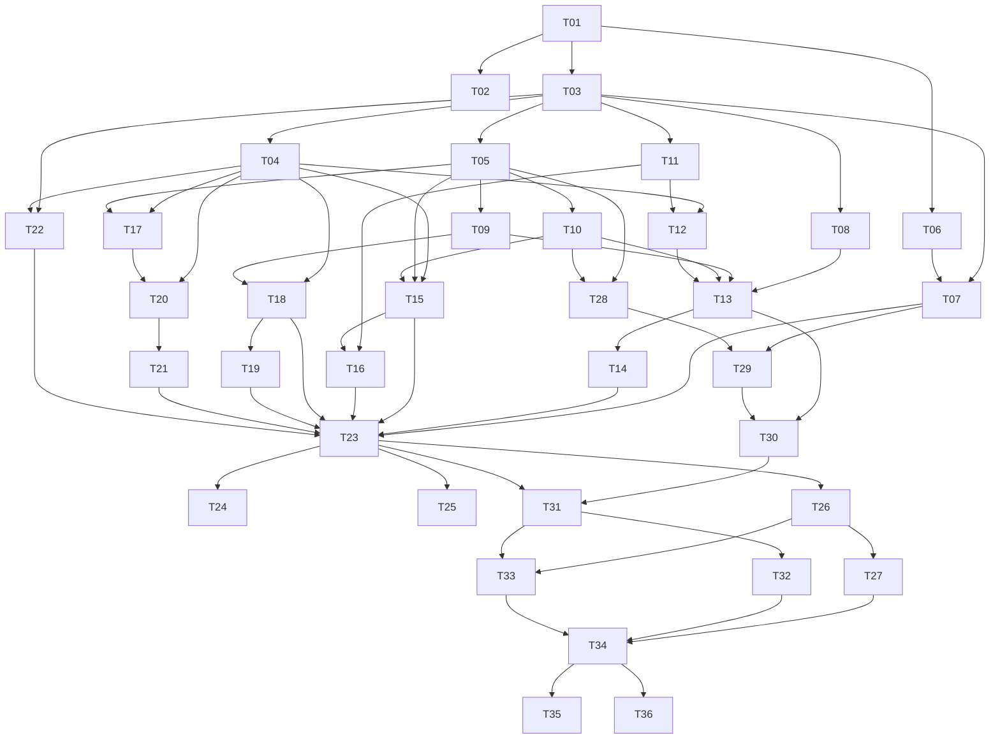

# agent-core implementation plan

Status: draft for review

This plan turns [design.md](design.md) into pull requests that coding agents
can pick up one at a time. Each task is one PR, with its dependencies, the
files it owns, what it delivers, and how a reviewer knows it is done. Tasks
without a dependency path between them can run in parallel.

The design is the source of truth for behavior. This plan fixes the engineering
choices the design leaves open ([Decisions](#decisions-this-plan-fixes)) and
orders the work. If a task has to deviate from the design, the same PR updates
`docs/design.md` and says why in its description.

## How to use this plan

1. Pick a task whose dependencies are all merged. The
   [dependency graph](#dependency-graph) and [lanes](#parallel-lanes) show what
   is unblocked.
2. Branch from the latest `main` as `<agent-name>/<branch>`. The branch name
   is given per task. The prefix names your coding agent (`claude`, `codex`,
   `copilot`), as `AGENTS.md` says.
3. Read the design sections the task links to, and this plan's
   [Decisions](#decisions-this-plan-fixes) and
   [Definition of done](#definition-of-done).
4. Deliver exactly the task's scope. Things marked out of scope belong to
   another task. If you find the task needs something that no task owns, add it
   to [Deferred work](#deferred-work) in the same PR rather than widening the
   change.
5. Leave the task's box in [Task index](#task-index) unticked. It is ticked
   when the PR merges, so a PR stacked on unmerged work never marks its task
   done before its base lands.

A task that grows past about 1,500 changed lines (lockfile and fixtures
excluded) should be split. Say where you split it in the PR description, and
add the remainder to this file as a new task with a letter suffix, for example
`T20b`.

## Decisions this plan fixes

These close questions the design leaves open, so that parallel tasks agree.

### Workspace

- The root `agent-core` package stays. It keeps `README.md` as its rustdoc and
  becomes an umbrella library that re-exports nothing. The root `Cargo.toml`
  gains:

  ```toml
  [workspace]
  members = ["crates/*"]
  default-members = [".", "crates/*"]
  resolver = "3"
  ```

  `default-members` makes plain `cargo test` and `cargo clippy` at the root
  cover every crate, so the existing CI commands keep working without
  `--workspace`. `cargo llvm-cov` ignores `default-members`, so the `coverage`
  alias passes `--workspace` itself
  ([impl-notes](impl-notes.md#cargo-llvm-cov-ignores-default-members)).
- CI runs cargo with `--locked`, so a stale `Cargo.lock` fails instead of
  being re-resolved on the runner.
- Crates live in `crates/<name>/`, with the package name equal to the directory
  name. All crates set `publish = false`.
- Shared metadata (`edition`, `rust-version`, `license-file`) and every
  third-party dependency version live in `[workspace.package]` and
  `[workspace.dependencies]`. Member crates use `workspace = true`. T01 declares
  every dependency this plan expects, so later PRs rarely touch the root
  manifest and rarely conflict on it.
- `[workspace.lints]` sets `rust.unsafe_code = "forbid"` and
  `clippy.all = "warn"`. Every crate has `[lints] workspace = true`. CI already
  turns warnings into errors.
- `Cargo.lock` is committed. agentd and agentctl are binaries that ship in
  images, so builds must be reproducible. T01 removes `Cargo.lock` from
  `.gitignore`.

### Crates

The design's [crate layout](design.md#crate-layout), with two additions and
one move:

| Crate | Kind | Notes |
| --- | --- | --- |
| `core-types` | lib | IDs, keys, `InboundEvent`, `Surface` trait, `Caps`, agentctl wire types. No I/O. |
| `store` | lib | sqlx on SQLite. **Owns encryption at rest** (moved from `auth`, see below). |
| `auth` | lib | PKCE, token exchange, refresh, profile and plan lookup. |
| `render` | lib | Markdown to Slack mrkdwn and Rocket.Chat, splitting, directives. |
| `commands` | lib | `/agent` grammar and its parsed `Command` type. Handlers live in agentd. |
| `router` | lib | **Added.** The design has "Router and turn policy" in the architecture diagram but no crate for it. It holds pure routing, gating and credential-selection logic. |
| `runner` | lib | stream-json driver, per-session queue, warm pool, reaping. It never calls agentd: placeholder minting and agentctl tokens reach it through a `TurnHooks` trait that agentd implements (T23). |
| `sandbox` | lib | `Sandbox` trait, Docker implementation (bollard), process implementation for tests and development. |
| `cred-proxy` | lib | Header-swap reverse proxy and egress allowlist proxy. Served by agentd. |
| `surface-rocketchat` | lib | REST and DDP clients, `Surface` implementation. |
| `surface-slack` | lib | HTTPS ingress, Web API, manifest API, `Surface` implementation. |
| `agentd` | bin + lib | Configuration, wiring, command handlers, HTTP listeners, the turn pipeline. |
| `agentctl` | bin | In-sandbox CLI. Static musl build. |
| `testkit` | lib | **Added.** Test-only: `MockSurface`, the `fake-claude` binary, fake Rocket.Chat and Anthropic servers, fixtures. Only ever a dev-dependency. |

Encryption lives in `store` instead of `auth`. Every encrypted column (Claude
tokens, PKCE verifiers, Slack client and signing secrets, bot tokens, Slack
configuration tokens) goes through the store, so doing it there means no caller
can forget. The store API takes and returns `secrecy::SecretString`, and seals
values with ChaCha20-Poly1305 using the row's table, column and primary key as
associated data, so a ciphertext copied into another row fails to decrypt.

### Libraries

| Concern | Choice |
| --- | --- |
| Async runtime | `tokio` (multi-thread) |
| HTTP server | `axum` on `hyper` 1 |
| HTTP client | `reqwest` with `default-features = false`, plus its `rustls` feature (the `aws-lc-rs` provider) in crates that talk HTTPS; see [impl-notes](impl-notes.md#reqwest-013-defaults-to-aws-lc-rs-not-ring). No OpenSSL anywhere (T02 enforces it). `agentctl` only talks plain HTTP to `agentctl.internal`, so it builds `reqwest` without any TLS feature. |
| WebSocket | `tokio-tungstenite` with rustls |
| Database | `sqlx` with `sqlite` and `runtime-tokio`, runtime-checked queries (`sqlx::query_as` with `FromRow`), not the `query!` macros, so CI needs no `DATABASE_URL` and no offline query cache |
| Migrations | `sqlx::migrate!("./migrations")` in `store`, file names `<UTC timestamp>_<name>.sql`, so parallel PRs don't collide on numbers |
| Errors | `thiserror` in libraries, `anyhow` in the two binaries |
| Logging | `tracing`, `tracing-subscriber` with JSON output in production |
| Secrets | `secrecy` for every token, key and secret in memory. `Debug` never prints them. |
| Serialization | `serde`, `serde_json`, `toml` |
| IDs | `uuid` with `v4` and `serde` |
| Time | `time` with `serde` and `formatting` (not `chrono`) |
| Crypto | `chacha20poly1305`, `sha2`, `hmac`, `base64`, `rand`, `subtle` for constant-time compares |
| Markdown | `pulldown-cmark` |
| CLI parsing | `clap` with `derive` |
| Docker | `bollard` |
| Dyn async traits | `async-trait` (the `Surface` trait is used as `dyn`) |
| HTTP fakes in tests | `wiremock` |

Adding a dependency that isn't in this table needs a sentence in the PR
description, and must pass T02's policy.

### Configuration

- One TOML file (`agentd --config /etc/agentd/agentd.toml`) plus environment
  overrides for secrets only. Secrets never go in the file:
  `AGENTD_MASTER_KEY` (base64, 32 bytes), `AGENTD_RC_MANAGER_TOKEN` and
  `AGENTD_SLACK_MANAGER_*`. The community API key is not configuration. An
  admin sets it with `/agent admin api-key set` (T26), and it is stored sealed.
  There is one source, so there is no precedence question.
- `agentd gen-key` prints a new master key.
- The file's sections, each added by the task that first needs it: `[server]`,
  `[internal]`, `[store]`, `[claude_oauth]`, `[sandbox]`, `[proxy]`,
  `[rocketchat]`, `[slack]`, `[limits]`. `config/agentd.example.toml` documents
  every key and is kept current by each task.
- Claude OAuth defaults, observed in the Claude Code 2.1.285 binary on
  2026-09-30. Configuration, not constants, per the design's
  [Account linking](design.md#account-linking) rules:

  | Key | Default |
  | --- | --- |
  | `authorize_url` | `https://claude.com/cai/oauth/authorize` |
  | `token_url` | `https://platform.claude.com/v1/oauth/token` |
  | `redirect_uri` | `https://platform.claude.com/oauth/code/callback` |
  | `client_id` | `9d1c250a-e61b-44d9-88ed-5944d1962f5e` |
  | `scopes` | `user:profile user:inference` |
  | `profile_url` | `https://api.anthropic.com/api/oauth/profile` |

  qm-core still uses `https://claude.ai/oauth/authorize` and
  `https://console.anthropic.com/v1/oauth/token`. T09 confirms the defaults with
  a live login and records the result in its PR.

### Network and deployment shape

- Development and single-host deployment use Docker Compose (added in T16).
- Two Docker networks:
  - `egress` is a normal bridge.
  - `sandbox` is `internal: true`, so it has no route out.
- agentd runs in a container on both networks, with a static address on each
  (Compose `ipv4_address` on fixed subnets). On `sandbox` it has the aliases
  `cred-proxy.internal` and `agentctl.internal`.
- Rocket.Chat and MongoDB are on `egress` only.
- Sandbox containers attach to `sandbox` only. Everything they reach, they reach
  through agentd.
- agentd listeners:

  | Listener | Binds | Reachable from | Serves |
  | --- | --- | --- | --- |
  | public | agentd's `egress` address, port 8443 | the internet, behind the operator's TLS terminator | Slack events, interactivity, slash commands, OAuth callbacks, `/healthz` |
  | proxy | agentd's `sandbox` address, port 8080 | sandboxes | `ANTHROPIC_BASE_URL` target, plus `HTTPS_PROXY` CONNECT with an allowlist |
  | ctl | agentd's `sandbox` address, port 8081 | sandboxes | agentctl API |

- Each listener binds its own address, never `0.0.0.0`, so a sandbox can't
  reach the public routes. As a second guard, the public listener also refuses
  connections from the sandbox subnet. T16 has a Docker test that a sandbox
  reaches only ports 8080 and 8081.
- A container's network identity is its IP on the `sandbox` network, read from
  `docker inspect` after start. The proxy and the ctl API map the source IP of
  each connection to a session, and reject any IP they don't know. Docker can
  give a dead container's IP to a new one, so mappings are revoked before a
  container is stopped and again when Docker reports it died (T21), and
  agentctl tokens are purged at startup (T15).
- agentd terminates no TLS itself. The operator puts a TLS terminator in front
  of the public listener; the README documents a Caddy example.

### Volumes and scopes

- A volume is keyed by `VolumeKey { agent, scope }`, matching the design's one
  volume per `(agent, scope)`. Two agents in one channel never share a volume
  or its `shared/` directory.
- The owner's DMs with their agent and the agent's private tasks use one
  volume, `VolumeKey { agent, scope: Private }`. Sessions stay separate (each
  mounts only its own `sessions/<id>/`), so a private task can't read the
  owner's DM transcript, as the design requires. Two directories on it are
  shared across sessions:
  - `shared/` holds what the owner granted for work: repositories and files.
    Owner-requested sessions mount it read-write. A private task a non-owner
    requested mounts it read-only, and the consent card says the task can read
    it.
  - `memory/` holds anything built from DM conversations. Only owner-requested
    sessions mount it. A non-owner's approved task never sees it, so DM
    context can't reach the channel through a private task, and the task
    can't plant text in the owner's future DM sessions.
- A non-owner's DM with an agent is a `Dm` scope with its own volume, and runs
  on the public side.
- Channel and group DM scopes each get their own volume per agent.
- Writes to `shared/` go through `agentctl lock -- <command>` (T15), which
  holds the scope's lock while the command runs. That is the design's
  "scope-level lock that `agentctl` takes for writes".

### Claude Code CLI

- The minimum version is 2.1.234, because the design relies on
  `CLAUDE_CODE_PROJECT_DIR_NAME`. The sandbox image pins an exact version with
  a build argument (2.1.285 when this plan was written). It uses the native
  installer, not npm, so the image has no Node.js.
- The stream-json output shapes the runner relies on, observed on 2.1.285:
  - `{"type":"system","subtype":"init",…}` at the start of every turn, not
    only once per process, with `session_id`, `model` and `tools`.
  - `{"type":"assistant","message":{…}}` and `{"type":"user",…}` during the
    turn.
  - A final `{"type":"result",…}` line with `subtype`, `is_error`, `result`,
    `session_id`, `total_cost_usd`, `usage`, `terminal_reason` and
    `api_error_status`.
    `is_error` decides failure, not `subtype`. An unreachable upstream produced
    `subtype: "success"` with `is_error: true` and
    `terminal_reason: "api_error"`.
  - Other line types, such as `rate_limit_event`, `system/api_retry`,
    `active_goal`, `autocompact_state` and `system/commands_changed`, appear
    too and must be ignored. With an OAuth token, `rate_limit_event` follows
    the first `assistant` line of each process; with an API key it didn't
    appear. Parse every line
    leniently: unknown `type` values are skipped, and unknown fields are
    allowed.
- The transcript lands at
  `$CLAUDE_CONFIG_DIR/projects/$CLAUDE_CODE_PROJECT_DIR_NAME/<session id>.jsonl`
  (verified on 2.1.285). It is created by the first user message, not when
  the process starts, so a process stopped before its first turn leaves no
  transcript to `--resume` ([impl-notes](impl-notes.md#t04-testkit)).
- With both `ANTHROPIC_API_KEY` and `CLAUDE_CODE_OAUTH_TOKEN` set, the CLI
  sends the API key. The runner sets exactly one of them.
- Input is one JSON object per line:
  `{"type":"user","message":{"role":"user","content":"…"}}`.

### Testing

- The workspace forbids `unsafe`, and in edition 2024 `std::env::set_var` is
  unsafe. Code that reads the environment (configuration overrides, the
  runner's launch environment) takes it as an injected map or iterator, so
  tests pass their own instead of mutating the process. Process groups for
  reaping use the safe `CommandExt::process_group`, not `pre_exec`.
- Tests never touch the network or a real Docker daemon by default. HTTP peers
  are `wiremock` servers or fakes from `testkit`.
- `testkit` ships a `fake-claude` binary. It accepts the design's launch flags,
  speaks stream-json from a script file named by `FAKE_CLAUDE_SCRIPT`, writes a
  transcript at the path above, and makes a real HTTP request to
  `ANTHROPIC_BASE_URL` with its credential header. That lets runner,
  cred-proxy and pipeline tests run end to end without Docker or an Anthropic
  account.
- Other crates find the binary with `testkit::fake_claude_path()`. Cargo only
  sets `CARGO_BIN_EXE_<name>` for a package's own integration tests. The helper
  runs `$CARGO build --locked -p testkit --bin fake-claude
  --message-format=json` once per test process and reads the executable path
  from the artifact message. That call blocks, so tests make it before
  starting any timeout.
  It passes `--target-dir` with the directory the running test executable
  was built in, because `cargo llvm-cov` names its target directory on the
  command line, where a nested cargo can't see it
  ([impl-notes](impl-notes.md#fake_claude_path-built-outside-cargo-llvm-covs-target-directory)).
- Tests that need Docker are named `docker_*` and marked
  `#[ignore = "needs docker"]`. CI runs them with
  `cargo test --workspace -- --ignored docker_` in a separate job (added in
  T17), so Docker tests in any crate run.
- The coverage gate (85% of lines, workspace-wide) stays as is. Docker tests
  don't run under coverage, so code that only they exercise must stay thin.
  Build requests to Docker, such as container configuration, as pure functions
  with unit tests, and keep the code that sends them small.
- Live checks against real Slack and Rocket.Chat are manual. The PR records
  what was run and what was seen. Never put real tokens in fixtures; redact
  captured payloads.

## Definition of done

Every PR, in addition to its task's acceptance criteria:

- `cargo fmt --check`,
  `cargo clippy --all-targets --all-features -- -D warnings`,
  `cargo test --all-features`, `cargo test --doc --all-features`, and
  `RUSTDOCFLAGS=-D\ warnings cargo doc --no-deps --all-features` pass locally.
- `cargo coverage` passes (85% of lines).
- `cargo check` passes on the MSRV in `Cargo.toml` (CI's `msrv` job).
- No `unsafe`. No `unwrap()` or `expect()` outside tests and `main` startup,
  unless the reason is a proven invariant; say which in the PR.
- No secret reaches a log line, an error message, a panic message or a test
  snapshot. Secret-bearing types use `secrecy`. Content that may hold secrets
  without being a typed secret (chat message text, model output, tool input
  and output) is never logged either; log ids, sizes and kinds instead.
- Public items of library crates have rustdoc comments. Behavior that's easy to
  get wrong (the proxy's swap rules, gating, attribution) has tests named after
  the rule they check.
- `config/agentd.example.toml` and `README.md` are updated when the task adds
  configuration or an operator-visible step.
- The task's box in the [Task index](#task-index) is ticked when the PR merges.
- The PR description links the task (`docs/tasks-plan.md#t07`), lists any
  deviation from the design or this plan, and lists what was verified live, if
  anything.

## Task index

| ID | Task | Branch | Depends on | Milestone |
| --- | --- | --- | --- | --- |
| [T01](#t01) | Workspace skeleton | `workspace-skeleton` | none | foundation |
| [T02](#t02) | Dependency policy in CI | `cargo-deny-policy` | T01 | foundation |
| [T03](#t03) | `core-types` | `core-types` | T01 | foundation |
| [T04](#t04) | `testkit`: mock surface and fake claude | `testkit` | T03 | foundation |
| [T05](#t05) | `store` foundation and encryption | `store-foundation` | T03 | foundation |
| [T06](#t06) | `render`: Slack mrkdwn | `render-slack-mrkdwn` | T01 | foundation |
| [T07](#t07) | `render`: splitting, directives, Rocket.Chat | `render-split-directives` | T03, T06 | foundation |
| [T08](#t08) | `commands`: `/agent` parser | `commands-parser` | T03 | foundation |
| [T09](#t09) | `auth`: PKCE, exchange, refresh, plan | `auth-pkce` | T05 | M1 |
| [T10](#t10) | `agentd` skeleton | `agentd-skeleton` | T05 | M1 |
| [T11](#t11) | Rocket.Chat REST client | `rocketchat-rest` | T03 | M1 |
| [T12](#t12) | Rocket.Chat realtime and `Surface` | `rocketchat-realtime` | T04, T11 | M1 |
| [T13](#t13) | Command dispatch and account commands | `account-commands` | T08, T09, T10, T12 | M1 |
| [T14](#t14) | Agent lifecycle on Rocket.Chat | `agent-lifecycle-rocketchat` | T13 | M1 |
| [T15](#t15) | `agentctl` and the ctl API | `agentctl` | T04, T05, T10 | M2 |
| [T16](#t16) | Sandbox image and Compose dev stack | `sandbox-image` | T11, T15 | M2 |
| [T17](#t17) | `sandbox` crate | `sandbox-crate` | T04, T05 | M2 |
| [T18](#t18) | Credential proxy: header swap | `cred-proxy-swap` | T04, T09 | M2 |
| [T19](#t19) | Credential proxy: egress allowlist | `egress-allowlist` | T18 | M2 |
| [T20](#t20) | `runner`: stream-json process driver | `runner-process` | T04, T17 | M2 |
| [T21](#t21) | `runner`: sessions, queue, warm pool | `runner-sessions` | T20 | M2 |
| [T22](#t22) | `router`: gating and credential policy | `router-policy` | T03, T04 | M2 |
| [T23](#t23) | Turn pipeline end to end | `turn-pipeline` | T07, T14, T15, T16, T18, T19, T21, T22 | M2 |
| [T24](#t24) | Session commands | `session-commands` | T23 | M2 |
| [T25](#t25) | Skills and the `agentctl` skill | `skills` | T23 | M2 |
| [T26](#t26) | Requester-pays routing | `requester-pays` | T23 | M3 |
| [T27](#t27) | Usage meter, limits, allow and deny | `usage-limits` | T26 | M3 |
| [T28](#t28) | Slack ingress | `slack-ingress` | T05, T10 | M4 |
| [T29](#t29) | Slack Web API and `Surface` | `slack-web-api` | T07, T28 | M4 |
| [T30](#t30) | Slack manager app and configuration token | `slack-manager-app` | T13, T29 | M4 |
| [T31](#t31) | Slack agent apps from manifests | `slack-agent-apps` | T30, T23 | M4 |
| [T32](#t32) | Verify Slack bot-to-bot delivery | `slack-bot-mention-check` | T31 | M5 gate |
| [T33](#t33) | Consent cards and private tasks | `private-tasks` | T26, T31 | M5 |
| [T34](#t34) | Agent-to-agent hand-off | `agent-to-agent` | T27, T32, T33 | M5 |
| [T35](#t35) | Cloud hand-off (design first) | `cloud-handoff-design` | T34 | M6 |
| [T36](#t36) | Slack Connect (design first) | `slack-connect-design` | T34 | M7 |

Progress:

- [x] T01 Workspace skeleton
- [ ] T02 Dependency policy in CI
- [ ] T03 `core-types`
- [ ] T04 `testkit`: mock surface and fake claude
- [ ] T05 `store` foundation and encryption
- [ ] T06 `render`: Slack mrkdwn
- [ ] T07 `render`: splitting, directives, Rocket.Chat
- [ ] T08 `commands`: `/agent` parser
- [ ] T09 `auth`: PKCE, exchange, refresh, plan
- [ ] T10 `agentd` skeleton
- [ ] T11 Rocket.Chat REST client
- [ ] T12 Rocket.Chat realtime and `Surface`
- [ ] T13 Command dispatch and account commands
- [ ] T14 Agent lifecycle on Rocket.Chat
- [ ] T15 `agentctl` and the ctl API
- [ ] T16 Sandbox image and Compose dev stack
- [ ] T17 `sandbox` crate
- [ ] T18 Credential proxy: header swap
- [ ] T19 Credential proxy: egress allowlist
- [ ] T20 `runner`: stream-json process driver
- [ ] T21 `runner`: sessions, queue, warm pool
- [ ] T22 `router`: gating and credential policy
- [ ] T23 Turn pipeline end to end
- [ ] T24 Session commands
- [ ] T25 Skills and the `agentctl` skill
- [ ] T26 Requester-pays routing
- [ ] T27 Usage meter, limits, allow and deny
- [ ] T28 Slack ingress
- [ ] T29 Slack Web API and `Surface`
- [ ] T30 Slack manager app and configuration token
- [ ] T31 Slack agent apps from manifests
- [ ] T32 Verify Slack bot-to-bot delivery
- [ ] T33 Consent cards and private tasks
- [ ] T34 Agent-to-agent hand-off
- [ ] T35 Cloud hand-off (design first)
- [ ] T36 Slack Connect (design first)

The design's milestone 3 (requester-pays) moves ahead of milestone 4 (Slack)
as the design orders it. The Slack surface (T28, T29) needs only T05, T07 and
T10, and the manager app (T30) adds T13, so that work can run alongside phases
2 and 3. Only T31 waits for the pipeline.

## Dependency graph



## Parallel lanes

With several agents, these lanes keep them out of each other's files. A lane
is a suggestion, not an owner: pick any unblocked task.

| Lane | Tasks in order | Main files |
| --- | --- | --- |
| Platform | T01, T02, T05, T10, T15, T16 | root manifests, `crates/store`, `crates/agentd`, `crates/agentctl`, `images/`, `deploy/` |
| Types and tests | T03, T04, T22 | `crates/core-types`, `crates/testkit`, `crates/router` |
| Rendering and commands | T06, T07, T08 | `crates/render`, `crates/commands` |
| Auth and proxy | T09, T18, T19 | `crates/auth`, `crates/cred-proxy` |
| Rocket.Chat | T11, T12, T13, T14 | `crates/surface-rocketchat`, agentd command handlers |
| Execution | T17, T20, T21 | `crates/sandbox`, `crates/runner` |
| Slack | T28, T29, T30, T31, T32 | `crates/surface-slack`, agentd Slack wiring |
| Integration | T23 to T27, T33, T34 | `crates/agentd` pipeline, `crates/router` |

## Phase 0: foundation

### T01

**Workspace skeleton.** Branch `workspace-skeleton`. Depends on nothing.

Design: [Crate layout](design.md#crate-layout).

Deliverables:

- Root `Cargo.toml` as in [Workspace](#workspace): `[workspace]`,
  `[workspace.package]`, `[workspace.dependencies]` (every crate in
  [Libraries](#libraries) with a pinned version and the features this plan
  names), `[workspace.lints]`.
- Empty library crates with a one-line rustdoc and one smoke test each:
  `core-types`, `store`, `auth`, `render`, `commands`, `router`, `runner`,
  `sandbox`, `cred-proxy`, `surface-rocketchat`, `surface-slack`, `testkit`.
- Binary crates `agentd` and `agentctl`, each with a `main` that parses
  `--version` with clap and exits.
- `Cargo.lock` committed and removed from `.gitignore`.
- `AGENTS.md` gains a short "Code layout" section that points to this plan and
  states the crate rules: `testkit` is only a dev-dependency, `core-types` does
  no I/O, and surface crates never depend on each other.
- `README.md`'s Development section mentions the workspace and the plan.
- `scripts/ci/docs-only.sh` treats every path under `crates/` as code, even
  `.md` files. Personas and skills there (T14, T25) are runtime assets that
  tests read, so a change to one must not skip the build and test jobs.

Acceptance:

- Every existing CI job passes unchanged, and the coverage job covers every
  crate (check the per-crate list in the coverage summary).
- `cargo tree -e normal -i openssl-sys` reports nothing.
- `sh scripts/ci/docs-only.sh` exits 1 for a diff touching only
  `crates/x/assets/a.md`, and 0 for one touching only `docs/a.md`.

Out of scope: any real code in the crates.

### T02

**Dependency policy in CI.** Branch `cargo-deny-policy`. Depends on T01.

Deliverables:

- `deny.toml` with these sections:
  - `[bans]` denies `openssl`, `openssl-sys` and `native-tls`, and warns on
    duplicate versions.
  - `[licenses]` allows the permissive licenses that
    `[workspace.dependencies]` actually needs: MIT, Apache-2.0,
    BSD-3-Clause, ISC, Unicode-3.0, Zlib, and CDLA-Permissive-2.0 (for
    `webpki-root-certs`). `aws-lc-sys` no longer needs an `OpenSSL`
    exception; see
    [impl-notes](impl-notes.md#aws-lc-sys-no-longer-needs-an-openssl-exception).
    GPL, LGPL and AGPL are denied. A weak-copyleft license such as MPL-2.0 is
    allowed only as a per-crate exception with a reason.
    `[licenses.private] ignore = true`, because the workspace crates carry
    only `license-file`. That exempts every `publish = false` crate, so
    `scripts/ci/check-path-deps.sh` fails when any path package other than
    the root package or a crate directly under `crates/` is in the graph
    (see
    [impl-notes](impl-notes.md#licensesprivate-exempts-any-unpublished-crate)).
  - `[advisories]` denies vulnerabilities and warns on unmaintained crates
    (the latter through `-W unmaintained` on the command line; see
    [impl-notes](impl-notes.md#cargo-deny-020-has-no-warning-level-for-unmaintained-crates)).
  - `[sources]` allows crates.io only.
- A `deny` job in `.github/workflows/ci.yml`, using
  `EmbarkStudios/cargo-deny-action` pinned to a major version, run with
  `--workspace` (see
  [impl-notes](impl-notes.md#cargo-deny-checks-only-the-root-package-by-default)).
  It runs `check-path-deps.sh` before cargo-deny, runs when code changed and
  on a weekly `schedule` (which runs every job but `publish-badges`; see
  [impl-notes](impl-notes.md#the-deny-job-ran-only-when-code-changed)),
  and is added to `ci-passed`'s `needs`.
- A README line naming the policy.

Acceptance: the job passes on `main`'s lockfile. A throwaway local commit that
adds `native-tls` fails it, and so does one that adds a GPL crate with
`publish = false` as a path dependency; say so in the PR.

### T03

**`core-types`.** Branch `core-types`. Depends on T01.

Design: [Terminology](design.md#terminology),
[Surface trait](design.md#crate-layout),
[Sessions and sandboxes: Keys](design.md#keys),
[Turn routing and billing](design.md#turn-routing-and-billing).

Deliverables in `crates/core-types/src/`:

- `ids.rs`: newtypes over `Uuid` for `MemberId`, `AgentId`, `SessionId`,
  `TurnId`, `ConsentId`, `BindingId` and `LeaseId`, each with `new_v4()`, `Display`,
  `FromStr` and serde.
- `surface.rs`:
  - `SurfaceKind` (`Slack`, `RocketChat`).
  - String newtypes `TeamId`, `UserId`, `ConversationId`, `MessageId`.
  - `MemberKey { surface, team, user }` and
    `ConvRef { surface, team, conversation }`.
  - `ThreadKey { conv, root: Option<MessageId> }`, where `None` means a DM's
    continuous session.
  - `ConvKind` (`Dm`, `GroupDm`, `Channel`), what the platform says the
    conversation is.
  - `ReplyTarget { conv, thread_root }`, `MsgRef`, `Cursor`.
- `scope.rs`:
  - `ScopeKind` (`Dm`, `Channel`, `GroupDm`, `Private`).
  - `ScopeKey`, which renders to a stable string such as
    `dm:<surface>:<team>:<conv>`, `ch:<surface>:<team>:<conv>`,
    `gdm:<surface>:<team>:<conv>` or `private`. Its parse and display
    round-trip. `%`, `:` and `/` inside ids are percent-escaped, so a
    Rocket.Chat team named after a `host:port` stays unambiguous.
  - `VolumeKey { agent, scope }`, rendered as `<agent>/<scope>`, which names
    volumes (see [Volumes and scopes](#volumes-and-scopes)).
- `event.rs`: `InboundEvent` with:
  - `event_id` for deduplication, `binding`, `sender: MemberKey`.
  - `sender_is_bot: bool` and `sender_bot_user: Option<UserId>`. For a bot,
    `sender.user` holds its user id when known and its bot id otherwise, and
    `sender_bot_user` is that user id or `None` (see
    [impl-notes](impl-notes.md#a-slack-bot-message-may-name-no-user)).
  - `conv`, `thread_root`, `message: MsgRef`, `text`.
  - `mentions: Vec<UserId>`, `conv_kind: ConvKind` (with an `is_dm()`
    helper), `reply_to: Option<MsgRef>`, `files: Vec<InFile>`, and
    `received_at`. A bare `is_dm` couldn't tell a group DM from a channel,
    and the router needs that for `ScopeKind::GroupDm`.
- `turn.rs`:
  - `CredentialKind` (`Subscription`, `ApiKey`).
  - `CredentialRef` (`Member(MemberId)`, `Community`).
  - `Requester { member: Option<MemberId>, key: MemberKey }`.
  - `Hop(u8)`.
  - `TurnKind` (`Normal`, `PrivateTask(ConsentId)`).
  - `Side` (`Owner`, `Public`), shared by the router's decision (T22) and the
    agentctl target rules (T15).
- `surface_trait.rs`: the design's `Surface` trait verbatim, with
  `#[async_trait]`, plus the `Binding`, `OutFile`, `InFile`, `Msg` and `Caps`
  types. `history` takes a `ThreadKey`, and `Sender` is core-types' own
  handle over a `Sink` trait, since the crate has no async runtime (see
  [impl-notes](impl-notes.md#t03-core-types)). `Caps` has `message_limit`,
  `supports_edit`, `supports_buttons`, `supports_threads` and
  `per_binding_delivery`. The last is true where every
  agent's app receives its own copy of an event (Slack), and false where
  agentd deduplicates one copy per message (Rocket.Chat). `message_limit` is
  a `Limit { max: usize, unit: LengthUnit }`, with `LengthUnit` `Chars` or
  `Utf16`; T07's splitter takes it. Errors are `SurfaceError` with
  `thiserror`, including a `RateLimited { retry_after }` variant.
- `ctl.rs`: agentctl request and response types (serde) for `attach`, `post`,
  `react`, `history`, `lock`, `ask-agent`, and `private` (task text plus file
  paths), with the error type. The binary and the server share these.

Acceptance: unit tests for `ScopeKey` and `VolumeKey` round-trips, serde
round-trips of every wire type, and ID parsing. The crate has no dependency
outside `serde`, `serde_json`, `uuid`, `time`, `thiserror` and `async-trait`.

Out of scope: any logic beyond construction, parsing and formatting.

### T04

**`testkit`: mock surface and fake claude.** Branch `testkit`. Depends
on T03.

Design: [Surface trait](design.md#crate-layout) ("A `MockSurface` drives the
shared core in tests"), [Tools and skills](design.md#tools-and-skills) (launch
flags).

Deliverables:

- `MockSurface`, implementing `Surface`. It records every `post`, `edit`,
  `react` and `upload` in an inspectable log, serves canned `history`, has
  configurable `Caps`, and has an `inject(InboundEvent)` helper feeding the
  `events` channel. It honors its `Caps` (`Unsupported` for `edit` without
  `supports_edit` and for thread targets without `supports_threads`), and
  `fail_next(op, error)` makes the next call of an operation fail with a
  platform error such as `RateLimited` or `Unauthorized`.
- A `fake-claude` binary (`src/bin/fake-claude.rs`) that:
  - Accepts the full launch flag set from the design. It fails with exit 2 on
    unknown flags, and when both `--session-id` and `--resume` are given, or
    neither.
  - With `--session-id`, fails if the transcript already exists. With
    `--resume`, fails if it doesn't.
  - Reads stream-json user lines from stdin. For each, it sends
    `POST $ANTHROPIC_BASE_URL/v1/messages` with `x-api-key:
    $ANTHROPIC_API_KEY` when that is set, and `Authorization: Bearer
    $CLAUDE_CODE_OAUTH_TOKEN` otherwise, as the real CLI does, and expects
    a 200.
  - Emits the `init`, `assistant` and `result` lines from the script file named
    by `FAKE_CLAUDE_SCRIPT` (JSON: a list of turns, each with reply text,
    `is_error`, optional delay, optional crash, and optional raw
    `extra_lines`, which may be unknown line types or not JSON at all). Like
    the real CLI with an OAuth token, it also prints a `rate_limit_event`
    after the first reply of each process, so a runner test always sees a
    line it must skip.
  - Appends to the transcript at
    `$CLAUDE_CONFIG_DIR/projects/$CLAUDE_CODE_PROJECT_DIR_NAME/<id>.jsonl`.
  - Can run `agentctl` commands listed in the script, to exercise the ctl API
    later.
- `fake_claude_path()`, as described in [Testing](#testing), so other crates
  can spawn the binary.
- `fake_anthropic()`: a `wiremock` server that records every request and its
  headers, answers `HEAD /api/hello`, and answers `POST /v1/messages` the way
  the real CLI needs. A request with `"stream": true` gets an SSE stream of
  `message_start`, `content_block_start`, `content_block_delta`
  (`text_delta`), `content_block_stop`, `message_delta` (`stop_reason:
  end_turn`, `usage`) and `message_stop`, with the text from a script. Other
  requests get the equivalent JSON message. The fixture is checked against
  the real CLI in T23's Docker test.
- A `fixtures/` directory with the `stream-json` sample lines listed in
  [Claude Code CLI](#claude-code-cli). Capture them from a real CLI with an
  unreachable base URL, as in this plan's research, and redact the paths.

Acceptance: tests that run `fake-claude` as a child process cover each of its
checks. At least one test finds it through `fake_claude_path()`, so the helper
is covered under `cargo coverage` as well. `MockSurface`
has tests for its log and inject path.

Out of scope: fake Rocket.Chat and Slack servers. Those are added with their
clients in T11, T12, T28 and T29, under `testkit::rocketchat` and
`testkit::slack`.

### T05

**`store` foundation and encryption.** Branch `store-foundation`.
Depends on T03.

Design: [Data model](design.md#data-model),
[Account linking](design.md#account-linking) (encryption rules).

Deliverables:

- `Store::open(url)`, which sets `journal_mode=WAL`, `foreign_keys=ON` and
  `busy_timeout`, and runs migrations.
- `Store::open_in_memory()` for tests.
- `Sealer`: ChaCha20-Poly1305 with a random 96-bit nonce per value. The stored
  layout is `version(1) || nonce(12) || ciphertext`. Associated data is
  `table/column/primary key`. The key is loaded from a `SecretString`
  (base64). Keep a key version byte so a future rotation can re-seal.
- A migration `…_foundation.sql` that creates these tables:
  - `members` (`id`, `display_name`, `created_at`).
  - `surface_identities` (`surface`, `team_id`, `user_id`, `member_id`) with a
    unique key on `(surface, team_id, user_id)`.
  - `claude_links` (`member_id` primary key, `access_token_enc`,
    `refresh_token_enc`, `expires_at`, `plan`, `rate_limit_tier`,
    `broken_at`, `updated_at`). `broken_at` is set when a refresh fails and
    cleared by the next successful login.
  - `pending_logins` (`state` primary key, `member_id`, `verifier_enc`,
    `expires_at`).
  - `processed_events` (`source`, `event_id`, `seen_at`) with a primary key on
    `(source, event_id)`, for durable deduplication of Slack retries and
    Rocket.Chat redeliveries.
- Repository methods, each a small async function with a test:
  - `member_for_identity`, `ensure_member(MemberKey, display_name)`.
  - `put_claude_link`, `get_claude_link`, `delete_claude_link`.
  - `put_pending_login`, `take_pending_login(state)` (atomic: delete and
    return), `invalidate_pending_logins(member)`.
  - `mark_event_processed(source, id) -> bool`, which returns false when the
    event was already there.
  - `sweep_expired(now)`.
- Every encrypted column goes through `Sealer`. Callers see `SecretString`
  only.

Acceptance:

- A ciphertext moved to another row or column fails to decrypt.
- A wrong key fails.
- `take_pending_login` returns a row exactly once under concurrent callers:
  test with `tokio::join!` on a file-backed database.
- The migration applies to an empty database and is idempotent.

Out of scope: every other table. Each task that needs one adds its own
migration: agents and bindings (T14), agentctl tokens and scope locks (T15),
volumes (T17), sessions (T21), message refs (T23), community settings (T26),
usage, policies, bans and thread usage (T27), Slack configuration tokens
(T30), consents (T33).

### T06

**`render`: Slack mrkdwn.** Branch `render-slack-mrkdwn`. Depends on
T01.

Design: [Rendering and delivery](design.md#rendering-and-delivery).
Behavioral reference: qm-core `src/slack/mrkdwn.ts`.

Deliverables:

- `render::slack::to_mrkdwn(md: &str, directory: &dyn MentionDirectory)
  -> String`, built on `pulldown-cmark` events. It converts:
  - Headings to bold lines.
  - `**bold**` to `*bold*`, `*em*` and `_em_` to `_em_`, and `~~strike~~` to
    `~strike~`.
  - Inline and fenced code are preserved, and their contents are never
    rewritten, except that a run of three backticks inside a fenced block
    gets a zero-width space so it can't close the block (see
    [impl-notes](impl-notes.md#backtick-runs-close-a-slack-code-block)).
  - Links to `<url|label>`, except that a label naming another host goes
    next to the link (see
    [impl-notes](impl-notes.md#a-link-label-can-disguise-its-destination)).
    Bare `http(s)` URLs get explicit `<url>` bounds, as in qm-core, so Slack
    doesn't pull neighboring marks into them (see
    [impl-notes](impl-notes.md#bare-urls-get-explicit-bounds)).
  - Lists to `•` and `1.` lines, with two spaces of indent per nesting level.
  - Blockquotes to `>`.
  - Tables to aligned plain text inside a fenced code block.
  - Images to links.
- Escapes `&`, `<` and `>` everywhere, including inside code, as Slack
  requires (see
  [impl-notes](impl-notes.md#escaping-applies-inside-code-too)).
- `@Name` (outside code) becomes `<@U…>` when `directory` resolves it and is
  left as text when it doesn't.
- Neutralizes mass mentions. `@here`, `@channel` and `@everyone`, and literal
  `<!here>`, `<!channel>` and `<!everyone>`, become harmless text (qm-core's
  behavior).
- `MentionDirectory` is a trait in `render` with `fn resolve(&self, name:
  &str) -> Option<String>`, so `render` stays free of I/O.

Acceptance: table-driven tests. Port qm-core's mrkdwn test cases where they
apply, and name the source file in a module-level comment. Code blocks
containing `**`, `<` and `@here` must come out untouched except for escaping.

Out of scope: splitting (T07).

### T07

**`render`: splitting, directives, Rocket.Chat.** Branch
`render-split-directives`. Depends on T03 and T06.

Design: [Rendering and delivery](design.md#rendering-and-delivery).
Reference: qm-core `src/slack/safe-cut.ts`.

Deliverables:

- `render::split(text: &str, limit: Limit) -> Vec<String>`, with `Limit` from
  `core-types` (T03). Rocket.Chat checks `Message_MaxAllowedSize` against
  JavaScript string length, so its limit counts UTF-16 code units, and an emoji
  counts as two. It:
  - Prefers paragraph breaks, then line breaks, then spaces.
  - Never cuts inside a Slack `<…>` token, a Markdown link, a mention or a
    multi-byte character. Cuts fall on `char` boundaries.
  - Closes an open code fence at the end of a chunk and reopens it, with the
    same info string, at the start of the next.
- `render::directives::extract(text) -> (String, Vec<Directive>)` for
  `[[react: <emoji>]]` (the only directive for now). Directives inside code are
  not parsed.
- `render::rocketchat::to_markdown(md, directory)`: pass-through, neutralizing
  `@all` and `@here` outside code, with the same `@Name` resolution as Slack.
- Per-surface limits as constants: Slack 3,000 characters per `text` chunk
  (under the 4,000 hard limit, leaving room for rendering growth), and
  Rocket.Chat 5,000 UTF-16 units (the server default `Message_MaxAllowedSize`).
  `Caps` carries them as a `Limit`, and the Rocket.Chat value is overridable
  from configuration.

Acceptance: property-style tests (a hand-written generator is enough; no new
dependency). Rejoining the chunks with fences removed gives back the original
text, and no chunk exceeds the limit in its unit. Fixed cases cover a URL at
the limit, an emoji at the limit in both units, and a 10,000-character code
block.

### T08

**`commands`: `/agent` parser.** Branch `commands-parser`. Depends on
T03.

Design: [Commands](design.md#commands),
[Rocket.Chat](design.md#rocketchat) (DM and `!agent` prefix).

Deliverables:

- `commands::parse(text: &str) -> Result<Command, ParseError>` over clap
  derive with `no_binary_name`. Input is the text after `/agent`, the whole
  text of a DM to the manager bot, or the text after `!agent`. A
  `strip_prefix` helper covers the last two.
- A `Command` enum covering every row of the design's command table:
  - `Login { code: Option<String> }`, `Logout`, `Me`.
  - `SlackToken { token, refresh }`.
  - `Create { name, persona }`, `Persona { name, text }`.
  - `Skill { add|rm, name, source }`.
  - `Allow` and `Deny { name, target }`.
  - `Limits { name, turns_per_day, hops }`.
  - `Pause`, `Resume` and `Delete { name }`.
  - `Sessions { name }`, `Reset { name, here: bool }`.
  - `List { user }`.
  - `Admin(AdminCommand)` with `ApiKey { set|clear }`, `Ban`, `Unban` and
    `Slack(…)` placeholders.
  - `Approve` and `Decline { consent }`, the text form of consent buttons used
    by T33.
- Agent names validated as `[a-z0-9-]{2,32}`.
- `limits` parses `turns=N/day hops=N` in any order.
- `Command::is_secret_bearing()` is true for `Login { code: Some }`,
  `SlackToken` and `Admin(ApiKey { set })`, so callers can enforce
  private-channel rules and redact logs.
- `Command::help()` gives short usage text per command. An unknown command
  returns the help text as the error message.

Acceptance: a test per command covering the success case and at least one
malformed case. Tests check that secret-bearing variants redact themselves in
`Debug`.

Out of scope: handlers (T13 onward).

## Phase 1: Rocket.Chat, linking, agent identities (design milestone 1)

### T09

**`auth`: PKCE, exchange, refresh, plan.** Branch `auth-pkce`. Depends
on T05.

Design: [Account linking](design.md#account-linking),
[Lifecycle](design.md#lifecycle) (plan read from the profile).
Reference: qm-core `src/model/subscription-oauth.ts`, but do not copy its use
of the verifier as `state`.

Deliverables:

- `OAuthConfig` (the `[claude_oauth]` section, defaults in
  [Configuration](#configuration)).
- `start_login(member) -> LoginStart { url, expires_at }`:
  - 32 random bytes of verifier, base64url.
  - The S256 challenge.
  - A separate random 32-byte `state`.
  - Stores a pending login with a 10-minute expiry, then builds the authorize
    URL with `code=true`, `client_id`, `response_type=code`, `redirect_uri`,
    `scope`, `code_challenge`, `code_challenge_method=S256` and `state`.
- `complete_login(member, pasted) -> Linked { plan }`:
  1. Parse `code#state`. Tolerate whitespace and a full callback URL pasted by
     mistake.
  2. `take_pending_login(state)`, and check that it belongs to `member`.
  3. POST the `authorization_code` grant as JSON with `code`, `state`,
     `code_verifier`, `redirect_uri` and `client_id`.
  4. Store the tokens.
  5. Fetch the profile.
- `fetch_plan(access_token) -> Plan`: `GET profile_url` with a Bearer token.
  Map `organization.organization_type` (`claude_pro`, `claude_max`,
  `claude_team`, `claude_enterprise`) to `Plan`, and keep
  `organization.rate_limit_tier`. Unknown values map to `Plan::Unknown(String)`
  rather than failing.
- A `TokenSource` trait for use by the proxy:
  `async fn access_token(&self, member) -> Result<SecretString>`. It refreshes
  when the token expires within 5 minutes, single-flight per member with a keyed
  async mutex, re-reads the plan after every refresh, and stores both.
- A refresh failure returns `AuthError::RelinkRequired` and marks the link
  broken. The DM to the member is sent by agentd (T13), not here.
- `logout(member)`: deletes the link. Revoking at Anthropic is not part of
  Claude Code's flow, so there's nothing to call.

Acceptance:

- wiremock tests for exchange, refresh and profile.
- A test that ten concurrent `access_token` calls during expiry cause exactly
  one refresh request.
- A test that `state` is never equal to or derived from the verifier, and that
  the verifier appears in no URL.
- A test for the expired pending login.

Live check (manual, recorded in the PR): one real login against the default
endpoints. Say which endpoints worked. If any default is wrong, fix it here and
in [Configuration](#configuration).

### T10

**`agentd` skeleton.** Branch `agentd-skeleton`. Depends on T05.

Deliverables:

- Subcommands `agentd serve --config <path>`, `agentd migrate --config <path>`
  and `agentd gen-key`.
- Config loading: TOML plus secret environment variables, as in
  [Configuration](#configuration). Validation errors name the key.
- `tracing` setup: human output on a TTY, JSON otherwise. Secrets are
  `secrecy` types and never reach a field. As a backstop, a redaction layer
  replaces the value of any field whose whole name is in a fixed list
  (`token`, `access_token`, `refresh_token`, `bot_token`, `secret`,
  `client_secret`, `signing_secret`, `api_key`, `code`, `verifier`,
  `password`), so fields such as `scope_key` are still logged.
- An axum public listener with `GET /healthz`, which checks the store. The
  internal listeners are placeholders that later tasks fill.
- Graceful shutdown on SIGTERM: stop accepting, then drain for a configurable
  timeout.
- An `App` struct holding the shared state (config, store, later the surfaces,
  runner and proxy) that later tasks extend. Keep it in
  `crates/agentd/src/app.rs`.
- A background sweeper task that calls `store.sweep_expired` every minute.
- `config/agentd.example.toml`.

Acceptance: an integration test boots `serve` on an ephemeral port with an
in-memory store, gets 200 from `/healthz`, and shuts down cleanly. Config
errors have tests.

### T11

**Rocket.Chat REST client.** Branch `rocketchat-rest`. Depends on T03.

Design: [Rocket.Chat](design.md#rocketchat).

Deliverables in `crates/surface-rocketchat/src/rest.rs`:

- A client authenticated with `X-User-Id` and `X-Auth-Token` (the manager's
  personal access token from `AGENTD_RC_MANAGER_TOKEN`, or a bot's token).
- Methods:
  - `me`.
  - `users.create` with `roles: ["bot"]`, and `verified`, `joinDefaultChannels:
    false` and `requirePasswordChange: false`, with a random password that is
    never stored.
  - A token for the new bot, in one of two ways. Pick the one that works with
    the custom role on the target server version and record which in the PR:
    - `users.createToken`. Recent servers refuse it unless the server runs
      with `CREATE_TOKENS_FOR_USERS=true`.
    - Log in once as the bot with its random password, then call
      `users.generatePersonalAccessToken`. The `bot` role needs
      `create-personal-access-tokens`, and the password is discarded
      afterwards.
  - `users.setAvatar`, `users.update` (name), `users.setActiveStatus`.
  - `channels.invite` and `groups.invite`, `rooms.info`,
    `im.create`.
  - `chat.postMessage` with `tmid` for threads, `chat.update`, `chat.react`.
  - `rooms.upload/{rid}` (multipart) with `tmid`.
  - `channels.history`, `groups.history`, `im.history` and
    `chat.getThreadMessages` for `history`.
- Handles the rate limiter: honor `x-ratelimit-reset` on 429, and retry at most
  once.
- `testkit::rocketchat::FakeRest`: wiremock routes for the above.

Acceptance: a wiremock test per method, including error mapping to
`SurfaceError` and the 429 retry.

Live check (manual): against a Rocket.Chat 7.x server (T16's Compose stack
works once it lands; until then a local container). Using a manager with only
the custom role from the design, create a bot user and obtain its token.
Record the exact permissions needed. This settles the design's open question.
Update the Rocket.Chat section of `docs/design.md` with the result.

### T12

**Rocket.Chat realtime and `Surface`.** Branch `rocketchat-realtime`.
Depends on T04 and T11.

Design: [Chat identities and mentions](design.md#chat-identities-and-mentions),
[Rocket.Chat](design.md#rocketchat).

Deliverables:

- A DDP client over `tokio-tungstenite`:
  - `connect`, then `login` with a `resume` token.
  - Answer server `ping` with `pong`.
  - Subscribe to `stream-room-messages` per joined room. Per the design's open
    question, don't rely on `__my_messages__`.
  - Subscribe to `stream-notify-user` `<uid>/subscriptions-changed`, and
    subscribe to a room as soon as the bot is added to it. Owners invite bots
    through the normal Rocket.Chat UI (T14), and the bot must hear the room
    without a restart.
  - Reconnect with jittered exponential backoff and resubscribe.
  - One connection per bot user (managed agents and the manager).
- Normalization into `InboundEvent`:
  - `mentions[]._id` goes to `mentions`.
  - `t` system messages are ignored.
  - `tmid` becomes `thread_root`, and also `reply_to`, since the router
    decides whether the thread root is the agent's own message.
  - Room type `d` sets `conv_kind` to `Dm`, or `GroupDm` when the room has
    more than two members.
  - The `bot` field, or a sender with the `bot` role, sets `sender_is_bot`,
    and then `sender_bot_user` is `u._id`, the same id as `sender.user`.
  - Edits (`editedAt`) are ignored.
  - `event_id` is the message `_id`.
  - A bot's own messages are not dropped here. Every connection in a room
    receives every message and the first to record it wins, so a per-connection
    drop could discard the only copy another agent would have seen. The
    pipeline never makes the sending agent a candidate (T23), and the router
    ignores managed-bot messages that don't mention the agent (T22).
- Deduplication through `store.mark_event_processed("rocketchat", _id)`, since
  several bots in one room each receive every message.
- `RocketChatSurface`, implementing `Surface` over T11 and this client, with
  a `message_limit` of 5,000 UTF-16 units, `supports_edit` and
  `supports_threads` true, and `supports_buttons` and `per_binding_delivery`
  false. Buttons stay false because interactive buttons need Apps-Engine.
  Consent uses text commands, see T33.
- `testkit::rocketchat::FakeDdp`: a small WebSocket server scripting DDP
  frames.

Acceptance:

- Tests against `FakeDdp` for login, subscription, a mention event producing
  the right `InboundEvent`, a dropped connection reconnecting and
  resubscribing, and a `subscriptions-changed` notice leading to a new room
  subscription.
- A test that two bots in one room produce one processed event, and that
  agent A's post mentioning agent B survives deduplication whichever
  connection records it first. The router receives it once per mentioned
  agent. Routing to the mentioned agents happens in T23; here, assert the
  event carries every mention.

### T13

**Command dispatch and account commands.** Branch `account-commands`.
Depends on T08, T09, T10 and T12.

Design: [Account linking](design.md#account-linking),
[Commands](design.md#commands) ("Command replies are always private").

Deliverables:

- `crates/agentd/src/commands/`: a dispatcher from `(MemberKey, Command,
  Origin)` to a handler. `Origin` is `SlackSlash { response_url }`,
  `RocketChatDm` or `RocketChatChannel { room }`.
- Private reply plumbing: a `reply_private(origin, text)` helper. On Rocket.Chat
  it sends a manager-bot DM; the Slack arm is filled in T30.
- Rocket.Chat wiring:
  - A DM to the manager bot is parsed whole as a command.
  - A channel message starting with `!agent` is parsed after the prefix.
- Handlers:
  - `login`: start the login and send the link privately.
  - `login <code>`: complete the login.
  - Any secret-bearing command from `RocketChatChannel` (`login <code>`,
    `admin api-key set`) is refused, and the member is told privately that the
    secret is now public. For `login <code>`, the member's pending logins are
    invalidated and they are told to start again. For the API key, the admin is
    told to revoke that key at Anthropic.
  - `logout`: delete the link (and, later, the Slack configuration token; T30
    adds that).
  - `me`: link status and plan. The usage line is added in T27, the manager app
    name in T30.
- Relink notice: when `TokenSource` reports `RelinkRequired`, DM the member.
  Send it only when `claude_links.broken_at` goes from empty to set, so there is
  one notice per failure.
- Secret-bearing commands are never logged with their arguments.

Acceptance: `MockSurface` and wiremock tests for the full login flow from DM,
the channel refusal and invalidation path, logout, and `me` for linked and
unlinked members.

### T14

**Agent lifecycle on Rocket.Chat.** Branch
`agent-lifecycle-rocketchat`. Depends on T13.

Design: [Rocket.Chat](design.md#rocketchat), [Commands](design.md#commands),
[Data model](design.md#data-model).

Deliverables:

- A migration `…_agents.sql`:
  - `agents` (`id`, `owner_id`, `name` unique per owner, `persona`,
    `visibility`, `state` of `active`, `paused` or `deleted`, `created_at`).
  - `agent_bindings` (`id`, `agent_id`, `surface`, `team_id`, `bot_user_id`
    nullable, `bot_token_enc` nullable, `state` of `creating`,
    `pending_install`, `active` or `disabled`, `state_changed_at`, plus the
    Slack columns from the design, nullable). Unique on `(surface, team_id,
    bot_user_id)` where `bot_user_id` is set. Slack bindings exist before their
    bot user does (T31).
- Store methods for agents and bindings.
- Handlers:
  - `create <name> [persona]` requires a linked member.
    1. Create the Rocket.Chat bot user named `<name>` (or `<owner>-<name>` when
       taken; tell the member which).
    2. Obtain its token. An avatar is optional; set one only from an
       `avatar_url` in configuration.
    3. Store the binding.
    4. Start its realtime connection.
    5. Reply with how to invite it.
  - `persona <name> <text>`: owner only. A `persona.md` file attached to a
    DM with the manager bot, with `persona <name>` as its text, replaces the
    persona the same way. Size is capped at 64 KB.
  - `list [@user]`: an agent directory.
  - `pause`, `resume` and `delete`, owner only. Delete deactivates the bot user
    and stops its connection; state becomes `deleted`.
- The default persona is a short template in `crates/agentd/assets/persona.md`
  naming the agent and owner.
- Joining rooms: the owner invites the bot with the normal Rocket.Chat UI, or
  the manager invites it where the manager is a member. `allow` and `deny` come
  in T27.
- On startup, agentd restores realtime connections for every active binding.

Acceptance: tests with `FakeRest` and `FakeDdp` for create, a name collision,
persona edit by a non-owner (refused), pause (events ignored), delete, and
restart restoring connections.

Live check (manual): create two agents on the Compose Rocket.Chat and mention
each in a channel. Before T23 the reply can be a fixed acknowledgement; record
that mentions arrive per bot.

## Phase 2: sessions, sandboxes, credential proxy (design milestone 2)

### T15

**`agentctl` and the ctl API.** Branch `agentctl`. Depends on T04, T05
and T10.

Design: [Tools and skills](design.md#tools-and-skills).

Deliverables:

- `agentctl`, a static binary:
  - Subcommands `attach <path>`, `post --to <target> <text>`,
    `react <emoji> [message id]`, `history [--before id]`,
    `lock -- <command>…`, `ask-agent <agent> <task>` and
    `private [--file <path>]… <task>`.
  - `lock` acquires the scope's `shared/` lock through the API, runs the
    command, and releases the lock when it exits. The lock is a lease in a
    `scope_locks` table (`lease_id` as the primary key, `volume_key` unique,
    `holder_session`, `expires_at`), renewed while the command runs, so a
    crashed holder frees it. Each acquire mints a new `LeaseId`, which
    `LockResponse::Held` returns; renew and release carry it and act only
    when it matches the current lease of the token's `volume_key`. The lock is exclusive per lease, not
    per session: Claude Code runs tool calls in parallel, so one session can
    run two `agentctl lock` at once, and the second must wait rather than
    share the first's lease (see
    [impl-notes](impl-notes.md#the-scope-lock-had-no-lease-id)).
    `holder_session` records which session holds the lease. This is the
    lock the design says `agentctl` takes for writes; the PR adds the
    command to the design's table.
  - Reads `AGENTCTL_URL` (default `http://agentctl.internal:8081`) and
    `AGENTCTL_TOKEN` from the environment.
  - Prints results as plain text for the model, and exits non-zero with a
    one-line reason on refusal.
  - `attach` streams the file to the API, capped at a configurable size
    (default 50 MB).
- A CI job, on x86_64 only, that adds the `x86_64-unknown-linux-musl` target,
  builds `agentctl` for it, and checks that `readelf -l` shows no `INTERP`
  segment (musl builds are static-pie, which `file` does not call
  "statically linked"). agentctl has no TLS and no C dependencies, so the
  target needs no extra system packages. The job is added to `ci-passed`.
- The ctl API server in agentd, `crates/agentd/src/ctl/`, on the ctl listener:
  - Bearer token auth, one token per `claude` process. A warm process is fed
    turns over stdin and its environment is fixed at start, so a token issued
    per turn could never reach it. Instead agentd tracks the current turn on
    the server, and a token authorizes nothing between turns. That gives the
    design's "expires with the turn" for everything the token can do; the PR
    notes it in the design's `agentctl` paragraph.
  - Tokens are 32 random bytes, stored as a SHA-256 hash in a new
    `ctl_tokens` table (`hash`, `session_id`, `agent_id`, `volume_key`,
    `container_ip`, and the current turn: `turn_id`, `requester`, `hop`,
    `kind`, `side`, nullable). That table's migration belongs to this task.
    agentd deletes every row at startup: containers from before a restart are
    reaped (T17), and Docker can give their IPs to new containers.
  - The connection's source IP must match `container_ip`, and `turn_id` must
    be set. Otherwise the request is refused.
  - `issue_process_token(...)`, `begin_turn(token, turn)`, `end_turn(token)`
    and `revoke_process_token(...)`, called through T21's hooks.
  - Handlers write to a per-turn outbox (attachments staged on disk under the
    agentd data directory, reactions and posts queued) that the turn pipeline
    (T23) drains.
  - Target rules, checked when the request arrives, from the turn's `Side`
    (the `core-types` type T22's router decides with, stored at
    `begin_turn`):
    - `Public` (every channel turn, the owner's included, since channel text
      is untrusted): `post` may target only the current conversation, and
      `react` only messages in it.
    - `Owner` (the owner's DMs and owner-requested private tasks): `post` may
      target any conversation the agent's bot is a member of. The surface
      refuses the rest.
    - Anything else is refused with a reason the model can read.
  - `history` calls `Surface::history`.
  - `ask-agent` and `private` return "not available yet" until T33 and T34.
  - Refusal rule already in place: inside a `TurnKind::PrivateTask` token,
    everything except `attach` is refused.

Acceptance:

- Tests for token hashing, IP binding, refusal between turns, the startup purge,
  refusal inside private tasks, each target rule, and the `lock` lease: a
  second session waits for it, so does a second `lock` in the same session, a
  renew or release naming an expired or earlier lease leaves the current one
  alone, and it expires when its holder dies.
- `agentctl` against the server for each subcommand, through the `fake-claude`
  script path from T04.

### T16

**Sandbox image and Compose dev stack.** Branch `sandbox-image`.
Depends on T11 and T15.

Design:
[Why the CLI runs inside the sandbox](design.md#why-the-cli-runs-inside-the-sandbox),
[Lifecycle](design.md#lifecycle) (non-root),
[Credential proxy](design.md#credential-proxy) (environment).

Deliverables:

- `images/sandbox/Dockerfile`:
  - Debian stable slim, with `ca-certificates`, `git`, `curl`, `jq`,
    `ripgrep` and `tini`.
  - Claude Code installed with the native installer at the pinned
    `CLAUDE_CODE_VERSION` build argument, with no Node.js.
  - `agentctl` copied from a multi-stage Rust build.
  - A non-root user `agent` with uid 10001, and `WORKDIR /volume`.
  - Entrypoint `tini --`. The container idles (`sleep infinity`), and the
    runner execs `claude` into it.
- `images/agentd/Dockerfile`: a multi-stage build of agentd on a distroless or
  Debian slim base, run as non-root.
- `deploy/compose/compose.yaml` for development:
  - Rocket.Chat 7.x and MongoDB, on `egress` only.
  - agentd, on both networks with static addresses, binding each listener to
    its own address, with the aliases from
    [Network and deployment shape](#network-and-deployment-shape).
  - The `sandbox` network (`internal: true`) and the `egress` network.
  - A volume root on the host.
  - Access to the Docker socket for agentd, documented as a development-only
    shortcut with a note that production should use a socket proxy.
- `deploy/compose/README.md`:
  1. Bring the stack up.
  2. Create the Rocket.Chat admin, then the manager user and its custom role
     (with the permissions T11 settled).
  3. Configure agentd.
  4. Run the live checks listed in T11, T14 and T23.
- CI: a job that builds both images (no push) when `images/**` or the Rust code
  changes, added to `ci-passed`. The same job runs this task's image and
  network tests below; T17's `docker-tests` job comes later.

Acceptance:

- The image builds in CI.
- `docker run --rm <image> claude --version` prints the pinned version.
- `docker run --rm <image> id -u` prints 10001.
- `docker run --rm <image> which node` fails.
- A Docker test, with the Compose networks, that a container on `sandbox`
  reaches agentd's ports 8080 and 8081, and not port 8443, Rocket.Chat,
  MongoDB or the internet.

### T17

**`sandbox` crate.** Branch `sandbox-crate`. Depends on T04 and T05.

Design: [Sessions and sandboxes](design.md#sessions-and-sandboxes),
[Persistence](design.md#persistence). This plan:
[Volumes and scopes](#volumes-and-scopes).

Deliverables:

- The `Sandbox` trait:
  - `ensure_volume(VolumeKey) -> VolumeRef`.
  - `prepare_session_dirs(volume, session)`. It creates `sessions/<id>/work`,
    `sessions/<id>/claude`, `sessions/<id>/home` and `sessions/<id>/tmp`, and
    writes `sessions/<id>/claude/settings.json` with `cleanupPeriodDays`
    (configurable, default 3650).
  - `start(SessionSpec) -> Container`, where `SessionSpec` carries the session
    id, volume, image, environment, the agent's persona and skills
    directories, and labels.
  - `Container::paths()`, which gives the paths as the CLI sees them: working
    directory, `CLAUDE_CONFIG_DIR`, `HOME`, `TMPDIR`, persona file. Docker and
    process sandboxes differ here, and the runner uses only these.
  - `exec(container, argv, env) -> ChildIo` with piped stdin and stdout.
  - `ip(container)`.
  - `stop(container)`.
  - `list_managed()`.
  - `events() -> Stream<ContainerEvent>`, which reports containers that died,
    so the runner can revoke their mappings at once (T21).
- A migration `…_volumes.sql` for the `volumes` table (`agent_id`,
  `scope_key`, `path`, `created_at`), keyed by `(agent_id, scope_key)`.
- Volumes are host directories under `volumes/` in the agentd data
  directory, at `volumes/<agent id>/<scope dir>`. `<scope dir>` is the
  lowercase hex SHA-256 of the scope key's string form: 64 characters from
  `[0-9a-f]` for every key, so no key makes a name too long, and none differ
  only by case. It is a digest rather than a reversible encoding (hex or
  base32 of the key) because those grow with the key, and a long
  Rocket.Chat team id could pass the 255-byte file-name limit. The `volumes`
  row records which key a directory holds, and `ensure_volume` derives the
  same path again if the row is lost. Scope and volume key strings contain
  `:` and may contain `%` (see
  [impl-notes](impl-notes.md#scope-keys-are-not-file-or-docker-names)), so
  neither is ever used as a path segment or a Docker name.
- `DockerSandbox` (bollard). `container_config(&SessionSpec) -> bollard
  config` is a pure function with unit tests, and the rest is a thin sender:
  - The pinned image, as user 10001.
  - Every directory below is a bind mount through bollard's `Mounts` API
    (`HostConfig::mounts`, type `bind`, `read_only` per mount). Never
    `HostConfig::binds` strings, whose `src:dst:ro` form a `:` in a path
    breaks, and never named Docker volumes, whose names allow only
    `[a-zA-Z0-9][a-zA-Z0-9_.-]*`.
  - `sessions/<id>/` mounted read-write at `/volume/sessions/<id>`, `shared/`
    at `/volume/shared` (read-write or read-only, per `SessionSpec`),
    `memory/` at `/volume/memory` when `SessionSpec` asks for it (see
    [Volumes and scopes](#volumes-and-scopes)), skills read-only at
    `/volume/sessions/<id>/claude/skills`, and the agent's persona directory
    read-only at `/agent`.
  - `HOME` and `TMPDIR` point into the session's `home/` and `tmp/`
    directories, which are writable and allow execution.
  - A tmpfs `/tmp` mounted with `exec`, because Docker's tmpfs default is
    `noexec`.
  - Network `sandbox` only, `no-new-privileges`, all capabilities dropped,
    memory, CPU and PID limits from configuration, and a read-only root
    filesystem.
  - Labels `agentd.session=<id>`, `agentd.agent=<id>` and
    `agentd.scope=<key>`.
  - `exec` attaches stdin and stdout with bollard's exec API.
  - `list_managed` finds containers by label.
  - `events` follows Docker's event stream, filtered to `die` events for
    managed containers.
- `ProcessSandbox`, for tests and Docker-less development: "containers" are
  directories under a temp root, `exec` spawns a local child process with the
  given environment and working directory, and `ip` returns `127.0.0.1`. It
  isolates nothing, and says so in its rustdoc.
- `reap_orphans()` at startup: stop every container labeled `agentd.session`.
  Placeholder mappings and agentctl tokens don't survive a restart, so no
  container from before one can be used.
- A CI job `docker-tests`, added to `ci-passed`. It runs
  `cargo test --workspace -- --ignored docker_` on ubuntu-24.04, when code
  changed. The tests here use `debian:stable-slim` with a non-root user, since
  they check mounts and isolation, not the CLI. The sandbox image is T16's,
  and the test that launches the real `claude` belongs to T23.

Acceptance:

- Unit tests with `ProcessSandbox` for the directory layout and the contents of
  `settings.json`.
- Unit tests of `container_config`: mounts, read-only flags, user,
  environment, network, limits, capabilities, labels. A scope key with `:`
  and `%` in its ids yields `Mounts` entries with the expected source paths
  and no `binds`.
- Two agents in one channel get two volumes.
- Docker tests:
  - A session can't see another session's directory.
  - `shared/` is visible.
  - Skills and the persona are read-only.
  - `shared/` is read-only when `SessionSpec` says so, and `memory/` is
    absent unless requested.
  - It runs as a non-root user.
  - `HOME` and `/tmp` are writable, and a script in `/tmp` runs.
  - The internet is unreachable: `curl https://example.com` fails.
  - Orphan reaping.
  - A killed container produces a `die` event.

### T18

**Credential proxy: header swap.** Branch `cred-proxy-swap`. Depends on
T04 and T09.

Design: [Credential proxy](design.md#credential-proxy) (rules 1 and 2), the
security table rows on placeholders.

Deliverables:

- `cred_proxy::Registry`:
  - `mint(session, container_ip, kind) -> Placeholder`: a random 32-byte token
    with a recognizable prefix per kind, for example `agentd-sub-…` and
    `agentd-key-…`.
  - `point(placeholder, CredentialRef)`, called at turn start.
  - `revoke(placeholder)` and `revoke_session(session)`.
  - In memory. It is disposable, re-derivable state: containers are reaped on
    restart.
- A reverse proxy served by agentd on the proxy listener, forwarding to the
  configured upstream (default `https://api.anthropic.com`):
  - Authenticates the source by peer IP, and looks up the placeholder presented
    in `Authorization: Bearer` or `x-api-key`.
  - Rejects the request unless the placeholder exists, is bound to that source
    IP, is pointed at a credential, and the header kind matches the placeholder
    kind.
  - Replaces only that header's value: a subscription credential from
    `TokenSource`, or the community API key from a `CommunityKey` trait.
    T26 implements it over the store; until then tests use a fixed key.
  - Leaves the body and every other header untouched, and streams request and
    response bodies (SSE) without buffering.
  - Answers `HEAD /api/hello` locally with 200.
  - Strips hop-by-hop headers.
  - Upstream is the one configured host. No `Host` header or absolute URI from
    the client can redirect it.
- Metrics hook: a `ProxyObserver` trait called with `(session, status, usage
  headers)`. T27 uses it for the meter.

Acceptance, as tests named after the rules:

- `swaps_bearer_for_subscription_placeholder`.
- `swaps_x_api_key_for_api_key_placeholder`.
- `refuses_placeholder_of_wrong_kind`.
- `refuses_unknown_source_ip`.
- `refuses_placeholder_bound_to_other_ip`.
- `never_substitutes_in_body`.
- `ignores_client_host_header`.
- `streams_sse_without_buffering`: the first event arrives before the upstream
  finishes.
- `revoked_placeholder_is_refused`.
- An end-to-end test with `fake-claude` and `fake_anthropic()`.

Out of scope: egress for other hosts (T19), bearer swap for other CLIs
([Deferred work](#deferred-work)).

### T19

**Credential proxy: egress allowlist.** Branch `egress-allowlist`.
Depends on T18.

Design: [Credential proxy](design.md#credential-proxy) (rule 3).

Deliverables:

- An HTTP `CONNECT` forward proxy on the same proxy listener. Sandboxes get
  `HTTPS_PROXY` and `HTTP_PROXY` set to `http://cred-proxy.internal:8080`, and
  `NO_PROXY=cred-proxy.internal,agentctl.internal`.
- A host allowlist from `[proxy] allow = [...]`, with a per-agent extension
  point (T25 adds skill-declared hosts):
  - Exact hosts and `*.suffix` patterns.
  - Port 443 only, unless a rule names another port.
  - Tunnels bytes without TLS interception.
- Always denied, whatever the allowlist says:
  - `api.anthropic.com` (so side traffic fails loudly, per the design).
  - Link-local and cloud metadata addresses (`169.254.0.0/16`, `fd00:ec2::254`).
  - Private ranges.
  - Denial is checked after DNS resolution, so a DNS rebind can't reach them.
- A denied `CONNECT` returns 403 with a one-line reason, and is logged with the
  session.
- Absolute-form requests (`GET http://host/…`, what `HTTP_PROXY` produces for
  plain HTTP) get 403. They must never fall through to the Anthropic reverse
  proxy. Plain HTTP egress is not offered.

Acceptance:

- Tests for an allowed tunnel, a denied host, denial of `api.anthropic.com`,
  a rebind to `169.254.169.254` denied, a non-443 port denied, and an
  absolute-form request refused without reaching the upstream.
- A Docker test (ignored by default) that a sandbox can `git clone` from an
  allowed host and not from another.

### T20

**`runner`: stream-json process driver.** Branch `runner-process`.
Depends on T04 and T17.

Design: [Lifecycle](design.md#lifecycle),
[Tools and skills](design.md#tools-and-skills) (launch flags),
[Claude Code CLI](#claude-code-cli) in this plan.

Deliverables:

- `ClaudeProcess::start(sandbox, container, LaunchSpec) -> ClaudeProcess`. It
  builds argv from the design's launch flags:
  - `--session-id <id>` when the session has never started, `--resume <id>`
    otherwise.
  - `--tools "Bash,Read,Edit,Write,Glob,Grep"`, `--strict-mcp-config`,
    `--setting-sources user`, `--permission-mode bypassPermissions` and
    `--append-system-prompt-file <persona path>`.
  - `--model <m>` when the router chose one.
  - The environment from the design's credential proxy block, plus
    `HOME` and `TMPDIR` from `Container::paths()`. The placeholder, the
    process's `AGENTCTL_TOKEN` and the egress proxy variables come from the
    caller in `LaunchSpec.env`. The runner doesn't know how they are made.
- `send_turn(user_message) -> TurnOutcome`. It writes one stream-json user line
  and reads lines until `type == "result"`. The outcome carries:
  - `is_error`, `result` text, `terminal_reason`, `api_error_status`.
  - `usage`, `total_cost_usd`, `session_id`.
  - Structural metadata for diagnostics: the number of `assistant` messages
    and the names of the tools called. Message bodies, tool inputs and tool
    output are never kept or logged: they can hold file contents and secrets
    that no field-name redaction can catch.
- Lenient parsing: unknown types and fields are ignored, and a malformed line
  is skipped, logging only its length and parse error, never its text.
- A per-turn timeout, configurable, default 30 minutes. On timeout the process
  is killed and the turn fails.
- Process death mid-turn becomes `TurnOutcome::Crashed`. The next turn starts a
  new process with `--resume`.
- Classification of `is_error` results: `usage_limit` (rate limit or credit
  exhausted, when `api_error_status` is 429 or the text says so), `auth` (401
  or 403), `other`. T26 turns these into member-facing messages.
- The persona file is `<data>/agents/<agent>/persona.md`, written by agentd
  when the persona changes and reached through `Container::paths()`. It stays
  byte-identical across restarts, so prompt caching keeps working. A persona
  edit takes effect when the process next starts.

Acceptance:

- With `fake-claude` and `ProcessSandbox`:
  - First start uses `--session-id` and later starts use `--resume`.
  - Two turns on one warm process.
  - A crash, then a resume.
  - A timeout.
  - An `is_error` result.
  - Unknown line types are ignored.
  - The environment contains no real credential, only the placeholder.
  - A turn whose assistant message and tool output contain a fake secret
    leaves no trace of it in captured logs.
- A fixture test parsing the real CLI lines captured in T04.

### T21

**`runner`: sessions, queue, warm pool.** Branch `runner-sessions`.
Depends on T20. It must not depend on T15 or T18: it reaches them through
`TurnHooks`, which agentd implements in T23.

Design: [Keys](design.md#keys), [Lifecycle](design.md#lifecycle).

Deliverables:

- A migration `…_sessions.sql`: `sessions` (`id`, `agent_id`, `surface`,
  `team_id`, `conversation`, `thread_root` not null, `scope_key`, `kind` of
  `normal` or `private`, `started` bool, `last_turn_at`, `reset_at`).
  - DMs store `thread_root = ''`, because SQLite treats NULLs as distinct in
    unique indexes.
  - A partial unique index on `(agent_id, surface, team_id, conversation,
    thread_root) WHERE kind = 'normal' AND reset_at IS NULL`, so a reset row
    doesn't collide with its replacement.
- The `TurnHooks` trait, the runner's only way out:
  - `process_starting(session, container_ip, kind) -> ProcessEnv`, which
    returns the placeholder, the agentctl token and the proxy variables for
    `LaunchSpec.env`.
  - `turn_starting(session, &TurnRequest)`, which points the placeholder at
    the turn's credential and records the turn on the agentctl token.
  - `turn_finished(session, turn)`, which clears the turn from the token.
  - `process_stopping(session)`, which revokes the placeholder and the token. It
    is called before the container is stopped, and again, idempotently, when the
    sandbox reports the container died.
- `SessionManager`:
  - `lookup_or_create(agent, thread_key) -> Session`. A new session id is a v4.
  - `reset(session)`: mints a new id and marks the old row reset, so the next
    turn uses `--session-id` with a fresh id.
  - `run_turn(session, TurnRequest) -> TurnOutcome`, serialized per session
    with a keyed queue. Turns queue in arrival order; steering is deferred.
- Warm pool: one container and one `ClaudeProcess` per active session.
  - An idle reaper, configurable, default 15 minutes, calls
    `process_stopping` and then stops both.
  - It follows `Sandbox::events()`: a container that died has its process
    marked gone and `process_stopping` called at once, so its IP can't be
    reused with a live mapping.
  - A per-scope container cap, default 4. Turns beyond it wait in a per-scope
    queue.
  - A global cap.
- Restart rule: if the next turn's `CredentialKind` or model differs from the
  running process's, stop the process and start a new one with `--resume`.
- Private sessions: `create_private(agent, consent) -> Session` on the
  agent's `Private` volume, always a fresh id. T33 uses it.

Acceptance:

- Tests with `fake-claude`:
  - Concurrent turns on one session run in order.
  - Turns on two sessions of one scope run concurrently, in two containers.
  - The scope cap queues the third session.
  - An idle reap followed by a message resumes with `--resume` and keeps the
    transcript.
  - A credential-kind change restarts the process.
  - A model change restarts the process.
  - Reset starts with a new id.
  - A recording `TurnHooks` double sees the calls in order for each turn:
    `process_starting` once per process, `turn_starting` and `turn_finished`
    per turn, and `process_stopping` before every stop and after a killed
    container.
  - Two DM lookups create one session, and a reset session's replacement
    inserts without a conflict.

### T22

**`router`: gating and credential policy.** Branch `router-policy`.
Depends on T03 and T04.

Design: [Routing](design.md#routing),
[Turn routing and billing](design.md#turn-routing-and-billing),
[Agent-to-agent attribution](design.md#agent-to-agent-attribution).

Deliverables:

- A pure function `route(event, agent, view: &dyn RouterView) -> Decision`.
  `RouterView` answers:
  - `is_managed_bot(MemberKey) -> Option<AgentId>`, keyed by surface, team
    and user as every identity is, so a matching user id from another team or
    server is never taken for a managed agent. The router asks it for
    `event.sender` when `sender_is_bot` is true. Surfaces put the bot's user
    id in both `sender.user` and `sender_bot_user`, so the router needs only
    `sender`; a bot known only by its bot id matches no binding.
  - `message_ref(msg) -> Option<(TurnId, Requester, Hop)>`.
  - `member_for(MemberKey)`, `is_linked(member)`.
  - `community_key_configured()`.
  - `agent_owner(agent)`, `agent_state(agent)`.
  - `is_reply_to_agent(msg, agent)`.
  - `policy(agent)`, which returns allow and deny (T27 fills it; the default
    allows).
  - `is_banned(member)` (T27 fills it; the default is false).
- `Decision` is one of:
  - `Ignore(reason)`.
  - `LinkPrompt`.
  - `Run { requester, hop, credential: CredentialRef, scope: ScopeKind,
    side: Owner | Public }`.
  - `Refuse(reason)`, used for paused agents, bans, deny rules and the hop
    cap.
- The flowchart from the design, each branch a named test:
  - Unmanaged bot, ignored, including one known only by its bot id
    (`sender_bot_user: None`).
  - Managed bot that doesn't mention the agent, ignored.
  - Managed bot that mentions the agent inherits requester and hop plus one.
  - Managed bot that mentions the agent but has no `message_ref`,
    `Ignore("unattributed managed bot")`. T34's pipeline retries the lookup
    before calling `route`, so the router stays pure.
  - An agent's own message, ignored, even if it mentions itself.
  - Human, not addressed, ignored.
  - Owner in a DM, owner credential on the owner side, `ScopeKind::Private`
    (so the agent's `Private` volume).
  - Owner in a channel, owner credential on the public side.
  - Linked non-owner, requester credential, channel scope.
  - Unlinked with the community key, community credential.
  - Unlinked without it, a link prompt.
  - A thread reply that doesn't mention the agent and isn't a reply to it,
    ignored.
  - Over the hop cap, refused.
- The model is chosen from the requester's plan by a `ModelPolicy`
  (configuration maps a plan to a model, with a default).

Acceptance: one test per branch above, plus exhaustive matching on `Decision`.
No I/O in the crate.

### T23

**Turn pipeline end to end.** Branch `turn-pipeline`. Depends on T07,
T14, T15, T16, T18, T19, T21 and T22.

Design: [Architecture](design.md#architecture),
[Rendering and delivery](design.md#rendering-and-delivery),
[Persistence](design.md#persistence) (per-turn message),
[Agent-to-agent attribution](design.md#agent-to-agent-attribution) (records).

Deliverables:

- A migration `…_message_refs.sql`: `message_refs` (`session_id`,
  `short_id` per session, `surface`, `team_id`, `conversation`,
  `thread_root` not null (`''` for DMs, as in `sessions`), `platform_ref`,
  `agent_id` nullable, `turn_id` nullable, `requester_member`,
  `requester_key`, `hop`, `posted_at`).
  - Unique on `(surface, team_id, conversation, platform_ref)`, since a Slack
    `ts` is unique only within a channel.
  - Indexed on `(agent_id, surface, team_id, conversation, thread_root)` for
    the thread lookups below.
  - Rows exist for every message agentd posts, and for inbound messages shown
    to the model, so short ids resolve.
- agentd's `TurnHooks` implementation (T21's trait): it mints and points
  placeholders with T18's `Registry`, sets the egress proxy variables from
  T19, and issues agentctl tokens and records their turns with T15.
- `crates/agentd/src/pipeline/`:
  1. Receive `InboundEvent`s from every surface.
  2. For each candidate agent, call `router::route` with a store-backed
     `RouterView`. The candidates are every managed agent mentioned, the
     agent whose DM it is, and the agent that posted the thread root
     (`reply_to`, looked up in `message_refs`). When the surface has
     `per_binding_delivery`, only the receiving binding's agent is a
     candidate, since each other agent gets its own copy.
  3. On `Run`, look up the session, build the turn message, and call
     `SessionManager::run_turn`.
  4. Deliver the reply:
     1. Extract directives.
     2. Upload staged attachments first.
     3. Render and split for the surface. `MentionDirectory` is synchronous,
        so the pipeline first builds a snapshot of the names the reply
        mentions from agent bindings and the surface's member cache.
     4. Post as the agent's bot identity in the thread.
     5. Record `message_refs` for every chunk with the turn's requester and
        hop.
     6. Apply reactions, and send the `agentctl post` messages the turn queued
        (T15 already checked their targets).
  5. On `LinkPrompt`, reply in the thread with a private-link instruction
     (manager bot DM or ephemeral where the surface allows).
- Turn message builder:
  - Thread messages since the agent's last reply that the transcript lacks,
    fetched with `Surface::history`.
  - Messages agentd posted for this agent in this thread outside this session,
    found in `message_refs` by agent, thread (`surface`, `team_id`,
    `conversation`, `thread_root`) and a different `session_id`, so results
    from other threads of the same channel stay out. That covers
    a private task's result and its declined or expired outcomes (T33), which
    never enter the channel session's transcript. This PR fixes the design's
    Persistence bullet on the per-turn message to say so.
  - Who is present, with short ids from `message_refs`.
  - Surface hints.
  - The system prompt (persona) is never changed per turn.
- Candidates never include the agent that posted the message.
- A typing or "working" indicator where the surface supports it. On
  Rocket.Chat, react with a configurable emoji at turn start and remove it at
  the end.
- Error delivery: failed turns post a short, non-leaking message. Classified
  errors from T20 get specific text: "your Claude usage limit is reached",
  "your Claude login expired, run `/agent login`".

Acceptance:

- A full pipeline test with `MockSurface`, `fake-claude`, `ProcessSandbox`, the
  real proxy and `fake_anthropic()`:
  - A mention produces one reply in the thread.
  - `message_refs` are recorded with the requester.
  - An attachment is uploaded before the text.
  - A `[[react: eyes]]` directive becomes a reaction and is stripped from the
    text.
  - A second mention in the thread resumes the same session.
  - A DM uses the DM session.
  - The same agent in two channels uses two volumes.
  - A human reply in a thread whose root the agent posted, without a mention,
    starts a turn.
  - A queued `agentctl post` to the current conversation is delivered.
- The `docker-tests` job (T17) gains a step that builds T16's sandbox image
  first.
- A Docker test (`docker_real_claude_starts`) with T16's image and T17's
  container configuration: the real `claude` starts on a read-only root,
  resumes a session through the proxy, and writes its transcript where
  [Claude Code CLI](#claude-code-cli) says. It uses a test network that is
  not internal, and `host-gateway` to reach the proxy and `fake_anthropic()`
  in the test process, so it needs no account. It asserts that the fake saw
  every request the CLI made, through the proxy. Blocking direct side traffic
  is T17's and T16's network tests' job, since this network isn't internal.

Live check (manual, recorded in the PR): with the Compose stack from T16 and a
real linked account, mention an agent in a channel on Rocket.Chat, run a turn
that uses Bash and returns a file, restart agentd, and continue the thread with
`--resume`. That completes design milestone 2.

### T24

**Session commands.** Branch `session-commands`. Depends on T23.

Deliverables:

- `/agent sessions <name>`: the owner's view of active and recent sessions,
  with scope, thread link where the surface can build one, last turn time and
  whether a container is warm.
- `/agent reset <name> [here]`: without `here`, reset every session of the
  agent. With `here`, reset only the current conversation's session. This is
  valid only as `!agent` in a channel on Rocket.Chat or a slash command in that
  channel on Slack.
- Reset stops a warm process first.

Acceptance: tests for both commands, owner-only enforcement, and that the next
turn after reset uses `--session-id` with a new id.

### T25

**Skills and the `agentctl` skill.** Branch `skills`. Depends on T23.

Design: [Tools and skills](design.md#tools-and-skills).

Deliverables:

- The bundled skill `crates/agentd/assets/skills/agentctl/SKILL.md`, which
  documents every `agentctl` command, its refusals, and that `private` returns
  at once and the result is posted later.
- Skill storage per agent: `<data>/skills/<agent>/<name>/`, mounted read-only
  into every session of that agent. The bundled skill is always present.
- `/agent skill add <name> <source>`, where `source` is one of:
  - a Git URL with an optional `#ref`, cloned by agentd on the egress network,
    shallow, with no submodules;
  - a `SKILL.md` or `.zip` file attached to the DM with the manager bot.
  It validates that `SKILL.md` exists with `name` and `description` front
  matter, and caps the size.
- `/agent skill rm <name>`.
- Skills may declare extra egress hosts in front matter (`allowed-hosts:`). The
  owner confirms them when adding, and they extend T19's allowlist for that
  agent's sandboxes.

Acceptance: tests for add from a local Git fixture repo, add from an uploaded
file, validation failures, rm, mounting (the path is visible in a
`ProcessSandbox` session), and the allowlist extension.

## Phase 3: requester-pays (design milestone 3)

### T26

**Requester-pays routing.** Branch `requester-pays`. Depends on T23.

Design: [Turn routing and billing](design.md#turn-routing-and-billing),
[Lifecycle](design.md#lifecycle) (credential kind and model restarts).

Deliverables:

- End-to-end use of `Decision::Run.credential`:
  - A linked non-owner's turn runs on their own subscription.
  - An unlinked member's turn runs on the community key if one is configured.
  - Otherwise the member gets a link prompt.
  - The owner's credential is used only for owner-requested turns.
- `/agent admin api-key set <key>` and `/agent admin api-key clear` for
  community admins. A migration `…_community_settings.sql` adds a
  single-row `community_settings` table with `api_key_enc`. This is the only
  source of the key. The command is secret-bearing: refused in channels
  (T13's rule) and never logged. Admins are listed in configuration, by
  `MemberKey`.
- The model is picked per requester plan through T22's `ModelPolicy`. A plan
  change after a token refresh takes effect on the next turn, and restarts the
  process when the model differs (T21's rule).
- Usage-limit and auth errors from T20 are shown to the requester, never the
  owner, and name whose account hit the limit.
- Public-side enforcement: a non-owner's turn runs on the conversation's own
  channel, group DM or DM volume, never the agent's `Private` volume. Add a
  test that fails if a non-owner decision ever resolves to `Private`.

Acceptance: pipeline tests with two linked members and one unlinked member in
one thread, each turn's credential checked through the fake Anthropic's
recorded headers. That includes a Bearer for linked members and `x-api-key` for
the community key, with a process restart between them. Plus admin command
tests.

### T27

**Usage meter, limits, allow and deny.** Branch `usage-limits`.
Depends on T26.

Design: [Commands](design.md#commands), [Slack](design.md#slack) (loop
protection), [Security](design.md#security) (agents loop).

Deliverables:

- A migration `…_usage.sql` with four tables:
  - `usage` (`member_id`, `day`, `turns`, `input_tokens`, `output_tokens`,
    `cost_usd`), keyed `(member_id, day)`.
  - `agent_policies` (`agent_id`, `turns_per_day`, `max_hops`, `allow_json`,
    `deny_json`).
  - `thread_usage` (`surface`, `team_id`, `conversation`, `thread_root`,
    `day`, `agent_turns`, `tokens`), for the per-thread caps.
  - `bans` (`member_id`, `banned_by`, `reason`, `created_at`).
- The meter accrues per requester from each `TurnOutcome`'s usage.
  `/agent me` shows today's and this month's turns and tokens.
- `/agent limits <name> turns=N/day hops=N`, enforced in the router through
  `RouterView::policy`: past the daily cap, reply once per thread per day.
- `/agent allow|deny <name> <target>`. A target is a member (`@user`), a
  channel (`#room`), or `everyone`. Deny wins, and the default allows
  everyone.
- Thread caps from `[limits]`:
  - Agent turns per thread per hour.
  - A token budget per thread per day.
  - A global hop cap. Per-agent `hops` can only lower it.
- `/agent admin ban @user [reason]` and `/agent admin unban @user`, for
  community admins. The router refuses a banned member's turns through
  `RouterView::is_banned`, and a ban also blocks their commands other than
  `me`.

Acceptance: router tests for each limit, rule and ban, including the hop cap,
and command tests. The pipeline test of two agents mentioning each other
until the cap belongs to T34, which hardens that path.

## Phase 4: Slack (design milestone 4)

T28 and T29 need only T05, T07 and T10, and T30 adds T13, so they can run
alongside phases 2 and 3.

### T28

**Slack ingress.** Branch `slack-ingress`. Depends on T05 and T10.
Secrets are looked up through a `SigningSecrets` trait. This task implements
it for the manager binding from configuration. T31 adds the store-backed
agent bindings.

Design: [Slack](design.md#slack) (transport, acknowledge first, forged
requests).

Deliverables:

- Public routes, with one request URL set per app, keyed by agentd's own
  binding id rather than Slack's app id:
  - `POST /slack/b/{binding}/events`.
  - `POST /slack/b/{binding}/interactivity`.
  - `POST /slack/b/{binding}/commands`.

  The app id doesn't exist until `apps.manifest.create` returns, but the
  manifest must already carry its URLs, so agentd mints the binding id first
  (T31). The manager app uses the fixed binding `manager`. The path selects
  the signing secret: the binding's for agent apps, the one from configuration
  for the manager. Unknown bindings get 404.
- Signature verification: `v0=HMAC-SHA256(secret, "v0:{ts}:{body}")` over the
  raw body, compared in constant time, rejecting timestamps more than 5 minutes
  old.
- `url_verification`: echo the challenge for a known binding, without checking
  the signature. Slack sends it during `apps.manifest.create`, before agentd
  has the new app's signing secret. The echo has no side effects. Every other
  request type must verify.
  This PR adds that detail to the design's Slack transport bullet.
- Every request is acknowledged within 3 seconds. Handlers enqueue and return
  200 at once. Slash commands and interactivity return an empty 200 and reply
  later through `response_url`.
- Deduplication per binding: `store.mark_event_processed("slack:<binding>",
  event_id)` drops retries, and a second key, `(binding, channel, ts)`, drops
  a message that reached the same app twice. `X-Slack-Retry-Num` is logged.
- Normalization to `InboundEvent`:
  - Agent apps take every message from `message.channels`,
    `message.groups`, `message.im` and `message.mpim`, and don't subscribe to
    `app_mention`. `app_mention` can't deliver a reply to the agent's own
    message that doesn't mention it, which the design's gating counts. The
    message events carry mentions too, and subscribing to both would deliver
    every mention twice. Mentions are read from the text, as below.
  - A channel message that neither mentions the app's bot user nor is a
    thread reply is dropped here.
  - This PR updates the design's identities table ("How the bot hears it")
    to match, and adds a row to its security table for the cost: each agent
    app needs the `*:history` scopes and receives every message in every
    channel it is in. N agents in a channel means N copies of its traffic,
    each member's app can read the channel's history, and workspaces that
    require app approval are more likely to block the install. That is the
    price of the design's "reply to the agent's own message" gating on Slack.
  - `message` subtypes other than none, `file_share` and `thread_broadcast`
    are ignored.
  - `thread_ts` becomes `thread_root` and `reply_to`.
  - `channel_type` sets `conv_kind`: `im` is `Dm`, `mpim` is `GroupDm`, and
    the rest are `Channel`.
  - `bot_id` or `bot_profile` sets `sender_is_bot`. When the event has a
    `user` field, it is `sender.user` and `sender_bot_user`. A bot event
    without one has its `bot_id` as `sender.user` and no `sender_bot_user`
    until T29's `bots.info` lookup fills both with the bot's user id (see
    `InboundEvent`'s "Bot senders" rustdoc).
  - Mentions come from `<@U…>` tokens in the text and in `blocks`.
  - `files` become `InFile`.
  - `team_id` comes from the envelope. `authorizations` are ignored for now.
- `testkit::slack`: request signing helpers and payload fixtures.

Acceptance:

- Tests for a valid signature, a bad signature, a stale timestamp, the wrong
  app's secret, the challenge, dedup of a retried event, each normalization
  case, and a slash command ack under 3 seconds with a slow handler.
- A Tower middleware or handler test showing the ack doesn't wait for the
  queue.

### T29

**Slack Web API and `Surface`.** Branch `slack-web-api`. Depends on T07
and T28.

Design: [Rendering and delivery](design.md#rendering-and-delivery),
[Surface trait](design.md#crate-layout).

Deliverables:

- A Web API client with a bot token per binding:
  - `chat.postMessage` with `thread_ts`, `unfurl_links: false` and mrkdwn text.
    Posts and updates never set `link_names` or `parse: full`: `render`
    leaves unresolved `@names` and code as written, and either flag would let
    them ping (see
    [impl-notes](impl-notes.md#typed-broadcasts-get-a-zero-width-space)).
  - `chat.update`, `chat.postEphemeral`, `reactions.add` and
    `reactions.remove`.
  - `conversations.replies` and `conversations.history`, `conversations.info`
    and `conversations.join` (public channels only; an app hears only the
    channels its bot user is in).
  - `users.info`, `users.list` (paginated), `bots.info`, `auth.test`.
  - The file upload flow: `files.getUploadURLExternal`, then upload, then
    `files.completeUploadExternal` with `channel_id` and `thread_ts`.
- Rate limits: on 429, honor `Retry-After`. Each method is tagged with its tier
  for a simple per-token limiter.
- `response_url` helper for private command replies (`response_type:
  ephemeral`).
- `SlackSurface`, implementing `Surface`. Its `Caps` have a `message_limit`
  of 3,000 chars, and `supports_edit`, `supports_buttons`, `supports_threads`
  and `per_binding_delivery` all true.
- A member cache per team, filled from `users.list` and refreshed on a
  TTL, mapping display and real names to user ids. The pipeline's
  `MentionDirectory` snapshot (T23) reads it together with agent bindings.
  `users.info` can't look a user up by name.
- `bots.info` fills `sender.user` and `sender_bot_user` with the bot's
  `user_id` for bot events that lack a `user` field, cached per bot id. A bot
  id that maps to no user keeps the `bot_id` as `sender.user` and no
  `sender_bot_user`, so the router ignores it as an unmanaged bot.

Acceptance: wiremock tests for each method, the upload flow in order, 429
handling, and that `render` converts and splits through `render`, so that
`post` sends one chunk as T23 expects. A test asserts that the
`chat.postMessage` and `chat.update` request bodies carry neither `link_names`
nor `parse: full`. Slack returns HTTP 200 with `ok: false` on errors; test
that mapping.

Live check (manual, recorded in the PR): post a reply whose Markdown has `|`
inside a link label, such as `[a | b](https://x.io)`, which `render` sends
as `<https://x.io|a | b>`, and confirm Slack shows the whole label `a | b`
linking to `https://x.io`.

### T30

**Slack manager app and configuration token.** Branch
`slack-manager-app`. Depends on T13 and T29.

Design: [Slack](design.md#slack) (one-time setup, slash command takeover),
[Commands](design.md#commands).

Deliverables:

- `deploy/slack/manager-manifest.yaml`, a template:
  - The bot user.
  - The `/agent` slash command.
  - Interactivity, events and command request URLs under
    `/slack/b/manager/…`, with the public URL substituted.
  - Scopes: `commands`, `chat:write`, `im:write`, `im:history`,
    `users:read`, `files:read`.
  - Bot events: `message.im` (commands and file uploads in the manager DM)
    and `user_change` (to notice members who leave).
  - `README.md` steps to install it once per workspace and put its
    credentials in configuration.
- Slack arm of `reply_private` (T13), using `response_url` for slash commands
  and a manager DM otherwise.
- Manager DMs on Slack work as on Rocket.Chat: the whole text is parsed as a
  command. Files attached there feed `persona` (T14's upload rule) and
  `skill add` (T25), downloaded with the manager's bot token.
- `/agent slack-token <token> <refresh>`, for linked members on Slack.
  - Validate the token with `auth.test` on the tooling API, or by calling
    `tooling.tokens.rotate` at once, which also proves the refresh token works.
  - A migration `…_slack_config_tokens.sql` creates `slack_config_tokens`
    (`member_id`, `team_id`, `token_enc`, `refresh_token_enc`, `expires_at`).
  - A rotation loop rotates each token when it has less than 2 hours left, and
    DMs the member on failure.
- `/agent logout` also deletes the member's configuration tokens, and so does
  a `user_change` event whose user is `deleted` (the design's threat table:
  "deleted on `/agent logout` or when the member leaves").
- `/agent me` shows the manager app's name and app id on Slack, from
  `auth.test` at startup, so members notice a takeover.

Acceptance: tests for the token command (success, invalid token, secret never
logged), rotation (a wiremock sequence of two rotations), logout and a
deleted-user event each deleting tokens, a command sent as a manager DM, and
`me` output. The manifest template passes a YAML parse test and a
snapshot test.

Live check (manual): install the manager app on the Slack development
workspace. Run `/agent login` end to end and `/agent slack-token` with a real
configuration token, and confirm the rotation after forcing a short expiry.

### T31

**Slack agent apps from manifests.** Branch `slack-agent-apps`.
Depends on T30 and T23.

Design: [Slack](design.md#slack) (per agent), [Data model](design.md#data-model)
(`AGENT_BINDING` Slack columns).

Deliverables:

- A generated agent manifest:
  - The bot user display name is the agent name.
  - No slash commands.
  - Bot events `message.channels`, `message.groups`, `message.im` and
    `message.mpim` (T28 explains why not `app_mention`).
  - Scopes: `chat:write`, `chat:write.public` (off by
    default, a configuration switch), `channels:history`, `groups:history`,
    `im:history`, `mpim:history`, `im:write`, `reactions:write`,
    `files:read`, `files:write`, `users:read`, `channels:join`.
  - Events and interactivity URLs under `/slack/b/{binding}/…`.
  - `redirect_urls` set to `{public_url}/slack/oauth/callback`.
- On `/agent create <name>` on Slack:
  1. Insert a binding row with a new id in state `creating`, so the public
     endpoint answers `url_verification` for it (T28).
  2. `apps.manifest.create` with the member's configuration token and a
     manifest whose URLs use that binding id.
  3. Store `app_id`, `client_id`, `client_secret_enc` and
     `signing_secret_enc` on the binding, and move it to `pending_install`. If
     creation fails, delete the row.
  4. DM the member an install link: `https://slack.com/oauth/v2/authorize`
     with `client_id`, scopes and a signed `state` naming the binding.
- `GET /slack/oauth/callback`:
  1. Verify `state`.
  2. Call `oauth.v2.access` with the app's `client_id` and `client_secret`.
  3. Store `bot_token_enc` and `bot_user_id`, and mark the binding active.
  4. Tell the member.

  When the workspace requires app approval, the member's click becomes a
  request and Slack never calls the callback. So the install DM says an admin
  may need to approve it. If a binding is still `pending_install` after a
  configurable time (default 1 hour), agentd DMs the member once more.
- The store-backed `SigningSecrets` implementation (T28's trait) for agent
  bindings.
- `/agent delete` on Slack calls `apps.manifest.delete` (this removes the app
  and its bot user) and deletes the binding. That needs the owner's
  configuration token, which `/agent logout` deletes (T30). Without one,
  agentd disables the binding, stops handling its events, and tells the owner
  to delete the app at api.slack.com. `pause` stops handling its events
  without touching Slack.
- Mention delivery goes through T28 to the pipeline from T23. The agent must be
  invited to a channel to hear mentions; the reply to create says so.

Acceptance: wiremock tests for the full create, install and callback
sequence (including a challenge answered while the binding is `creating`),
the pending-install reminder, delete with and without a configuration token,
a callback with a forged or replayed
state refused, and a pipeline test where a Slack channel message mentioning
the agent produces a reply posted with the agent's bot token.

Live check (manual): on the Slack development workspace, create two agents,
install them, invite them to a channel, mention each, and get replies. That
completes design milestone 4.

## Phase 5: private tasks and agent-to-agent (design milestone 5)

### T32

**Verify Slack bot-to-bot delivery.** Branch `slack-bot-mention-check`.
Depends on T31. Docs-only PR, and a gate for T34's Slack half.

Design: [Chat identities and mentions](design.md#chat-identities-and-mentions)
(the "expected but not yet verified" row), [Milestones](design.md#milestones)
item 5. T28 moved agent apps from `app_mention` to the `message.*` events, so
the open question becomes whether those deliver one app's bot posts to
another app.

Deliverables:

- A live experiment on the Slack development workspace, using two agent apps
  from T31:
  1. Agent A posts `<@B>` in a channel both are in, at top level and in a
     thread.
  2. Record whether B's app receives the `message.channels` event, with which
     `subtype`, `bot_id` and `user` fields. Redact the payload.
- Update `docs/design.md`: the table row, the open question, and footnote
  `slack-botmention`, with the result and date.
- If Slack doesn't deliver it, propose the fallback in the same PR, and change
  T34 in this file to match. One possible fallback: agentd delivers
  agent-to-agent mentions internally, since it posted the message and knows the
  mention.

Acceptance: the redacted payloads are in the PR description, and the design
and this plan are updated.

### T33

**Consent cards and private tasks.** Branch `private-tasks`. Depends on
T26 and T31.

Design: [Private tasks](design.md#private-tasks), the security rows on private
tasks, [Data model](design.md#data-model) (`CONSENT`).

Deliverables:

- A migration `…_consents.sql` for `consents`, with the design's columns plus
  `agent_id`, `attachments_json` (paths staged by the channel turn), and
  `decided_by` and `decided_at`.
- `agentctl private <task>` handler:
  1. Create a `consents` row with the turn's requester, hop, reply target and
     origin session. Copy the files named with `--file` (paths in the
     calling session's directory) into the consent's staging area. These are
     the design's "files the channel turn attached explicitly". The PR adds
     `--file` to the design's `agentctl` table.
  2. Return the consent id at once.
  3. If the requester is the owner, set the state to `approved` and enqueue the
     task. Otherwise send the consent card to the owner.
- Consent card:
  - Slack: Block Kit in the owner's DM from the manager bot, showing the exact
    task text, requester, channel and thread link, with Approve and Decline
    buttons. They are handled on `/slack/b/manager/interactivity`, and the
    card is updated with the outcome.
  - Rocket.Chat: a DM from the manager bot with the same text, plus the
    commands `approve <id>` and `decline <id>` (T08's `Approve` and `Decline`).
  - Only the owner can decide.
- Expiry: a sweeper marks cards `expired` after `[limits]
  consent_ttl` (default 24 hours) and posts the outcome to the thread.
- Execution:
  1. `SessionManager::create_private(agent, consent)` makes a fresh session on
     the owner's private volume.
  2. The turn message is only the task text plus the staged attachments,
     copied into the session's work directory. No thread transcript.
  3. The credential is the owner's.
  4. Mounts follow [Volumes and scopes](#volumes-and-scopes): a task the owner
     requested gets `shared/` read-write and `memory/`. A task a non-owner
     requested gets `shared/` read-only and no `memory/`, and its consent card
     says it can read the owner's shared files.
  5. The turn recorded on the agentctl token has `TurnKind::PrivateTask`, so
     agentctl allows only `attach` (T15's rule).
- Delivery: the final reply and attached files are posted to the recorded
  thread as a new message from the agent. Its `message_refs` row carries the
  original requester and hop, the private session's id, and the recorded
  thread's `conversation` and `thread_root`, so the channel session's next
  turn finds it (T23). Declined and expired outcomes are posted the same way.
- The private session is never the owner's DM session, and its container is
  reaped right after the task.

Acceptance, as tests named after the design's rules:

- `private_returns_at_once_and_channel_turn_ends`.
- `owner_requester_skips_card`.
- `non_owner_requires_approval`.
- `decline_posts_outcome`.
- `expiry_posts_outcome`.
- `private_session_is_fresh_and_not_dm`.
- `only_task_text_and_attachments_cross_in`.
- `only_reply_and_attachments_cross_out`.
- `ask_agent_and_private_refused_inside_private_task`.
- `result_message_ref_inherits_requester_and_hop`.
- `only_owner_can_decide`.
- `channel_volume_never_mounts_private_paths`.
- `non_owner_task_gets_read_only_shared_and_no_memory`.

### T34

**Agent-to-agent hand-off.** Branch `agent-to-agent`. Depends on T27,
T32 and T33.

Design: [Agent-to-agent attribution](design.md#agent-to-agent-attribution),
[Routing](design.md#routing).

Deliverables:

- Mention path: an agent's reply that mentions another managed agent starts a
  turn for the mentioned agent. The router inherits requester and `hop + 1`
  from the posting message's `message_refs` row (T22 already decides this; this
  task makes sure the pipeline feeds it, including when the platform event
  arrives before `message_refs` is written).
  - Record the ref before posting, keyed by a client-generated id where the
    platform supports one.
  - Otherwise record right after the post returns and have the pipeline retry
    the lookup briefly.
  - On Slack, follow T32's outcome.
- `agentctl ask-agent <agent> <task>`:
  1. Post the task in the current thread as the calling agent, mentioning the
     target, so the hand-off is visible.
  2. Record it with the turn's requester and hop.
  3. Return at once, like `private`.
- Hop caps and the thread budget from T27 apply. When a hop is refused, the
  thread gets a one-line notice.
- Mentions from unmanaged bots are ignored (T22). Add a pipeline test with an
  unmanaged bot on each surface.

Acceptance:

- Pipeline tests: A mentions B and B's turn runs on the original requester's
  credential with hop 1; B mentions A and the turn runs with hop 2; the chain
  stops at T27's cap, and a per-agent `hops` limit lowers it.
- The thread token budget from T27 stops a chain.
- A race test where the inbound event precedes the ref write.
- `ask-agent` inherits attribution.
- An unmanaged bot's mention is ignored.

Live check (manual): on both surfaces, two agents in one thread hand off once
and stop at the cap. That completes design milestone 5.

## Phase 6 and 7: design first

### T35

**Cloud hand-off.** Branch `cloud-handoff-design`. Depends on T34.

Design milestone 6, "Owner-initiated cloud hand-off (`claude --cloud`) for
long PR work". The design says only that the CLI can create a cloud session
and queue a message, and that no documented way exists to read replies. That
is not enough to implement against. This task is a design addendum PR (a new
section in `docs/design.md`) covering:

- The command surface, for example `/agent cloud <name> <repo> <task>`.
- Which credential is used (the owner's only).
- How the session link is returned.
- Whether and how status is read.

Implementation tasks follow in a later revision of this plan.

### T36

**Slack Connect.** Branch `slack-connect-design`. Depends on T34.

Design milestone 7 and [Slack Connect](design.md#slack-connect). Design
addendum first, covering:

- Deduplicating an event delivered once per connected workspace. The store
  already dedups by `event_id`; confirm whether IDs differ per workspace.
- Routing consent cards to the owner's own workspace.
- The configurable audience policy.
- How slash commands behave for external members.

Implementation tasks follow in a later revision of this plan.

## Deferred work

Not scheduled. Each needs a decision before it becomes a task.

- **Bearer swap for other CLIs** (proxy rule 4, for example `GH_TOKEN`). CLIs
  such as `gh` and `git` speak HTTPS directly to their hosts, so swapping a
  header needs one of two things: TLS interception with a CA trusted inside the
  sandbox, or a plain-HTTP reverse endpoint per upstream that the CLI can be
  pointed at. `GH_HOST` doesn't allow plain HTTP, and `git` can use
  `http.<url>.extraHeader` over an HTTP base. Decide and add a design section.
  Until then, owners who need GitHub use the cloud hand-off (T35) or a
  fine-grained token scoped to one repository in a private task, and accept
  that it enters that private sandbox.
- **Postgres.** The store is SQLite for single-host deployments. Moving to
  Postgres is `sqlx` feature work plus migration dialect review.
- **Transcript mirroring** to the store for multi-host deployments.
- **Steering** a running turn with a new message, instead of queueing it.
- **Switching models over the stream-json control channel** instead of
  restarting the process.
- **Per-scope container cap tuning** from real usage (T21 sets a default).
- **Community bot fallback** that posts as each agent with
  `chat:write.customize`, for workspaces at the app limit (design,
  [Alternatives considered](design.md#alternatives-considered)).
- **Managed Agents backend** for channel agents funded by a community API key
  (design, same section).
